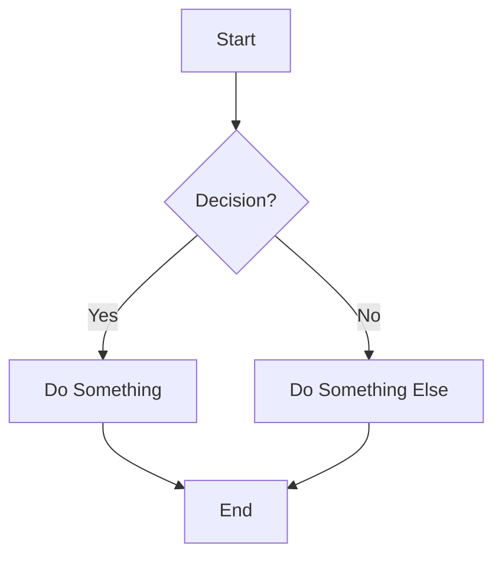
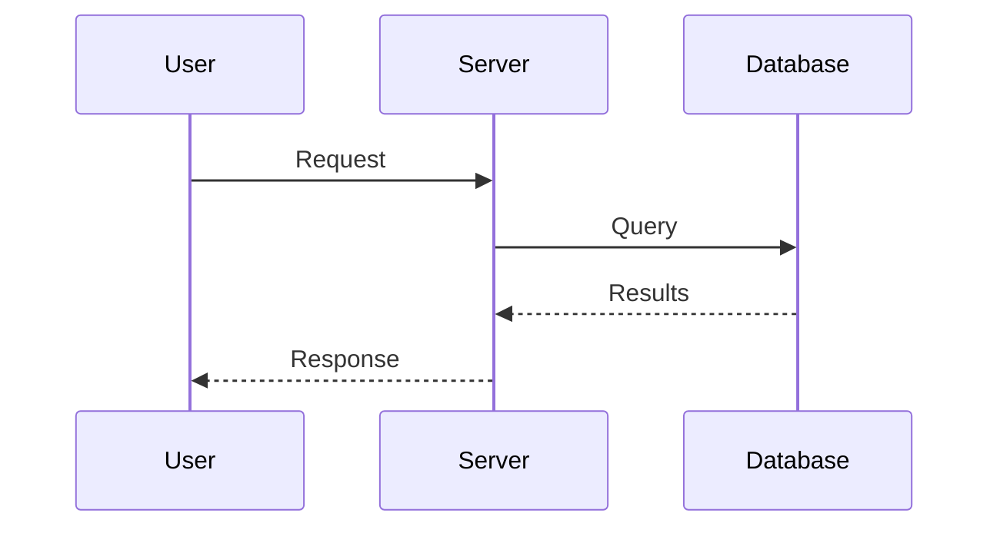
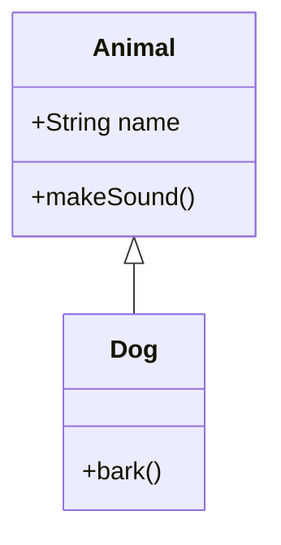
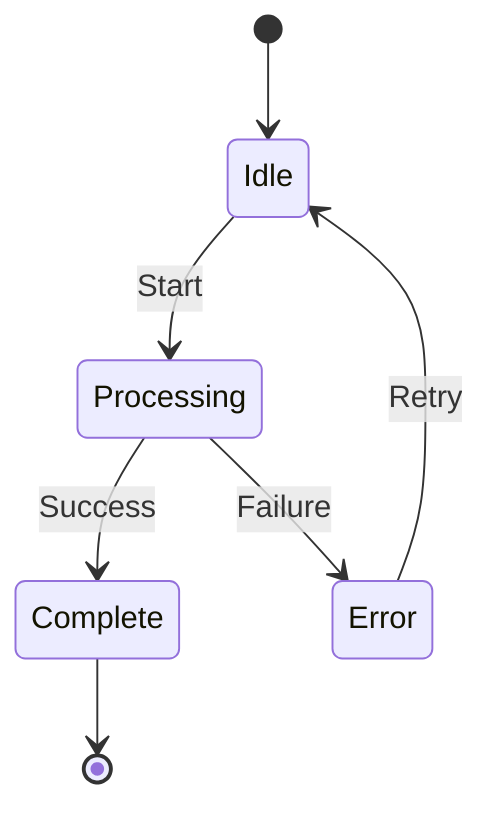
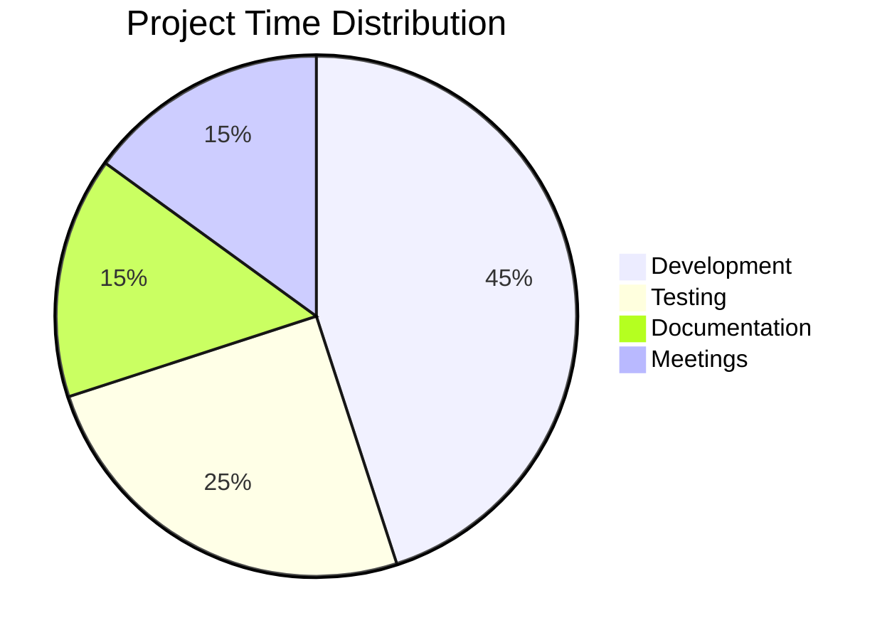
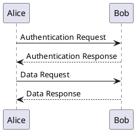
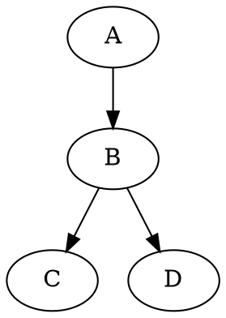
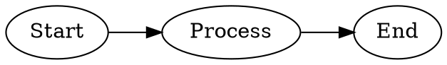
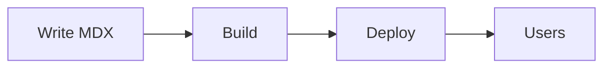

# MDX Authoring Guide for LLM Agents

This document describes what features you can use when creating MDX documents for the VS Code MDX Preview extension.

## What is MDX?

MDX combines Markdown with JSX, allowing you to use React components alongside standard Markdown syntax. This enables rich, interactive documentation. Features range from basic Markdown (available in Safe Mode) to full React component rendering (Trusted Mode).

---

## Safe Mode vs Trusted Mode

MDX Preview operates in one of two rendering modes:

**Safe Mode** (default) renders MDX as static HTML with no JavaScript execution. Built-in components render as semantic HTML. Unknown components display as placeholders.

**Trusted Mode** enables full React rendering with component imports, custom plugins, Tailwind CSS, and MDX transclusion. Requires: trusted workspace + `mdx-preview.preview.enableScripts` set to `true` + local files (not remote).

| Feature                                            | Safe Mode     | Trusted Mode      |
| -------------------------------------------------- | ------------- | ----------------- |
| Markdown, math, diagrams                           | Yes           | Yes               |
| GitHub Alerts                                      | Yes           | Yes               |
| Directive callouts (`:::`)                         | Yes           | Yes               |
| Built-in components (Callout, Tabs, etc.)          | Semantic HTML | Full React render |
| Framework components (Docusaurus, Starlight, etc.) | No            | Yes               |
| Custom imports                                     | No            | Yes               |
| Tailwind CSS                                       | No            | Yes               |
| Custom remark/rehype plugins                       | No            | Yes               |
| MDX transclusion                                   | No            | Yes               |
| Custom layouts                                     | No            | Yes               |

---

## Basic Markdown (Always Available)

Standard Markdown works as expected:

```mdx
# Heading 1

## Heading 2

**Bold**, _italic_, ~~strikethrough~~

- Bullet lists
- With multiple items

1. Numbered lists
2. Work too

[Links](https://example.com) and 

> Blockquotes for emphasis

| Tables | Work |
| ------ | ---- |
| Like   | This |

- [x] Task lists
- [ ] Are supported
```

---

## GitHub-Style Alerts

Use these for callouts without importing components:

```mdx
> [!NOTE]
> Useful information that users should know.

> [!TIP]
> Helpful advice for doing things better.

> [!IMPORTANT]
> Key information users need to know.

> [!WARNING]
> Urgent info that needs immediate attention.

> [!CAUTION]
> Advises about risks or negative outcomes.
```

---

## Directive-Style Callouts

Use triple-colon syntax for callouts without JSX. Works in both Safe and Trusted Mode:

```mdx
:::note
This is a note callout.
:::

:::warning Custom Title
Be careful about this.
:::

:::tip[Bracket Title Syntax]
This also works for setting titles.
:::
```

All 17 callout types are supported with this syntax: `note`, `tip`, `info`, `warning`, `danger`, `caution`, `important`, `summary`, `hint`, `success`, `question`, `failure`, `bug`, `example`, `quote`, `todo`, `attention`.

Aliases also work: `:::abstract`, `:::tldr`, `:::error`, `:::faq`, `:::check`, etc. (see alias table under Built-in Components).

---

## Code Blocks

### Basic Syntax Highlighting

````mdx
```javascript
function greet(name) {
  return `Hello, ${name}!`;
}
```
````

Supported languages include: `javascript`, `typescript`, `python`, `rust`, `go`, `java`, `c`, `cpp`, `csharp`, `ruby`, `php`, `swift`, `kotlin`, `sql`, `html`, `css`, `scss`, `json`, `yaml`, `bash`, `shell`, `markdown`, `mdx`, and 100+ more.

### Code Block with Title

````mdx
```typescript title="utils.ts"
export const formatDate = (date: Date) => date.toISOString();
```
````

---

## Math (LaTeX/KaTeX)

### Inline Math

```mdx
The quadratic formula is $x = \frac{-b \pm \sqrt{b^2-4ac}}{2a}$ for solving equations.
```

### Display Math

```mdx
$$
\int_{-\infty}^{\infty} e^{-x^2} dx = \sqrt{\pi}
$$
```

Common math expressions:

- Fractions: `\frac{a}{b}`
- Exponents: `x^2`, `e^{-x}`
- Subscripts: `x_1`, `a_{n+1}`
- Square roots: `\sqrt{x}`, `\sqrt[3]{x}`
- Summation: `\sum_{i=1}^{n} x_i`
- Integrals: `\int_a^b f(x)dx`
- Greek letters: `\alpha`, `\beta`, `\gamma`, `\theta`, `\pi`
- Matrices: `\begin{pmatrix} a & b \\ c & d \end{pmatrix}`

---

## Mermaid Diagrams

Create diagrams with code blocks:

### Flowchart

````mdx

````

### Sequence Diagram

````mdx

````

### Class Diagram

````mdx

````

### State Diagram

````mdx

````

### Pie Chart

````mdx

````

---

## PlantUML Diagrams

Render UML diagrams via a configurable PlantUML server (default: [Kroki](https://kroki.io)):

````mdx

````

Configure the server URL via `mdx-preview.diagrams.plantUmlServer`.

---

## Graphviz Diagrams

Render DOT graphs client-side using a WASM engine:

````mdx

````

You can also use the `graphviz` language tag:

````mdx

````

---

## Built-in Components

These components are available without imports:

### Callout / Alert / Admonition

```mdx
<Callout type="note" title="Note">
  This is informational content.
</Callout>

<Callout type="tip" title="Pro Tip">
  Here's a helpful suggestion.
</Callout>

<Callout type="warning" title="Warning">
  Be careful about this.
</Callout>

<Callout type="danger" title="Danger">
  This could cause problems.
</Callout>

<Callout type="success" title="Done">
  Operation completed successfully.
</Callout>

<Callout type="info">Title is optional.</Callout>
```

**17 supported types:** `note`, `tip`, `info`, `warning`, `danger`, `caution`, `important`, `summary`, `hint`, `success`, `question`, `failure`, `bug`, `example`, `quote`, `todo`, `attention`

**Aliases** (use either the alias or the canonical name):

| Alias              | Maps To    |
| ------------------ | ---------- |
| `abstract`, `tldr` | `summary`  |
| `warn`             | `warning`  |
| `error`            | `danger`   |
| `check`, `done`    | `success`  |
| `help`, `faq`      | `question` |
| `fail`, `missing`  | `failure`  |
| `snippet`          | `example`  |
| `cite`             | `quote`    |

**Component aliases:** `<Alert>` and `<Admonition>` work identically to `<Callout>`.

### Tabs

````mdx
<Tabs>
  <TabItem label="npm">```bash npm install package-name ```</TabItem>
  <TabItem label="yarn">```bash yarn add package-name ```</TabItem>
  <TabItem label="pnpm">```bash pnpm add package-name ```</TabItem>
</Tabs>
````

### CodeGroup (Tabbed Code Blocks)

````mdx
<CodeGroup>
```javascript title="example.js"
const greeting = "Hello";
````

```typescript title="example.ts"
const greeting: string = 'Hello';
```

```python title="example.py"
greeting = "Hello"
```

</CodeGroup>
```

### Collapsible / Accordion

```mdx
<Collapsible title="Click to expand">
  Hidden content that can be revealed.

- Supports markdown inside
- Multiple paragraphs work
  </Collapsible>

<Collapsible title="Open by default" defaultOpen>
  This starts expanded.
</Collapsible>
```

---

## Framework-Specific Components

If the project uses a documentation framework, additional components are available. The framework is auto-detected from `package.json` or can be set manually via `mdx-preview.framework` or `.mdx-previewrc.json`.

### Docusaurus Projects

```mdx
import Tabs from '@theme/Tabs';
import TabItem from '@theme/TabItem';
import CodeBlock from '@theme/CodeBlock';
import Details from '@theme/Details';

<Tabs groupId="language">
  <TabItem value="js" label="JavaScript">
    JavaScript content
  </TabItem>
  <TabItem value="ts" label="TypeScript">
    TypeScript content
  </TabItem>
</Tabs>

<CodeBlock language="jsx" title="Component.jsx" showLineNumbers>
  {`function App() {
  return <div>Hello</div>;
}`}
</CodeBlock>

<Details summary="Click to expand">
  Collapsible content using Docusaurus Details component.
</Details>
```

Docusaurus also supports admonition syntax:

```mdx
:::note
This renders as a Docusaurus-style admonition.
:::

:::tip Pro Tip
Directive callouts map to Docusaurus admonitions automatically.
:::
```

### Starlight Projects (Astro)

```mdx
import {
  Card,
  CardGrid,
  Code,
  Steps,
  Badge,
  FileTree,
  Aside,
  LinkCard,
  Tabs,
  TabItem,
} from '@astrojs/starlight/components';

<CardGrid>
  <Card title="Getting Started" icon="rocket">
    Learn the basics of the platform.
  </Card>
  <Card title="API Reference" icon="document">
    Detailed API documentation.
  </Card>
</CardGrid>

<LinkCard
  title="View on GitHub"
  description="Check out the source code"
  href="https://github.com/example/repo"
/>

<Steps>
  1. Install dependencies 2. Configure your project 3. Start building
</Steps>

<Badge text="New" variant="tip" />
<Badge text="Deprecated" variant="caution" />

<FileTree>
  - src/ - components/ - **Button.tsx** (highlighted) - Card.tsx - pages/ -
  index.mdx - package.json - tsconfig.json
</FileTree>

<Aside type="tip" title="Quick Tip">
  This is a sidebar note.
</Aside>

<Code code="const x: number = 42;" lang="ts" title="example.ts" />

<Tabs>
  <TabItem label="npm">npm install</TabItem>
  <TabItem label="pnpm">pnpm add</TabItem>
</Tabs>
```

Icons: `star`, `rocket`, `document`, `pencil`, `puzzle`, `setting`, `information`, `open-book`, `warning`, `error`, `check`, `heart`, `lightning`, `sun`, `moon`, `external`

### Nextra Projects (Next.js)

```mdx
import {
  Callout,
  Tabs,
  Cards,
  FileTree,
  Steps,
  Bleed,
} from 'nextra/components';

<Callout type="info" emoji="💡">
  Nextra callouts support custom emoji.
</Callout>

<Tabs items={['npm', 'yarn', 'pnpm']}>
  <Tabs.Tab>npm install next</Tabs.Tab>
  <Tabs.Tab>yarn add next</Tabs.Tab>
  <Tabs.Tab>pnpm add next</Tabs.Tab>
</Tabs>

<Cards num={2}>
  <Cards.Card title="Documentation" href="/docs" icon="📚" />
  <Cards.Card title="Examples" href="/examples" icon="🎯" />
</Cards>

<FileTree>
  <FileTree.Folder name="pages" defaultOpen>
    <FileTree.File name="index.mdx" />
    <FileTree.File name="about.mdx" />
  </FileTree.Folder>
  <FileTree.File name="package.json" />
</FileTree>

<Steps>
  ### Step 1
  Install dependencies.

### Step 2

Configure your project.

</Steps>

<Bleed>This content breaks out of the container to full width.</Bleed>
```

### Next.js Projects

```mdx
import Image from 'next/image';
import Link from 'next/link';

<Image src="/hero.png" alt="Hero image" width={800} height={400} />

<Link href="/about">Learn more about us</Link>
```

Note: `next/image` renders as a standard `` without Next.js optimization. Specify `width` and `height` for consistent sizing.

---

## Tailwind CSS (Trusted Mode)

Tailwind CSS v4 is supported with auto-detection from your project's configuration. Use utility classes directly in JSX:

```mdx
<div className="flex items-center gap-4 p-6 bg-blue-100 rounded-lg">
  <h2 className="text-2xl font-bold">Styled with Tailwind</h2>
  <p className="text-gray-600">Utility classes are compiled live.</p>
</div>
```

The extension detects Tailwind from your project's `package.json` dependencies and config files. Configure via `.mdx-previewrc.json`:

```json
{ "tailwind": { "enabled": "auto" } }
```

Options: `"auto"` (detect from project), `"enabled"` (always on), `"disabled"` (off).

---

## MDX Transclusion (Trusted Mode)

Import other MDX or Markdown files as React components:

```mdx
import Introduction from './Introduction.mdx';
import FAQ from '../shared/FAQ.md';

<Introduction />

## Frequently Asked Questions

<FAQ />
```

Imported files are watched for changes and the preview refreshes automatically when they are modified.

---

## TypeScript/JSX Preview (Trusted Mode)

Preview `.tsx` and `.ts` files that render to a `#root` element:

```tsx
import ReactDOM from 'react-dom/client';

function App() {
  return <div>Hello from TSX!</div>;
}

const root = ReactDOM.createRoot(document.getElementById('root')!);
root.render(<App />);
```

Open the preview with `Ctrl+K X` / `Cmd+K X` just like MDX files.

---

## Frontmatter

Add metadata at the top of MDX files:

```mdx
---
title: My Page Title
description: A brief description of this page
---

# Content starts here
```

### Preview-Related Frontmatter

```mdx
---
title: My Page
previewTheme: github-dark
codeBlockTheme: github-dark
---
```

| Key              | Description                                     |
| ---------------- | ----------------------------------------------- |
| `title`          | Document title                                  |
| `description`    | Page description                                |
| `previewTheme`   | Override the preview theme for this document    |
| `codeBlockTheme` | Override the code block theme for this document |

### Nextra-Specific Frontmatter

```mdx
---
title: Page Title
sidebarTitle: Short Title
description: SEO description
layout: default
---
```

Nextra also supports `_meta.json` files for per-page settings (title, layout, table of contents visibility). The extension walks upward from the document directory to find these files.

---

## Configuration (.mdx-previewrc.json)

Create a `.mdx-previewrc.json` in your project root for per-project settings. Most options require Trusted Mode:

```json
{
  "remarkPlugins": ["remark-toc"],
  "rehypePlugins": [["rehype-external-links", { "target": "_blank" }]],
  "components": {
    "Button": "./src/components/Button.tsx",
    "Chart": "./src/components/Chart.tsx"
  },
  "framework": "docusaurus",
  "tailwind": { "enabled": "auto" }
}
```

| Field              | Description                                                                            |
| ------------------ | -------------------------------------------------------------------------------------- |
| `remarkPlugins`    | Custom remark plugins (Trusted Mode only)                                              |
| `rehypePlugins`    | Custom rehype plugins (Trusted Mode only)                                              |
| `components`       | Map component names to file paths (Trusted Mode only)                                  |
| `framework`        | Override framework detection: `generic`, `docusaurus`, `starlight`, `nextra`, `nextjs` |
| `frameworkOptions` | Framework-specific options (`enableShims`, `customAliases`)                            |
| `tailwind`         | Tailwind settings (`enabled`, `configPath`)                                            |
| `unknownBehavior`  | Unknown component handling: `placeholder` (default), `strip`, `raw`                    |

Plugins are resolved from your project's `node_modules`. Supports both `"plugin-name"` and `["plugin-name", { options }]` syntax.

---

## Custom Layout (Trusted Mode)

Apply a layout wrapper by exporting a default component:

```mdx
import Layout from './components/Layout';
export default Layout;

# Content

This content is wrapped in your custom Layout component.
```

Or set a global layout via the `mdx-preview.preview.mdx.customLayoutFilePath` setting.

---

## Theming

### Preview Themes

16 preview themes available via `mdx-preview.preview.previewTheme` or the Command Palette:

github-light, github-dark, atom-dark, atom-light, atom-material, one-dark, one-light, solarized-dark, solarized-light, gothic, medium, monokai, newsprint, night, vue, none

### Auto Theme Switching

Enabled by default (`mdx-preview.preview.autoTheme`). The preview automatically follows your VS Code light/dark theme. Theme pairs: github-light/dark, atom-light/dark, one-light/dark, solarized-light/dark.

### Custom CSS

Point `mdx-preview.preview.customCss` to a CSS file for additional styling applied to the preview.

### Image Lightbox

Click any image in the preview to view it fullscreen. Press Escape or click outside to close.

---

## Best Practices for Document Creation

### Structure

1. **Start with a clear heading** - Use `#` for the main title
2. **Use progressive disclosure** - Put important info first, details in collapsibles
3. **Group related content** - Use tabs for alternatives (OS, language, etc.)
4. **Add visual breaks** - Use `---` for horizontal rules between sections

### Callout Usage

- **Note**: General information, context
- **Tip/Hint**: Best practices, shortcuts, recommendations
- **Important/Attention**: Must-know information
- **Warning/Caution**: Potential issues, things to watch out for
- **Danger**: Breaking changes, destructive actions
- **Info**: Supplementary details
- **Summary/Abstract**: TL;DR or condensed version
- **Success**: Confirmation, completion status
- **Question/FAQ**: Frequently asked questions
- **Failure**: Error conditions, what went wrong
- **Bug**: Known issues
- **Example**: Code samples, demonstrations
- **Quote**: Citations, attributions
- **Todo**: Action items, pending work

### Code Examples

- Always specify the language for syntax highlighting
- Use titles for code blocks when showing file contents
- Use CodeGroup/Tabs for showing the same concept in multiple languages
- Keep examples concise and focused

### Diagrams

- Use flowcharts for processes and workflows
- Use sequence diagrams for API interactions
- Use class diagrams for data structures
- Keep diagrams simple - split complex ones into multiple

### Accessibility

- Always provide alt text for images
- Use semantic heading hierarchy (h1 -> h2 -> h3)
- Don't rely solely on color to convey meaning
- Provide text alternatives for visual content

---

## Example: Complete Documentation Page

````mdx
---
title: Quick Start Guide
description: Get up and running in 5 minutes
---

# Quick Start Guide

Get your project running quickly with this guide.

> [!TIP]
> Make sure you have Node.js 18+ installed before starting.

## Installation

<Tabs>
  <TabItem label="npm">```bash npm create my-app@latest ```</TabItem>
  <TabItem label="yarn">```bash yarn create my-app ```</TabItem>
</Tabs>

## Project Structure

After installation, your project will look like this:
````

my-app/
├── src/
│ ├── components/
│ └── pages/
├── public/
├── package.json
└── tsconfig.json

````

## Configuration

:::tip
Configuration is optional - sensible defaults are provided.
:::

```typescript title="config.ts"
export default {
  theme: 'dark',
  language: 'en',
};
````

## How It Works



## API Overview

:::example
Here's a quick example of the API in action.
:::

```typescript title="api.ts"
const response = await fetch('/api/data');
const data = await response.json();
```

## Next Steps

<Collapsible title="Advanced Configuration">
  For advanced use cases, you can customize:

- Theme colors
- Plugin system
- Build pipeline
  </Collapsible>

## Need Help?

> [!NOTE]
> Check our [FAQ](/faq) or [open an issue](https://github.com/example/repo/issues).

````

---

## Quick Reference

| Feature | Syntax |
|---------|--------|
| GitHub Alert | `> [!NOTE]` / `> [!TIP]` / `> [!WARNING]` |
| Directive callout | `:::note` / `:::warning Title` / `:::tip[Title]` |
| Inline math | `$equation$` |
| Block math | `$$equation$$` |
| Mermaid | ` ```mermaid ` |
| PlantUML | ` ```plantuml ` |
| Graphviz | ` ```dot ` / ` ```graphviz ` |
| Callout component | `<Callout type="tip">` (also `<Alert>`, `<Admonition>`) |
| Tabs | `<Tabs><TabItem label="...">` |
| Collapsible | `<Collapsible title="...">` |
| Code group | `<CodeGroup>` with code blocks |
| Tailwind CSS | `className="flex ..."` (Trusted Mode) |
| MDX transclusion | `import X from './X.mdx'; <X />` (Trusted Mode) |
| Custom layout | `export default Layout` (Trusted Mode) |
| Config file | `.mdx-previewrc.json` |
````
