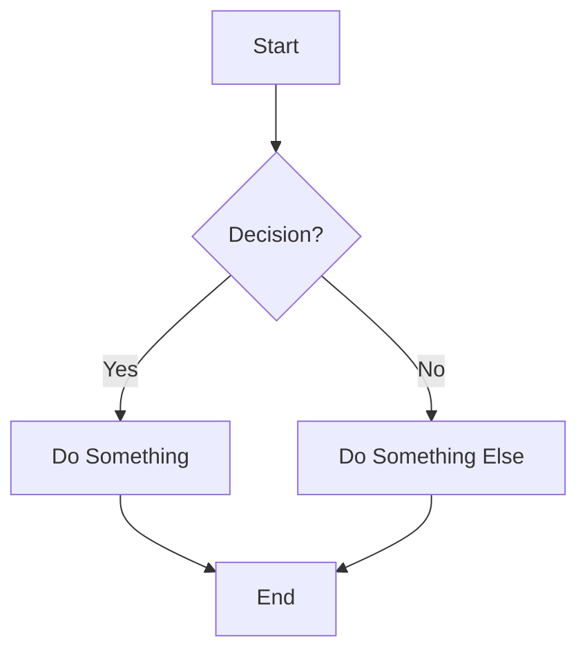
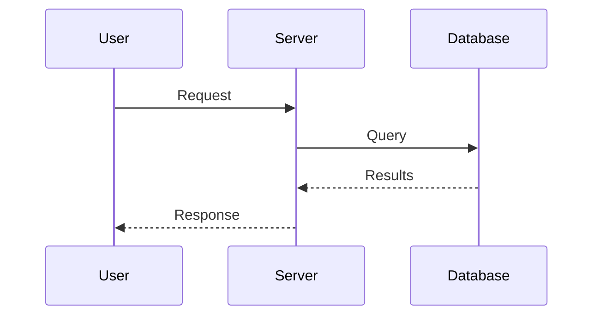
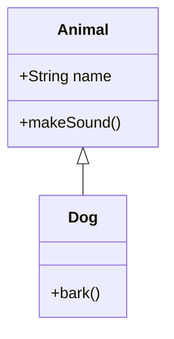
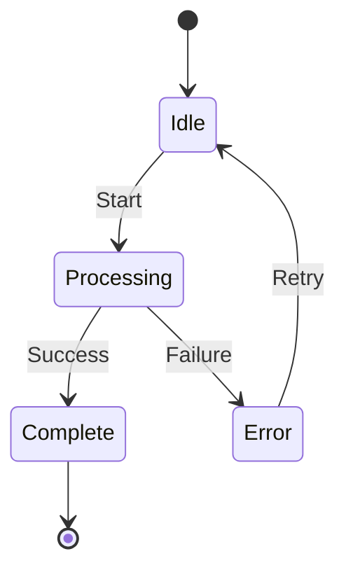
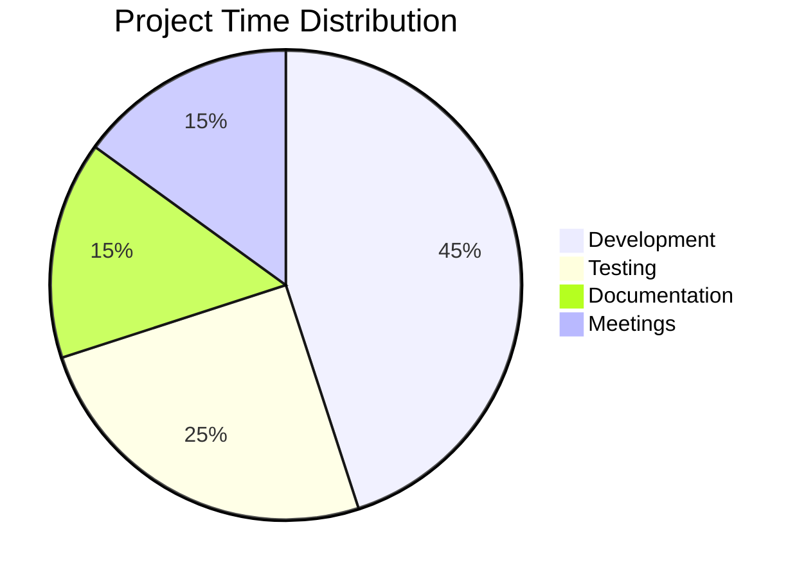
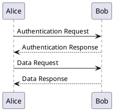
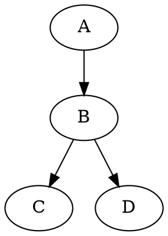
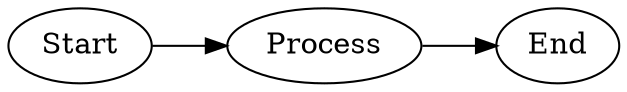
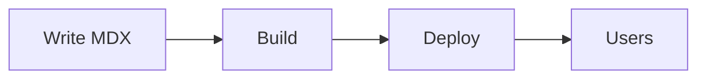

# MDX Authoring Guide for LLM Agents

This document describes what features you can use when creating MDX documents for the VS Code MDX Preview extension.

## What is MDX?

MDX combines Markdown with JSX, allowing you to use React components alongside standard Markdown syntax. This enables rich, interactive documentation.

---

## Basic Markdown (Always Available)

Standard Markdown works as expected:

```mdx
# Heading 1

## Heading 2

**Bold**, _italic_, ~~strikethrough~~

- Bullet lists
- With multiple items

1. Numbered lists
2. Work too

[Links](https://example.com) and 

> Blockquotes for emphasis

| Tables | Work |
| ------ | ---- |
| Like   | This |

- [x] Task lists
- [ ] Are supported
```

---

## GitHub-Style Alerts

Use these for callouts without importing components:

```mdx
> [!NOTE]
> Useful information that users should know.

> [!TIP]
> Helpful advice for doing things better.

> [!IMPORTANT]
> Key information users need to know.

> [!WARNING]
> Urgent info that needs immediate attention.

> [!CAUTION]
> Advises about risks or negative outcomes.
```

---

## Code Blocks

### Basic Syntax Highlighting

````mdx
```javascript
function greet(name) {
  return `Hello, ${name}!`;
}
```
````

Supported languages include: `javascript`, `typescript`, `python`, `rust`, `go`, `java`, `c`, `cpp`, `csharp`, `ruby`, `php`, `swift`, `kotlin`, `sql`, `html`, `css`, `scss`, `json`, `yaml`, `bash`, `shell`, `markdown`, `mdx`, and 100+ more.

### Code Block with Title

````mdx
```typescript title="utils.ts"
export const formatDate = (date: Date) => date.toISOString();
```
````

---

## Math (LaTeX/KaTeX)

### Inline Math

```mdx
The quadratic formula is $x = \frac{-b \pm \sqrt{b^2-4ac}}{2a}$ for solving equations.
```

### Display Math

```mdx
$$
\int_{-\infty}^{\infty} e^{-x^2} dx = \sqrt{\pi}
$$
```

Common math expressions:

- Fractions: `\frac{a}{b}`
- Exponents: `x^2`, `e^{-x}`
- Subscripts: `x_1`, `a_{n+1}`
- Square roots: `\sqrt{x}`, `\sqrt[3]{x}`
- Summation: `\sum_{i=1}^{n} x_i`
- Integrals: `\int_a^b f(x)dx`
- Greek letters: `\alpha`, `\beta`, `\gamma`, `\theta`, `\pi`
- Matrices: `\begin{pmatrix} a & b \\ c & d \end{pmatrix}`

---

## Mermaid Diagrams

Create diagrams with code blocks:

### Flowchart

````mdx

````

### Sequence Diagram

````mdx

````

### Class Diagram

````mdx

````

### State Diagram

````mdx

````

### Pie Chart

````mdx

````

---

## PlantUML Diagrams

Render UML diagrams via a configurable PlantUML server (default: [Kroki](https://kroki.io)):

````mdx

````

Configure the server URL via `mdx-preview.diagrams.plantUmlServer`.

---

## Graphviz Diagrams

Render DOT graphs client-side using a WASM engine:

````mdx

````

You can also use the `graphviz` language tag:

````mdx

````

---

## Built-in Components

These components are available without imports:

### Callout / Alert / Admonition

```mdx
<Callout type="note" title="Note">
  This is informational content.
</Callout>

<Callout type="tip" title="Pro Tip">
  Here's a helpful suggestion.
</Callout>

<Callout type="warning" title="Warning">
  Be careful about this.
</Callout>

<Callout type="danger" title="Danger">
  This could cause problems.
</Callout>

<Callout type="info">Title is optional.</Callout>
```

Types: `note`, `tip`, `info`, `warning`, `danger`, `caution`, `important`

### Tabs

````mdx
<Tabs>
  <TabItem label="npm">```bash npm install package-name ```</TabItem>
  <TabItem label="yarn">```bash yarn add package-name ```</TabItem>
  <TabItem label="pnpm">```bash pnpm add package-name ```</TabItem>
</Tabs>
````

### CodeGroup (Tabbed Code Blocks)

````mdx
<CodeGroup>
```javascript title="example.js"
const greeting = "Hello";
````

```typescript title="example.ts"
const greeting: string = 'Hello';
```

```python title="example.py"
greeting = "Hello"
```

</CodeGroup>
```

### Collapsible / Accordion

```mdx
<Collapsible title="Click to expand">
  Hidden content that can be revealed.

- Supports markdown inside
- Multiple paragraphs work
  </Collapsible>

<Collapsible title="Open by default" defaultOpen>
  This starts expanded.
</Collapsible>
```

---

## Framework-Specific Components

If the project uses a documentation framework, additional components are available:

### Docusaurus Projects

```mdx
import Tabs from '@theme/Tabs';
import TabItem from '@theme/TabItem';
import CodeBlock from '@theme/CodeBlock';

<Tabs groupId="language">
  <TabItem value="js" label="JavaScript">
    JavaScript content
  </TabItem>
  <TabItem value="ts" label="TypeScript">
    TypeScript content
  </TabItem>
</Tabs>

<CodeBlock language="jsx" title="Component.jsx" showLineNumbers>
  {`function App() {
  return <div>Hello</div>;
}`}
</CodeBlock>
```

### Starlight Projects (Astro)

```mdx
import {
  Card,
  CardGrid,
  Steps,
  Badge,
  FileTree,
  Aside,
  LinkCard,
} from '@astrojs/starlight/components';

<CardGrid>
  <Card title="Getting Started" icon="rocket">
    Learn the basics of the platform.
  </Card>
  <Card title="API Reference" icon="document">
    Detailed API documentation.
  </Card>
</CardGrid>

<LinkCard
  title="View on GitHub"
  description="Check out the source code"
  href="https://github.com/example/repo"
/>

<Steps>
  1. Install dependencies 2. Configure your project 3. Start building
</Steps>

<Badge text="New" variant="tip" />
<Badge text="Deprecated" variant="caution" />

<FileTree>
  - src/ - components/ - **Button.tsx** (highlighted) - Card.tsx - pages/ -
  index.mdx - package.json - tsconfig.json
</FileTree>

<Aside type="tip" title="Quick Tip">
  This is a sidebar note.
</Aside>
```

Icons: `star`, `rocket`, `document`, `pencil`, `puzzle`, `setting`, `information`, `open-book`, `warning`, `error`, `check`, `heart`, `lightning`, `sun`, `moon`, `external`

### Nextra Projects (Next.js)

```mdx
import { Callout, Tabs, Cards, FileTree, Steps } from 'nextra/components';

<Callout type="info" emoji="💡">
  Nextra callouts support custom emoji.
</Callout>

<Tabs items={['npm', 'yarn', 'pnpm']}>
  <Tabs.Tab>npm install next</Tabs.Tab>
  <Tabs.Tab>yarn add next</Tabs.Tab>
  <Tabs.Tab>pnpm add next</Tabs.Tab>
</Tabs>

<Cards num={2}>
  <Cards.Card title="Documentation" href="/docs" icon="📚" />
  <Cards.Card title="Examples" href="/examples" icon="🎯" />
</Cards>
```

### Next.js Projects

```mdx
import Image from 'next/image';
import Link from 'next/link';

<Image src="/hero.png" alt="Hero image" width={800} height={400} />

<Link href="/about">Learn more about us</Link>
```

---

## Frontmatter

Add metadata at the top of MDX files:

```mdx
---
title: My Page Title
description: A brief description of this page
---

# Content starts here
```

### Nextra-Specific Frontmatter

```mdx
---
title: Page Title
sidebarTitle: Short Title
description: SEO description
layout: default
---
```

Layout options: `default` (centered), `full` (full-width), `raw` (no styling)

---

## Best Practices for Document Creation

### Structure

1. **Start with a clear heading** - Use `#` for the main title
2. **Use progressive disclosure** - Put important info first, details in collapsibles
3. **Group related content** - Use tabs for alternatives (OS, language, etc.)
4. **Add visual breaks** - Use `---` for horizontal rules between sections

### Callout Usage

- **Note**: General information, context
- **Tip**: Best practices, shortcuts, recommendations
- **Important**: Must-know information
- **Warning**: Potential issues, things to watch out for
- **Danger/Caution**: Breaking changes, destructive actions

### Code Examples

- Always specify the language for syntax highlighting
- Use titles for code blocks when showing file contents
- Use CodeGroup/Tabs for showing the same concept in multiple languages
- Keep examples concise and focused

### Diagrams

- Use flowcharts for processes and workflows
- Use sequence diagrams for API interactions
- Use class diagrams for data structures
- Keep diagrams simple - split complex ones into multiple

### Accessibility

- Always provide alt text for images
- Use semantic heading hierarchy (h1 → h2 → h3)
- Don't rely solely on color to convey meaning
- Provide text alternatives for visual content

---

## Example: Complete Documentation Page

````mdx
---
title: Quick Start Guide
description: Get up and running in 5 minutes
---

# Quick Start Guide

Get your project running quickly with this guide.

> [!TIP]
> Make sure you have Node.js 18+ installed before starting.

## Installation

<Tabs>
  <TabItem label="npm">```bash npm create my-app@latest ```</TabItem>
  <TabItem label="yarn">```bash yarn create my-app ```</TabItem>
</Tabs>

## Project Structure

After installation, your project will look like this:
````

my-app/
├── src/
│ ├── components/
│ └── pages/
├── public/
├── package.json
└── tsconfig.json

````

## Configuration

<Callout type="info" title="Optional">
  Configuration is optional - sensible defaults are provided.
</Callout>

```typescript title="config.ts"
export default {
  theme: 'dark',
  language: 'en',
};
````

## How It Works



## Next Steps

<Collapsible title="Advanced Configuration">
  For advanced use cases, you can customize:

- Theme colors
- Plugin system
- Build pipeline
  </Collapsible>

## Need Help?

> [!NOTE]
> Check our [FAQ](/faq) or [open an issue](https://github.com/example/repo/issues).

````

---

## Quick Reference

| Feature | Syntax |
|---------|--------|
| Alert | `> [!NOTE]` / `> [!TIP]` / `> [!WARNING]` |
| Inline math | `$equation$` |
| Block math | `$$equation$$` |
| Mermaid | ` ```mermaid ` |
| Callout | `<Callout type="tip">` |
| Tabs | `<Tabs><TabItem label="...">` |
| Collapsible | `<Collapsible title="...">` |
| Code group | `<CodeGroup>` with code blocks |
````
