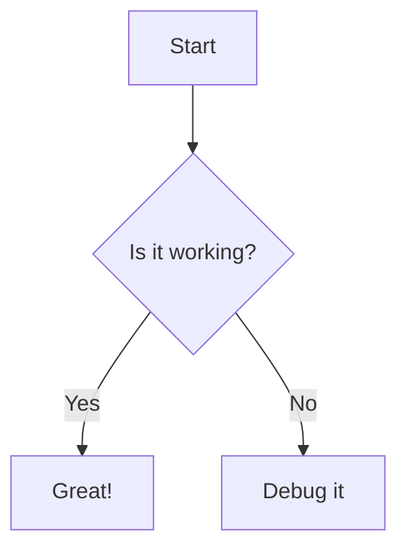

# MDX Preview for Visual Studio Code

Preview [MDX](https://mdxjs.com) files with live refresh and React component support directly in VS Code.


## Features

- **Live Preview**: See your MDX rendered instantly as you type with debounced updates
- **React Components**: Full support for importing and rendering React components in Trusted Mode
- **MDX 3 Support**: Built on the latest MDX compiler with modern React 18
- **TypeScript Support**: Preview `.tsx` and `.ts` files that render to `#root`
- **Security Model**: Safe Mode for untrusted content, Trusted Mode for full rendering
- **Syntax Highlighting**: Shiki-based code highlighting with theme support matching VS Code
- **Mermaid Diagrams**: Client-side rendering of flowcharts, sequence diagrams, state diagrams, and more
- **GitHub Alerts**: Support for GitHub-style callouts (NOTE, TIP, WARNING, CAUTION, IMPORTANT)
- **Math Expressions**: KaTeX integration for inline and block math expressions
- **Table of Contents**: Automatic TOC generation with collapsible sections
- **Scroll Sync**: Bi-directional scroll synchronization between editor and preview
- **Frontmatter Display**: Visual display of YAML frontmatter metadata

## Quick Start

1. Open an `.mdx` or `.md` file in your workspace
2. Open Command Palette (`Cmd+Shift+P` / `Ctrl+Shift+P`)
3. Run **"MDX: Open Preview"** or use the keyboard shortcut `Cmd+K X` / `Ctrl+K X`

Alternatively, click the preview icon in the editor toolbar when viewing `.mdx`, `.md`, `.tsx`, or `.js` files.

## Available Commands

- **MDX: Open Preview** (`Cmd+K X` / `Ctrl+K X`) - Open preview for current file
- **MDX: Refresh Preview** - Manually refresh the preview
- **MDX: Toggle Script Execution** - Toggle between Safe Mode and Trusted Mode
- **MDX: Toggle Using VSCode Markdown Styles** - Toggle VS Code markdown styling
- **MDX: Toggle Using White Background** - Toggle white background override
- **MDX: Change Security Settings** - Modify Content Security Policy settings

## Security Model

MDX Preview has two security modes:

### Safe Mode (Default)

- Renders MDX as static HTML without JavaScript execution
- Used automatically in untrusted workspaces
- No custom React components or imports

### Trusted Mode

Requires **both**:

1. A trusted workspace (VS Code Workspace Trust)
2. `mdx-preview.preview.enableScripts` setting enabled

In Trusted Mode:

- Full MDX rendering with React components
- JavaScript execution enabled
- Import statements work

> **Note**: Trusted Mode is only available for local workspaces. Remote environments (SSH, WSL, Dev Containers, Codespaces) always use Safe Mode.

## Configuration

| Setting                                        | Default     | Description                                              |
| ---------------------------------------------- | ----------- | -------------------------------------------------------- |
| `mdx-preview.preview.enableScripts`            | `false`     | Enable JavaScript execution (requires trusted workspace) |
| `mdx-preview.preview.updateMode`               | `"onType"`  | When to update preview (`onType`, `onSave`, `manual`)    |
| `mdx-preview.preview.debounceDelay`            | `300`       | Debounce delay in milliseconds for on-type updates       |
| `mdx-preview.preview.useVscodeMarkdownStyles`  | `true`      | Apply VS Code's markdown styling                         |
| `mdx-preview.preview.useWhiteBackground`       | `false`     | Force white background                                   |
| `mdx-preview.preview.customCss`                | `""`        | Path to custom CSS file for preview styling              |
| `mdx-preview.preview.mdx.customLayoutFilePath` | `""`        | Path to custom layout component                          |
| `mdx-preview.preview.showToc`                  | `true`      | Show table of contents sidebar                           |
| `mdx-preview.preview.scrollSync`               | `true`      | Enable scroll synchronization                            |
| `mdx-preview.preview.scrollBehavior`           | `"instant"` | Scroll behavior (`instant` or `smooth`)                  |
| `mdx-preview.preview.showFrontmatter`          | `true`      | Show frontmatter metadata at top of preview              |
| `mdx-preview.preview.security`                 | `"strict"`  | CSP policy (`strict` or `disabled`)                      |
| `mdx-preview.build.useSucraseTranspiler`       | `false`     | Use Sucrase instead of Babel                             |

## Custom Layouts

Apply custom layouts to your MDX in three ways:

### 1. Export Default Layout

```mdx
import Layout from './components/Layout';

export default Layout;

# Hello World

This content will be wrapped in Layout.
```

### 2. Configuration Setting

Set `mdx-preview.preview.mdx.customLayoutFilePath` to the absolute path of your layout file.

### 3. VS Code Markdown Styles (Default)

When no custom layout is specified, VS Code's built-in markdown styling is applied.

## Advanced Features

### Syntax Highlighting

Code blocks are automatically highlighted using Shiki, matching your VS Code theme:

````mdx
```typescript
const greeting: string = 'Hello, MDX!';
console.log(greeting);
```
````

### Mermaid Diagrams

Create diagrams using Mermaid syntax:

````mdx

````

### Math Expressions

Use LaTeX syntax for mathematical expressions:

```mdx
Inline math: $E = mc^2$

Block math:

$$
\frac{-b \pm \sqrt{b^2 - 4ac}}{2a}
$$
```

### GitHub Alerts

Use GitHub-style callouts:

```mdx
> [!NOTE]
> Useful information that users should know

> [!TIP]
> Helpful advice for doing things better

> [!WARNING]
> Urgent info that needs immediate attention

> [!CAUTION]
> Advises about risks or negative outcomes

> [!IMPORTANT]
> Key information users need to know
```

### MDX Transclusion

Import other MDX files as components:

```mdx
import Introduction from './Introduction.mdx';
import Features from './Features.mdx';

# Documentation

<Introduction />

<Features />
```

### JavaScript/TypeScript Preview

Preview React apps that render to `#root`:

```tsx
// App.tsx
import React from 'react';
import ReactDOM from 'react-dom/client';
import App from './App';

const root = ReactDOM.createRoot(document.getElementById('root')!);
root.render(<App />);
```

### Frontmatter Metadata

YAML frontmatter is automatically parsed and displayed:

```mdx
---
title: My Document
author: Jane Doe
tags: [mdx, react, preview]
---

# {frontmatter.title}

Content goes here...
```

## Webview Limitations

VS Code webviews have some inherent limitations:

- No Service Workers or Local Storage
- Use `MemoryRouter` instead of `BrowserRouter` for React Router
- Some third-party components may not work

## Troubleshooting

### Component doesn't render?

1. Open Command Palette and run **"Developer: Open Webview Developer Tools"**
2. Check the console for errors
3. Try enabling `mdx-preview.build.useSucraseTranspiler`

### Preview shows "Safe Mode"?

1. Trust the workspace: Command Palette > **"Workspaces: Manage Workspace Trust"**
2. Enable scripts: Set `mdx-preview.preview.enableScripts` to `true`

## Project Status

This extension is currently in **alpha** (version 1.0.0-alpha.3). While it is functional and includes many powerful features, you may encounter bugs or limitations. Please report issues on [GitHub](https://github.com/ggfincke/vscode-mdx-preview/issues).

## Requirements

- VS Code 1.90.0 or higher
- Node.js and npm for workspaces with dependencies (when using custom components)

## Extension Pack

This extension automatically installs:

- [MDX](https://marketplace.visualstudio.com/items?itemName=unifiedjs.vscode-mdx) - Modern MDX language support with syntax highlighting and validation

## Contributing

See [CONTRIBUTING.md](./CONTRIBUTING.md) for development setup and guidelines.

## Credits

This project is based on the original [vscode-mdx-preview](https://github.com/xyc/vscode-mdx-preview) by [Xiaoyi Chen](https://github.com/xyc), who created the original codebase, architecture, and UI.

## License

GPL-3.0
