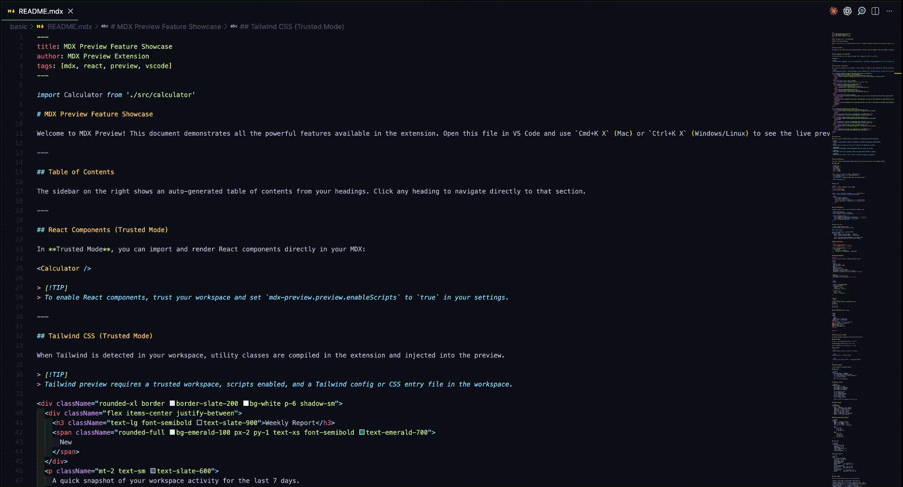
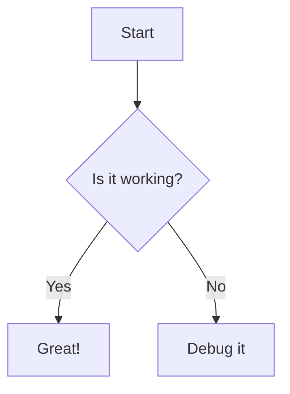

# MDX Preview for Visual Studio Code

Preview [MDX](https://mdxjs.com) files with live refresh and React component support directly in VS Code.



## Features

- **Live Preview**: See your MDX rendered instantly as you type with debounced updates
- **React Components**: Full support for importing and rendering React components in Trusted Mode
- **Framework Support**: Auto-detection and component shims for Docusaurus, Starlight, Nextra, and Next.js
- **MDX 3 Support**: Built on the latest MDX compiler with modern React 18
- **TypeScript Support**: Preview `.tsx` and `.ts` files that render to `#root`
- **Security Model**: Safe Mode for untrusted content, Trusted Mode for full rendering
- **Syntax Highlighting**: Shiki-based code highlighting with 100+ languages and 24 themes
- **Preview Themes**: 15+ preview themes (GitHub, Atom, Solarized, etc.) with auto light/dark switching
- **Tailwind CSS**: Built-in Tailwind v4 support with automatic detection and compilation
- **Mermaid Diagrams**: Client-side rendering of flowcharts, sequence diagrams, state diagrams, and more
- **GitHub Alerts**: Support for GitHub-style callouts (NOTE, TIP, WARNING, CAUTION, IMPORTANT)
- **Math Expressions**: KaTeX integration for inline and block math expressions
- **Table of Contents**: Automatic TOC generation with collapsible sections
- **Frontmatter Display**: Visual display of YAML frontmatter metadata
- **Custom Plugins**: Load custom remark/rehype plugins from your project

## Quick Start

1. Open an `.mdx` or `.md` file in your workspace
2. Open Command Palette (`Cmd+Shift+P` / `Ctrl+Shift+P`)
3. Run **"MDX: Open MDX Preview"** or use the keyboard shortcut `Cmd+K X` / `Ctrl+K X`

Alternatively, click the preview icon in the editor toolbar when viewing `.mdx`, `.md`, `.tsx`, or `.js` files.

## Supported Frameworks

MDX Preview automatically detects your framework from `package.json` and provides compatible component shims.

| Framework      | Detection            | Component Shims                                                                       |
| -------------- | -------------------- | ------------------------------------------------------------------------------------- |
| **Docusaurus** | `@docusaurus/core`   | `@theme/Tabs`, `@theme/TabItem`, `@theme/CodeBlock`, `@theme/Details`                 |
| **Starlight**  | `@astrojs/starlight` | `Card`, `CardGrid`, `LinkCard`, `Steps`, `Badge`, `Aside`, `Tabs`, `FileTree`, `Code` |
| **Nextra**     | `nextra`             | `Callout`, `Tabs`, `Cards`, `FileTree`, `Steps`, `Bleed`                              |
| **Next.js**    | `next` + MDX package | `next/image`, `next/link`                                                             |
| **Generic**    | (fallback)           | `Callout`, `Collapsible`, `Tabs`, `TabItem`, `CodeGroup`                              |

### Framework Examples

<details>
<summary><strong>Docusaurus</strong></summary>

````mdx
import Tabs from '@theme/Tabs';
import TabItem from '@theme/TabItem';

<Tabs>
  <TabItem value="js" label="JavaScript">
    ```js console.log('Hello'); ```
  </TabItem>
  <TabItem value="py" label="Python">
    ```python print('Hello') ```
  </TabItem>
</Tabs>
````

Admonitions are also supported:

```mdx
:::note
This is a note admonition.
:::

:::tip Pro Tip
You can add a custom title!
:::
```

</details>

<details>
<summary><strong>Astro Starlight</strong></summary>

```mdx
import { Card, CardGrid, Aside } from '@astrojs/starlight/components';

<CardGrid>
  <Card title="Getting Started" icon="rocket">
    Start building your documentation site.
  </Card>
  <Card title="Configuration" icon="setting">
    Learn how to configure your site.
  </Card>
</CardGrid>

<Aside type="tip" title="Pro Tip">
  You can customize these components with CSS variables.
</Aside>
```

</details>

<details>
<summary><strong>Nextra</strong></summary>

```mdx
import { Callout, Tabs } from 'nextra/components';

<Callout type="info">This is an informational callout.</Callout>

<Tabs items={['npm', 'yarn', 'pnpm']}>
  <Tabs.Tab>npm install mdx-preview</Tabs.Tab>
  <Tabs.Tab>yarn add mdx-preview</Tabs.Tab>
  <Tabs.Tab>pnpm add mdx-preview</Tabs.Tab>
</Tabs>
```

Nextra's `_meta.json` files are also supported for page-level settings.

</details>

<details>
<summary><strong>Next.js</strong></summary>

```mdx
import Image from 'next/image';
import Link from 'next/link';

<Image src="/logo.png" alt="Logo" width={200} height={100} />

<Link href="/docs/getting-started">Get Started</Link>
```

</details>

For complete framework documentation, see [docs/frameworks.md](https://github.com/ggfincke/vscode-mdx-preview/blob/main/docs/frameworks.md).

## Built-in Components

These components are available without imports when `mdx-preview.components.builtins` is enabled (default):

| Component     | Aliases                | Description                                                     |
| ------------- | ---------------------- | --------------------------------------------------------------- |
| `Callout`     | `Alert`, `Admonition`  | Alert box with type variants (note, tip, info, warning, danger) |
| `Tabs`        | -                      | Tabbed content sections                                         |
| `TabItem`     | `Tab`                  | Individual tab pane                                             |
| `CodeGroup`   | -                      | Multiple code blocks as tabs                                    |
| `Collapsible` | `Accordion`, `Details` | Expandable/collapsible section                                  |

```mdx
<Callout type="warning">This is a warning callout.</Callout>

<Tabs>
  <TabItem label="First">Content 1</TabItem>
  <TabItem label="Second">Content 2</TabItem>
</Tabs>

<Collapsible title="Click to expand">Hidden content here.</Collapsible>
```

## Available Commands

| Command                                | Shortcut       | Description                               |
| -------------------------------------- | -------------- | ----------------------------------------- |
| **MDX: Open MDX Preview**              | `Cmd/Ctrl+K X` | Open preview for current file             |
| **MDX: Refresh Preview**               | -              | Manually refresh the preview              |
| **MDX: Toggle Script Execution**       | -              | Toggle between Safe Mode and Trusted Mode |
| **MDX: Select Preview Theme**          | -              | Choose a preview theme                    |
| **MDX: Select Code Block Theme**       | -              | Choose a syntax highlighting theme        |
| **MDX: Select Mermaid Theme**          | -              | Choose a Mermaid diagram theme            |
| **MDX: Select Framework**              | -              | Manually select MDX framework             |
| **MDX: Toggle VSCode Markdown Styles** | -              | Toggle VS Code markdown styling           |
| **MDX: Toggle White Background**       | -              | Toggle white background override          |
| **MDX: Change Security Settings**      | -              | Modify Content Security Policy            |
| **MDX: Clear All Caches**              | -              | Clear cached modules                      |
| **MDX: Show Effective Configuration**  | -              | Show resolved config for current file     |
| **MDX: Toggle Debug Output**           | -              | Toggle debug logging in output channel    |

## Configuration

For complete configuration documentation, see [docs/configuration.md](https://github.com/ggfincke/vscode-mdx-preview/blob/main/docs/configuration.md).

### Key Settings

| Setting                                  | Default         | Description                                                                 |
| ---------------------------------------- | --------------- | --------------------------------------------------------------------------- |
| `mdx-preview.preview.enableScripts`      | `false`         | Enable JavaScript execution (requires trusted workspace)                    |
| `mdx-preview.preview.updateMode`         | `"onType"`      | When to update: `onType`, `onSave`, `manual`                                |
| `mdx-preview.preview.debounceDelay`      | `300`           | Debounce delay (ms) for on-type updates                                     |
| `mdx-preview.preview.previewTheme`       | `"none"`        | Preview theme (github-light, atom-dark, etc.)                               |
| `mdx-preview.preview.codeBlockTheme`     | `"auto"`        | Code syntax theme (`auto` matches preview)                                  |
| `mdx-preview.preview.mermaidTheme`       | `"default"`     | Mermaid diagram theme                                                       |
| `mdx-preview.preview.autoTheme`          | `true`          | Auto light/dark switching with VS Code                                      |
| `mdx-preview.preview.security`           | `"strict"`      | CSP policy: `strict` or `disabled`                                          |
| `mdx-preview.framework`                  | `"auto"`        | Framework: `auto`, `docusaurus`, `starlight`, `nextra`, `nextjs`, `generic` |
| `mdx-preview.tailwind.enabled`           | `"enabled"`     | Tailwind CSS: `auto`, `enabled`, `disabled`                                 |
| `mdx-preview.components.builtins`        | `true`          | Enable built-in components                                                  |
| `mdx-preview.components.unknownBehavior` | `"placeholder"` | Unknown components: `placeholder`, `strip`, `raw`                           |
| `mdx-preview.build.useSucraseTranspiler` | `false`         | Use Sucrase instead of Babel                                                |

## Themes

### Preview Themes

16 themes available from Markdown Preview Enhanced:

| Light Themes      | Dark Themes      |
| ----------------- | ---------------- |
| `github-light`    | `github-dark`    |
| `atom-light`      | `atom-dark`      |
| `one-light`       | `one-dark`       |
| `solarized-light` | `solarized-dark` |
| `vue`             | `atom-material`  |
| `newsprint`       | `gothic`         |
| `medium`          | `night`          |
| `none` (minimal)  | `monokai`        |

### Code Block Themes

24 syntax highlighting themes including: `auto`, `default`, `atom-dark`, `atom-light`, `darcula`, `github`, `github-dark`, `monokai`, `one-dark`, `one-light`, `solarized-dark`, `solarized-light`, `vs`, and more.

### Mermaid Themes

| Theme     | Description               |
| --------- | ------------------------- |
| `default` | Light theme (recommended) |
| `dark`    | Dark background theme     |
| `forest`  | Green-tinted theme        |
| `neutral` | Grayscale theme           |
| `base`    | Minimal styling           |
| `null`    | No theme (raw SVG)        |

### Auto Theme Switching

When `autoTheme` is enabled (default), the extension automatically switches between light/dark theme variants based on your VS Code color theme.

## Tailwind CSS Support

MDX Preview includes built-in Tailwind CSS support with automatic detection and compilation.

### Requirements

- **Tailwind CSS v4** (recommended) - Full support with `@tailwindcss/postcss`
- **Tailwind CSS v3** - Supported but deprecated

### Auto-Detection

Tailwind is enabled automatically when the extension detects:

- A `tailwind.config.{js,ts,mjs,cjs}` file in your workspace, OR
- A CSS file with `@import "tailwindcss"` or `@tailwind` directives

### Supported Patterns

The extension extracts Tailwind classes from:

- Static: `className="flex gap-4"`
- Conditional: `className={active ? "bg-blue-500" : "bg-gray-500"}`
- Utilities: `clsx()`, `cn()`, `classnames()`
- CVA: `cva('base', { variants: {...} })`
- `@apply` directives in CSS

## Configuration Files

MDX Preview supports per-project customization through `.mdx-previewrc.json` files. Configuration files only work in **Trusted Mode**.

```json
{
  "remarkPlugins": ["remark-toc", ["remark-emoji", { "emoticon": true }]],
  "rehypePlugins": ["rehype-external-links"],
  "components": {
    "Button": "./src/components/Button.tsx",
    "Card": "./src/components/Card.tsx"
  },
  "framework": "docusaurus",
  "tailwind": {
    "enabled": "auto"
  }
}
```

Plugins must be installed in your project's `node_modules`. For complete configuration options, see [docs/configuration.md](https://github.com/ggfincke/vscode-mdx-preview/blob/main/docs/configuration.md).

## Advanced Features

### Syntax Highlighting

Code blocks are highlighted using Shiki with 100+ supported languages:

````mdx
```typescript
const greeting: string = 'Hello, MDX!';
console.log(greeting);
```
````

**Language Aliases**: Common aliases are supported (`js`→`javascript`, `ts`→`typescript`, `sh`→`bash`, `py`→`python`, etc.)

### Mermaid Diagrams

Create diagrams using Mermaid syntax:

````mdx

```mermaid
graph TD
    A[Start] --> B{Is it working?}
    B -->|Yes| C[Great!]
    B -->|No| D[Debug it]
```
````

Supported diagram types: flowcharts, sequence diagrams, class diagrams, state diagrams, ER diagrams, gantt charts, pie charts, journey maps, and more.

### Math Expressions

Use LaTeX syntax for mathematical expressions:

```mdx
Inline math: $E = mc^2$

Block math:

$$
\frac{-b \pm \sqrt{b^2 - 4ac}}{2a}
$$
```

### GitHub Alerts

Use GitHub-style callouts:

```mdx
> [!NOTE]
> Useful information that users should know

> [!TIP]
> Helpful advice for doing things better

> [!WARNING]
> Urgent info that needs immediate attention

> [!CAUTION]
> Advises about risks or negative outcomes

> [!IMPORTANT]
> Key information users need to know
```

### MDX Transclusion

Import other MDX files as components:

```mdx
import Introduction from './Introduction.mdx';
import Features from './Features.mdx';

# Documentation

<Introduction />

<Features />
```

### JavaScript/TypeScript Preview

Preview React apps that render to `#root`:

```tsx
// App.tsx
import React from 'react';
import ReactDOM from 'react-dom/client';
import App from './App';

const root = ReactDOM.createRoot(document.getElementById('root')!);
root.render(<App />);
```

### Frontmatter Metadata

YAML frontmatter is automatically parsed and displayed:

```mdx
---
title: My Document
author: Jane Doe
tags: [mdx, react, preview]
---

# {frontmatter.title}

Content goes here...
```

### Custom Layouts

Apply custom layouts to your MDX:

```mdx
import Layout from './components/Layout';

export default Layout;

# Hello World

This content will be wrapped in Layout.
```

Or set globally via `mdx-preview.preview.mdx.customLayoutFilePath`.

## Security Model

MDX Preview has two security modes:

### Safe Mode (Default)

- Renders MDX as static HTML without JavaScript execution
- Used automatically in untrusted workspaces
- No custom React components or imports
- Strict Content Security Policy

### Trusted Mode

Requires **both**:

1. A trusted workspace (VS Code Workspace Trust)
2. `mdx-preview.preview.enableScripts` setting enabled

In Trusted Mode:

- Full MDX rendering with React components
- JavaScript execution enabled
- Import statements work
- Custom plugins load from `node_modules`

> **Note**: Trusted Mode is only available for local workspaces. Remote environments (SSH, WSL, Dev Containers, Codespaces) always use Safe Mode.

For complete security documentation, see [docs/security.md](https://github.com/ggfincke/vscode-mdx-preview/blob/main/docs/security.md).

## Webview Limitations

VS Code webviews have some inherent limitations:

- No Service Workers or Local Storage
- Use `MemoryRouter` instead of `BrowserRouter` for React Router
- Some third-party components may not work
- `next/image` optimization features are not available (renders as standard ``)

## Troubleshooting

### Component doesn't render?

1. Open Command Palette and run **"Developer: Open Webview Developer Tools"**
2. Check the console for errors
3. Verify you're in Trusted Mode
4. Try enabling `mdx-preview.build.useSucraseTranspiler`

### Preview shows "Safe Mode"?

1. Trust the workspace: Command Palette > **"Workspaces: Manage Workspace Trust"**
2. Enable scripts: Set `mdx-preview.preview.enableScripts` to `true`

### Framework not detected?

1. Verify the framework package is in your `package.json`
2. Manually set the framework: `mdx-preview.framework`

For comprehensive troubleshooting, see [docs/troubleshooting.md](https://github.com/ggfincke/vscode-mdx-preview/blob/main/docs/troubleshooting.md).

## Example Projects

The `examples/` directory contains working examples for various use cases:

| Example                                       | Description                                 |
| --------------------------------------------- | ------------------------------------------- |
| [`basic/`](https://github.com/ggfincke/vscode-mdx-preview/tree/main/examples/basic/)                   | Fundamental MDX features and Tailwind CSS   |
| [`docusaurus/`](https://github.com/ggfincke/vscode-mdx-preview/tree/main/examples/docusaurus/)         | Docusaurus framework with @theme components |
| [`starlight/`](https://github.com/ggfincke/vscode-mdx-preview/tree/main/examples/starlight/)           | Astro Starlight components                  |
| [`nextra/`](https://github.com/ggfincke/vscode-mdx-preview/tree/main/examples/nextra/)                 | Nextra framework with \_meta.json           |
| [`nextjs/`](https://github.com/ggfincke/vscode-mdx-preview/tree/main/examples/nextjs/)                 | Next.js MDX with next/image and next/link   |
| [`admonitions/`](https://github.com/ggfincke/vscode-mdx-preview/tree/main/examples/admonitions/)       | Docusaurus-style admonition callouts        |
| [`generic-shims/`](https://github.com/ggfincke/vscode-mdx-preview/tree/main/examples/generic-shims/)   | Built-in component library                  |
| [`custom-plugins/`](https://github.com/ggfincke/vscode-mdx-preview/tree/main/examples/custom-plugins/) | Custom remark/rehype plugins                |
| [`safe-mode/`](https://github.com/ggfincke/vscode-mdx-preview/tree/main/examples/safe-mode/)           | Safe Mode rendering examples                |

## Documentation

Comprehensive documentation is available in the `docs/` folder:

- [Configuration](https://github.com/ggfincke/vscode-mdx-preview/blob/main/docs/configuration.md) - Full configuration reference
- [Frameworks](https://github.com/ggfincke/vscode-mdx-preview/blob/main/docs/frameworks.md) - Framework support and component shims
- [Security](https://github.com/ggfincke/vscode-mdx-preview/blob/main/docs/security.md) - Security model deep dive
- [Troubleshooting](https://github.com/ggfincke/vscode-mdx-preview/blob/main/docs/troubleshooting.md) - Common issues and solutions
- [Contributing](https://github.com/ggfincke/vscode-mdx-preview/blob/main/docs/contributing.md) - Development setup and guidelines
- [Architecture](https://github.com/ggfincke/vscode-mdx-preview/blob/main/docs/architecture.mdx) - Technical architecture overview

## Project Status

This extension is now **stable** (version 1.0.0). Please report issues on [GitHub](https://github.com/ggfincke/vscode-mdx-preview/issues).

## Requirements

- VS Code 1.90.0 or higher
- Node.js 20+ for workspaces with dependencies (when using custom components or plugins)

## Extension Pack

This extension automatically installs:

- [MDX](https://marketplace.visualstudio.com/items?itemName=unifiedjs.vscode-mdx) - Modern MDX language support with syntax highlighting and validation

## Credits

This project is based on the original [vscode-mdx-preview](https://github.com/xyc/vscode-mdx-preview) by [Xiaoyi Chen](https://github.com/xyc), who created the original codebase, architecture, and UI.

## License

GPL-3.0-or-later
