# MDX Preview Architecture

This document provides a comprehensive overview of the VS Code MDX Preview extension architecture, covering the extension lifecycle, security model, module resolution, webview rendering, and all major subsystems.

---

## Overview

MDX Preview is a VS Code extension that provides live preview for MDX documents with full React component support. The extension implements a sophisticated security model with two rendering modes and handles complex module resolution and transpilation in a browser environment.

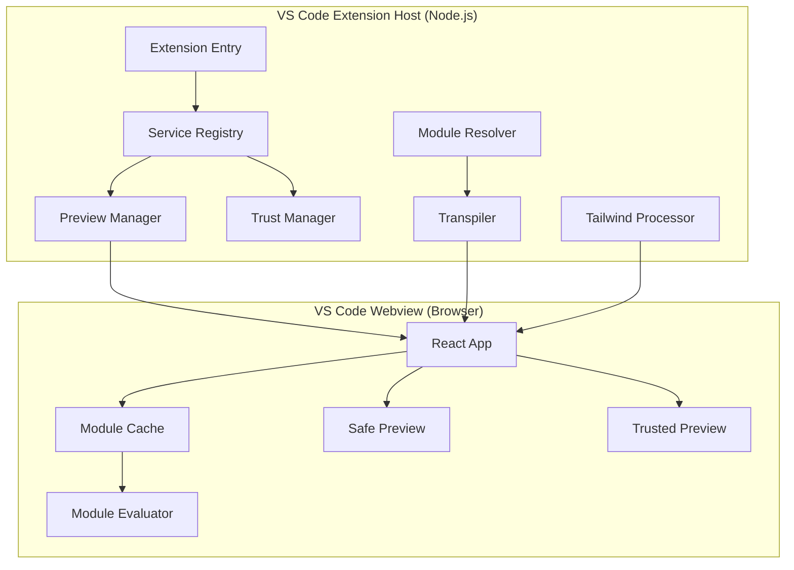

### Monorepo Structure

The project uses npm workspaces w/ five internal packages plus one external npm dependency:

| Package                   | Environment          | Purpose                                                               |
| ------------------------- | -------------------- | --------------------------------------------------------------------- |
| `packages/extension-host` | Node.js              | VS Code extension host - handles compilation, resolution, security    |
| `packages/webview-client` | Browser              | React 19 app rendered in VS Code webview iframe                       |
| `packages/contracts`      | Both                 | Shared types, constants, enums, & lightweight behavioral abstractions |
| `packages/runtime-utils`  | Both                 | Cross-runtime utilities (LRU cache, validation, error handling)       |
| `packages/codegen`        | Build-time           | Code generation scripts & libraries                                   |
| `mdx-forge` (npm)         | External npm package | Unified library (compiler, browser modules, component shims)          |

> [!NOTE]
> The extension and webview run in completely separate JavaScript environments. They communicate via Comlink RPC over VS Code's webview messaging API.

---

## Two-Mode Rendering System

The extension operates in two mutually exclusive security modes based on workspace trust and user settings.

### Safe Mode

**Safe Mode** is the default when the workspace is untrusted or scripts are disabled.

| Aspect           | Details                                               |
| ---------------- | ----------------------------------------------------- |
| **Compilation**  | MDX compiled to static HTML (no JavaScript execution) |
| **Components**   | No imports, no React components, no custom plugins    |
| **CSP**          | Strict CSP without `unsafe-eval`                      |
| **Sanitization** | All HTML sanitized with DOMPurify                     |

**Supported Features:** Standard Markdown (headings, lists, tables, blockquotes), code blocks with syntax highlighting, Mermaid diagrams, KaTeX math expressions, GitHub-style callouts, images (relative paths resolved), and links (internal and external).

**Not Supported:** JSX expressions, custom component imports, user remark/rehype plugins, and unsanitized HTML.

### Trusted Mode

**Trusted Mode** is enabled when the workspace is trusted AND the `enableScripts` setting is true.

| Aspect            | Details                                      |
| ----------------- | -------------------------------------------- |
| **Compilation**   | MDX compiled to executable JavaScript        |
| **Components**    | Full React component rendering with imports  |
| **CSP**           | Includes `unsafe-eval` for module evaluation |
| **Communication** | Module fetching via RPC to extension         |

**Additional Features:** JSX expressions, custom component imports, user remark/rehype plugins (from config file), export statements, and unsanitized HTML (user's responsibility).

**Requirements:**

| #   | Requirement                                                   |
| --- | ------------------------------------------------------------- |
| 1   | VS Code workspace must be trusted                             |
| 2   | `mdx-preview.preview.enableScripts` setting must be `true`    |
| 3   | Must NOT be in a remote environment (SSH, Container, WSL)     |
| 4   | Document must be a local file (`file:` or `untitled:` scheme) |

### Trust State Flow

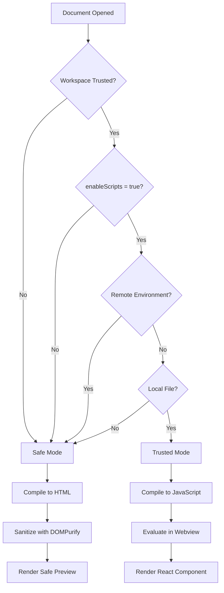

### TrustManager

The `TrustManager` service centrally manages trust state:

```typescript title="packages/extension-host/src/features/security/TrustManager.ts"
interface TrustState {
  workspaceTrusted: boolean; // VS Code workspace trust
  scriptsEnabled: boolean; // mdx-preview.preview.enableScripts
  canExecute: boolean; // workspaceTrusted && scriptsEnabled
  reason?: string; // Explanation if canExecute is false
  openMdxLinksInPreview: boolean; // Setting for .mdx link handling
}
```

**Key Methods:**

- `getState()` - Returns current trust state (always fresh, no caching)
- `canUseTrustedMode(docUri)` - Validates all 4 security requirements
- `getStateForDocument(docUri)` - Trust state with document-specific checks
- `subscribe(callback)` - Listen for trust state changes

> [!WARNING]
> Never bypass trust checks. Always use `getTrustManager().getState()` or the throwing utilities in `validateTrust.ts`.

### Content Security Policy

CSP headers are dynamically generated based on trust state:

```typescript title="packages/extension-host/src/features/security/CSP.ts"
// Safe Mode - Strict CSP
default-src 'none';
img-src ${webviewSource} https: data:;
style-src ${webviewSource} 'unsafe-inline';
script-src ${webviewSource} 'nonce-${nonce}' 'wasm-unsafe-eval';
connect-src ${webviewSource};
font-src ${webviewSource};

// Trusted Mode - Includes unsafe-eval
script-src ${webviewSource} 'nonce-${nonce}' 'unsafe-eval' 'wasm-unsafe-eval';
connect-src ${webviewSource};
```

---

## Extension Package Architecture

The extension runs in VS Code's extension host (Node.js environment) and manages all compilation, resolution, and security.

### Entry Point and Lifecycle

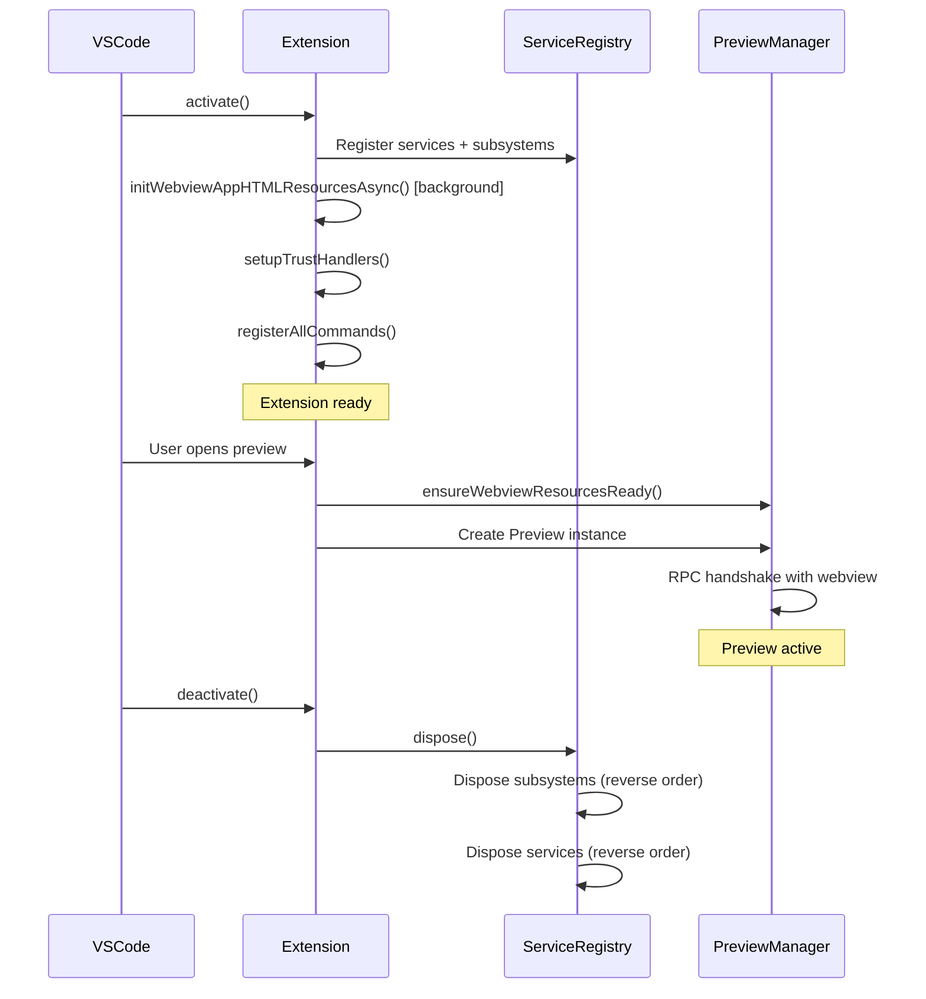

**Activation Flow (`activate.ts`):**

1. **Service Registration** - Register services + subsystems in dependency order
2. **Background Resource Loading** - Load Vite manifest asynchronously (non-blocking)
3. **Event Handlers** - Trust events, settings changes, theme changes
4. **Commands** - Register all preview/config/theme/debug commands
5. **File Watchers** - Package.json watcher for resolver cache invalidation

**Deactivation:**

- Single call to `ServiceRegistry.dispose()` handles all cleanup in reverse order

### Service Registry Pattern

The extension uses a centralized Service Registry for dependency injection and lifecycle management.

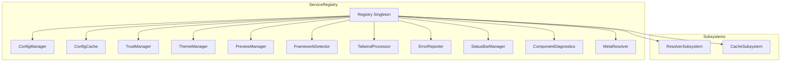

**Key Features:**

- **Lazy Initialization** - Services created on first access via factory functions
- **Circular Dependency Detection** - Throws `CircularDependencyError` with cycle path
- **Ordered Disposal** - Subsystems first, then services, in reverse registration order

**Two Singleton Patterns:**

| Pattern                           | Use Case                                            | Example                      |
| --------------------------------- | --------------------------------------------------- | ---------------------------- |
| `SingletonService` (class-based)  | Services with lifecycle, subscriptions, disposables | TrustManager, PreviewManager |
| `createSingleton` (factory-based) | Stateless utilities, cached results                 | FileProbeStrategy, Resolvers |

**Service Access:**

```typescript title="Preferred access pattern"
import { getConfigManager, getTrustManager } from './services';

const config = getConfigManager();
const trustState = getTrustManager().getState();
```

> [!TIP]
> Always use service-locator functions from `service-locator.ts` rather than direct `getInstance()` calls. This provides type safety and decoupling.

### Services vs Subsystems

The extension distinguishes between **Services** and **Subsystems** for lifecycle management:

> [!TIP]
> For detailed implementation guidelines, see [packages/extension-host/src/app/services/ARCHITECTURE.md](/packages/extension-host/src/app/services/ARCHITECTURE.md).

| Aspect             | Services                                                 | Subsystems                            |
| ------------------ | -------------------------------------------------------- | ------------------------------------- |
| **Pattern**        | `SingletonService` class-based                           | Factory functions + module state      |
| **Use Case**       | Lifecycle management, VS Code disposables, subscriptions | Stateless utilities, caches, watchers |
| **Registration**   | `ServiceRegistry.register()`                             | `ServiceRegistry.registerSubsystem()` |
| **Disposal Order** | Second (after subsystems)                                | First (before services)               |
| **Examples**       | TrustManager, ConfigManager, PreviewManager              | ResolverSubsystem, CacheSubsystem     |

**Why this distinction?**

- **Services** own VS Code resources (event handlers, file watchers, status bar items) and depend on the extension host being active.
- **Subsystems** group related factory singletons and module-level caches that may depend on services but not vice versa.
- **Disposal order**: Subsystems are disposed first because they may hold references to services. Services are disposed second, in reverse registration order to respect dependencies.

**Current Subsystems:**

- `ResolverSubsystem` - Module resolution strategies, cached file system, stat/compiled caches
- `CacheSubsystem` - Component detection cache, path security caches, and other unmanaged caches

### Preview Management

The `PreviewManager` singleton manages all preview instances and webview panels.

```typescript title="packages/extension-host/src/features/preview/preview-manager.ts"
class PreviewManager extends SingletonService<PreviewManager> {
  private currentPreview: Preview | undefined;
  private _panel: vscode.WebviewPanel | undefined;

  // Key methods
  getCurrentPreview(): Preview | undefined;
  setCurrentPreview(preview: Preview): void;
  refreshAllPreviews(): void;
  pushThemeToAllPreviews(): void;
}
```

**Preview Instance Composition:**

Each `Preview` instance is composed of specialized modules:

| Module                   | Responsibility                                               |
| ------------------------ | ------------------------------------------------------------ |
| `PreviewConfiguration`   | Per-instance settings (updateMode, debounce, security)       |
| `PreviewWebviewBridge`   | Webview communication and theme management                   |
| `PreviewDocumentHandler` | Document tracking and version management                     |
| `PreviewInitializer`     | Initial setup and handshake                                  |
| `WatcherManager`         | Dependency and config file watchers                          |
| `EvaluationEngine`       | MDX compilation (safe/trusted) and async Tailwind processing |

**Handshake Protocol:**

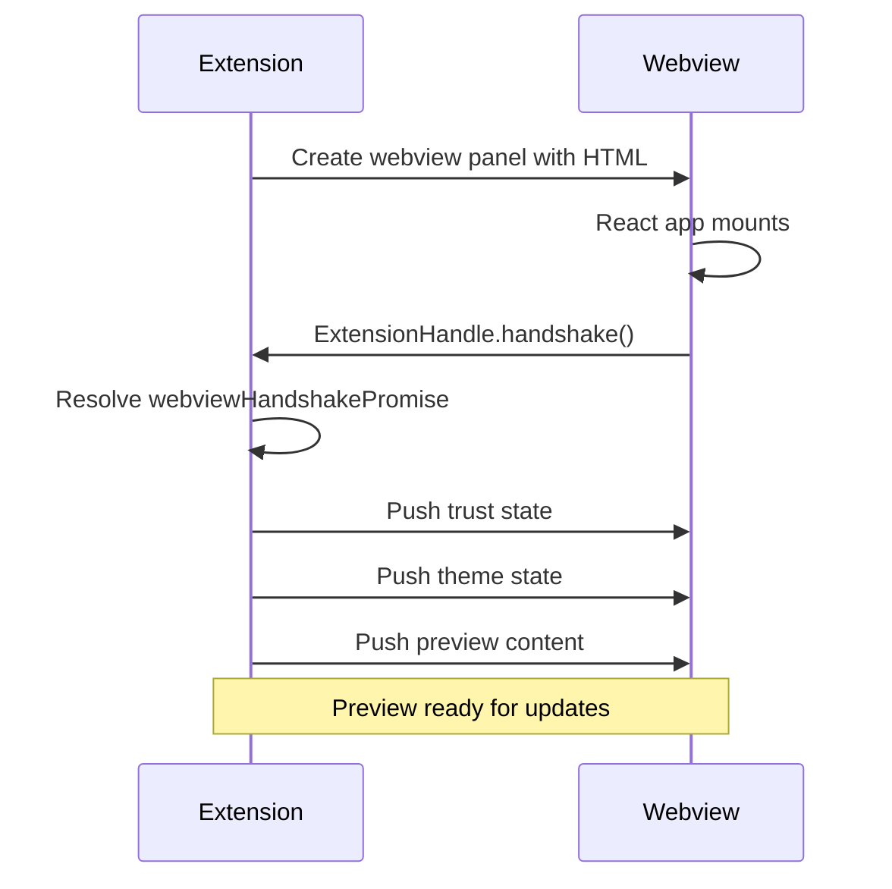

### Preview Update & Refresh Orchestration

`Preview.ts` now delegates update/refresh routing to explicit flow modules:

- `runPreviewUpdateFlow(...)` (`preview-update-flow.ts`)
  - rendered-version skip gate (unless forced)
  - scheme routing (`untitled`, `file`, default remote/vfs)
  - source selection by update mode (`onType` vs disk/fs read)
  - `evaluateInWebview(...)` invocation
  - mark-rendered only after successful evaluation
- `runPreviewRefreshFlow(...)` (`preview-refresh-flow.ts`)
  - panel refresh via `refreshPanel(...)`
  - forced update pass (`updateWebview(true)`)

### Stage-Based Evaluation Pipeline

`evaluate-in-webview.ts` is now a composition root over explicit stage modules:

1. `prepareEvaluationContext(...)`
   - resolve trust state, effective config, compiler config, and effective `canExecute`
   - run Tailwind profile detection and fallback-warning dedupe
   - compute browser-runtime toggle and return `{ kind: 'refresh-required' }` when it flips
2. Handshake + base-state push
   - await webview handshake
   - push trust state, runtime config, and framework metadata
3. Mode stage (inlined in `evaluate-in-webview.ts`)
   - trusted: `engine.evaluateTrusted(...)`
   - safe: `engine.evaluateSafe(...)`
4. Post-push artifacts: `postPushArtifacts(...)`
   - shared frontmatter/runtime/meta push
   - trusted branch: dependency updates, optional component detection, `updatePreview`, async Tailwind process
   - safe branch: Tailwind channel clear + `updatePreviewSafe`

### RPC Communication

Extension and webview communicate using Comlink for type-safe RPC over VS Code's webview messaging API.

#### Extension to Webview

The extension calls methods on the webview via `WebviewHandle`:

```typescript title="packages/contracts/src/rpc/types.ts"
interface WebviewRPC {
  // State management
  setTrustState(state: TrustState): void;
  setFramework(framework: Framework): void;
  setUsedComponents(components: string[]): void;
  updatePreview(
    code: string,
    entryFilePath: string,
    entryFileDependencies: string[]
  ): void;
  updatePreviewSafe(html: string): void;
  showPreviewError(error: PreviewError): void;

  // Module invalidation
  invalidate(fsPath: string): Promise<void>;
  clearAllCaches(): Promise<void>;
  setStale(isStale: boolean): void;

  // Styling
  setCustomCss(css: string): void;
  setTailwindCss(css: string): void;
  setTailwindBrowserCss(css: string): void;
  setTheme(state: WebviewThemeState): void;

  // Editor → preview scroll sync
  setScrollSync(mode: PreviewScrollSyncValue): void;
  scrollToLine(line: number): void;

  // Nextra support
  setNextraMeta(meta: NextraPageMeta): void;
}
```

#### Webview to Extension

The webview calls methods on the extension via `ExtensionHandle`:

```typescript title="packages/contracts/src/rpc/types.ts"
interface ExtensionRPC {
  // Lifecycle
  handshake(): void;

  // Performance tracking
  reportPerformance(evaluationDuration: number): void;

  // Module fetching (Trusted Mode only)
  fetch(
    request: string,
    isBare: boolean,
    parentId: string
  ): Promise<FetchResult | undefined>;

  // Settings & trust
  openSettings(settingId?: string): void;
  manageTrust(): void;

  // Navigation
  openExternal(url: string): void;
  openDocument(
    relativePath: string,
    line?: number,
    column?: number
  ): Promise<void>;
  openPreview(relativePath: string): Promise<void>;

  // Source-line navigation & preview → editor scroll sync
  openSourceLine(line: number): Promise<void>;
  reportPreviewSourceLine(
    line: number
  ): Promise<PreviewSourceLineReportResult>; // 'accepted' | 'ignored' | 'retry'

  renderPlantUml(code: string): Promise<string | undefined>;
}
```

> [!IMPORTANT]
> The `fetch` method is the primary attack surface. All inputs are validated: type validation (strings, booleans), length checks, security validation via `isValidModuleRequest()`, and trust validation via `requireTrustedModeForDocument()`.

### Source-Line Scroll Sync

Scroll synchronization between the VS Code editor and the rendered preview is implemented as a pair of coordinated pipelines, both keyed on the `data-source-line` annotations the MDX compiler emits onto rendered blocks.

**Mode contract** (`packages/contracts/src/config/enums.ts`):

```typescript
export const PREVIEW_SCROLL_SYNC_VALUES = [
  'off',
  'editorToPreview',
  'previewToEditor',
  'bidirectional',
] as const;

export function isEditorToPreviewMode(mode: PreviewScrollSyncValue): boolean;
export function isPreviewToEditorMode(mode: PreviewScrollSyncValue): boolean;
```

The mode is part of the runtime configuration pushed to the webview (`PreviewConfiguration`) and changes are honored without a reload; switching into a mode that includes `editorToPreview` immediately calls `Preview.syncEditorScrollToPreview()` to align the freshly-enabled side.

**Shared tuning constants** (`packages/contracts/src/preview/scroll-sync.ts`):

| Constant                                  | Value | Purpose                                                                 |
| ----------------------------------------- | ----- | ----------------------------------------------------------------------- |
| `SOURCE_LINE_SCROLL_SYNC_ANCHOR_RATIO`    | 0.35  | Both sides target the top-third reading band instead of vertical center |
| `SOURCE_LINE_SCROLL_SYNC_ANIMATION_MS`    | 120   | Suppression window applied after a programmatic scroll dispatch         |
| `SOURCE_LINE_SCROLL_SYNC_SETTLE_MS`       | 80    | Idle window before a final "settled" dispatch is sent                   |

**Editor → preview pipeline** (`packages/extension-host/src/features/preview/scroll-sync.ts`):

1. `workspace-events.ts` subscribes `window.onDidChangeTextEditorVisibleRanges` to `handleEditorVisibleRangesChange`.
2. The handler resolves the active preview, picks the leading visible range (folded code can produce multiple), and computes the anchored source line at the 35% band.
3. `queueScroll(preview, line)` writes the line into a per-`Preview` scheduler. Two dispatches are scheduled:
   - **Live dispatch** throttled at ~33 ms while the user is actively scrolling.
   - **Settle dispatch** after `SOURCE_LINE_SCROLL_SYNC_SETTLE_MS` (80 ms) of quiet for the final landing line.
4. On dispatch, `preview.scrollToLine(line)` calls `WebviewRPC.scrollToLine`. The dispatch also sets `ignorePreviewUntilMs = now + 120 ms` so the resulting preview scroll does not bounce back as a `reportPreviewSourceLine`.

**Preview → editor pipeline** (`packages/webview-client/src/features/preview/shared/hooks/usePreviewScrollSync.ts`):

1. The hook observes the preview container on every scroll/resize, finding the entry whose bounding rect is closest to the anchor line at 35% of viewport height.
2. The active source line is reported via `ExtensionHandle.reportPreviewSourceLine(line)`. The reply is one of:
   - `'accepted'` — extension revealed the editor or confirmed the line was already current.
   - `'ignored'` — sync is disabled, the line is invalid, or no visible editor matches the preview's document.
   - `'retry'` — extension is currently inside its editor→preview suppression window; the hook reschedules.
3. The hook honors user interrupts (scroll keys, wheel) by cancelling any in-flight programmatic preview scrolls before measuring the new active line.

**Bounce-back suppression.** Both sides maintain independent suppression windows on the `PreviewScheduler`:

- `ignorePreviewUntilMs` — set after an editor→preview dispatch; preview→editor reports are deferred during this window and replied to with `'retry'`.
- `ignoreEditorUntilMs` — set after a preview→editor reveal or after `openSourceLine` opens the document; editor→preview visible-range events are dropped during this window.

**Cmd/Ctrl+Click navigation.** `useSourceLineHighlight` attaches a click handler that fires only when `event.button === 0` and either `event.ctrlKey` or `event.metaKey` is true, and only when the click target is not inside a native interactive element (`a`, `button`, `input`, `select`, `textarea`, `label`, `details`, `summary`, `[role="button"]`, `[contenteditable]`). It then calls `openSourceLine(line)`, which dispatches `ExtensionHandle.openSourceLine`. The extension pre-suppresses editor→preview sync, calls `vscode.window.showTextDocument` with a selection, then re-arms suppression after the await to cover the case where `showTextDocument` latency outran the 120 ms window.

**Lifecycle.**

- Schedulers are held in a `Map<Preview, PreviewScheduler>` keyed by `Preview` instance.
- `Preview.dispose()` calls `disposeScrollSyncForPreview(this)` to clear timers and drop the entry.
- `runtime config push` reset: when the webview reloads, `resetPreviewScrollSync` clears cached `lastPreviewSourceKey` state so the same line can be re-dispatched against the fresh DOM.

---

## Module Resolution System

In Trusted Mode, the webview cannot access the file system directly. The extension resolves and transpiles modules on demand.

### Module Fetching Flow

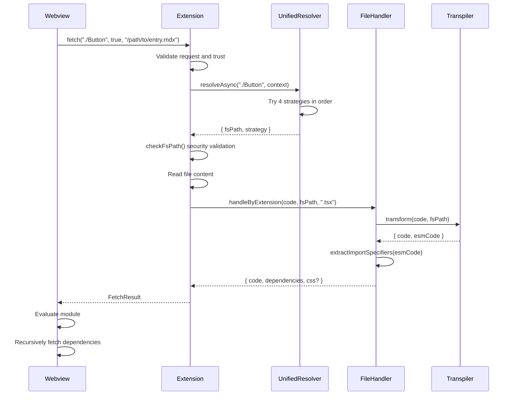

### UnifiedResolver - 4-Strategy Chain

The `UnifiedResolver` chains 4 resolution strategies in priority order:

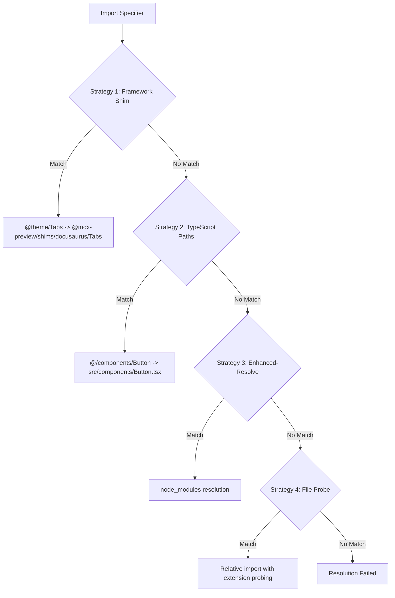

**Strategy Details:**

| #   | Strategy         | Use Case                            | Example                                    |
| --- | ---------------- | ----------------------------------- | ------------------------------------------ |
| 1   | Framework Shim   | Framework-specific imports          | `@theme/Tabs` to built-in shim             |
| 2   | TypeScript Paths | tsconfig.json path aliases          | `@/lib/utils` to `src/lib/utils.ts`        |
| 3   | Enhanced-Resolve | node_modules packages               | `lodash` to `node_modules/lodash/index.js` |
| 4   | File Probe       | Relative imports without extensions | `./Button` to `./Button.tsx`               |

**Resolution Context:**

```typescript title="packages/extension-host/src/features/module-runtime/types/module-system.ts"
interface ResolutionContext {
  baseDir: string; // Directory containing the importing file
  tsConfig?: TypeScriptConfiguration;
  framework?: FrameworkId; // docusaurus, starlight, nextra, nextjs
  workspaceRoot?: string;
  shimsEnabled?: boolean; // Whether to use built-in component shims
}
```

### File Type Handlers

The handler registry dispatches to specialized handlers based on file extension:

| Handler         | Extensions                                  | Behavior                               |
| --------------- | ------------------------------------------- | -------------------------------------- |
| `ScriptHandler` | `.js`, `.ts`, `.jsx`, `.tsx`, `.mdx`, `.md` | Transpile, extract dependencies        |
| CSS (factory)   | `.css`                                      | Return CSS for injection               |
| `SassHandler`   | `.scss`, `.sass`                            | Compile via workspace sass, return CSS |
| JSON (factory)  | `.json`                                     | Wrap as `module.exports = {...}`       |
| `ImageHandler`  | `.png`, `.jpg`, `.svg`, `.gif`, `.webp`     | Convert to webview URI                 |

**Handler Interface:**

```typescript title="packages/extension-host/src/features/module-runtime/types/handlers.ts"
interface FileTypeHandler {
  extensions: string[];
  handle(code: string, fsPath: string, preview: Preview): Promise<FetchResult>;
}
```

### Transpilation Pipeline

#### Entry File Transformation

Entry file transformation (MDX documents) follows these steps:

| Step                    | Action                                        |
| ----------------------- | --------------------------------------------- |
| 1. MDX Compilation      | If `.mdx` or `.md`, compile via `@mdx-js/mdx` |
| 2. TypeScript Stripping | If TypeScript, strip types via Sucrase        |
| 3. ESM Capture          | Save ESM code for dependency extraction       |
| 4. Transpilation        | Convert to CommonJS via Babel or Sucrase      |

```typescript title="packages/extension-host/src/features/module-runtime/transform/selector.ts"
// transpile code w/ automatic fallback from Sucrase to Babel
async function transpileWithFallback(
  code: string,
  options: TranspileOptions
): Promise<string>;
```

#### Dependency Transformation

Dependency transformation (imported files) follows these steps:

| Step                    | Action                                                                                                                        |
| ----------------------- | ----------------------------------------------------------------------------------------------------------------------------- |
| 1. MDX Compilation      | If `.mdx` or `.md`                                                                                                            |
| 2. TypeScript Stripping | If TypeScript extension                                                                                                       |
| 3. ESM Capture          | For dependency extraction                                                                                                     |
| 4. Smart Transpilation  | Skip if in `node_modules` and not a module; use Sucrase for `node_modules` (faster); use Babel for local code (full features) |

The `transpileWithFallback()` function in `selector.ts` handles both entry files and dependencies, attempting Sucrase first when configured and falling back to Babel on failure.

**Transpiler Selection:**

| Transpiler          | Use Case               | Features                                            |
| ------------------- | ---------------------- | --------------------------------------------------- |
| **Babel** (default) | Full transformation    | `@babel/preset-env`, `@babel/preset-react`, ES2022+ |
| **Sucrase** (fast)  | Simple transformations | JSX, TypeScript, imports only                       |

> [!NOTE]
> Babel is lazy-loaded (~2MB) only when first needed. Sucrase is bundled and used for `node_modules` by default.

### Dependency Extraction

Imports are extracted from ESM code using `es-module-lexer`:

```typescript title="packages/extension-host/src/features/module-runtime/dependencies/import-extractor.ts"
// Fast pre-check regex
const IMPORT_PATTERN =
  /\b(import\s|import\s*\(|require\s*\(|export\s+[*{]|export\s+type\s+\{|from\s+['"`])/;

async function extractImportSpecifiers(code: string): Promise<string[]> {
  // 1. Fast pre-check - skip parsing if no import patterns
  if (!IMPORT_PATTERN.test(code)) return [];

  // 2. Parse with es-module-lexer
  const [imports] = await parse(code);

  // 3. Extract specifier names
  return imports.map((imp) => imp.n).filter(Boolean);
}
```

> [!NOTE]
> The pre-check regex is an optimization that may have false negatives for minified code
> (e.g., `export{foo}from'bar'` without spaces). This is acceptable since minified code
> in user source files is rare, and the optimization significantly improves performance.

---

## Webview Application

The webview is a React 19 application built with Vite, rendered in a VS Code webview iframe.

### Application Structure

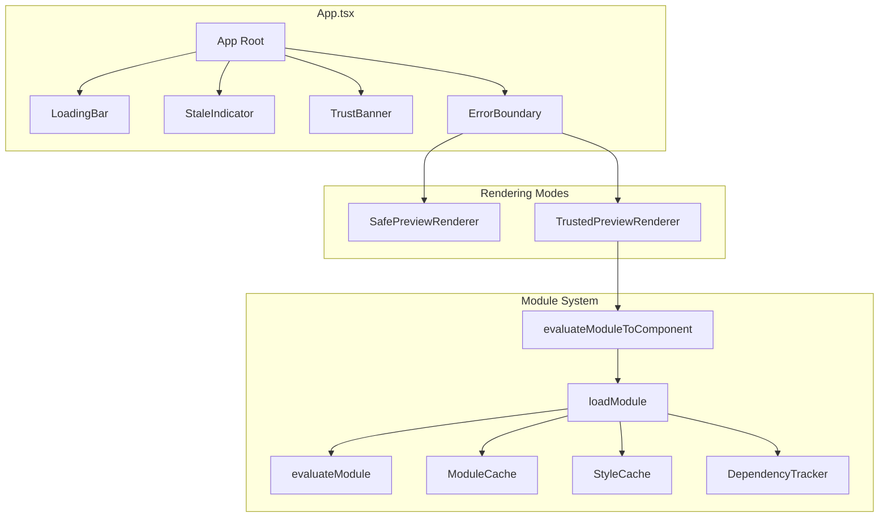

### Safe vs Trusted Rendering

#### SafePreviewRenderer

Renders HTML in Safe Mode without JavaScript execution.

```typescript title="packages/webview-client/src/features/preview/safe/SafePreview.tsx"
function SafePreviewRenderer({ html }: { html: string }) {
  const { sourceLineHighlightEnabled } = useUIFlags();
  const { containerRef, handleImageClick, renderPortals } = usePreviewSetup({
    diagramMode: 'after-paint',
  });

  // Run Safe Mode processing imperatively on the container DOM
  useSafeModeProcessing(containerRef, html);
  useSourceLineHighlight({
    containerRef,
    trigger: html,
    enabled: sourceLineHighlightEnabled,
  });
  useKatexDetection({ html });

  useEffect(() => {
    const container = containerRef.current;
    if (!container) return;
    container.addEventListener('click', handleImageClick);
    return () => container.removeEventListener('click', handleImageClick);
  }, [containerRef, handleImageClick]);

  return (
    <PreviewContainer
      containerRef={containerRef}
      mode="safe"
      diagramPortals={renderPortals()}
      className="markdown-body"
    />
  );
}
```

**Processing Pipeline:** DOMPurify sanitization, external-link hardening (`target="_blank"` + `rel="noopener noreferrer"`), image enhancement (`cursor: zoom-in`), single-fragment DOM append, Safe Mode placeholder style injection, code-block enhancement, and diagram handling via `usePreviewSetup`.

### Diagram Scan Coordinator

Diagram discovery/rendering is coordinated by one canonical hook per preview container:

- `usePreviewSetup(...)` delegates diagram work to `useDiagramScanCoordinator(...)`.
- The coordinator creates exactly one `MutationObserver` for that preview container.
- DOM mutation bursts are RAF-coalesced into one scan batch.
- `diagramMode` controls effect timing path:
  - `before-paint` uses `useLayoutEffect`
  - `after-paint` uses `useEffect`
- Each scan runs adapter-based extraction in stable order:
  1. Mermaid
  2. PlantUML
  3. Graphviz
- Adapters pair extraction with rendering (`find*Containers` + renderer component), and portals use adapter-scoped keys (`${adapter.key}:${diagram.id}`) to avoid cross-type key collisions.

#### TrustedPreviewRenderer

Evaluates transpiled code and renders React component.

```typescript title="packages/webview-client/src/features/preview/trusted/TrustedPreview.tsx"
function TrustedPreviewRenderer({ content }: Props) {
  const [component, setComponent] = useState<React.ReactNode>(null);
  const [isEvaluating, setIsEvaluating] = useState(false);

  useAsyncEffect(async () => {
    setIsEvaluating(true);
    try {
      const result = await evaluateModuleToComponent(
        content.code,
        content.entryFilePath,
        content.dependencies,
        extensionHandle.fetch
      );
      setComponent(resolveMdxNode(result));
    } finally {
      setIsEvaluating(false);
    }
  }, [content.code, content.entryFilePath]);

  if (isEvaluating) return <Spinner />;
  return <div className="markdown-body">{component}</div>;
}
```

### Module System Architecture

The webview module system handles code evaluation with caching and dependency tracking.

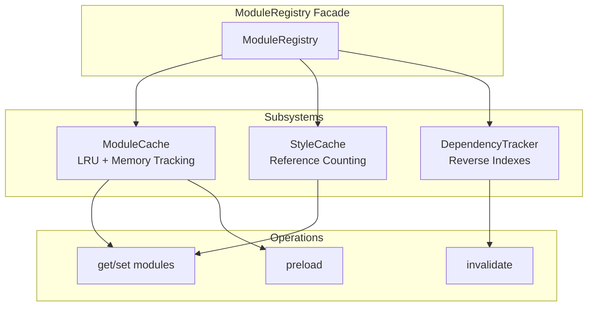

**ModuleCache:**

- LRU cache with configurable limits (default: 500 modules, 50MB)
- Memory estimation for proper eviction
- Preloaded modules protected from eviction
- Pending fetch tracking for circular dependency detection

**StyleCache:**

- Shared LRUCache with reference-counted eviction protection
- `isProtected` predicate keeps styles with active references (`refCount > 0`)
- Unreferenced styles evicted in LRU order to stay under capacity

**DependencyTracker:**

- Resolution map: `(parentId, request) -> fsPath`
- Reverse indexes for O(k) cleanup
- Transitive dependent collection for cascading invalidation

### Module Loading Process

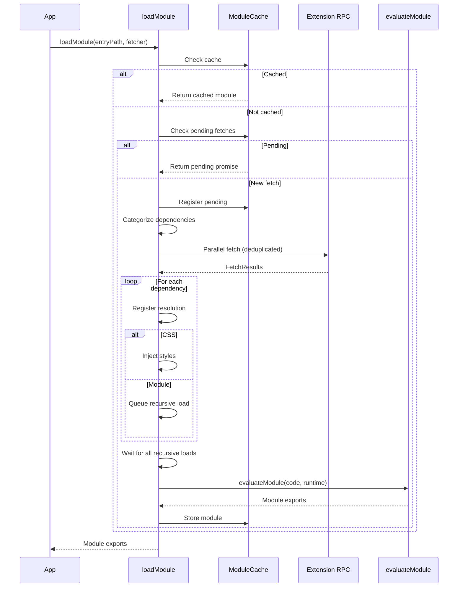

### Module Evaluation

Modules are evaluated safely using the Function constructor:

```typescript title="mdx-forge: src/browser/eval/evaluateModule.ts"
function evaluateModule(
  code: string,
  runtime: ModuleRuntime,
  moduleId: string
): unknown {
  // Create function with runtime injected
  const fn = new Function(
    'runtime',
    'exports',
    'module',
    '__filename',
    `const require = runtime.require;
     ${code}
     return module.exports;`
  );

  const module = { exports: {} };
  const result = fn(runtime, module.exports, module, moduleId);

  return result ?? module.exports;
}
```

**Runtime Context:**

- `Fragment`, `jsx`, `jsxs` - React JSX runtime
- `require` - Module require function with cache lookup

### Preloaded Modules

Core modules are preloaded and protected from cache eviction:

| Module ID                 | Package           | Purpose                       |
| ------------------------- | ----------------- | ----------------------------- |
| `npm://react`             | react             | React library                 |
| `npm://react-dom`         | react-dom         | Full DOM API                  |
| `npm://react-dom/client`  | react-dom/client  | createRoot, hydrateRoot       |
| `npm://react/jsx-runtime` | react/jsx-runtime | JSX transformation            |
| `npm://@mdx-js/react`     | @mdx-js/react     | MDXProvider, useMDXComponents |

**Framework Shims:**

Framework-specific components are loaded on-demand:

```typescript title="packages/webview-client/src/generated/preload/preload.generated.ts"
// Docusaurus shims
'npm://@mdx-preview/shims-docusaurus/Tabs';
'npm://@mdx-preview/shims-docusaurus/TabItem';
'npm://@mdx-preview/shims-docusaurus/Admonition';

// Starlight shims
'npm://@mdx-preview/shims-starlight/Card';
'npm://@mdx-preview/shims-starlight/CardGrid';
'npm://@mdx-preview/shims-starlight/Aside';
```

### Webview RPC Orchestrator Modules

The webview RPC layer is decomposed into focused orchestration modules:

| Module                    | Responsibility                                                                  |
| ------------------------- | ------------------------------------------------------------------------------- |
| `rpc-message-queue.ts`    | Queue/optional buffering, trust/content validation, flush ordering, coalescing  |
| `rpc-registration.ts`     | Handler registration retry/backoff, duplicate-register guard, warning threshold |
| `rpc-bootstrap.ts`        | Comlink endpoint bootstrap + `ExtensionRPC` wrap/expose handshake               |
| `handler-factory.ts`      | Factory functions for queued & optional handler patterns w/ shared types        |
| `content-mode-guard.ts`   | `canAcceptContentMode()` — webview-side trust gating that discards trusted RPC payloads when `canExecute` is false or before the trust handshake completes |
| `module-system-loader.ts` | Lazy loader for the webview module-runtime import (deduped, retry-aware)        |
| `export-html.ts`          | Serializes the live preview DOM (incl. injected styles) into a standalone HTML document for the export command |
| `webview-rpc-client.ts`   | Thin composition root wiring queue/registration/bootstrap/handlers              |

`acquireVsCodeApi()` is invoked lazily inside `initRPCWebviewSide()` (via `rpc-bootstrap.ts`), not at module import time. This allows RPC modules to be imported safely in tests without a global bootstrap shim.

Direct (non-queued) handlers for DOM/style/module-system are now inlined into `webview-rpc-client.ts` rather than living in a separate `rpc-direct-handlers.ts` module.

---

## Framework Support

The extension auto-detects MDX frameworks and provides compatible component shims.

### Framework Detection

```typescript title="packages/extension-host/src/features/framework/FrameworkDetector.ts"
// Detection rules (checked in priority order)
const FRAMEWORK_RULES = [
  {
    id: 'docusaurus',
    packages: ['@docusaurus/core', '@docusaurus/preset-classic'],
  },
  { id: 'starlight', packages: ['@astrojs/starlight'] },
  {
    id: 'nextra',
    packages: ['nextra', 'nextra-theme-docs', 'nextra-theme-blog'],
  },
  {
    id: 'nextjs',
    packages: ['next'],
    secondaryDeps: ['@next/mdx', 'next-mdx-remote', '@mdx-js/react'],
  },
  // fallback: 'generic'
];
```

### Supported Frameworks

| Framework  | Detection Package                                  | Example Aliases                    |
| ---------- | -------------------------------------------------- | ---------------------------------- |
| Docusaurus | `@docusaurus/core` or `@docusaurus/preset-classic` | `@theme/Tabs`, `@theme/Admonition` |
| Starlight  | `@astrojs/starlight`                               | `@astrojs/starlight/components`    |
| Nextra     | `nextra`                                           | `nextra/components`                |
| Next.js    | `next` + MDX config                                | `next/image`, `next/link`          |
| Generic    | (fallback)                                         | `Callout`, `Tabs`, `Collapsible`   |

### Alias Resolution Flow

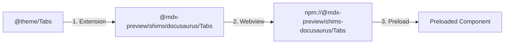

### Nextra \_meta.json Support

For Nextra projects, the extension resolves `_meta.json` files:

```typescript title="packages/contracts/src/preview/types.ts"
interface NextraPageMeta {
  title?: string;
  layout?: 'default' | 'full' | 'raw';
  description?: string;
  toc?: boolean;
}
```

**Resolution:**

1. Walk up from document directory to workspace root
2. Find nearest `_meta.json` file
3. Extract page-level settings
4. Merge with frontmatter (frontmatter takes precedence)

---

## Tailwind CSS Pipeline

The extension includes built-in Tailwind CSS support for utility-first styling.

### Pipeline Overview

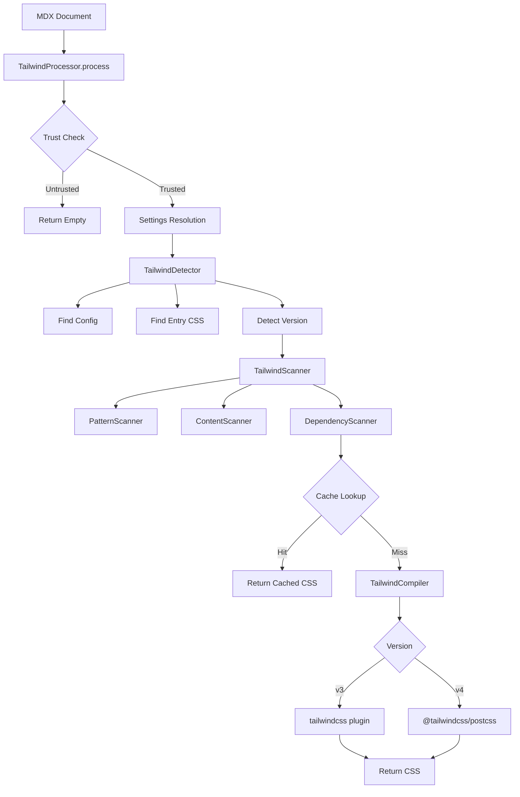

### Scanner Architecture

| Scanner               | Purpose             | Patterns                                   |
| --------------------- | ------------------- | ------------------------------------------ |
| **PatternScanner**    | Static patterns     | `className="..."`, `@apply ...`            |
| **ContentScanner**    | Dynamic expressions | `className={...}`, clsx/cn/classnames, CVA |
| **DependencyScanner** | Imported files      | Scans local imports for additional classes |

### Caching Strategy

**Two-Level Cache:**

| Level         | Purpose                    | Key                                       | TTL   |
| ------------- | -------------------------- | ----------------------------------------- | ----- |
| Version Cache | Avoid package.json lookups | Workspace root                            | 5 min |
| CSS Cache     | Avoid recompilation        | SHA1(version + content + config + stamps) | 5 min |

**Cache Key Composition:**

```typescript
buildCacheKey(
  version, // 'v3' or 'v4'
  content, // 'flex gap-4 text-sm ...'
  configPath, // '/path/to/tailwind.config.js' | null
  entryCssPath // '/path/to/globals.css' | null
); // derives config/entry file stamps internally; returns SHA1 hash
```

> [!NOTE]
> The cache key includes `TAILWIND_CACHE_SCHEMA_VERSION` which must be manually bumped
> when making breaking changes to compilation logic. The 5-minute TTL provides additional
> safety against stale cache issues during extension upgrades.

### Version Support

| Version | Status        | Plugin                 |
| ------- | ------------- | ---------------------- |
| v1-v3   | Not Supported | -                      |
| v4      | Supported     | `@tailwindcss/postcss` |

---

## Configuration System

MDX Preview supports per-project customization via configuration files.

### Configuration Precedence

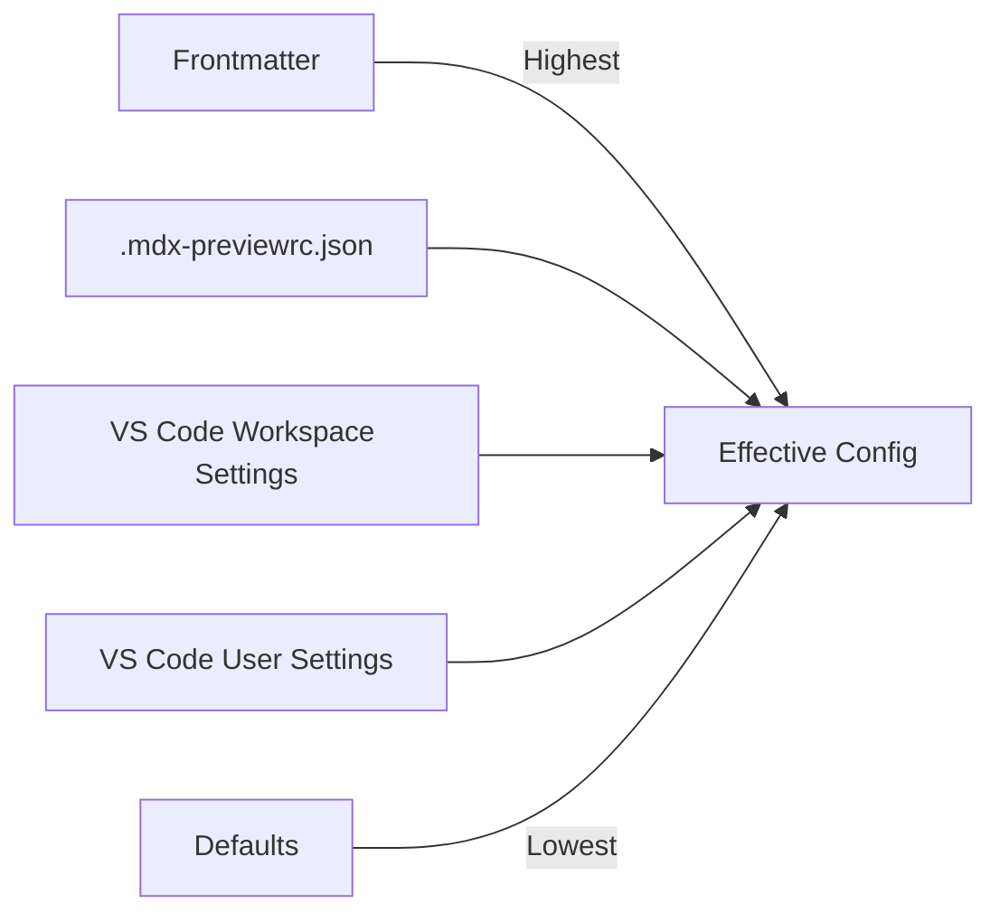

### VS Code Settings

| Setting                                        | Type    | Default     | Description                      |
| ---------------------------------------------- | ------- | ----------- | -------------------------------- |
| `mdx-preview.preview.enableScripts`            | boolean | false       | Enable Trusted Mode              |
| `mdx-preview.preview.updateMode`               | string  | "onType"    | When to update preview           |
| `mdx-preview.preview.debounceDelay`            | number  | 300         | Debounce delay (ms)              |
| `mdx-preview.preview.previewTheme`             | string  | "none"      | Preview theme                    |
| `mdx-preview.preview.codeBlockTheme`           | string  | "auto"      | Code block theme                 |
| `mdx-preview.preview.autoTheme`                | boolean | true        | Auto light/dark switching        |
| `mdx-preview.preview.sourceLineHighlight`      | boolean | true        | Hover highlight by source line   |
| `mdx-preview.preview.sourceLineHighlightColor` | string  | "dependent" | Source-line highlight color mode |
| `mdx-preview.preview.scrollSync`               | string  | "off"       | Source-line scroll sync mode     |
| `mdx-preview.preview.shimSideRail`             | boolean | true        | Framework shim side rail         |
| `mdx-preview.framework`                        | string  | "auto"      | MDX framework                    |
| `mdx-preview.tailwind.enabled`                 | string  | "enabled"   | Tailwind processing              |
| `mdx-preview.build.useSucraseTranspiler`       | boolean | false       | Use Sucrase over Babel           |

### Project Configuration File

`.mdx-previewrc.json` in project root:

```json title=".mdx-previewrc.json"
{
  "remarkPlugins": ["remark-gfm", ["remark-toc", { "heading": "contents" }]],
  "rehypePlugins": ["rehype-slug"],
  "components": {
    "Callout": "./src/components/Callout.tsx",
    "Button": "./src/components/Button.tsx"
  },
  "tailwind": {
    "enabled": "auto",
    "configPath": "./tailwind.config.js"
  }
}
```

### Plugin Loading

Plugins are loaded from workspace `node_modules` in Trusted Mode only:

```typescript title="mdx-forge: src/compiler/plugins/loader.ts"
// Plugin spec formats
'plugin-name'[('plugin-name', { option: true })]; // Just name // With options

// Resolution
const pluginPath = resolve(pluginName, {
  basedir: configDir,
  // enhanced-resolve options
});
```

> [!WARNING]
> Plugin loading is restricted to Trusted Mode for security. Never load plugins in Safe Mode.

---

## Theming System

The extension supports configurable preview and code block themes.

### Preview Themes

16 themes from Markdown Preview Enhanced (including `none` for minimal styling):

| Light Themes    | Dark Themes    |
| --------------- | -------------- |
| github-light    | github-dark    |
| atom-light      | atom-dark      |
| one-light       | one-dark       |
| solarized-light | solarized-dark |
| vue             | atom-material  |
| newsprint       | gothic         |
| medium          | night          |
| none (minimal)  | monokai        |

### Code Block Themes

24 syntax highlighting themes (22 named themes plus `auto` and `default`) via Shiki with CSS variables:

```typescript title="packages/extension-host/src/features/themes/types.ts"
type CodeBlockTheme =
  | 'auto' // Match preview theme
  | 'github-light'
  | 'github-dark'
  | 'one-dark-pro'
  | 'dracula';
// ... 20 more
```

### Auto Theme Switching

When `mdx-preview.preview.autoTheme` is enabled (default):

1. ThemeManager observes VS Code color theme changes
2. Detects if VS Code theme is light or dark
3. Automatically switches between theme variants
4. Pushes updated theme to webview

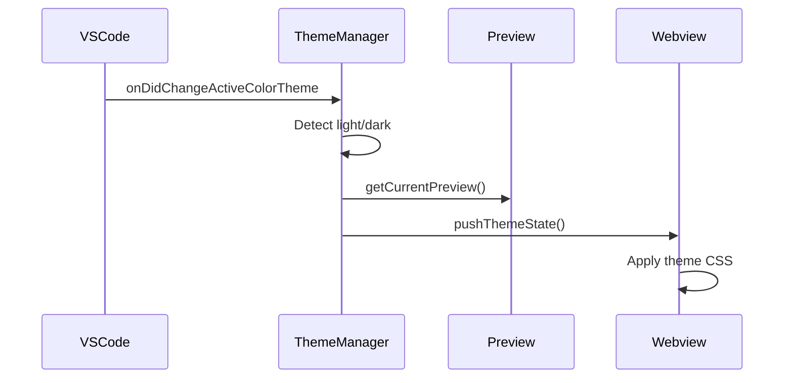

---

## Commands

The extension currently contributes 20 VS Code commands organized by category.

### Preview Commands

| Command ID                                     | Description                                 |
| ---------------------------------------------- | ------------------------------------------- |
| `mdx-preview.commands.openPreview`             | Open MDX preview for active document        |
| `mdx-preview.commands.refreshPreview`          | Refresh current preview                     |
| `mdx-preview.commands.openPreviewFromExplorer` | Open preview for the selected Explorer item |
| `mdx-preview.commands.exportToHtml`            | Export the rendered preview as standalone HTML |

### Config Toggle Commands

| Command ID                                           | Description                    |
| ---------------------------------------------------- | ------------------------------ |
| `mdx-preview.commands.toggleUseVscodeMarkdownStyles` | Toggle VS Code markdown styles |
| `mdx-preview.commands.toggleUseWhiteBackground`      | Toggle white background        |

### Security Commands

| Command ID                                    | Description                            |
| --------------------------------------------- | -------------------------------------- |
| `mdx-preview.commands.changeSecuritySettings` | Change security settings               |
| `mdx-preview.commands.toggleScripts`          | Toggle script execution (Trusted Mode) |

### Theme Commands

| Command ID                                            | Description                        |
| ----------------------------------------------------- | ---------------------------------- |
| `mdx-preview.commands.selectPreviewTheme`             | Select preview theme from list     |
| `mdx-preview.commands.selectCodeBlockTheme`           | Select code block theme from list  |
| `mdx-preview.commands.selectMermaidTheme`             | Select Mermaid diagram theme       |
| `mdx-preview.commands.selectSourceLineHighlightColor` | Select source-line highlight color |

### Framework Commands

| Command ID                             | Description          |
| -------------------------------------- | -------------------- |
| `mdx-preview.commands.selectFramework` | Select MDX framework |

### Cache Commands

| Command ID                            | Description                                        |
| ------------------------------------- | -------------------------------------------------- |
| `mdx-preview.commands.clearAllCaches` | Clear all caches (resolver, Sass, webview modules) |

The `clearAllCaches` command clears:

1. **Extension-side caches**: Resolver cache, Sass module cache, component detection cache, path security caches
2. **Webview-side caches**: Module cache, style cache, dependency tracker (via RPC)

### Config Info Commands

| Command ID                                 | Description                               |
| ------------------------------------------ | ----------------------------------------- |
| `mdx-preview.commands.showEffectiveConfig` | Show effective configuration with sources |

The `showEffectiveConfig` command opens a JSON document showing:

- **Metadata**: Document path, framework, trust state
- **Effective Config**: Merged configuration values
- **Sources**: Origin of each setting (frontmatter, config file, workspace settings, user settings, default)

### Debug Commands

| Command ID                               | Description                         |
| ---------------------------------------- | ----------------------------------- |
| `mdx-preview.commands.toggleDebugOutput` | Toggle debug output in Output panel |

### Authoring Commands

| Command ID                                | Description                           |
| ----------------------------------------- | ------------------------------------- |
| `mdx-preview.commands.copyAuthoringGuide` | Copy MDX authoring guide to clipboard |

### Zoom Commands

| Command ID                       | Description                  |
| -------------------------------- | ---------------------------- |
| `mdx-preview.commands.zoomIn`    | Increase preview zoom by 10% |
| `mdx-preview.commands.zoomOut`   | Decrease preview zoom by 10% |
| `mdx-preview.commands.resetZoom` | Reset preview zoom to 100%   |

---

## Testing Infrastructure

The extension uses Vitest for all testing with different configurations.

### Test Types

| Type    | Config                              | Environment          | Purpose                                           |
| ------- | ----------------------------------- | -------------------- | ------------------------------------------------- |
| Unit    | `tests/vitest.config.ts`            | Node + mocked vscode | Test isolated logic & VS Code API usage via mocks |
| Webview | `tests/vitest.config.ts` (jsdom)    | jsdom                | Test React components & webview-side modules      |

VS Code API integration is exercised through the mocked-vscode unit suite (`packages/extension-host/test/__mocks__/vscode.ts`); there is no separate Extension Development Host integration runner.

### Running Tests

```bash title="Test commands"
# Full production-critical suite (extension + webview)
npm test

# Watch mode for the full suite
npm run test:watch

# Webview-only subset (subdirectory filter)
npm run test:webview

# Alias for the full suite (same as `npm test`)
npm run test:all
```

### Test Fixtures

```
packages/extension-host/test/
└── __mocks__/
    └── vscode.ts        # VS Code API mock

tests/
├── helpers/             # Shared test fixtures & utilities
├── security/            # Trust, CSP, path validation tests
├── compilation/         # MDX compilation tests
├── transpilation/       # Sucrase/Babel transpilation tests
├── resolution/          # Module resolution tests
├── extension/           # Extension-specific tests (commands, framework, etc.)
├── webview/             # Webview component & runtime tests
├── shared/              # Cross-repo parity tests against mdx-forge
└── services/            # Service registry tests
```

### Key Testing Patterns

**Mocking VS Code:**

```typescript title="packages/extension-host/test/__mocks__/vscode.ts"
export const workspace = {
  isTrusted: true,
  getConfiguration: vi.fn(),
  onDidChangeConfiguration: vi.fn(),
  // ...
};
```

**Testing Trust State:**

```typescript title="Example test"
import { getTrustManager } from '../services';

test('returns false when workspace untrusted', () => {
  vi.mocked(vscode.workspace.isTrusted).mockReturnValue(false);

  const state = getTrustManager().getState();

  expect(state.canExecute).toBe(false);
  expect(state.reason).toContain('untrusted');
});
```

---

## Error Handling & Recovery

The extension implements a two-layer error handling architecture spanning the extension host and webview.

### Error Flow

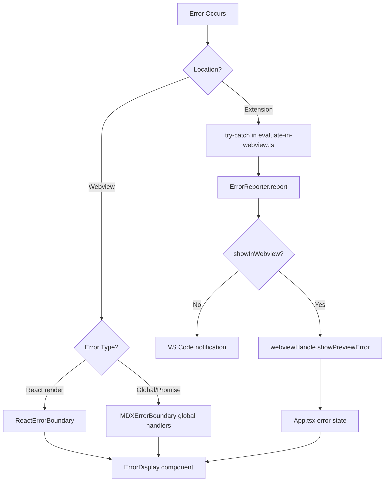

### Extension-Side Error Handling

Errors during compilation, transpilation, or module fetching are caught in `evaluate-in-webview.ts`:

```typescript title="packages/extension-host/src/features/preview/evaluate-in-webview.ts"
try {
  // Compilation and evaluation logic
} catch (error) {
  getErrorReporter().report(error, {
    context: ErrorContext.Transpile,
    showInWebview: true,
    webviewHandle,
    metadata: { fsPath },
  });
}
```

The `ErrorReporter` service provides:

- Automatic severity inference based on error type and context
- Duplicate error suppression (LRU-based, configurable window)
- Unified logging with context
- Webview error display via RPC
- VS Code notification fallback

### Webview-Side Error Handling

The webview uses a **two-layer error boundary**:

1. **Global error handlers** (`MDXErrorBoundary`) - Catches unhandled errors and promise rejections via `window.addEventListener`
2. **React error boundary** (`ReactErrorBoundary`) - Catches errors during React rendering

```typescript title="packages/webview-client/src/shared/ui/error-boundary/ErrorBoundary.tsx"
// Global handlers for non-React errors
useEffect(() => {
  const handleError = (event: ErrorEvent) => {
    event.preventDefault();
    setGlobalError(normalizeError(event.error));
  };
  window.addEventListener('error', handleError);
  // ...
}, []);
```

### Error Display

The `ErrorDisplay` component shows:

- Error message with VS Code-themed styling
- **Suggestions** extracted from `ModuleError` (actionable fixes)
- **Stack trace** with parsed frames (user code highlighted)
- Copy and Retry buttons

### No "Last Good Render" Pattern

> [!WARNING]
> The extension does **not** retain the last successful render on error. When an error occurs, the error display **replaces** the preview content entirely.

This design choice:

- Prevents showing stale/misleading content
- Makes errors immediately visible to users
- Simplifies state management (no need to track "last good" state)

### RPC Message Queue & Flush Order

Messages received before React mounts are buffered in `rpc-message-queue.ts` and flushed by `registerWebviewHandlers(...)` after registration succeeds:

```typescript title="packages/webview-client/src/platform/rpc/rpc-message-queue.ts"
// Flush order with content validation:
// 1. Trust state (sets rendering mode - MUST be first)
// 2. Content (safe OR trusted, validated against trust state)
// 3. Error/stale overlays
```

`rpc-registration.ts` owns retry/backoff and duplicate-register guards; once handlers are committed, it calls `queue.flush()`.

**Content validation** ensures that trusted content is only applied when `canExecute` is true. The check lives in `content-mode-guard.ts` and is shared by both the queue and the direct handlers:

```typescript title="packages/webview-client/src/platform/rpc/content-mode-guard.ts"
export function canAcceptContentMode(
  trustState: TrustState | null,
  contentMode: 'safe' | 'trusted',
  log: TaggedLogger
): boolean {
  if (contentMode !== 'trusted') return true;
  if (trustState?.canExecute === true) return true;

  // discard - prevents rendering trusted code in safe mode
  // or before the trust handshake has completed
  log.warn('Discarding trusted content - trust state not canExecute');
  return false;
}
```

### Performance Reporting

The `reportPerformance(evaluationDuration)` RPC method is **development-only** for debugging render performance. It is **not** telemetry and does not send data externally.

Current behavior:

- Logs evaluation duration to console in development
- No-op in production builds

### Stale Indicator

When the preview content becomes stale (dependency changed, document modified before re-evaluation):

1. Extension calls `webviewHandle.setStale(true)`
2. Webview shows a visual "Stale" indicator overlay
3. On successful re-evaluation, `setStale(false)` clears the indicator

The stale indicator does **not** block interaction - users can still scroll and interact with stale content.

---

## Security Considerations

### Trust Validation

Always validate trust before sensitive operations:

```typescript title="Two validation patterns"
// Pattern 1: Conditional (when fallback exists)
const trustState = getTrustManager().getState();
if (trustState.canExecute) {
  // Trusted operation
} else {
  // Safe fallback
}

// Pattern 2: Throwing (when operation must fail)
import { requireTrustedModeForDocument } from './security/validateTrust';
requireTrustedModeForDocument(documentUri, 'load plugins'); // Throws TrustError if not trusted
```

### Path Validation

Prevent directory traversal attacks:

```typescript title="packages/extension-host/src/features/module-runtime/security/checkFsPath.ts"
function checkFsPath(baseDir: string, fsPath: string): void {
  const resolved = path.resolve(fsPath);
  if (!resolved.startsWith(baseDir)) {
    throw new SecurityError('Path outside allowed directory');
  }
}
```

> [!NOTE]
> The example above is simplified. Security-critical code uses `checkFsPathAsync()` which:
>
> - Resolves symlinks via `fs.promises.realpath()` to prevent symlink traversal
> - Normalizes paths for case-insensitive comparison on Windows
> - Caches resolved paths for performance

### Module Fetching Limits

DoS prevention via size and dependency limits:

| Limit                       | Value      | Purpose                         |
| --------------------------- | ---------- | ------------------------------- |
| Max file size               | 5 MB       | Prevent memory exhaustion       |
| Max dependencies per module | 200        | Prevent combinatorial explosion |
| Max fetch request length    | 2048 chars | Prevent oversized specifiers    |

### HTML Sanitization

All HTML in Safe Mode is sanitized:

```typescript title="packages/webview-client/src/features/preview/safe/security/allowlist.ts"
import DOMPurify from 'dompurify';

// DOMPURIFY_CONFIG is a strict explicit allowlist (no ADD_TAGS); foreignObject
// is excluded. Consumed once, via the useSafeModeProcessing hook.
const DOMPURIFY_CONFIG = {
  // HTML + KaTeX/MathML + SVG (foreignObject excluded; 'use' allowed)
  ALLOWED_TAGS: ['h1', 'p', 'a', 'pre', 'code', 'table', 'svg', 'use' /* ... */],
  // standard attrs + diagram data attributes
  ALLOWED_ATTR: [
    'href', 'src', 'class', 'xlink:href',
    'data-mermaid-chart', 'data-mermaid-id',
    'data-plantuml-code', 'data-graphviz-code',
    'data-admonition-type', 'data-source-line' /* ... */,
  ],
  ADD_ATTR: ['target', 'rel'],
  ALLOW_UNKNOWN_PROTOCOLS: false,
  ALLOWED_URI_REGEXP: /^(?:(?:https?|mailto|tel):|[^a-z]|[a-z+.-]+(?:[^a-z+.\-:]|$))/i,
};

// invoked in useSafeModeProcessing.ts
const sanitized = DOMPurify.sanitize(html, DOMPURIFY_CONFIG);
```

### Security Checklist

> [!CAUTION]
> When modifying security-sensitive code:
>
> 1. **Never bypass trust checks** - Always use TrustManager or validateTrust utilities
> 2. **Validate file paths** - Use `checkFsPath()` for all file system access
> 3. **Sanitize HTML** - DOMPurify is mandatory in Safe Mode
> 4. **Maintain CSP** - Don't add `unsafe-*` directives without security review
> 5. **Prevent eval injection** - Module code is pre-transpiled; validate all inputs

---

## Performance Optimizations

MDX Preview uses multiple caching layers to minimize redundant work. For a comprehensive
guide to all caches, invalidation triggers, and troubleshooting, see the
[Caching Architecture](/docs/caching) documentation.

### Caching Strategy

| Cache            | Location               | Size          | TTL       | Purpose                   |
| ---------------- | ---------------------- | ------------- | --------- | ------------------------- |
| File Stat        | file-prober.ts         | 1000          | 5s        | Avoid repeated stat calls |
| TS Pattern Index | TypeScriptPathStrategy | Per-config    | Validated | O(1) path matching        |
| Resolver FS      | resolver-factory.ts    | Shared        | 30s       | Node resolution caching   |
| Babel Config     | babel.ts               | 1             | Forever   | Avoid preset recreation   |
| Sass Module      | SassHandler.ts         | Per-workspace | Forever   | Lazy workspace sass       |
| Module Cache     | ModuleCache.ts         | 500/50MB      | Forever   | Webview module caching    |
| Tailwind CSS     | TailwindProcessor.ts   | 50            | 5min      | Avoid recompilation       |

**Automatic Cache Invalidation:**

| Trigger                | Caches Cleared                              |
| ---------------------- | ------------------------------------------- |
| `package.json` change  | Resolver cache, Sass module cache           |
| Config file change     | Preview refresh (dependencies re-evaluated) |
| Dependency file change | Module cache entry invalidated              |

**Manual Cache Commands:**

| Command          | Effect                                           |
| ---------------- | ------------------------------------------------ |
| `clearAllCaches` | Clears resolver, Sass, and webview module caches |

### Prewarm System

The extension includes a prewarm coordinator to reduce first-render latency by loading heavy modules in the background before they're needed.

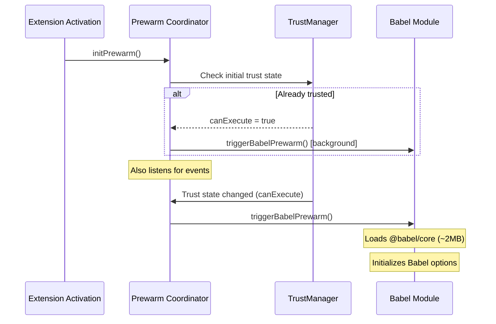

**Prewarm Triggers:**

- Extension activation (if already trusted)
- Trust state change to `canExecute`
- User opens an MDX file (anticipatory)

**Prewarmed Modules:**

- `@babel/core` - Heavy module (~2MB), loaded in background
- Babel options cache - Initialized after core loads

> [!NOTE]
> Prewarm is safe to call multiple times - it tracks state internally and becomes a no-op after first successful warm.

### Lazy Loading

- Canonical loader primitive: `@mdx-preview/runtime-utils#createLazyValueLoader`
  - Provides deduplicated in-flight loads, cached success values, optional retry after failure, and reset support.
- **Babel** (~2MB) - Loaded on first transform, not activation (or prewarmed in background)
- **Sass** - Loaded from workspace `node_modules` on first .scss
- **KaTeX CSS** - Loaded in webview only when math detected
- **Framework Shims** - Loaded on-demand per framework
- **Mermaid / Graphviz / module-runtime import** - Loaded through dedicated loader modules that share the same lazy-value semantics.

Wrapper conventions:

- Extension `createLazyImport(...)` is built on `createLazyValueLoader(..., { allowRetry: false })` to preserve fail-sticky module-load behavior.
- Webview `createResourceLoader(...)` is built on the same primitive and keeps side-effect resource APIs (`load/isLoaded/isLoading/reset`) with configurable retry semantics.

### Parallel Operations

All parallel operations use a custom `Semaphore` utility to prevent resource exhaustion:

- File probing uses `Promise.all` for extension checks (bounded by probe extensions)
- Dependency scanning reads files in parallel (max 10 concurrent via Semaphore)
- Module loading fetches dependencies in parallel (max 10 concurrent, deduplicated)
- Tailwind scans dependencies in parallel (max 8 concurrent for file reads)

---

## File Reference

### Extension Package (`packages/extension-host`)

| Directory                      | Purpose                                               |
| ------------------------------ | ----------------------------------------------------- |
| `src/entry/activate.ts`        | Entry point, activation, deactivation                 |
| `src/features/preview/`        | Preview management, webview bridge, evaluation engine |
| `src/features/module-runtime/` | Resolution, handlers, transpilation, security         |
| `src/features/security/`       | Trust management, CSP generation                      |
| `src/features/commands/`       | VS Code command handlers                              |
| `src/features/diagnostics/`    | Component detection, code actions                     |
| `src/features/framework/`      | Framework detection, Nextra \_meta.json support       |
| `src/features/tailwind/`       | Tailwind detection, scanning, compilation             |
| `src/features/themes/`         | Theme management, auto-switching                      |
| `src/features/prewarm/`        | Background module prewarming                          |
| `src/app/services/`            | Service registry, singleton services                  |
| `src/shared/config/`           | Configuration management, caching                     |
| `src/shared/errors/`           | ErrorReporter, error codes, messages                  |
| `src/shared/logging/`          | Tagged logger for extension host                      |
| `src/shared/utils/`            | Shared utilities (cache, file helpers, validation)    |
| `src/platform/rpc/`            | RPC endpoint & handler                                |

### Webview Package (`packages/webview-client`)

| Directory                       | Purpose                                                  |
| ------------------------------- | -------------------------------------------------------- |
| `src/app/App.tsx`               | Root component, mode switching                           |
| `src/features/preview/safe/`    | Safe Mode rendering                                      |
| `src/features/preview/trusted/` | Trusted Mode rendering                                   |
| `src/features/preview/shared/`  | Shared preview UI (loading, stale, trust)                |
| `src/features/module-runtime/`  | Module caching, loading, preload                         |
| `src/generated/shim-barrels/`   | Generated framework shim re-exports                      |
| `src/features/diagrams/`        | Mermaid, PlantUML, Graphviz rendering                    |
| `src/features/code-block/`      | Code block enhancement & KaTeX                           |
| `src/features/lightbox/`        | Image lightbox                                           |
| `src/features/theme/`           | Theme loading & detection                                |
| `src/app/state/`                | React context providers                                  |
| `src/platform/rpc/`             | RPC communication, message queue                         |
| `src/shared/`                   | Shared hooks, UI components, utilities                   |
| `src/generated/`                | Code-generated files (preload, shim-barrels, CSS loader) |

### Shared Packages

| Package                      | Purpose                                                         |
| ---------------------------- | --------------------------------------------------------------- |
| `@mdx-preview/contracts`     | Types, enums, constants, logging, themes, RPC contracts, errors |
| `@mdx-preview/runtime-utils` | LRU cache, validation, error handling, Semaphore, module ID     |
| `@mdx-preview/codegen`       | Code generation scripts & libraries                             |

### mdx-forge Library (External)

| Subpath                         | Purpose                                                                |
| ------------------------------- | ---------------------------------------------------------------------- |
| `mdx-forge/compiler`            | MDX compilation (safe & trusted modes), plugins, transforms            |
| `mdx-forge/browser`             | Browser module loading, evaluation, preload, registry                  |
| `mdx-forge/components`          | React component shims (generic, docusaurus, starlight, nextra, nextjs) |
| `mdx-forge/components/registry` | Component registry metadata & queries                                  |
| `mdx-forge/components/styles/*` | Framework CSS files                                                    |

---

## Conclusion

MDX Preview implements a sophisticated architecture balancing security, performance, and extensibility:

- **Two-mode security model** ensures safe defaults while enabling power users
- **Service-based architecture** provides clean separation and lifecycle management
- **Comlink RPC** enables type-safe communication between extension and webview
- **4-strategy module resolution** handles all import patterns
- **Comprehensive caching** minimizes redundant work
- **Framework detection** provides seamless experience across MDX ecosystems

For implementation details, refer to the source files linked throughout this document.
