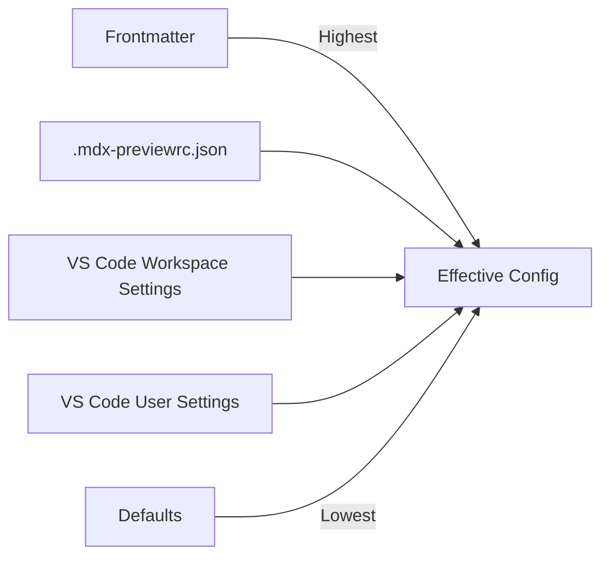
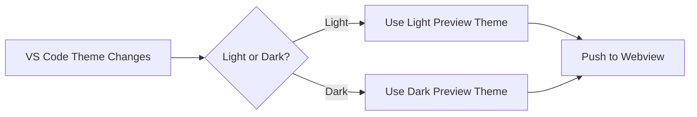

# Configuration

This document covers all configuration options for MDX Preview, including VS Code settings, project configuration files, frontmatter overrides, and theme customization.

---

## Overview

MDX Preview uses a layered configuration system with five levels of precedence:



**Precedence Order (highest to lowest):**

1. **Frontmatter** - Per-document overrides in YAML front matter
2. **Project Config File** - `.mdx-previewrc.json` in project directory
3. **VS Code Workspace Settings** - `.vscode/settings.json` in your project
4. **VS Code User Settings** - Global user settings
5. **Defaults** - Built-in extension defaults

This allows you to set defaults globally, customize them per-workspace, override per-project, and fine-tune per-document.

---

## VS Code Settings

All settings are prefixed with `mdx-preview.` in VS Code's settings.json.

### Preview Settings

| Setting | Type | Default | Description |
|---------|------|---------|-------------|
| `preview.updateMode` | string | `"onType"` | When to update the preview: `"onType"`, `"onSave"`, or `"manual"` |
| `preview.debounceDelay` | number | `300` | Delay in milliseconds before updating preview after typing |
| `preview.enableScripts` | boolean | `false` | Enable Trusted Mode for JavaScript execution and imports |
| `preview.openMdxLinksInPreview` | boolean | `true` | Open `.mdx` links in the preview instead of the editor |
| `preview.security` | string | `"strict"` | Security policy: `"strict"` or `"disabled"` |
| `preview.useVscodeMarkdownStyles` | boolean | `true` | Use VS Code's built-in markdown styles as base |
| `preview.useWhiteBackground` | boolean | `false` | Force white background regardless of theme |
| `preview.customCss` | string | `""` | Path to custom CSS file for preview styling |
| `preview.mdx.customLayoutFilePath` | string | `""` | Path to custom MDX layout component |

#### Update Mode Options

| Value | Behavior |
|-------|----------|
| `"onType"` | Updates preview as you type (with debounce delay) |
| `"onSave"` | Updates preview only when file is saved |
| `"manual"` | Updates only when manually refreshed |

> [!TIP]
> Use `"onSave"` for large documents or slow machines to reduce CPU usage.

### Theme Settings

| Setting | Type | Default | Description |
|---------|------|---------|-------------|
| `preview.previewTheme` | string | `"none"` | Preview theme for document styling |
| `preview.codeBlockTheme` | string | `"auto"` | Syntax highlighting theme for code blocks |
| `preview.mermaidTheme` | string | `"default"` | Theme for Mermaid diagrams |
| `preview.autoTheme` | boolean | `true` | Automatically switch light/dark based on VS Code theme |

See [Theme Configuration](#theme-configuration) for available themes.

### Build Settings

| Setting | Type | Default | Description |
|---------|------|---------|-------------|
| `build.useSucraseTranspiler` | boolean | `false` | Use Sucrase instead of Babel for faster transpilation |

> [!NOTE]
> Sucrase is faster but supports fewer syntax features. Babel provides full ES2022+ support.

### Tailwind Settings

| Setting | Type | Default | Description |
|---------|------|---------|-------------|
| `tailwind.enabled` | string | `"enabled"` | Tailwind processing: `"auto"`, `"enabled"`, or `"disabled"` |
| `tailwind.maxFileSizeBytes` | number | `10485760` | Maximum file size to scan for Tailwind classes (10MB) |
| `tailwind.maxCssFilesToSearch` | number | `500` | Maximum CSS files to search for entry points |
| `tailwind.cacheMaxEntries` | number | `50` | Maximum cache entries for compiled CSS |
| `tailwind.cacheTtlSeconds` | number | `300` | Cache time-to-live in seconds (5 minutes) |
| `tailwind.compilationTimeout` | number | `15000` | Timeout for Tailwind compilation in milliseconds |

#### Tailwind Enabled Options

| Value | Behavior |
|-------|----------|
| `"auto"` | Enable if Tailwind is detected in package.json |
| `"enabled"` | Always process Tailwind CSS |
| `"disabled"` | Never process Tailwind CSS |

### Framework Settings

| Setting | Type | Default | Description |
|---------|------|---------|-------------|
| `framework` | string | `"auto"` | MDX framework: `"auto"`, `"docusaurus"`, `"starlight"`, `"nextra"`, `"nextjs"`, or `"generic"` |
| `framework.componentShims` | boolean | `true` | Enable built-in component shims for detected framework |

> [!TIP]
> Use `"auto"` (default) to let MDX Preview detect your framework from package.json. Set explicitly if detection is incorrect.

### Component Settings

| Setting | Type | Default | Description |
|---------|------|---------|-------------|
| `components.builtins` | boolean | `true` | Enable built-in components (Callout, Tabs, etc.) |
| `components.unknownBehavior` | string | `"placeholder"` | How to handle unknown components: `"strip"`, `"placeholder"`, or `"raw"` |

#### Unknown Component Behavior

| Value | Behavior |
|-------|----------|
| `"strip"` | Remove the component entirely |
| `"placeholder"` | Show placeholder box with component name and children |
| `"raw"` | Remove the wrapper but render children inline |

### Advanced Settings

| Setting | Type | Default | Description |
|---------|------|---------|-------------|
| `advanced.watcherDebounceMs` | number | `500` | Debounce delay for file watchers |

---

## Project Configuration File

Create a `.mdx-previewrc.json` file in your project root for per-project settings.

### Location and Discovery

The extension searches for configuration files in this order:

1. `.mdx-previewrc.json` (preferred)
2. `.mdx-previewrc`

Starting from the MDX document's directory, it searches upward until it finds a config file or reaches the workspace root.

### Schema

```json
{
  "remarkPlugins": ["plugin-name", ["plugin-with-options", { "option": true }]],
  "rehypePlugins": ["rehype-plugin"],
  "components": {
    "ComponentName": "./path/to/Component.tsx"
  },
  "framework": "docusaurus",
  "frameworkOptions": {
    "enableShims": true,
    "customAliases": {
      "@components": "./src/components"
    }
  },
  "tailwind": {
    "enabled": "auto",
    "configPath": "./tailwind.config.js"
  },
  "unknownBehavior": "placeholder"
}
```

### Configuration Options

#### remarkPlugins

Custom remark plugins added after built-in plugins.

```json
{
  "remarkPlugins": [
    "remark-gfm",
    ["remark-toc", { "heading": "contents", "maxDepth": 3 }]
  ]
}
```

**Plugin Spec Formats:**
- `"plugin-name"` - Plugin without options
- `["plugin-name", { options }]` - Plugin with options

> [!WARNING]
> Plugin loading requires Trusted Mode. Plugins are resolved from your workspace's `node_modules`.

#### rehypePlugins

Custom rehype plugins added after built-in plugins.

```json
{
  "rehypePlugins": [
    "rehype-slug",
    ["rehype-autolink-headings", { "behavior": "wrap" }]
  ]
}
```

#### components

Map component names to file paths for automatic import generation.

```json
{
  "components": {
    "Button": "./src/components/Button.tsx",
    "Card": "./src/components/Card.tsx",
    "Alert": "@/components/Alert"
  }
}
```

Paths are resolved relative to the config file location. The extension generates import statements automatically:

```javascript
import Button from './src/components/Button.tsx';
import Card from './src/components/Card.tsx';
import Alert from '@/components/Alert';
```

#### framework

Override auto-detected framework.

```json
{
  "framework": "docusaurus"
}
```

Valid values: `"docusaurus"`, `"starlight"`, `"nextra"`, `"nextjs"`, `"generic"`

#### frameworkOptions

Framework-specific customization.

```json
{
  "frameworkOptions": {
    "enableShims": true,
    "customAliases": {
      "@theme": "./src/theme",
      "@site": "./src"
    }
  }
}
```

| Option | Type | Description |
|--------|------|-------------|
| `enableShims` | boolean | Enable/disable component shims for this project |
| `customAliases` | object | Custom import alias mappings |

#### tailwind

Tailwind CSS configuration.

```json
{
  "tailwind": {
    "enabled": "auto",
    "configPath": "./config/tailwind.config.js"
  }
}
```

| Option | Type | Description |
|--------|------|-------------|
| `enabled` | string | `"auto"`, `"enabled"`, or `"disabled"` |
| `configPath` | string | Path to Tailwind config file (relative to config file) |

#### unknownBehavior

How to handle unknown JSX components in Safe Mode.

```json
{
  "unknownBehavior": "placeholder"
}
```

Valid values: `"strip"`, `"placeholder"`, `"raw"`

---

## Frontmatter Configuration

Override settings per-document using YAML frontmatter.

### Supported Keys

```yaml
---
title: My Document
layout: full
theme: github-dark
---

# Content starts here
```

| Key | Type | Description |
|-----|------|-------------|
| `title` | string | Document title (used by some frameworks) |
| `layout` | string | Layout mode: `"default"`, `"full"`, or `"raw"` |
| `theme` | string | Override preview theme for this document |

### Layout Modes

| Layout | Description |
|--------|-------------|
| `default` | Standard preview with table of contents |
| `full` | Full-width preview without sidebar |
| `raw` | Minimal preview without any wrapper |

> [!NOTE]
> Layout modes are primarily used with Nextra and are read from `_meta.json` files as well.

---

## Theme Configuration

### Preview Themes

16 preview themes available, inherited from Markdown Preview Enhanced:

| Light Themes | Dark Themes |
|--------------|-------------|
| `github-light` | `github-dark` |
| `atom-light` | `atom-dark` |
| `one-light` | `one-dark` |
| `solarized-light` | `solarized-dark` |
| `vue` | `atom-material` |
| `newsprint` | `gothic` |
| `medium` | `night` |
| `none` (minimal) | `monokai` |

### Code Block Themes

23 syntax highlighting themes for code blocks (including `auto` and `default`):

| Theme | Theme | Theme |
|-------|-------|-------|
| `auto` | `default` | `atom-dark` |
| `atom-light` | `atom-material` | `coy` |
| `darcula` | `dark` | `funky` |
| `github` | `github-dark` | `hopscotch` |
| `monokai` | `okaidia` | `one-dark` |
| `one-light` | `pen-paper-coffee` | `pojoaque` |
| `solarized-dark` | `solarized-light` | `twilight` |
| `vs` | `vue` | `xonokai` |

The `auto` option selects a theme that matches your preview theme.

### Mermaid Themes

| Theme | Description |
|-------|-------------|
| `default` | Light theme (default) |
| `dark` | Dark theme |
| `forest` | Green-accented theme |
| `neutral` | Grayscale theme |
| `base` | Minimal styling |
| `null` | No theme (raw) |

### Auto Theme Switching

When `preview.autoTheme` is enabled (default), the extension automatically switches between light and dark theme variants based on your VS Code color theme.



Theme pairs (light ↔ dark):
- `github-light` ↔ `github-dark`
- `atom-light` ↔ `atom-dark`
- `one-light` ↔ `one-dark`
- `solarized-light` ↔ `solarized-dark`

---

## Examples

### Minimal Configuration

Just enable Trusted Mode in VS Code settings:

```json
{
  "mdx-preview.preview.enableScripts": true
}
```

### Docusaurus Project

`.mdx-previewrc.json`:

```json
{
  "framework": "docusaurus",
  "remarkPlugins": ["remark-gfm"],
  "components": {
    "CodeBlock": "@theme/CodeBlock"
  }
}
```

### Next.js with Tailwind

`.mdx-previewrc.json`:

```json
{
  "framework": "nextjs",
  "tailwind": {
    "enabled": "enabled",
    "configPath": "./tailwind.config.ts"
  },
  "components": {
    "Image": "next/image",
    "Link": "next/link"
  }
}
```

### Custom Components Library

`.mdx-previewrc.json`:

```json
{
  "components": {
    "Button": "./src/components/Button.tsx",
    "Card": "./src/components/Card.tsx",
    "Alert": "./src/components/Alert.tsx",
    "Tabs": "./src/components/Tabs.tsx",
    "TabItem": "./src/components/TabItem.tsx"
  },
  "remarkPlugins": [
    "remark-gfm",
    ["remark-directive", {}]
  ],
  "rehypePlugins": [
    "rehype-slug"
  ]
}
```

### Full-Featured Configuration

VS Code settings.json:

```json
{
  "mdx-preview.preview.enableScripts": true,
  "mdx-preview.preview.updateMode": "onType",
  "mdx-preview.preview.debounceDelay": 500,
  "mdx-preview.preview.previewTheme": "github-light",
  "mdx-preview.preview.codeBlockTheme": "auto",
  "mdx-preview.preview.autoTheme": true,
  "mdx-preview.tailwind.enabled": "auto",
  "mdx-preview.framework": "auto",
  "mdx-preview.components.builtins": true,
  "mdx-preview.components.unknownBehavior": "placeholder"
}
```

---

## Configuration Caching

Configuration files are cached for performance:

- **Per-directory cache** - Each directory's resolved config is cached
- **File watchers** - Changes to config files trigger cache invalidation
- **Automatic refresh** - Preview updates when config changes

To manually clear all caches (including configuration), use the command:

```
MDX Preview: Clear All Caches
```

---

## Troubleshooting Configuration

### Config File Not Found

1. Verify file is named `.mdx-previewrc.json` or `.mdx-previewrc`
2. Check file is within the workspace root
3. Check for JSON syntax errors

### Plugins Not Loading

1. Verify Trusted Mode is enabled
2. Check plugins are installed in `node_modules`
3. Check plugin name matches npm package name

### Settings Not Applied

1. Check configuration precedence (frontmatter > config file > VS Code)
2. Reload window after changing `.mdx-previewrc.json`
3. Check Output panel for configuration errors

> [!TIP]
> View the Output panel (View > Output > MDX Preview) for detailed configuration loading logs.
