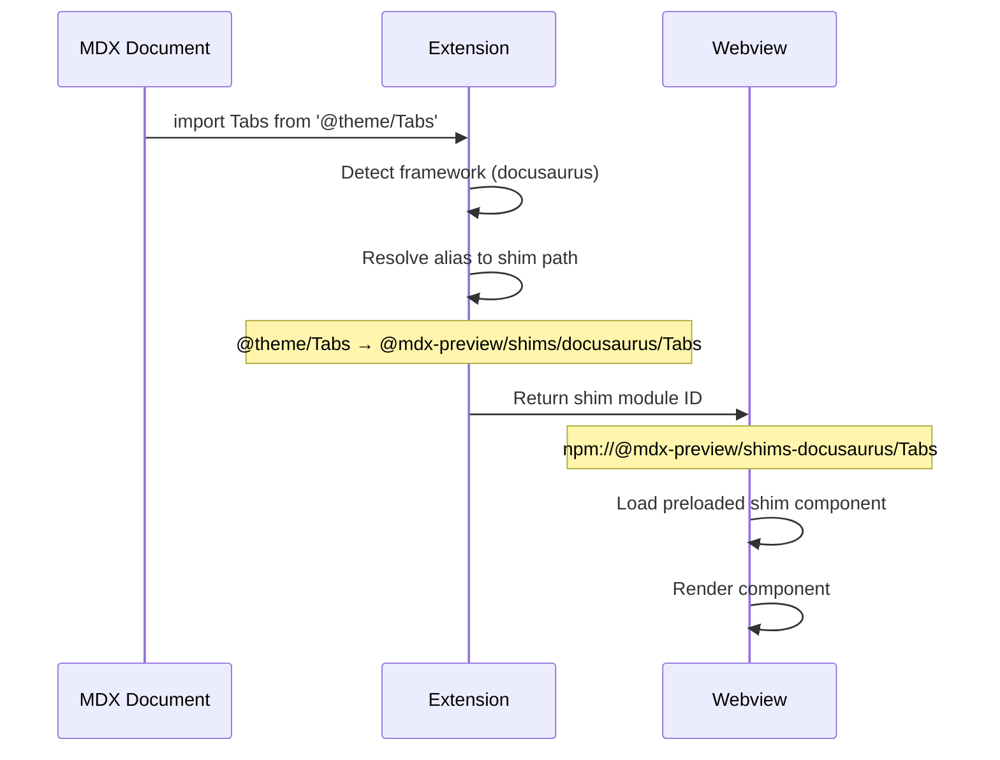

# Framework Support

MDX Preview automatically detects your MDX framework and provides compatible component shims for preview rendering. This document covers supported frameworks, detection mechanisms, and component shimming.

---

## Overview

MDX Preview supports the following frameworks out of the box:

| Framework | Detection | Component Shims |
|-----------|-----------|-----------------|
| **Docusaurus** | `@docusaurus/core` or `@docusaurus/preset-classic` | `@theme/Tabs`, `@theme/TabItem`, `@theme/CodeBlock`, `@theme/Details` |
| **Starlight** | `@astrojs/starlight` | `Card`, `CardGrid`, `LinkCard`, `Steps`, `Badge`, `Aside`, `Tabs`, `TabItem`, `FileTree`, `Code` |
| **Nextra** | `nextra` | `Callout`, `Tabs`, `Cards`, `FileTree`, `Steps`, `Bleed` |
| **Next.js** | `next` + MDX package | `next/image`, `next/link` |
| **Generic** | (fallback) | `Callout`, `Collapsible`, `Tabs`, `TabItem`, `CodeGroup` |

When a framework is detected, imports like `@theme/Tabs` are automatically resolved to built-in preview shims that render compatible UI.

---

## Supported Frameworks

### Docusaurus

**Detection:** Presence of `@docusaurus/core` or `@docusaurus/preset-classic` in package.json

**Supported Imports:**

| Import | Component | Description |
|--------|-----------|-------------|
| `@theme/Tabs` | Tabs | Tabbed interface for code examples |
| `@theme/TabItem` | TabItem | Individual tab content |
| `@theme/CodeBlock` | CodeBlock | Syntax-highlighted code block |
| `@theme/Details` | Details | Expandable/collapsible section |

**Example Usage:**

```mdx
import Tabs from '@theme/Tabs';
import TabItem from '@theme/TabItem';

<Tabs>
  <TabItem value="js" label="JavaScript">
    ```js
    console.log('Hello');
    ```
  </TabItem>
  <TabItem value="py" label="Python">
    ```python
    print('Hello')
    ```
  </TabItem>
</Tabs>
```

> [!NOTE]
> Docusaurus admonitions are rendered using the built-in callout styles. Import paths like `@theme/Admonition` resolve to the generic Callout shim.

---

### Starlight (Astro)

**Detection:** Presence of `@astrojs/starlight` in package.json

**Supported Imports:**

Starlight components are available as named exports from the barrel import:

```mdx
import { Card, CardGrid, Aside, Tabs, TabItem } from '@astrojs/starlight/components';
```

| Component | Description |
|-----------|-------------|
| `Card` | Content card with title and icon |
| `CardGrid` | Grid layout for cards |
| `LinkCard` | Card that links to a URL |
| `Steps` | Numbered step-by-step instructions |
| `Badge` | Status badge with variants |
| `Aside` | Callout/admonition box |
| `Tabs` | Tabbed content sections |
| `TabItem` | Individual tab pane |
| `FileTree` | Directory structure display |
| `Code` | Syntax-highlighted code block |

**Example Usage:**

```mdx
import { Card, CardGrid, Aside } from '@astrojs/starlight/components';

<CardGrid>
  <Card title="Getting Started" icon="rocket">
    Start building your documentation site.
  </Card>
  <Card title="Configuration" icon="setting">
    Learn how to configure your site.
  </Card>
</CardGrid>

<Aside type="tip" title="Pro Tip">
  You can customize these components with CSS variables.
</Aside>
```

**Individual Imports:**

You can also import components individually:

```mdx
import Card from '@astrojs/starlight/components/Card';
import Aside from '@astrojs/starlight/components/Aside';
```

---

### Nextra

**Detection:** Presence of `nextra`, `nextra-theme-docs`, or `nextra-theme-blog` in package.json

**Supported Imports:**

Nextra components are available as named exports:

```mdx
import { Callout, Tabs, Cards, FileTree, Steps } from 'nextra/components';
```

| Component | Description |
|-----------|-------------|
| `Callout` | Alert/admonition box with type variants |
| `Tabs` | Tabbed content sections |
| `Cards` | Card grid for navigation |
| `FileTree` | Directory structure display |
| `Steps` | Numbered step-by-step guide |
| `Bleed` | Full-width content that bleeds to edges |

**Example Usage:**

```mdx
import { Callout, Tabs } from 'nextra/components';

<Callout type="info">
  This is an informational callout.
</Callout>

<Tabs items={['npm', 'yarn', 'pnpm']}>
  <Tabs.Tab>npm install mdx-preview</Tabs.Tab>
  <Tabs.Tab>yarn add mdx-preview</Tabs.Tab>
  <Tabs.Tab>pnpm add mdx-preview</Tabs.Tab>
</Tabs>
```

**Alternative Import Paths:**

```mdx
import { Callout } from 'nextra-theme-docs';
import { Callout } from 'nextra-theme-docs/components';
import Callout from 'nextra/components/Callout';
```

---

### Next.js

**Detection:** Presence of `next` AND at least one of: `@next/mdx`, `next-mdx-remote`, or `@mdx-js/react`

**Supported Imports:**

| Import | Component | Description |
|--------|-----------|-------------|
| `next/image` | Image | Optimized image component |
| `next/link` | Link | Client-side navigation link |

**Example Usage:**

```mdx
import Image from 'next/image';
import Link from 'next/link';

<Image src="/logo.png" alt="Logo" width={200} height={100} />

<Link href="/docs/getting-started">
  Get Started
</Link>
```

> [!IMPORTANT]
> The `next/image` shim renders a standard `` tag without Next.js optimization features. Image optimization only works in the actual Next.js runtime.

---

### Generic (Fallback)

When no specific framework is detected, MDX Preview provides generic component shims.

**Built-in Components:**

| Component | Aliases | Description |
|-----------|---------|-------------|
| `Callout` | `Alert`, `Admonition` | Alert/info box with type variants |
| `Collapsible` | `Accordion`, `Details` | Expandable section |
| `Tabs` | - | Tabbed content |
| `TabItem` | `Tab` | Individual tab pane |
| `CodeGroup` | - | Grouped code blocks with tabs |

**Usage:**

Generic components can be used without imports when `components.builtins` is enabled (default):

```mdx
<Callout type="warning">
  This is a warning callout.
</Callout>

<Collapsible title="Click to expand">
  Hidden content here.
</Collapsible>

<Tabs>
  <TabItem label="First">Content 1</TabItem>
  <TabItem label="Second">Content 2</TabItem>
</Tabs>
```

**Callout Types:**

| Type | Description |
|------|-------------|
| `note` | Neutral note (default) |
| `info` | Informational |
| `tip` | Helpful tip |
| `warning` | Warning/caution |
| `danger` | Error/danger |
| `success` | Success message |

---

## Framework Detection

### Detection Algorithm

The extension detects frameworks by reading your `package.json` and checking for specific dependencies:

```mermaid
flowchart TD
    A[Read package.json] --> B{"@docusaurus/core or preset-classic?"}
    B -->|Yes| C[Docusaurus]
    B -->|No| D{@astrojs/starlight?}
    D -->|Yes| E[Starlight]
    D -->|No| F{nextra?}
    F -->|Yes| G[Nextra]
    F -->|No| H{next + MDX pkg?}
    H -->|Yes| I[Next.js]
    H -->|No| J[Generic]
```

**Detection Priority Order:**

1. **Docusaurus** - `@docusaurus/core` or `@docusaurus/preset-classic`
2. **Starlight** - `@astrojs/starlight`
3. **Nextra** - `nextra`, `nextra-theme-docs`, or `nextra-theme-blog`
4. **Next.js** - `next` + one of: `@next/mdx`, `next-mdx-remote`, `@mdx-js/react`
5. **Generic** - No framework detected (fallback)

> [!NOTE]
> Nextra detection comes before Next.js because Nextra projects also have the `next` dependency. This ensures Nextra-specific shims are used instead of generic Next.js shims.

### Manual Override

If auto-detection is incorrect, you can manually specify the framework:

**VS Code Settings:**

```json
{
  "mdx-preview.framework": "docusaurus"
}
```

**Project Config (`.mdx-previewrc.json`):**

```json
{
  "framework": "docusaurus"
}
```

Valid values: `"auto"`, `"docusaurus"`, `"starlight"`, `"nextra"`, `"nextjs"`, `"generic"`

---

## Alias Resolution Flow

When you import a framework-specific component, the extension resolves it through multiple steps:



**Resolution Steps:**

1. **Framework Detection** - Determine active framework from package.json
2. **Alias Lookup** - Map import path to shim path using component registry
3. **Shim Resolution** - Resolve shim path to preloaded webview module
4. **Component Rendering** - Render the shim component in preview

**Example Resolution Chain:**

| Import | Framework | Shim Path | Preload ID |
|--------|-----------|-----------|------------|
| `@theme/Tabs` | Docusaurus | `@mdx-preview/shims/docusaurus/Tabs` | `npm://@mdx-preview/shims-docusaurus/Tabs` |
| `@astrojs/starlight/components` | Starlight | `@mdx-preview/shims/starlight` | `npm://@mdx-preview/shims-starlight/components` |
| `nextra/components` | Nextra | `@mdx-preview/shims/nextra` | `npm://@mdx-preview/shims-nextra/components` |
| `next/image` | Next.js | `@mdx-preview/shims/nextjs/Image` | `npm://@mdx-preview/shims-nextjs/Image` |

---

## Component Registry

The extension maintains a central component registry that maps framework imports to shim implementations.

### Registry Architecture

```
packages/shared/registry/
├── types.ts           # Type definitions
├── registry-data.ts   # COMPONENT_REGISTRY constant
├── queries.ts         # Query functions
└── index.ts           # Barrel exports
```

### Query Functions

The registry provides utility functions for component lookups:

```typescript
import {
  isGenericComponent,
  getCanonicalComponentName,
  getFrameworkShimPath,
} from '@mdx-preview/shared';

// Check if a name is a generic component or alias
isGenericComponent('Callout');  // true
isGenericComponent('Alert');    // true (alias of Callout)

// Resolve alias to canonical name
getCanonicalComponentName('Alert');  // 'Callout'

// Get shim path for framework component
getFrameworkShimPath('docusaurus', 'Tabs');
// '@mdx-preview/shims/docusaurus/Tabs'
```

---

## Nextra _meta.json Support

For Nextra projects, MDX Preview reads `_meta.json` files to extract page-level settings.

### Resolution Strategy

1. Start from the MDX document's directory
2. Walk upward searching for `_meta.json`
3. Stop at workspace root
4. Extract settings for the current page (by filename)

### Supported Settings

The `_meta.json` file supports per-page configuration:

```json
{
  "getting-started": "Getting Started Guide",
  "configuration": {
    "title": "Configuration",
    "theme": {
      "layout": "full",
      "toc": false
    }
  },
  "api-reference": {
    "title": "API Reference",
    "theme": {
      "layout": "raw"
    }
  }
}
```

| Setting | Type | Description |
|---------|------|-------------|
| `title` | string | Page title for navigation |
| `theme.layout` | string | Layout mode: `"default"`, `"full"`, `"raw"` |
| `theme.toc` | boolean | Show table of contents |

### Layout Modes

| Layout | Description |
|--------|-------------|
| `default` | Standard layout with sidebar and TOC |
| `full` | Full-width content, no sidebar |
| `raw` | Minimal layout, just content |

### Merging with Frontmatter

Frontmatter in the MDX file takes precedence over `_meta.json` settings:

```mdx
---
title: Custom Title
layout: raw
---

Content here uses the frontmatter settings, overriding _meta.json.
```

**Precedence:** Frontmatter > `_meta.json` > Defaults

---

## Configuration Options

### Enabling/Disabling Shims

Control whether framework-specific shims are loaded:

```json
{
  "mdx-preview.framework.componentShims": true
}
```

When disabled, framework imports like `@theme/Tabs` will attempt to resolve from your actual `node_modules`.

### Built-in Components

Control whether generic built-in components are available:

```json
{
  "mdx-preview.components.builtins": true
}
```

When enabled (default), you can use `<Callout>`, `<Tabs>`, etc. without explicit imports.

---

## Troubleshooting Framework Issues

### Framework Not Detected

**Symptoms:** Generic shims used instead of framework-specific ones

**Solutions:**

1. Verify the framework package is in `package.json` (dependencies or devDependencies)
2. Check the Output panel for detection logs
3. Manually set the framework in settings:

   ```json
   {
     "mdx-preview.framework": "docusaurus"
   }
   ```

### Components Not Rendering

**Symptoms:** Components show as placeholders or error

**Solutions:**

1. Verify you're in Trusted Mode (`mdx-preview.preview.enableScripts: true`)
2. Check the import path matches supported patterns
3. Verify component shims are enabled (`mdx-preview.framework.componentShims: true`)
4. Check the webview console for errors (Command: "Developer: Open Webview Developer Tools")

### Shim Style Differences

**Note:** Shim components provide visual approximations of framework components. They may not match the exact styling of your production site.

**Solutions:**

1. Add custom CSS via `mdx-preview.preview.customCss`
2. Use project-specific component overrides in `.mdx-previewrc.json`

### Next.js Image Optimization

The `next/image` shim renders a standard `` tag. Features like automatic resizing, lazy loading, and optimization are not available in preview.

**Workaround:** Images will render at their natural size. Specify `width` and `height` props for consistent sizing.

---

## Framework-Specific Examples

### Docusaurus Documentation Site

`.mdx-previewrc.json`:

```json
{
  "framework": "docusaurus",
  "components": {
    "DocCardList": "./src/components/DocCardList.tsx"
  }
}
```

### Starlight Documentation

`.mdx-previewrc.json`:

```json
{
  "framework": "starlight"
}
```

### Nextra Blog

`.mdx-previewrc.json`:

```json
{
  "framework": "nextra"
}
```

`docs/_meta.json`:

```json
{
  "index": "Home",
  "blog": {
    "title": "Blog",
    "theme": {
      "layout": "full"
    }
  }
}
```

### Next.js App with MDX

`.mdx-previewrc.json`:

```json
{
  "framework": "nextjs",
  "components": {
    "CustomButton": "./components/Button.tsx"
  },
  "tailwind": {
    "enabled": "auto"
  }
}
```
