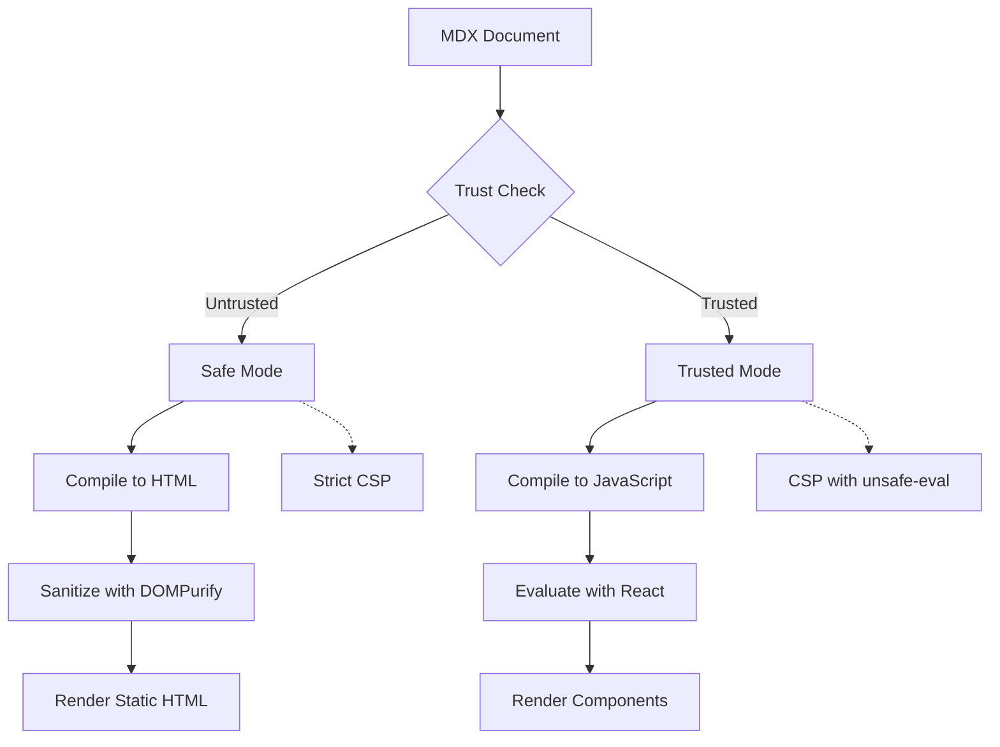
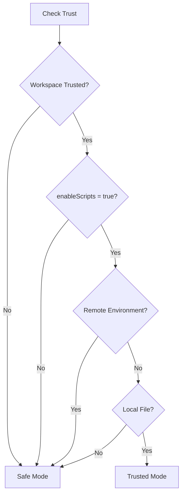

# Security Model

> Last security review: 2026-02-02

MDX Preview implements a defense-in-depth security model with two rendering modes to balance functionality with protection. This document covers the trust model, Content Security Policy, Safe Mode, Trusted Mode, and security best practices.

---

## Overview

MDX Preview's security model is built on the principle that **untrusted content should never execute code**. The extension implements:

1. **Two-Factor Trust** - Both workspace trust AND user setting required
2. **Two Rendering Modes** - Safe Mode (static HTML) and Trusted Mode (full React)
3. **Content Security Policy** - Strict CSP headers to prevent injection
4. **HTML Sanitization** - DOMPurify in Safe Mode
5. **Path Validation** - Prevent directory traversal attacks
6. **Request Validation** - Validate all RPC inputs



---

## Trust Model

### Two-Factor Trust

MDX Preview requires **both** factors to be true for Trusted Mode:

| Factor | Source | Description |
|--------|--------|-------------|
| **Workspace Trust** | VS Code | User grants trust to the workspace folder |
| **Scripts Enabled** | Extension setting | `mdx-preview.preview.enableScripts` |

```typescript
interface TrustState {
  workspaceTrusted: boolean;       // VS Code workspace.isTrusted
  scriptsEnabled: boolean;         // mdx-preview.preview.enableScripts setting
  canExecute: boolean;             // workspaceTrusted && scriptsEnabled
  reason?: string;                 // Explanation when canExecute is false
  openMdxLinksInPreview: boolean;  // Setting for .mdx link handling
}
```

This two-factor approach ensures:
- Opening an untrusted folder doesn't enable code execution
- Users must explicitly opt-in via both VS Code trust and extension setting
- Revoking either factor immediately disables Trusted Mode

### Trust State Management

The `TrustManager` service is the single source of truth for trust state:

```typescript
import { getTrustManager } from './services';

// Get current trust state (always fresh, never cached)
const state = getTrustManager().getState();
console.log(state.canExecute);  // true or false

// Check if Trusted Mode allowed for specific document
const docState = getTrustManager().getStateForDocument(docUri);

// Subscribe to trust state changes
const disposable = getTrustManager().subscribe((newState) => {
  if (newState.canExecute) {
    // Switch to Trusted Mode
  } else {
    // Switch to Safe Mode
  }
});
```

### Trusted Mode Requirements

For Trusted Mode to be enabled, **all four requirements** must be met:

| # | Requirement | Reason |
|---|-------------|--------|
| 1 | Workspace is trusted | VS Code's trust system protects against malicious workspaces |
| 2 | `enableScripts` is `true` | User explicitly enables script execution |
| 3 | Not in remote environment | Remote environments have different security contexts |
| 4 | Document is local file | Only `file:` or `untitled:` URI schemes allowed |



---

## Safe Mode

Safe Mode is the **default** rendering mode, activated when any trust requirement is not met.

### Capabilities

| Feature | Supported | Notes |
|---------|-----------|-------|
| Markdown syntax | Yes | Headings, lists, tables, blockquotes |
| Code blocks | Yes | Syntax highlighting via Shiki |
| Mermaid diagrams | Yes | Rendered from code blocks |
| KaTeX math | Yes | Inline `$...$` and display `$$...$$` |
| Images | Yes | Relative paths resolved, external allowed |
| Links | Yes | External links open in browser |
| GitHub callouts | Yes | `> [!NOTE]`, `> [!WARNING]`, etc. |

### Restrictions

| Feature | Supported | Reason |
|---------|-----------|--------|
| JSX expressions | No | Requires JavaScript execution |
| Import statements | No | Would execute arbitrary code |
| Custom components | No | Requires React rendering |
| Custom plugins | No | Plugins execute at compile time |
| Dynamic expressions | No | `{variable}` syntax stripped |

### Security Measures

**1. Static HTML Compilation**

MDX is compiled to static HTML with all JSX stripped:

```typescript
// Safe Mode compilation pipeline
mdx -> remark-parse -> remark-mdx
    -> strip JSX nodes
    -> strip import/export
    -> remark-rehype
    -> rehype-stringify
    -> HTML string
```

**2. HTML Sanitization with DOMPurify**

All HTML output is sanitized before rendering:

```typescript
import DOMPurify from 'dompurify';

const sanitized = DOMPurify.sanitize(html, {
  ADD_ATTR: ['target', 'data-mermaid'],
  ADD_TAGS: ['mermaid'],
});
```

**3. Strict Content Security Policy**

Safe Mode uses strict CSP without `unsafe-eval`:

```
default-src 'none';
img-src ${webviewSource} https: data:;
style-src ${webviewSource} 'unsafe-inline';
script-src ${webviewSource} 'nonce-${nonce}' 'wasm-unsafe-eval';
connect-src ${webviewSource};
font-src ${webviewSource};
```

---

## Trusted Mode

Trusted Mode enables full MDX capabilities with React component rendering.

### Capabilities

| Feature | Supported | Notes |
|---------|-----------|-------|
| All Safe Mode features | Yes | - |
| JSX expressions | Yes | `{variable}`, `{fn()}` |
| Import statements | Yes | Local modules resolved from workspace |
| Custom components | Yes | React components rendered |
| Custom plugins | Yes | remark/rehype plugins from config |
| Dynamic expressions | Yes | Full JavaScript in JSX |
| Component imports | Yes | Framework shims + local components |

### Security Measures

Even in Trusted Mode, security measures are in place:

**1. CSP with unsafe-eval**

```
default-src 'none';
img-src ${webviewSource} https: data:;
style-src ${webviewSource} 'unsafe-inline';
script-src ${webviewSource} 'nonce-${nonce}' 'unsafe-eval' 'wasm-unsafe-eval';
connect-src ${webviewSource};
font-src ${webviewSource};
```

> [!WARNING]
> `unsafe-eval` is required for the module evaluation system (via Function constructor). This is why Trusted Mode requires explicit user opt-in.

**2. Path Validation**

All file system access is validated to prevent directory traversal:

- Resolved paths checked against workspace boundaries
- `../` escape sequences blocked
- Only files within workspace allowed

**3. Request Validation**

All RPC requests from webview are validated:

```typescript
// Validate module request
if (!isValidModuleRequest(request)) {
  throw new SecurityError('Invalid module request');
}

// Validate trust state before every operation
requireTrustedModeForDocument(docUri, 'fetch module');

// Validate path is within workspace
if (!isWithinWorkspace(resolvedPath, workspaceRoot)) {
  throw new SecurityError('Path outside workspace');
}
```

**4. Module Evaluation**

Modules are evaluated using `Function` constructor (not `eval`):

```typescript
// Code is already transpiled by extension
// No user input reaches eval directly
const fn = new Function('exports', 'require', 'module', code);
fn(exports, requireFn, module);
```

---

## Content Security Policy (CSP)

### CSP Generation

CSP headers are dynamically generated based on trust state:

```typescript
function getCSP(
  webview: vscode.Webview,
  nonce: string,
  trustState: TrustState
): string {
  const allowUnsafeEval = trustState.canExecute;

  const scriptSrc = allowUnsafeEval
    ? `${webview.cspSource} 'nonce-${nonce}' 'unsafe-eval'`
    : `${webview.cspSource} 'nonce-${nonce}'`;

  return [
    "default-src 'none'",
    `img-src ${webview.cspSource} https: data:`,
    `style-src ${webview.cspSource} 'unsafe-inline'`,
    `script-src ${scriptSrc}`,
    `connect-src ${webview.cspSource}`,
    `font-src ${webview.cspSource}`,
  ].join('; ');
}
```

### CSP Directives Explained

| Directive | Safe Mode | Trusted Mode | Purpose |
|-----------|-----------|--------------|---------|
| `default-src` | `'none'` | `'none'` | Block all by default |
| `script-src` | nonce + wasm-unsafe-eval | nonce + unsafe-eval + wasm-unsafe-eval | Control script execution |
| `style-src` | unsafe-inline | unsafe-inline | Allow inline styles |
| `img-src` | webview + https + data | webview + https + data | Allow images |
| `connect-src` | webview | webview | Allow fetch/XHR connections |
| `font-src` | webview | webview | Allow bundled fonts |

### Nonce Generation

Each webview gets a cryptographically secure nonce:

```typescript
function generateNonce(): string {
  const array = new Uint8Array(16);
  crypto.getRandomValues(array);
  return Array.from(array, (byte) =>
    byte.toString(16).padStart(2, '0')
  ).join('');
}
```

### Disabling CSP

CSP can be disabled via `mdx-preview.preview.security: "disabled"`:

> [!CAUTION]
> Disabling CSP removes an important security layer. Only use for debugging specific issues. Never disable in production workflows.

---

## HTML Sanitization

### DOMPurify Configuration

Safe Mode uses DOMPurify with a carefully tuned configuration:

```typescript
DOMPurify.sanitize(html, {
  // Allow target attribute for links
  ADD_ATTR: ['target', 'data-mermaid', 'data-code-block'],
  // Allow mermaid custom element
  ADD_TAGS: ['mermaid'],
  // Allow data URIs for images
  ALLOW_DATA_ATTR: true,
});
```

### What Gets Sanitized

| Content | Action |
|---------|--------|
| `<script>` tags | Removed |
| `onclick` handlers | Removed |
| `javascript:` URLs | Removed |
| `data:` URLs (except images) | Removed |
| Unknown attributes | Removed |
| SVG `<use>` elements | Sanitized |

### Post-Processing

After sanitization, additional processing occurs:

1. **Link rewriting** - Add `target="_blank"` and `rel="noopener"`
2. **Image path resolution** - Resolve relative paths to webview URIs
3. **Code block enhancement** - Add copy buttons and language badges

---

## Trust Validation API

### Throwing Pattern

Use when operation **must fail** if not trusted:

```typescript
import { requireTrustedMode, TrustError } from './security/validateTrust';

async function loadCustomPlugins(configPath: string) {
  // Throws TrustError if not in Trusted Mode
  requireTrustedMode('load custom MDX plugins');

  // Only reached if trusted
  return await loadPlugins(configPath);
}

// With document-specific check
async function fetchModule(specifier: string, docUri: vscode.Uri) {
  requireTrustedModeForDocument(docUri, 'fetch and evaluate modules');
  // Validates workspace trust + document is local file
  return await resolveAndLoad(specifier);
}
```

### Conditional Pattern

Use when you have a **fallback behavior**:

```typescript
import { getTrustManager } from './services';

function compileDocument(doc: vscode.TextDocument) {
  const { canExecute } = getTrustManager().getState();

  if (canExecute) {
    return compileToJavaScript(doc);  // Full React/JSX
  } else {
    return compileToSafeHtml(doc);    // Static HTML
  }
}
```

### TrustError Handling

```typescript
import { TrustError } from './security/validateTrust';

try {
  requireTrustedMode('execute user code');
  executeCode();
} catch (e) {
  if (e instanceof TrustError) {
    showSafeModeWarning();
  } else {
    throw e;
  }
}
```

---

## Remote Environment Restrictions

Trusted Mode is **disabled in remote environments** for security:

| Environment | Trusted Mode | Reason |
|-------------|--------------|--------|
| Local workspace | Allowed | Full control over files |
| SSH Remote | Blocked | Remote file system access |
| Dev Containers | Blocked | Container isolation concerns |
| WSL | Blocked | Different security context |
| GitHub Codespaces | Blocked | Cloud environment |

When in a remote environment, `getTrustManager().canUseTrustedMode()` returns:

```typescript
{
  allowed: false,
  reason: "Remote environment detected (ssh-remote). Trusted Mode is only available for local workspaces."
}
```

---

## Security Checklist for Developers

When modifying security-sensitive code, verify:

### Trust Validation

- [ ] Trust checks present before sensitive operations
- [ ] Using `requireTrustedMode()` or `requireTrustedModeForDocument()` appropriately
- [ ] Not caching trust state (always use `getState()`)

### Path Validation

- [ ] All file paths validated against workspace boundaries
- [ ] No directory traversal possible (`../` blocked)
- [ ] Only `file:` and `untitled:` URI schemes accepted

### CSP Compliance

- [ ] No new `unsafe-*` directives added
- [ ] All scripts use nonce attribute
- [ ] No inline script execution without nonce

### Input Validation

- [ ] All RPC inputs type-checked
- [ ] String length limits enforced
- [ ] No user input reaches `eval()` directly

### HTML Handling

- [ ] DOMPurify used in Safe Mode
- [ ] Custom elements properly sanitized
- [ ] Event handlers stripped

---

## Common Security Pitfalls

### Bypassing Trust Checks

**Wrong:**
```typescript
// DON'T: Check once and cache
const isTrusted = getTrustManager().canExecute();
// ... later ...
if (isTrusted) { ... }  // Trust state may have changed!
```

**Right:**
```typescript
// DO: Always check fresh state
if (getTrustManager().canExecute()) {
  // Trust state is current
}
```

### Adding CSP Exceptions

**Wrong:**
```typescript
// DON'T: Add unsafe directives without review
script-src 'unsafe-inline' 'unsafe-eval';
```

**Right:**
```typescript
// DO: Use nonce for scripts
script-src 'nonce-${nonce}';
// Only add unsafe-eval when explicitly required (Trusted Mode)
```

### Unsanitized User Content

**Wrong:**
```typescript
// DON'T: Render HTML without sanitization
element.innerHTML = userContent;
```

**Right:**
```typescript
// DO: Sanitize first
element.innerHTML = DOMPurify.sanitize(userContent);
```

### Path Traversal

**Wrong:**
```typescript
// DON'T: Use user input directly in paths
const path = join(baseDir, userInput);
```

**Right:**
```typescript
// DO: Validate resolved path
const resolved = resolve(baseDir, userInput);
if (!resolved.startsWith(baseDir)) {
  throw new SecurityError('Path outside allowed directory');
}
```

---

## Reporting Security Issues

If you discover a security vulnerability:

1. **Do not** open a public issue
2. Email security concerns to the maintainer
3. Provide detailed reproduction steps
4. Allow time for a fix before disclosure

---

## Known Vulnerabilities

MDX Preview maintains awareness of dependency vulnerabilities via `npm audit`. The following moderate vulnerabilities are accepted risks:

### esbuild Request Forgery (GHSA-67mh-4wv8-2f99)

**Path:** `vitest -> vite -> esbuild`

**Assessment:** No production risk
- Development dependency only
- Not included in extension bundle
- Only affects local dev server during testing

**Mitigation:** Will update when vitest 4.x stabilizes.

---

## Summary

MDX Preview's security model provides:

- **Safe defaults** - Untrusted workspaces use Safe Mode
- **Explicit opt-in** - Two factors required for Trusted Mode
- **Defense in depth** - Multiple security layers
- **Clear boundaries** - Extension (trusted) vs Webview (sandboxed)

The goal is to let users preview MDX safely while providing full capabilities when they choose to trust the content.
