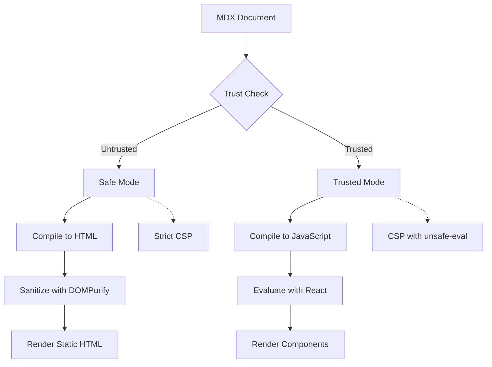
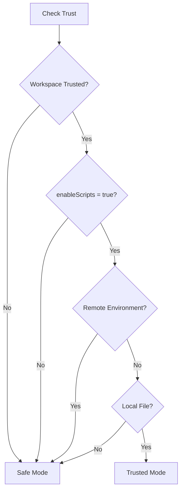

# Security Model

> Last security review: 2026-06-03

MDX Preview implements a defense-in-depth security model with two rendering modes to balance functionality with protection. This document covers the trust model, Content Security Policy, Safe Mode, Trusted Mode, and security best practices.

---

## Overview

MDX Preview's security model is built on the principle that **untrusted content should never execute code**. The extension implements:

1. **Two-Factor Trust** - Both workspace trust AND user setting required
2. **Two Rendering Modes** - Safe Mode (static HTML) and Trusted Mode (full React)
3. **Content Security Policy** - Strict CSP headers to prevent injection
4. **HTML Sanitization** - DOMPurify in Safe Mode
5. **Path Validation** - Prevent directory traversal attacks
6. **Request Validation** - Validate all RPC inputs



---

## Trust Model

### Two-Factor Trust

MDX Preview requires **both** factors to be true for Trusted Mode:

| Factor | Source | Description |
|--------|--------|-------------|
| **Workspace Trust** | VS Code | User grants trust to the workspace folder |
| **Scripts Enabled** | Extension setting | `mdx-preview.preview.enableScripts` |

```typescript
interface TrustState {
  workspaceTrusted: boolean;       // VS Code workspace.isTrusted
  scriptsEnabled: boolean;         // mdx-preview.preview.enableScripts setting
  canExecute: boolean;             // workspaceTrusted && scriptsEnabled
  reason?: string;                 // Explanation when canExecute is false
  openMdxLinksInPreview: boolean;  // Setting for .mdx link handling
}
```

This two-factor approach ensures:
- Opening an untrusted folder doesn't enable code execution
- Users must explicitly opt-in via both VS Code trust and extension setting
- Revoking either factor immediately disables Trusted Mode

### Webview-Side Trust Gating

Trust enforcement is **not** extension-only. The webview also discards trusted-mode RPC payloads it shouldn't have received, in case they slip through during a trust-state change or before the trust handshake completes:

```typescript title="packages/webview-client/src/platform/rpc/content-mode-guard.ts"
export function canAcceptContentMode(
  trustState: TrustState | null,
  contentMode: 'safe' | 'trusted',
  log: TaggedLogger
): boolean {
  if (contentMode !== 'trusted') return true;
  if (trustState?.canExecute === true) return true;
  log.warn('Discarding trusted content - trust state not canExecute');
  return false;
}
```

Both the queued-message flow (`rpc-message-queue.ts`) and the direct-handler flow (`webview-rpc-client.ts`) consult this guard before applying any trusted payload. The webview's trust state is replicated from the extension via `setTrustState(...)` and is shared with the queue through the `getTrustState` / `onTrustStateChange` callbacks passed to `createRpcMessageQueue(...)`.

### Trust State Management

The `TrustManager` service is the single source of truth for trust state:

```typescript
import { getTrustManager } from './services';

// Get current trust state (always fresh, never cached)
const state = getTrustManager().getState();
console.log(state.canExecute);  // true or false

// Check if Trusted Mode allowed for specific document
const docState = getTrustManager().getStateForDocument(docUri);

// Subscribe to trust state changes
const disposable = getTrustManager().subscribe((newState) => {
  if (newState.canExecute) {
    // Switch to Trusted Mode
  } else {
    // Switch to Safe Mode
  }
});
```

### Trusted Mode Requirements

For Trusted Mode to be enabled, **all four requirements** must be met:

| # | Requirement | Reason |
|---|-------------|--------|
| 1 | Workspace is trusted | VS Code's trust system protects against malicious workspaces |
| 2 | `enableScripts` is `true` | User explicitly enables script execution |
| 3 | Not in remote environment | Remote environments have different security contexts |
| 4 | Document is local file | Only `file:` or `untitled:` URI schemes allowed |



---

## Safe Mode

Safe Mode is the **default** rendering mode, activated when any trust requirement is not met.

### Capabilities

| Feature | Supported | Notes |
|---------|-----------|-------|
| Markdown syntax | Yes | Headings, lists, tables, blockquotes |
| Code blocks | Yes | Syntax highlighting via Shiki |
| Mermaid diagrams | Yes | Rendered from code blocks |
| KaTeX math | Yes | Inline `$...$` and display `$$...$$` |
| Images | Yes | Relative paths resolved, external allowed |
| Links | Yes | External links open in browser |
| GitHub callouts | Yes | `> [!NOTE]`, `> [!WARNING]`, etc. |

### Restrictions

| Feature | Supported | Reason |
|---------|-----------|--------|
| JSX expressions | No | Requires JavaScript execution |
| Import statements | No | Would execute arbitrary code |
| Custom components | No | Requires React rendering |
| Custom plugins | No | Plugins execute at compile time |
| Dynamic expressions | No | `{variable}` syntax stripped |

### Security Measures

**1. Static HTML Compilation**

MDX is compiled to static HTML with all JSX stripped:

```typescript
// Safe Mode compilation pipeline
mdx -> remark-parse -> remark-mdx
    -> strip JSX nodes
    -> strip import/export
    -> remark-rehype
    -> rehype-stringify
    -> HTML string
```

**2. HTML Sanitization with DOMPurify**

All HTML output is sanitized before rendering:

```typescript
import DOMPurify from 'dompurify';
import { DOMPURIFY_CONFIG } from './security/allowlist';

// DOMPURIFY_CONFIG is a strict explicit allowlist (ALLOWED_TAGS + ALLOWED_ATTR)
// covering HTML, KaTeX math, and SVG for Mermaid (no foreignObject), with
// ADD_ATTR: ['target', 'rel'] and protocol filtering via ALLOWED_URI_REGEXP.
const sanitized = DOMPurify.sanitize(html, DOMPURIFY_CONFIG);
```

**3. Strict Content Security Policy**

Safe Mode uses strict CSP without `unsafe-eval`:

```
default-src 'none';
img-src ${webviewSource} https: data:;
style-src ${webviewSource} 'unsafe-inline';
script-src ${webviewSource} 'nonce-${nonce}' 'wasm-unsafe-eval';
connect-src ${webviewSource};
font-src ${webviewSource};
```

---

## Trusted Mode

Trusted Mode enables full MDX capabilities with React component rendering.

### Capabilities

| Feature | Supported | Notes |
|---------|-----------|-------|
| All Safe Mode features | Yes | - |
| JSX expressions | Yes | `{variable}`, `{fn()}` |
| Import statements | Yes | Local modules resolved from workspace |
| Custom components | Yes | React components rendered |
| Custom plugins | Yes | remark/rehype plugins from config |
| Dynamic expressions | Yes | Full JavaScript in JSX |
| Component imports | Yes | Framework shims + local components |

### Security Measures

Even in Trusted Mode, security measures are in place:

**1. CSP with unsafe-eval**

```
default-src 'none';
img-src ${webviewSource} https: data:;
style-src ${webviewSource} 'unsafe-inline';
script-src ${webviewSource} 'nonce-${nonce}' 'unsafe-eval' 'wasm-unsafe-eval';
connect-src ${webviewSource};
font-src ${webviewSource};
```

> [!WARNING]
> `unsafe-eval` is required for the module evaluation system (via Function constructor). This is why Trusted Mode requires explicit user opt-in.

**2. Path Validation**

All file system access is validated to prevent directory traversal:

- Resolved paths checked against workspace boundaries
- `../` escape sequences blocked
- Only files within workspace allowed

**3. Request Validation**

All RPC requests from webview are validated:

```typescript
// Validate module request
if (!isValidModuleRequest(request)) {
  throw new SecurityError('Invalid module request');
}

// Validate trust state before every operation
requireTrustedModeForDocument(docUri, 'fetch module');

// Validate path is within workspace
if (!isWithinWorkspace(resolvedPath, workspaceRoot)) {
  throw new SecurityError('Path outside workspace');
}
```

**4. Module Evaluation**

Modules are evaluated using `Function` constructor (not `eval`):

```typescript
// Code is already transpiled by extension
// No user input reaches eval directly
const fn = new Function('exports', 'require', 'module', code);
fn(exports, requireFn, module);
```

---

## Content Security Policy (CSP)

### CSP Generation

CSP is generated from a small `CSPOptions` record (webview, nonce, eval policy, optional extra `connect-src` sources). `getCSP(...)` resolves the trust-aware eval policy and delegates to `generateCSP(...)`:

```typescript title="packages/extension-host/src/features/security/CSP.ts"
export interface CSPOptions {
  webview: vscode.Webview;
  nonce: string;
  allowUnsafeEval: boolean;
  connectSrc?: string[];
}

export function generateCSP(options: CSPOptions): string {
  const { webview, nonce, allowUnsafeEval, connectSrc } = options;
  const scriptSrc = allowUnsafeEval
    ? `${webview.cspSource} 'nonce-${nonce}' 'unsafe-eval' 'wasm-unsafe-eval'`
    : `${webview.cspSource} 'nonce-${nonce}' 'wasm-unsafe-eval'`;
  const connectSources = buildConnectSources(webview, connectSrc);

  return [
    "default-src 'none'",
    `img-src ${webview.cspSource} https: data:`,
    `style-src ${webview.cspSource} 'unsafe-inline'`,
    `script-src ${scriptSrc}`,
    `connect-src ${connectSources.join(' ')}`,
    `font-src ${webview.cspSource}`,
  ].join('; ');
}

export function getCSP(
  webview: vscode.Webview,
  nonce: string,
  trustState: TrustState,
  securityPolicy: SecurityPolicy = SecurityPolicy.Strict
): string {
  if (securityPolicy === SecurityPolicy.Disabled) return '';
  return generateCSP({
    webview,
    nonce,
    allowUnsafeEval: trustState.canExecute,
  });
}
```

The `connectSrc` parameter is a reserved extension point that no current caller supplies, so `connect-src` is always just `webview.cspSource`. PlantUML/Kroki diagrams are rendered by the extension host proxy (`renderPlantUml`, a server-side fetch) to avoid CORS, so the sandboxed webview never connects to the diagram server itself.

### CSP Directives Explained

| Directive | Safe Mode | Trusted Mode | Purpose |
|-----------|-----------|--------------|---------|
| `default-src` | `'none'` | `'none'` | Block all by default |
| `script-src` | nonce + wasm-unsafe-eval | nonce + unsafe-eval + wasm-unsafe-eval | Control script execution |
| `style-src` | unsafe-inline | unsafe-inline | Allow inline styles |
| `img-src` | webview + https + data | webview + https + data | Allow images |
| `connect-src` | webview | webview | Allow fetch/XHR connections |
| `font-src` | webview | webview | Allow bundled fonts |

### Nonce Generation

Each webview gets a cryptographically secure nonce:

```typescript
function generateNonce(): string {
  const array = new Uint8Array(16);
  crypto.getRandomValues(array);
  return Array.from(array, (byte) =>
    byte.toString(16).padStart(2, '0')
  ).join('');
}
```

### Disabling CSP

CSP can be disabled via `mdx-preview.preview.security: "disabled"`:

> [!CAUTION]
> Disabling CSP removes an important security layer. Only use for debugging specific issues. Never disable in production workflows.

---

## HTML Sanitization

### DOMPurify Configuration

Safe Mode uses DOMPurify with a carefully tuned configuration:

```typescript
// packages/webview-client/src/features/preview/safe/security/allowlist.ts
export const DOMPURIFY_CONFIG = {
  // explicit element allowlist: headings, text, lists, code, links,
  // tables, KaTeX math, and SVG (no foreignObject)
  ALLOWED_TAGS: ['h1', 'p', 'a', 'pre', 'code', 'table', 'svg', 'use' /* ... */],
  // explicit attribute allowlist, incl. diagram data attributes
  ALLOWED_ATTR: [
    'href', 'src', 'class', 'xlink:href',
    'data-mermaid-chart', 'data-mermaid-id',
    'data-plantuml-code', 'data-graphviz-code',
    'data-admonition-type', 'data-source-line' /* ... */,
  ],
  ADD_ATTR: ['target', 'rel'],
  ALLOW_UNKNOWN_PROTOCOLS: false,
  ALLOWED_URI_REGEXP: /^(?:(?:https?|mailto|tel):|[^a-z]|[a-z+.-]+(?:[^a-z+.\-:]|$))/i,
};
```

### What Gets Sanitized

| Content | Action |
|---------|--------|
| `<script>` tags | Removed |
| `onclick` handlers | Removed |
| `javascript:` URLs | Removed |
| `data:` URLs (all) | Removed (blocked by `ALLOWED_URI_REGEXP`) |
| Unknown attributes | Removed |
| SVG `<use>` elements | Allowed (in `ALLOWED_TAGS`; `xlink:href` permitted) |
| `<foreignObject>` (e.g. Mermaid HTML labels) | Removed (not in allowlist) |

### Post-Processing

After sanitization, additional processing occurs:

1. **Relative URL resolution** - Relative image/link URLs resolve against the base `href` (the document's webview URI) set in the host HTML
2. **Code block enhancement** - Add copy buttons and language badges

---

## Trust Validation API

### Throwing Pattern

Use when operation **must fail** if not trusted:

```typescript
import {
  requireTrustedModeForDocument,
  TrustError,
} from './security/validateTrust';

async function loadCustomPlugins(configPath: string, docUri: vscode.Uri) {
  // Throws TrustError if not in Trusted Mode
  requireTrustedModeForDocument(docUri, 'load custom MDX plugins');

  // Only reached if trusted
  return await loadPlugins(configPath);
}

// With document-specific check
async function fetchModule(specifier: string, docUri: vscode.Uri) {
  requireTrustedModeForDocument(docUri, 'fetch and evaluate modules');
  // Validates workspace trust + document is local file
  return await resolveAndLoad(specifier);
}
```

### Conditional Pattern

Use when you have a **fallback behavior**:

```typescript
import { getTrustManager } from './services';

function compileDocument(doc: vscode.TextDocument) {
  const { canExecute } = getTrustManager().getState();

  if (canExecute) {
    return compileToJavaScript(doc);  // Full React/JSX
  } else {
    return compileToSafeHtml(doc);    // Static HTML
  }
}
```

### Try Pattern (non-throwing)

Use when you want a single guard call to either return the validated `TrustState` or short-circuit cleanly. This is what the RPC handler uses on every `fetch(...)` request, since a `TrustError` thrown from inside a Comlink call would surface as an opaque rejected promise on the webview side:

```typescript
import {
  tryRequireTrustedModeForDocument,
  type TrustError,
} from './security/validateTrust';

const trustState = tryRequireTrustedModeForDocument(
  docUri,
  'fetch and evaluate modules',
  (error: TrustError) => {
    log.warn('refused module fetch', { reason: error.message });
  }
);

if (!trustState) return undefined; // gracefully refused, no throw
```

`tryRequireTrustedModeForDocument(...)` and `tryRequireWorkspaceTrusted(...)` return `TrustState | undefined` and re-throw any non-`TrustError` exception. The optional callback runs once, before the function returns `undefined`, so callers can attach context-specific logging without writing their own `try/catch`.

### TrustError Handling

```typescript
import {
  requireTrustedModeForDocument,
  TrustError,
} from './security/validateTrust';

try {
  requireTrustedModeForDocument(docUri, 'execute user code');
  executeCode();
} catch (e) {
  if (e instanceof TrustError) {
    showSafeModeWarning();
  } else {
    throw e;
  }
}
```

---

## Remote Environment Restrictions

Trusted Mode is **disabled in remote environments** for security:

| Environment | Trusted Mode | Reason |
|-------------|--------------|--------|
| Local workspace | Allowed | Full control over files |
| SSH Remote | Blocked | Remote file system access |
| Dev Containers | Blocked | Container isolation concerns |
| WSL | Blocked | Different security context |
| GitHub Codespaces | Blocked | Cloud environment |

When in a remote environment, `getTrustManager().canUseTrustedMode()` returns:

```typescript
{
  allowed: false,
  reason: "Remote environment detected (ssh-remote). Trusted Mode is only available for local workspaces."
}
```

---

## Network Egress

The extension makes **one category of outbound network request**: PlantUML rendering.

- PlantUML code blocks are rendered by POSTing the **raw diagram source** to the server configured in `mdx-preview.diagrams.plantUmlServer` (default: the public [Kroki](https://kroki.io) service).
- Rendering is **gated on Workspace Trust** — untrusted workspaces never send anything; the diagram slot shows an explanatory error instead.
- The server setting is listed in `restrictedConfigurations`, so a repository's `.vscode/settings.json` cannot redirect it while the workspace is untrusted.
- For private diagrams, point `plantUmlServer` at a self-hosted Kroki/PlantUML instance.

No telemetry, analytics, crash reporting, or update checks are performed. All other rendering (Markdown/MDX, Mermaid, Graphviz, KaTeX, Shiki) happens locally.

---

## Security Checklist for Developers

When modifying security-sensitive code, verify:

### Trust Validation

- [ ] Trust checks present before sensitive operations
- [ ] Using `requireTrustedModeForDocument()` or `requireWorkspaceTrusted()` appropriately
- [ ] Not caching trust state (always use `getState()`)

### Path Validation

- [ ] All file paths validated against workspace boundaries
- [ ] No directory traversal possible (`../` blocked)
- [ ] Only `file:` and `untitled:` URI schemes accepted

### CSP Compliance

- [ ] No new `unsafe-*` directives added
- [ ] All scripts use nonce attribute
- [ ] No inline script execution without nonce

### Input Validation

- [ ] All RPC inputs type-checked
- [ ] String length limits enforced
- [ ] No user input reaches `eval()` directly

### HTML Handling

- [ ] DOMPurify used in Safe Mode
- [ ] Custom elements properly sanitized
- [ ] Event handlers stripped

---

## Common Security Pitfalls

### Bypassing Trust Checks

**Wrong:**
```typescript
// DON'T: Check once and cache
const isTrusted = getTrustManager().canExecute();
// ... later ...
if (isTrusted) { ... }  // Trust state may have changed!
```

**Right:**
```typescript
// DO: Always check fresh state
if (getTrustManager().canExecute()) {
  // Trust state is current
}
```

### Adding CSP Exceptions

**Wrong:**
```typescript
// DON'T: Add unsafe directives without review
script-src 'unsafe-inline' 'unsafe-eval';
```

**Right:**
```typescript
// DO: Use nonce for scripts
script-src 'nonce-${nonce}';
// Only add unsafe-eval when explicitly required (Trusted Mode)
```

### Unsanitized User Content

**Wrong:**
```typescript
// DON'T: Render HTML without sanitization
element.innerHTML = userContent;
```

**Right:**
```typescript
// DO: Sanitize first
element.innerHTML = DOMPurify.sanitize(userContent);
```

### Path Traversal

**Wrong:**
```typescript
// DON'T: Use user input directly in paths
const path = join(baseDir, userInput);
```

**Right:**
```typescript
// DO: Validate resolved path
const resolved = resolve(baseDir, userInput);
if (!resolved.startsWith(baseDir)) {
  throw new SecurityError('Path outside allowed directory');
}
```

---

## Reporting Security Issues

If you discover a security vulnerability:

1. **Do not** open a public issue
2. Email security concerns to the maintainer
3. Provide detailed reproduction steps
4. Allow time for a fix before disclosure

---

## Known Vulnerabilities

MDX Preview tracks dependency vulnerabilities via `npm audit` and addresses any high-severity advisory affecting production code paths. The following moderate-severity advisories are currently accepted risks:

### uuid `Buffer` Bounds Check (GHSA-w5hq-g745-h8pq)

**Path:** transitive via `@azure/msal-node` and `mermaid`

**Assessment:** No production risk for the extension
- Affects v3/v5/v6 generation when callers pass a custom `buf` argument to `uuid.*` — neither dependency does that with attacker-controlled input
- `@azure/msal-node` is reachable only via Microsoft auth flows that the extension does not invoke
- `mermaid` runs in the sandboxed webview and uses `uuid` for internal node IDs only

**Mitigation:** Will update when both upstreams cut releases pinned to `uuid >= 14`.

### Triage Policy

We do not enumerate every transitive moderate advisory here — `npm audit` is the source of truth. This section only documents advisories that we have actively reviewed and chosen not to mitigate, and the rationale. Any high-severity advisory affecting bundled extension code is patched in a point release (see CHANGELOG entries tagged **Security**).

---

## Summary

MDX Preview's security model provides:

- **Safe defaults** - Untrusted workspaces use Safe Mode
- **Explicit opt-in** - Two factors required for Trusted Mode
- **Defense in depth** - Multiple security layers
- **Clear boundaries** - Extension (trusted) vs Webview (sandboxed)

The goal is to let users preview MDX safely while providing full capabilities when they choose to trust the content.
