# Mermaid Architecture Diagrams with Icon Packs

Mermaid [architecture diagrams](https://mermaid.js.org/syntax/architecture.html)
can render icons from icon packs. Icons are referenced as `pack:icon-name`
inside a service definition.

## Built-in `logos` pack (AWS service logos)

The `logos` pack is bundled, so `logos:aws-*` icons work with no setup:

```mermaid
architecture-beta
    group api(logos:aws)[AWS]

    service client(logos:aws-api-gateway)[API Gateway] in api
    service fn(logos:aws-lambda)[Lambda] in api
    service db(logos:aws-dynamodb)[DynamoDB] in api
    service bucket(logos:aws-s3)[S3] in api

    client:R --> L:fn
    fn:R --> L:db
    fn:B --> T:bucket
```

## Adding your own packs (no rebuild)

Register extra [Iconify](https://iconify.design) packs via the
`mdx-preview.diagrams.mermaidIconPacks` setting. This folder ships an example
in `.vscode/settings.json` that registers `icons/sample-pack.json` under the
name `custom`, used here:

```mermaid
architecture-beta
    service a(custom:box)[Custom Icon]
```

To use a different pack, drop its Iconify JSON anywhere in the workspace, point
a `{ "name": ..., "source": ... }` entry at it, and reload the preview. For the
full AWS Architecture icon set, bundle a pack such as
[`harmalh/aws-mermaid-icons`](https://github.com/harmalh/aws-mermaid-icons).

## Notes

- Packs are read by the extension host and sent to the webview, so they work
  offline and within the webview's Content-Security-Policy (no CDN fetch).
- Relative `source` paths resolve against the workspace folder.
- Regular Mermaid diagrams (flowcharts, sequence diagrams, etc.) are unaffected.
