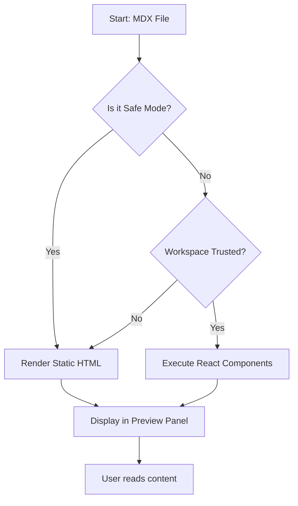
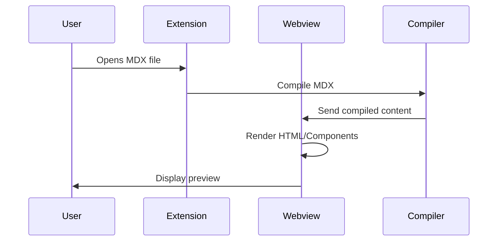
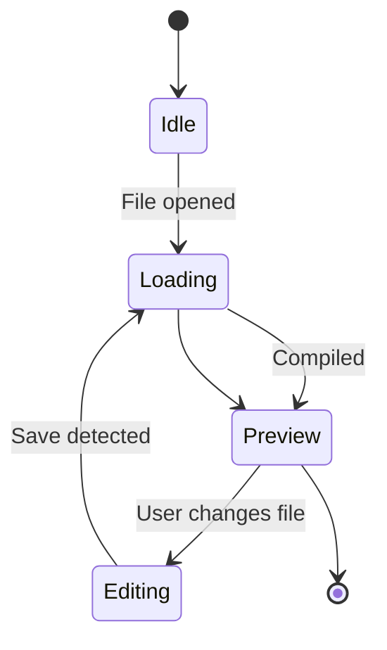
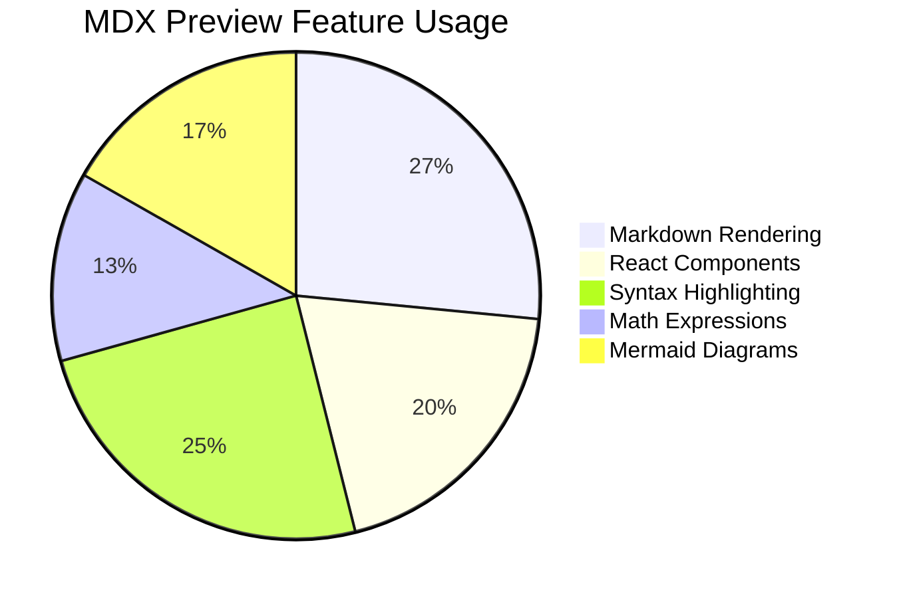

# MDX Preview Example

This is a simple example showing MDX Preview in action.

## Interactive Component

import MyComponent from './src/my-component'

Try clicking the button below:

<MyComponent />

## Features Demonstrated

- **Markdown rendering**: Headers, paragraphs, lists
- **React components**: Interactive button with state
- **Live preview**: Changes update instantly

## Code Example

```jsx
import React from 'react';

export default function MyComponent() {
  const [count, setCount] = React.useState(0);

  return (
    <button onClick={() => setCount(c => c + 1)}>
      Clicked {count} times
    </button>
  );
}
```

## Getting Started

1. Open this `README.mdx` file in VS Code
2. Run **"MDX: Open Preview"** from the Command Palette
3. Trust the workspace and enable scripts for interactive components

## What is MDX?

MDX is a format that lets you seamlessly write JSX in your Markdown documents. You can import components, such as interactive charts or alerts, and embed them within your content. This makes writing long-form content with components a blast.

### Why MDX?

- **Component-based**: Use React components directly in your content
- **Flexible**: Mix Markdown and JSX as needed
- **Powerful**: Full access to JavaScript expressions
- **Familiar**: If you know Markdown and React, you know MDX

## Markdown Features

### Text Formatting

You can use **bold**, *italic*, ~~strikethrough~~, and `inline code` in your content.

### Blockquotes

> MDX is an authorable format that lets you seamlessly write JSX in your Markdown documents.
> 
> It's perfect for documentation, blogs, and interactive tutorials.

### Tables

| Feature | Safe Mode | Trusted Mode |
|---------|-----------|--------------|
| Markdown rendering | Yes | Yes |
| Syntax highlighting | Yes | Yes |
| React components | No | Yes |
| JavaScript execution | No | Yes |

### Task Lists

- [x] Install the extension
- [x] Open an MDX file
- [ ] Enable trusted mode
- [ ] Try the interactive components

## Advanced Usage

### Nested Lists

1. First level item
   - Second level item
   - Another second level item
     - Third level item
2. Back to first level
   1. Numbered nested item
   2. Another numbered nested item

### Code Blocks with Syntax Highlighting

Here's some TypeScript code:

```typescript
interface User {
  id: number;
  name: string;
  email: string;
}

async function fetchUser(id: number): Promise<User> {
  const response = await fetch(`/api/users/${id}`);
  return response.json();
}
```

And some CSS:

```css
.button {
  background: linear-gradient(135deg, #667eea 0%, #764ba2 100%);
  border: none;
  border-radius: 8px;
  color: white;
  padding: 12px 24px;
  cursor: pointer;
  transition: transform 0.2s ease;
}

.button:hover {
  transform: translateY(-2px);
}
```

## Links and References

- [MDX Documentation](https://mdxjs.com/)
- [React Documentation](https://react.dev/)
- [VS Code Documentation](https://code.visualstudio.com/docs)

### Internal Links

You can link to [sections within this document](#what-is-mdx) using anchor links.

## Images

Images can be embedded using standard Markdown syntax:


## Horizontal Rules

Use horizontal rules to separate sections:

---

## Rich Content Features

### Mermaid Diagrams

Mermaid diagrams render as interactive visualizations. Here's a flowchart example:



And here's a sequence diagram showing component interaction:



A simple state diagram:



And a pie chart showing feature adoption:



### Math and LaTeX Expressions

Inline math expressions: `E = mc²` is the famous mass-energy equivalence formula discovered by Einstein.

The quadratic formula solves `ax² + bx + c = 0`:

`x = (-b ± √(b² - 4ac)) / 2a`

### Code Block Enhancements

Here's a **code** block with line highlighting and a title:

```typescript title="user-service.ts" {2,4-6}
export class UserService {
  async fetchUser(id: number): Promise<User> {
    const response = await fetch(`/api/users/${id}`);
    const data = await response.json();
    this.cache.set(id, data);
    return data;
  }
}
```

JavaScript with line numbers:

```javascript
function fibonacci(n: number): number {
  if (n <= 1) return n;
  
  let prev = 0, curr = 1;
  for (let i = 2; i <= n; i++) {
    [prev, curr] = [curr, prev + curr];
  }
  return curr;
}
```

Python code example:

```python title="app.py"
from flask import Flask, jsonify

app = Flask(__name__)

@app.route('/api/data')
def get_data():
    return jsonify({'status': 'success', 'data': []})

if __name__ == '__main__':
    app.run(debug=True)
```

### GitHub Alerts/Callouts

> [!NOTE]
> This is a note providing helpful information. Use this for tips and general guidance that enhances understanding.

> [!TIP]
> Tips highlight best practices and clever techniques that can improve your workflow or code quality.

> [!WARNING]
> Warnings alert you to important considerations that could cause issues if overlooked.

> [!CAUTION]
> Use caution when following these instructions as they may have unintended side effects.

> [!IMPORTANT]
> This information is critical and should not be skipped. Pay close attention to these details.

### Formulas and Math

The famous equation `E = mc²` describes mass-energy equivalence.

Other common formulas include the quadratic formula and the Pythagorean theorem `a² + b² = c²`.

## Conclusion

This example demonstrates the rich feature set of MDX Preview. Whether you're writing documentation, tutorials, or interactive content, MDX provides a powerful way to combine the simplicity of Markdown with the flexibility of React components.

**Happy writing!**
