import Calculator from './src/calculator'

# MDX Preview Feature Showcase

Welcome to MDX Preview! This document demonstrates all the powerful features available in the extension. Open this file in VS Code and use `Cmd+K X` (Mac) or `Ctrl+K X` (Windows/Linux) to see the live preview.

---

## Table of Contents

The sidebar on the right shows an auto-generated table of contents from your headings. Click any heading to navigate directly to that section.

---

## React Components (Trusted Mode)

In **Trusted Mode**, you can import and render React components directly in your MDX:

<Calculator />

> [!TIP]
> To enable React components, trust your workspace and set `mdx-preview.preview.enableScripts` to `true` in your settings.

---

## GitHub Alerts

MDX Preview supports GitHub-style alert callouts for highlighting important information:

> [!NOTE]
> **Notes** provide helpful context and additional information that enhances understanding.

> [!TIP]
> **Tips** share best practices and clever techniques that improve your workflow.

> [!IMPORTANT]
> **Important** highlights critical information that users must not overlook.

> [!WARNING]
> **Warnings** alert you to potential issues that could cause problems if ignored.

> [!CAUTION]
> **Caution** advises about risks or actions that may have negative consequences.

---

## Syntax Highlighting

Code blocks feature Shiki-powered syntax highlighting with **copy buttons** and **language badges**:

### TypeScript

```typescript
interface User {
  id: number;
  name: string;
  email: string;
  roles: string[];
}

async function fetchUser(id: number): Promise<User> {
  const response = await fetch(`/api/users/${id}`);
  if (!response.ok) {
    throw new Error(`Failed to fetch user: ${response.status}`);
  }
  return response.json();
}
```

### React/JSX

```tsx
import { useState, useEffect } from 'react';

interface CounterProps {
  initialValue?: number;
}

export function Counter({ initialValue = 0 }: CounterProps) {
  const [count, setCount] = useState(initialValue);

  return (
    <div className="counter">
      <span>Count: {count}</span>
      <button onClick={() => setCount(c => c + 1)}>+</button>
      <button onClick={() => setCount(c => c - 1)}>-</button>
    </div>
  );
}
```

### Line Highlighting

Highlight specific lines to draw attention to important code:

```typescript {2,5-7}
function processData(items: string[]) {
  const filtered = items.filter(Boolean); // highlighted

  return filtered.map(item => {
    const normalized = item.trim().toLowerCase(); // highlighted
    const encoded = encodeURIComponent(normalized); // highlighted
    return `processed_${encoded}`; // highlighted
  });
}
```

### Code with Title

```python title="api/routes.py"
from flask import Flask, jsonify, request

app = Flask(__name__)

@app.route('/api/users', methods=['GET'])
def get_users():
    page = request.args.get('page', 1, type=int)
    limit = request.args.get('limit', 10, type=int)

    users = User.query.paginate(page=page, per_page=limit)
    return jsonify([u.to_dict() for u in users.items])
```

### Diff Highlighting

```diff
- const oldImplementation = () => {
-   return data.filter(x => x.active);
- };
+ const newImplementation = () => {
+   return data
+     .filter(x => x.active)
+     .sort((a, b) => b.priority - a.priority);
+ };
```

### Multiple Languages

<details>
<summary>Click to see more language examples</summary>

**CSS**
```css
.card {
  display: flex;
  flex-direction: column;
  gap: 1rem;
  padding: 1.5rem;
  border-radius: 8px;
  background: var(--card-bg);
  box-shadow: 0 2px 8px rgba(0, 0, 0, 0.1);
  transition: transform 0.2s ease, box-shadow 0.2s ease;
}

.card:hover {
  transform: translateY(-2px);
  box-shadow: 0 4px 16px rgba(0, 0, 0, 0.15);
}
```

**JSON**
```json
{
  "name": "mdx-preview-demo",
  "version": "1.0.0",
  "dependencies": {
    "react": "^18.2.0",
    "react-dom": "^18.2.0"
  },
  "scripts": {
    "dev": "vite",
    "build": "vite build"
  }
}
```

**Shell**
```bash
# Clone and setup
git clone https://github.com/example/repo.git
cd repo
npm install

# Development
npm run dev

# Production build
npm run build && npm run preview
```

**SQL**
```sql
SELECT
  u.id,
  u.name,
  COUNT(o.id) as order_count,
  SUM(o.total) as total_spent
FROM users u
LEFT JOIN orders o ON u.id = o.user_id
WHERE u.created_at > '2024-01-01'
GROUP BY u.id, u.name
HAVING COUNT(o.id) > 5
ORDER BY total_spent DESC
LIMIT 10;
```

</details>

---

## Math Expressions (KaTeX)

MDX Preview renders mathematical expressions using KaTeX:

### Inline Math

The quadratic formula $x = \frac{-b \pm \sqrt{b^2 - 4ac}}{2a}$ solves equations of the form $ax^2 + bx + c = 0$.

Einstein's mass-energy equivalence: $E = mc^2$

### Block Math

The Gaussian integral:

$$
\int_{-\infty}^{\infty} e^{-x^2} dx = \sqrt{\pi}
$$

Matrix multiplication:

$$
\begin{bmatrix}
a & b \\
c & d
\end{bmatrix}
\begin{bmatrix}
x \\
y
\end{bmatrix}
=
\begin{bmatrix}
ax + by \\
cx + dy
\end{bmatrix}
$$

Summation notation:

$$
\sum_{i=1}^{n} i = \frac{n(n+1)}{2}
$$

The limit definition of e:

$$
e = \lim_{n \to \infty} \left(1 + \frac{1}{n}\right)^n
$$

---

## Mermaid Diagrams

Create diagrams using Mermaid syntax:

### Flowchart

```mermaid
graph TD
    A[📄 MDX File] --> B{Mode?}
    B -->|Safe Mode| C[🔒 Static HTML]
    B -->|Trusted Mode| D[⚛️ React Components]
    C --> E[Preview Panel]
    D --> E
    E --> F[👁️ Live Preview]

    style A fill:#e1f5fe
    style F fill:#c8e6c9
```



### Sequence Diagram


### State Diagram


### Entity Relationship Diagram


### Pie Chart


### Gantt Chart


---

## Tables (GFM)

GitHub Flavored Markdown tables are fully supported:

| Feature | Safe Mode | Trusted Mode | Description |
|---------|:---------:|:------------:|-------------|
| Markdown rendering | ✅ | ✅ | Basic formatting, lists, links |
| Syntax highlighting | ✅ | ✅ | Shiki-powered code highlighting |
| Math expressions | ✅ | ✅ | KaTeX for LaTeX math |
| Mermaid diagrams | ✅ | ✅ | Flowcharts, sequences, etc. |
| GitHub alerts | ✅ | ✅ | Note, tip, warning callouts |
| React components | ❌ | ✅ | Custom interactive components |
| JavaScript execution | ❌ | ✅ | Full JS/TS support |
| Module imports | ❌ | ✅ | npm packages & local files |

---

## Task Lists

Track progress with interactive task lists:

- [x] Install MDX Preview extension
- [x] Open an MDX file
- [x] View in preview panel
- [ ] Enable Trusted Mode
- [ ] Try interactive components
- [ ] Customize with themes

---

## Images

Images support click-to-zoom with a lightbox modal. Click any image to view it fullscreen:


> [!TIP]
> Press `Escape` or click outside the image to close the lightbox.

---

## Text Formatting

MDX Preview supports all standard Markdown formatting:

- **Bold text** for emphasis
- *Italic text* for subtle emphasis
- ~~Strikethrough~~ for corrections
- `inline code` for technical terms
- [Links](https://mdxjs.com) to external resources
- <mark>Highlighted text</mark> using HTML

### Blockquotes

> "The best way to predict the future is to invent it."
>
> — Alan Kay

Nested blockquotes:

> Level 1 quote
>> Level 2 nested quote
>>> Level 3 deeply nested

---

## Lists

### Ordered Lists

1. First item
2. Second item
   1. Nested item 2.1
   2. Nested item 2.2
3. Third item

### Unordered Lists

- Main point
  - Sub-point
    - Detailed item
  - Another sub-point
- Second main point

### Definition Lists (HTML)

<dl>
  <dt>MDX</dt>
  <dd>Markdown + JSX = Interactive documentation</dd>

  <dt>Safe Mode</dt>
  <dd>Static HTML rendering without JavaScript execution</dd>

  <dt>Trusted Mode</dt>
  <dd>Full React rendering with component support</dd>
</dl>

---

## Keyboard Shortcuts

Use these shortcuts to work efficiently:

| Action | Mac | Windows/Linux |
|--------|-----|---------------|
| Open Preview | `Cmd+K X` | `Ctrl+K X` |
| Zoom In | `Cmd+=` | `Ctrl+=` |
| Zoom Out | `Cmd+-` | `Ctrl+-` |
| Reset Zoom | `Cmd+0` | `Ctrl+0` |

---

## Theme Support

MDX Preview supports multiple themes for both preview content and code blocks:

**Preview Themes:** GitHub Light, GitHub Dark, Atom, Solarized, Monokai, and more

**Code Block Themes:** 24+ syntax highlighting themes

**Auto Theme:** Automatically matches your VS Code color theme (light/dark)

> [!NOTE]
> Use the Command Palette commands `MDX: Select Preview Theme` and `MDX: Select Code Block Theme` to customize appearance.

---

## MDX Transclusion

Import other MDX files as components (Trusted Mode only):

```mdx
import Introduction from './Introduction.mdx';
import Features from './Features.mdx';

# Documentation

<Introduction />

## Features

<Features />
```

---

## Custom Layouts

Wrap your content in custom React layouts:

```mdx
import DocsLayout from './components/DocsLayout';

export default DocsLayout;

# My Documentation

This content will be wrapped in DocsLayout.
```

---

## Getting Started

1. **Install** the MDX Preview extension from the VS Code Marketplace
2. **Open** any `.mdx` or `.md` file in your workspace
3. **Preview** using `Cmd+K X` or the preview icon in the toolbar
4. **Enable Trusted Mode** for React components:
   - Trust your workspace (Command Palette → "Manage Workspace Trust")
   - Enable scripts in settings: `mdx-preview.preview.enableScripts: true`

---

## Learn More

- [MDX Documentation](https://mdxjs.com/)
- [React Documentation](https://react.dev/)
- [Mermaid Documentation](https://mermaid.js.org/)
- [KaTeX Documentation](https://katex.org/)
- [GitHub Flavored Markdown](https://github.github.com/gfm/)

---

**Happy writing with MDX Preview!** 🚀
