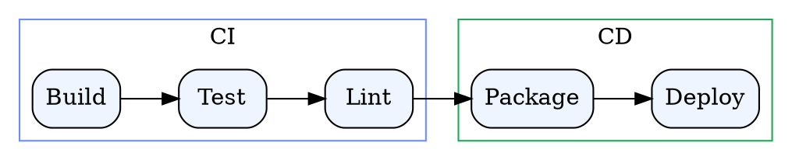
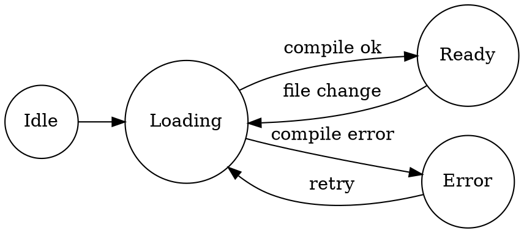
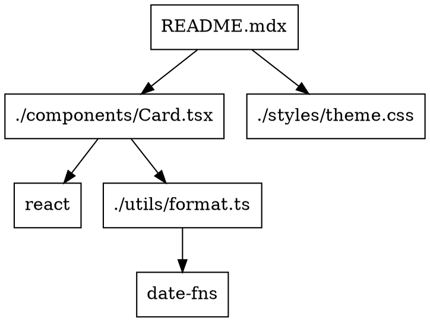

# Graphviz DOT Rendering

MDX Preview renders both `dot` and `graphviz` fenced code blocks as inline SVG diagrams.

> [!TIP]
> Graphviz rendering is client-side via `@viz-js/viz`, so it does not require a network request.

---

## `dot` Fence Example

---

## `graphviz` Fence Example

---

## State Machine Example

---

## Dependency Graph Example

---

## Notes

- Both `dot` and `graphviz` language tags are supported
- Graph colors are adjusted for light and dark preview themes
- On parse/render errors, MDX Preview shows an inline error UI with source toggle
