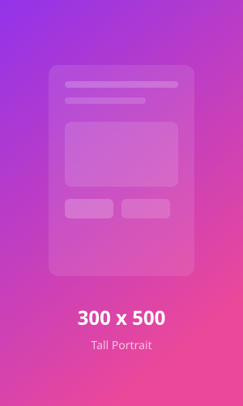
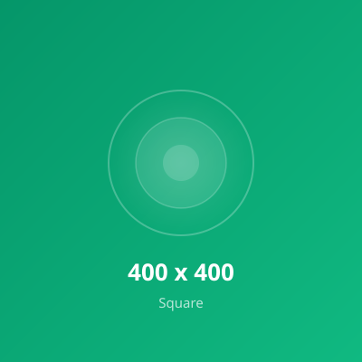
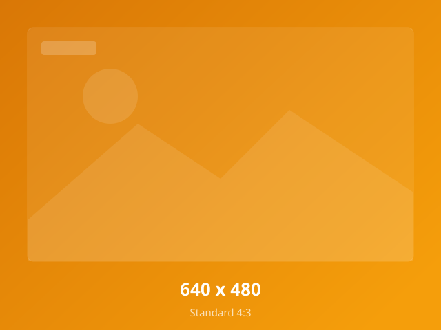
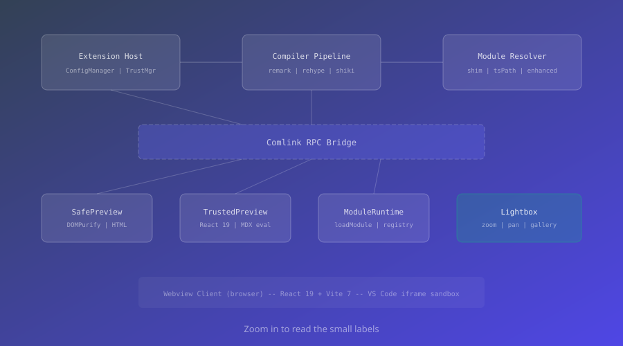

# Image Lightbox & Preview Zoom

This example demonstrates two features: the **image lightbox** (click any image for a fullscreen modal with zoom, pan, and gallery navigation) and **preview zoom** (scale the entire preview via VS Code commands).

---

## Image Lightbox

Click any image below to open the lightbox. When multiple images are present, the lightbox enters **gallery mode** showing an image counter and navigation arrows.

### Single Image

A standalone image. Click to open the lightbox in single-image mode:

---

### Image Gallery

All images below are collected into a single gallery. Click any image, then use the arrow buttons or keyboard to navigate between them.

> [!TIP]
> The lightbox counter shows "1 of 7" through "7 of 7" as you navigate. The gallery wraps around: pressing right on the last image goes back to the first.

---

### Aspect Ratios

These three images have different aspect ratios. The lightbox uses `object-fit: contain` to display each image without cropping, regardless of shape:

| Shape | Image | Dimensions |
|-------|-------|------------|
| Wide |  | 800 x 300 |
| Tall |  | 300 x 500 |
| Square |  | 400 x 400 |

> [!NOTE]
> Images inside tables are also clickable. Clicking a table image opens its own section gallery.

---

### Image Captions

The lightbox displays the image's **alt text** as a caption at the bottom of the modal.

**Long caption:**

**Short caption:**

**No caption** (empty alt text -- the caption bar should be hidden):

---

## Lightbox Controls

### Keyboard Shortcuts

| Action | Shortcut |
|--------|----------|
| Open lightbox | Click any image |
| Close | `Escape` / click x / click backdrop |
| Next image | `ArrowRight` or click `>` button |
| Previous image | `ArrowLeft` or click `<` button |
| Zoom in | Scroll wheel up |
| Zoom out | Scroll wheel down |
| Toggle 1x / 2x zoom | Double-click image |
| Pan (when zoomed) | Click and drag |
| Reset zoom and pan | Press `0` |

### Cursor States

The cursor changes to indicate available interactions:

- **zoom-in** -- Default cursor when viewing at 1x. Indicates you can double-click to zoom in.
- **grab** -- Shown when the image is zoomed beyond 1x. Indicates you can click and drag to pan.
- **grabbing** -- Shown while actively dragging a zoomed image.

> [!IMPORTANT]
> Zoom range in the lightbox is **0.5x to 5x**. Scroll wheel adjusts by 0.25x per step, centered on your cursor position.

---

## Preview Zoom

Separate from the lightbox, you can zoom the **entire preview** using VS Code commands. This scales all content (text, images, diagrams) uniformly.

### Commands

Open the Command Palette (`Cmd+Shift+P` / `Ctrl+Shift+P`) and search for:

| Command | ID | Description |
|---------|----|-------------|
| MDX: Zoom In | `mdx-preview.commands.zoomIn` | Increase preview scale by 10% |
| MDX: Zoom Out | `mdx-preview.commands.zoomOut` | Decrease preview scale by 10% |
| MDX: Reset Zoom | `mdx-preview.commands.resetZoom` | Reset to 100% |

### Behavior

- **Range**: 0.5x to 3.0x (50% to 300%)
- **Persistence**: Zoom level is saved to localStorage and restored when you reopen the preview
- **Rendering**: Applied via CSS `transform: scale()` on the preview container

> [!NOTE]
> Preview zoom and lightbox zoom are independent. Preview zoom scales the entire page; lightbox zoom affects only the focused image in the modal.

---

## Testing Checklist

Use this checklist to verify both features work correctly:

- [ ] All images render in the preview
- [ ] Clicking an image opens the lightbox
- [ ] Gallery section: counter shows "X of 7"
- [ ] Aspect ratios section: counter shows "X of 3"
- [ ] Captions section: counter shows "X of 3"
- [ ] Single image section: no gallery counter (single-image mode)
- [ ] Arrow keys and buttons navigate within section gallery only
- [ ] Gallery wraps around (last to first, first to last)
- [ ] Scroll wheel zooms in and out (0.5x to 5x)
- [ ] Double-click toggles between 1x and 2x
- [ ] Click and drag pans when zoomed beyond 1x
- [ ] Pressing `0` resets zoom and pan
- [ ] `Escape` closes the lightbox
- [ ] Clicking the backdrop closes the lightbox
- [ ] Alt text appears as caption; no caption for images without alt
- [ ] Preview zoom commands work from Command Palette
- [ ] Zoom level persists after closing and reopening preview
- [ ] Features work in both Safe Mode and Trusted Mode
