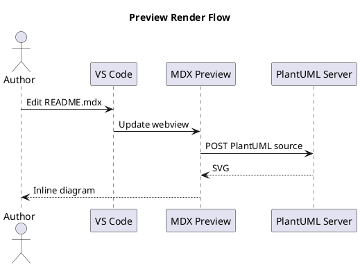
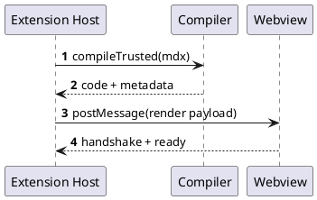
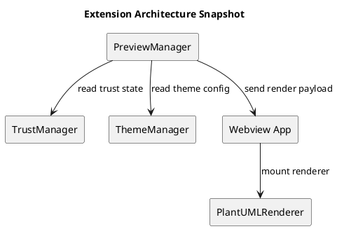
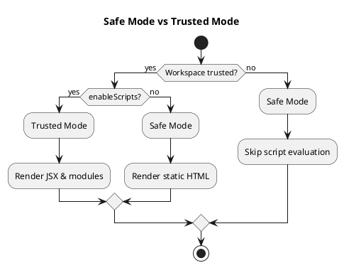

# PlantUML Diagram Rendering

MDX Preview renders fenced code blocks labeled `plantuml` as inline SVG diagrams.

> [!NOTE]
> PlantUML rendering uses an HTTP server endpoint. The default server is `https://kroki.io`.

---

## Quick Start



---

## Sequence Diagram Example



---

## Component Diagram Example



---

## Activity Diagram Example



---

## PlantUML Server Configuration

Configure the server globally in VS Code settings:

```json
{
  "mdx-preview.diagrams.plantUmlServer": "https://kroki.io"
}
```

Use a self-hosted instance if you need local or private rendering:

```json
{
  "mdx-preview.diagrams.plantUmlServer": "http://localhost:8000"
}
```

---

## Notes

- PlantUML diagrams render in both Safe Mode and Trusted Mode
- Network access to the configured server is required
- On server errors, MDX Preview shows an inline error UI with source toggle
