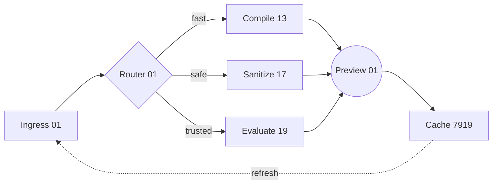
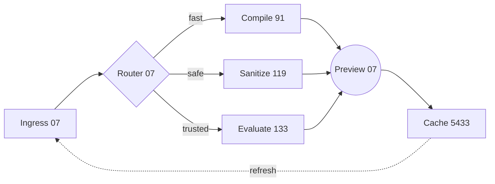
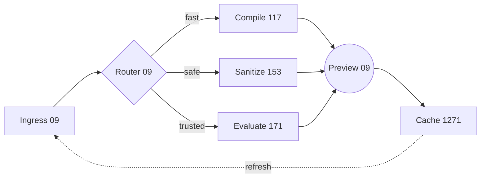
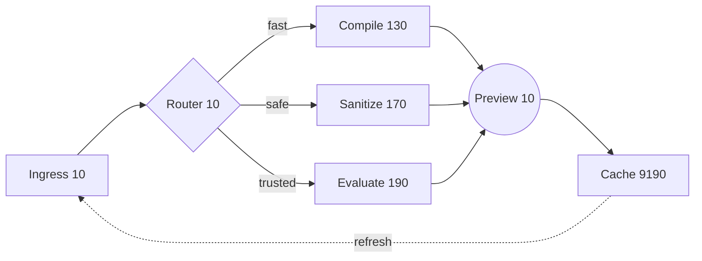
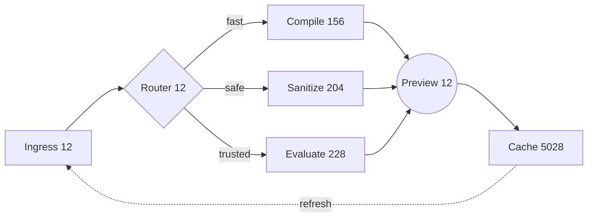
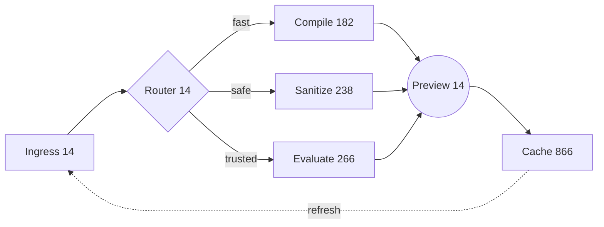
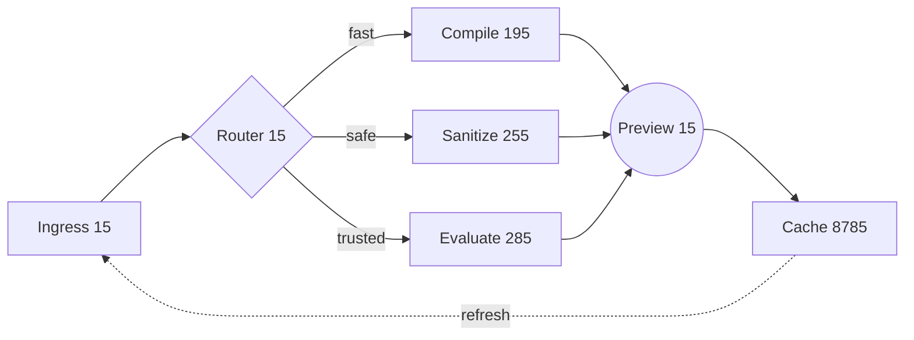
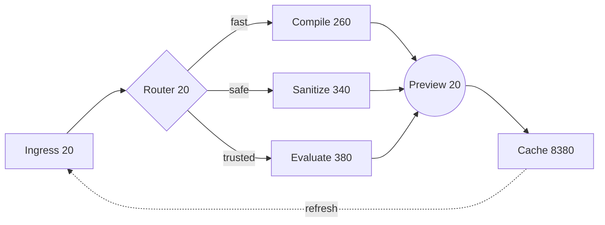
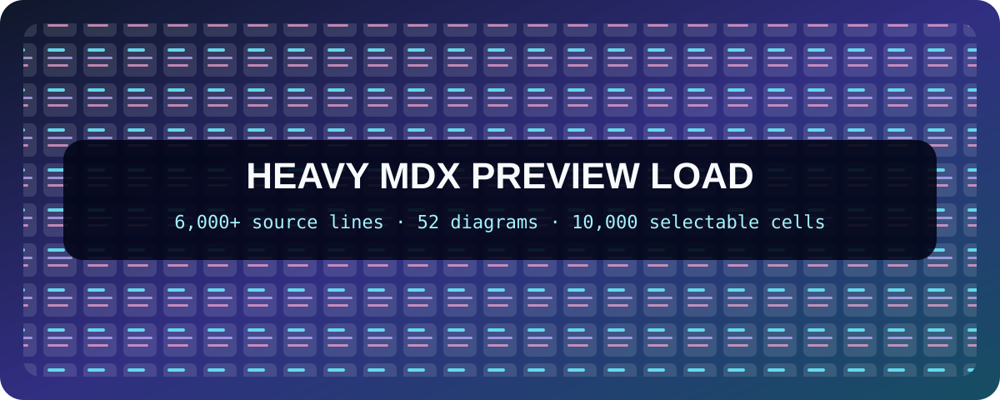

import StressHarness from './src/StressHarness'
import Appendix from './src/transcluded.mdx'

# MDX Preview Heavy Stress Test

> [!WARNING]
> This fixture is intentionally expensive. It renders thousands of interactive
> React nodes, more than fifty diagrams, a large table, many highlighted code
> fences, and a transcluded MDX module. Save other work before selecting the
> 10,000-cell load.

Use this file to compare cold-open time, edit-to-preview latency, memory growth,
scroll synchronization, theme switching, diagram caching, and repeated refreshes.
Everything is deterministic, local, and offline.

## Load profile

| Surface | Literal load | Intended pressure |
|---|---:|---|
| Markdown source | 6,700+ lines across two modules | parsing, plugins, source maps, transport |
| React harness | 2,500 cells by default; 10,000 selectable | evaluation, reconciliation, DOM, events |
| GFM table | 160 rows × 10 columns | parsing, layout, horizontal scrolling |
| Syntax highlighting | 36 standalone fences plus grouped fences | Shiki grammar loading and token DOM |
| Mermaid | 52 unique diagrams | lazy rendering and result-cache turnover |
| Graphviz | 8 unique graphs | WASM loading and client-side layout |
| Math | 24 display equations plus inline expressions | KaTeX parsing and CSS |
| Generic components | 40 component instances | shims, nesting, interaction |
| Transclusion | one large local MDX module | resolver, module cache, dependency watching |

## How to stress it

1. Open this file and run **Open MDX Preview**.
2. Record the first complete render, then make a one-character edit at
   `STRESS_EDIT_MARKER_0001` below.
3. Switch the React grid between 500, 2,500, 5,000, and 10,000 cells.
4. Filter for `ready`, reverse the order, and toggle roomy cards repeatedly.
5. Collapse and reopen the preview, then switch VS Code themes.

> [!TIP]
> The shared `examples/.vscode/settings.json` enables scripts. Turn scripts off
> to compare Safe Mode compilation against the full Trusted Mode workload.

**Edit marker:** `STRESS_EDIT_MARKER_0001`

## Interactive pressure lane

<div className="rounded-2xl border border-fuchsia-300 bg-gradient-to-br from-fuchsia-50 via-white to-cyan-50 p-5 shadow-lg dark:border-fuchsia-800 dark:from-fuchsia-950 dark:via-slate-950 dark:to-cyan-950">
  <p className="m-0 text-lg font-black text-slate-950 dark:text-white">
    Browser-safe Tailwind entry detected inside this example package
  </p>
  <p className="mb-0 mt-2 text-sm text-slate-700 dark:text-slate-200">
    This panel intentionally uses gradients, responsive utilities, dark variants,
    arbitrary tracking, and layered borders before the generated grid begins.
  </p>
</div>

<StressHarness />

---

# Literal Markdown pressure lane

The next sections are intentionally repetitive but not byte-identical. Unique
headings, anchors, prose, tables, lists, callouts, and inline math prevent the
compiler and renderer from treating this as one tiny generated expression.

## Literal batch 01 — Quartz

Batch 01 carries deterministic prose for the quartz lane. Its
payload token is `batch-01-quartz`, its inline equation is
$x^2 + 1x + 1$, and its stable link points back to [the load profile](#load-profile).

### Checkpoint 01.1 — nested structure

> [!NOTE]
> Checkpoint 01 exists to create a unique blockquote, source-line range, and
> alert node while preserving predictable text for visual diffing.

:::tip[Batch 01 tip]
Change the number 7919 and watch whether the corresponding preview region
updates without losing the current scroll position.
:::

- Batch 01 root item
  - Quartz child A with **bold**, *italic*, and `inline-01` content
    - grandchild A.01 with ~~discarded text~~ and a [local anchor](#checkpoint-012--task-pressure)
    - grandchild B.01 with keyboard hints <kbd>Cmd</kbd> + <kbd>K</kbd> <kbd>X</kbd>
  - Quartz child B
    1. ordered payload 01.1
    2. ordered payload 01.2
       1. deep payload 01.2.1
       2. deep payload 01.2.2

### Checkpoint 01.2 — task pressure

- [x] Parse batch 01
- [x] Attach source metadata for Quartz
- [ ] Reconcile generated shard 97
- [ ] Re-render after edit token `refresh-01-13`

| Batch | Lane | Seed | Prime-ish | Ratio | State |
|---:|---|---:|---:|---:|---|
| 1 | Quartz | 101 | 7919 | 0.0244 | ready |
| 41 | Nimbus | 211 | 1543 | 0.9756 | warm |

> Batch 01 ends with a multi-line quotation so block layout, typography,
> source mapping, and paragraph spacing all receive another distinct node.

---

## Literal batch 02 — Nimbus

Batch 02 carries deterministic prose for the nimbus lane. Its
payload token is `batch-02-nimbus`, its inline equation is
$x^2 + 2x + 4$, and its stable link points back to [the load profile](#load-profile).

### Checkpoint 02.1 — nested structure

> [!NOTE]
> Checkpoint 02 exists to create a unique blockquote, source-line range, and
> alert node while preserving predictable text for visual diffing.

:::tip[Batch 02 tip]
Change the number 15838 and watch whether the corresponding preview region
updates without losing the current scroll position.
:::

- Batch 02 root item
  - Nimbus child A with **bold**, *italic*, and `inline-02` content
    - grandchild A.02 with ~~discarded text~~ and a [local anchor](#checkpoint-022--task-pressure)
    - grandchild B.02 with keyboard hints <kbd>Cmd</kbd> + <kbd>K</kbd> <kbd>X</kbd>
  - Nimbus child B
    1. ordered payload 02.1
    2. ordered payload 02.2
       1. deep payload 02.2.1
       2. deep payload 02.2.2

### Checkpoint 02.2 — task pressure

- [x] Parse batch 02
- [x] Attach source metadata for Nimbus
- [ ] Reconcile generated shard 194
- [ ] Re-render after edit token `refresh-02-26`

| Batch | Lane | Seed | Prime-ish | Ratio | State |
|---:|---|---:|---:|---:|---|
| 2 | Nimbus | 202 | 15838 | 0.0488 | ready |
| 42 | Helix | 422 | 3086 | 0.9512 | warm |

> Batch 02 ends with a multi-line quotation so block layout, typography,
> source mapping, and paragraph spacing all receive another distinct node.

---

## Literal batch 03 — Helix

Batch 03 carries deterministic prose for the helix lane. Its
payload token is `batch-03-helix`, its inline equation is
$x^2 + 3x + 9$, and its stable link points back to [the load profile](#load-profile).

### Checkpoint 03.1 — nested structure

> [!NOTE]
> Checkpoint 03 exists to create a unique blockquote, source-line range, and
> alert node while preserving predictable text for visual diffing.

:::tip[Batch 03 tip]
Change the number 23757 and watch whether the corresponding preview region
updates without losing the current scroll position.
:::

- Batch 03 root item
  - Helix child A with **bold**, *italic*, and `inline-03` content
    - grandchild A.03 with ~~discarded text~~ and a [local anchor](#checkpoint-032--task-pressure)
    - grandchild B.03 with keyboard hints <kbd>Cmd</kbd> + <kbd>K</kbd> <kbd>X</kbd>
  - Helix child B
    1. ordered payload 03.1
    2. ordered payload 03.2
       1. deep payload 03.2.1
       2. deep payload 03.2.2

### Checkpoint 03.2 — task pressure

- [x] Parse batch 03
- [x] Attach source metadata for Helix
- [ ] Reconcile generated shard 291
- [ ] Re-render after edit token `refresh-03-39`

| Batch | Lane | Seed | Prime-ish | Ratio | State |
|---:|---|---:|---:|---:|---|
| 3 | Helix | 303 | 23757 | 0.0732 | ready |
| 43 | Vector | 633 | 4629 | 0.9268 | warm |

> Batch 03 ends with a multi-line quotation so block layout, typography,
> source mapping, and paragraph spacing all receive another distinct node.

---

## Literal batch 04 — Vector

Batch 04 carries deterministic prose for the vector lane. Its
payload token is `batch-04-vector`, its inline equation is
$x^2 + 4x + 16$, and its stable link points back to [the load profile](#load-profile).

### Checkpoint 04.1 — nested structure

> [!NOTE]
> Checkpoint 04 exists to create a unique blockquote, source-line range, and
> alert node while preserving predictable text for visual diffing.

:::tip[Batch 04 tip]
Change the number 31676 and watch whether the corresponding preview region
updates without losing the current scroll position.
:::

- Batch 04 root item
  - Vector child A with **bold**, *italic*, and `inline-04` content
    - grandchild A.04 with ~~discarded text~~ and a [local anchor](#checkpoint-042--task-pressure)
    - grandchild B.04 with keyboard hints <kbd>Cmd</kbd> + <kbd>K</kbd> <kbd>X</kbd>
  - Vector child B
    1. ordered payload 04.1
    2. ordered payload 04.2
       1. deep payload 04.2.1
       2. deep payload 04.2.2

### Checkpoint 04.2 — task pressure

- [x] Parse batch 04
- [x] Attach source metadata for Vector
- [ ] Reconcile generated shard 388
- [ ] Re-render after edit token `refresh-04-52`

| Batch | Lane | Seed | Prime-ish | Ratio | State |
|---:|---|---:|---:|---:|---|
| 4 | Vector | 404 | 31676 | 0.0976 | ready |
| 44 | Cinder | 844 | 6172 | 0.9024 | warm |

> Batch 04 ends with a multi-line quotation so block layout, typography,
> source mapping, and paragraph spacing all receive another distinct node.

---

## Literal batch 05 — Cinder

Batch 05 carries deterministic prose for the cinder lane. Its
payload token is `batch-05-cinder`, its inline equation is
$x^2 + 5x + 25$, and its stable link points back to [the load profile](#load-profile).

### Checkpoint 05.1 — nested structure

> [!NOTE]
> Checkpoint 05 exists to create a unique blockquote, source-line range, and
> alert node while preserving predictable text for visual diffing.

:::tip[Batch 05 tip]
Change the number 39595 and watch whether the corresponding preview region
updates without losing the current scroll position.
:::

- Batch 05 root item
  - Cinder child A with **bold**, *italic*, and `inline-05` content
    - grandchild A.05 with ~~discarded text~~ and a [local anchor](#checkpoint-052--task-pressure)
    - grandchild B.05 with keyboard hints <kbd>Cmd</kbd> + <kbd>K</kbd> <kbd>X</kbd>
  - Cinder child B
    1. ordered payload 05.1
    2. ordered payload 05.2
       1. deep payload 05.2.1
       2. deep payload 05.2.2

### Checkpoint 05.2 — task pressure

- [x] Parse batch 05
- [x] Attach source metadata for Cinder
- [ ] Reconcile generated shard 485
- [ ] Re-render after edit token `refresh-05-65`

| Batch | Lane | Seed | Prime-ish | Ratio | State |
|---:|---|---:|---:|---:|---|
| 5 | Cinder | 505 | 39595 | 0.1220 | ready |
| 45 | Orbit | 1055 | 7715 | 0.8780 | warm |

> Batch 05 ends with a multi-line quotation so block layout, typography,
> source mapping, and paragraph spacing all receive another distinct node.

---

## Literal batch 06 — Orbit

Batch 06 carries deterministic prose for the orbit lane. Its
payload token is `batch-06-orbit`, its inline equation is
$x^2 + 6x + 36$, and its stable link points back to [the load profile](#load-profile).

### Checkpoint 06.1 — nested structure

> [!NOTE]
> Checkpoint 06 exists to create a unique blockquote, source-line range, and
> alert node while preserving predictable text for visual diffing.

:::tip[Batch 06 tip]
Change the number 47514 and watch whether the corresponding preview region
updates without losing the current scroll position.
:::

- Batch 06 root item
  - Orbit child A with **bold**, *italic*, and `inline-06` content
    - grandchild A.06 with ~~discarded text~~ and a [local anchor](#checkpoint-062--task-pressure)
    - grandchild B.06 with keyboard hints <kbd>Cmd</kbd> + <kbd>K</kbd> <kbd>X</kbd>
  - Orbit child B
    1. ordered payload 06.1
    2. ordered payload 06.2
       1. deep payload 06.2.1
       2. deep payload 06.2.2

### Checkpoint 06.2 — task pressure

- [x] Parse batch 06
- [x] Attach source metadata for Orbit
- [ ] Reconcile generated shard 582
- [ ] Re-render after edit token `refresh-06-78`

| Batch | Lane | Seed | Prime-ish | Ratio | State |
|---:|---|---:|---:|---:|---|
| 6 | Orbit | 606 | 47514 | 0.1463 | ready |
| 46 | Lattice | 1266 | 9258 | 0.8537 | warm |

> Batch 06 ends with a multi-line quotation so block layout, typography,
> source mapping, and paragraph spacing all receive another distinct node.

---

## Literal batch 07 — Lattice

Batch 07 carries deterministic prose for the lattice lane. Its
payload token is `batch-07-lattice`, its inline equation is
$x^2 + 7x + 49$, and its stable link points back to [the load profile](#load-profile).

### Checkpoint 07.1 — nested structure

> [!NOTE]
> Checkpoint 07 exists to create a unique blockquote, source-line range, and
> alert node while preserving predictable text for visual diffing.

:::tip[Batch 07 tip]
Change the number 55433 and watch whether the corresponding preview region
updates without losing the current scroll position.
:::

- Batch 07 root item
  - Lattice child A with **bold**, *italic*, and `inline-07` content
    - grandchild A.07 with ~~discarded text~~ and a [local anchor](#checkpoint-072--task-pressure)
    - grandchild B.07 with keyboard hints <kbd>Cmd</kbd> + <kbd>K</kbd> <kbd>X</kbd>
  - Lattice child B
    1. ordered payload 07.1
    2. ordered payload 07.2
       1. deep payload 07.2.1
       2. deep payload 07.2.2

### Checkpoint 07.2 — task pressure

- [x] Parse batch 07
- [x] Attach source metadata for Lattice
- [ ] Reconcile generated shard 679
- [ ] Re-render after edit token `refresh-07-91`

| Batch | Lane | Seed | Prime-ish | Ratio | State |
|---:|---|---:|---:|---:|---|
| 7 | Lattice | 707 | 55433 | 0.1707 | ready |
| 47 | Signal | 1477 | 10801 | 0.8293 | warm |

> Batch 07 ends with a multi-line quotation so block layout, typography,
> source mapping, and paragraph spacing all receive another distinct node.

---

## Literal batch 08 — Signal

Batch 08 carries deterministic prose for the signal lane. Its
payload token is `batch-08-signal`, its inline equation is
$x^2 + 8x + 64$, and its stable link points back to [the load profile](#load-profile).

### Checkpoint 08.1 — nested structure

> [!NOTE]
> Checkpoint 08 exists to create a unique blockquote, source-line range, and
> alert node while preserving predictable text for visual diffing.

:::tip[Batch 08 tip]
Change the number 63352 and watch whether the corresponding preview region
updates without losing the current scroll position.
:::

- Batch 08 root item
  - Signal child A with **bold**, *italic*, and `inline-08` content
    - grandchild A.08 with ~~discarded text~~ and a [local anchor](#checkpoint-082--task-pressure)
    - grandchild B.08 with keyboard hints <kbd>Cmd</kbd> + <kbd>K</kbd> <kbd>X</kbd>
  - Signal child B
    1. ordered payload 08.1
    2. ordered payload 08.2
       1. deep payload 08.2.1
       2. deep payload 08.2.2

### Checkpoint 08.2 — task pressure

- [x] Parse batch 08
- [x] Attach source metadata for Signal
- [ ] Reconcile generated shard 776
- [ ] Re-render after edit token `refresh-08-104`

| Batch | Lane | Seed | Prime-ish | Ratio | State |
|---:|---|---:|---:|---:|---|
| 8 | Signal | 808 | 63352 | 0.1951 | ready |
| 48 | Prism | 1688 | 12344 | 0.8049 | warm |

> Batch 08 ends with a multi-line quotation so block layout, typography,
> source mapping, and paragraph spacing all receive another distinct node.

---

## Literal batch 09 — Prism

Batch 09 carries deterministic prose for the prism lane. Its
payload token is `batch-09-prism`, its inline equation is
$x^2 + 9x + 81$, and its stable link points back to [the load profile](#load-profile).

### Checkpoint 09.1 — nested structure

> [!NOTE]
> Checkpoint 09 exists to create a unique blockquote, source-line range, and
> alert node while preserving predictable text for visual diffing.

:::tip[Batch 09 tip]
Change the number 71271 and watch whether the corresponding preview region
updates without losing the current scroll position.
:::

- Batch 09 root item
  - Prism child A with **bold**, *italic*, and `inline-09` content
    - grandchild A.09 with ~~discarded text~~ and a [local anchor](#checkpoint-092--task-pressure)
    - grandchild B.09 with keyboard hints <kbd>Cmd</kbd> + <kbd>K</kbd> <kbd>X</kbd>
  - Prism child B
    1. ordered payload 09.1
    2. ordered payload 09.2
       1. deep payload 09.2.1
       2. deep payload 09.2.2

### Checkpoint 09.2 — task pressure

- [x] Parse batch 09
- [x] Attach source metadata for Prism
- [ ] Reconcile generated shard 873
- [ ] Re-render after edit token `refresh-09-117`

| Batch | Lane | Seed | Prime-ish | Ratio | State |
|---:|---|---:|---:|---:|---|
| 9 | Prism | 909 | 71271 | 0.2195 | ready |
| 49 | Harbor | 1899 | 13887 | 0.7805 | warm |

> Batch 09 ends with a multi-line quotation so block layout, typography,
> source mapping, and paragraph spacing all receive another distinct node.

---

## Literal batch 10 — Harbor

Batch 10 carries deterministic prose for the harbor lane. Its
payload token is `batch-10-harbor`, its inline equation is
$x^2 + 10x + 100$, and its stable link points back to [the load profile](#load-profile).

### Checkpoint 10.1 — nested structure

> [!NOTE]
> Checkpoint 10 exists to create a unique blockquote, source-line range, and
> alert node while preserving predictable text for visual diffing.

:::tip[Batch 10 tip]
Change the number 79190 and watch whether the corresponding preview region
updates without losing the current scroll position.
:::

- Batch 10 root item
  - Harbor child A with **bold**, *italic*, and `inline-10` content
    - grandchild A.10 with ~~discarded text~~ and a [local anchor](#checkpoint-102--task-pressure)
    - grandchild B.10 with keyboard hints <kbd>Cmd</kbd> + <kbd>K</kbd> <kbd>X</kbd>
  - Harbor child B
    1. ordered payload 10.1
    2. ordered payload 10.2
       1. deep payload 10.2.1
       2. deep payload 10.2.2

### Checkpoint 10.2 — task pressure

- [x] Parse batch 10
- [x] Attach source metadata for Harbor
- [ ] Reconcile generated shard 970
- [ ] Re-render after edit token `refresh-10-130`

| Batch | Lane | Seed | Prime-ish | Ratio | State |
|---:|---|---:|---:|---:|---|
| 10 | Harbor | 1010 | 79190 | 0.2439 | ready |
| 50 | Quartz | 2110 | 15430 | 0.7561 | warm |

> Batch 10 ends with a multi-line quotation so block layout, typography,
> source mapping, and paragraph spacing all receive another distinct node.

---

## Literal batch 11 — Quartz

Batch 11 carries deterministic prose for the quartz lane. Its
payload token is `batch-11-quartz`, its inline equation is
$x^2 + 11x + 121$, and its stable link points back to [the load profile](#load-profile).

### Checkpoint 11.1 — nested structure

> [!NOTE]
> Checkpoint 11 exists to create a unique blockquote, source-line range, and
> alert node while preserving predictable text for visual diffing.

:::tip[Batch 11 tip]
Change the number 87109 and watch whether the corresponding preview region
updates without losing the current scroll position.
:::

- Batch 11 root item
  - Quartz child A with **bold**, *italic*, and `inline-11` content
    - grandchild A.11 with ~~discarded text~~ and a [local anchor](#checkpoint-112--task-pressure)
    - grandchild B.11 with keyboard hints <kbd>Cmd</kbd> + <kbd>K</kbd> <kbd>X</kbd>
  - Quartz child B
    1. ordered payload 11.1
    2. ordered payload 11.2
       1. deep payload 11.2.1
       2. deep payload 11.2.2

### Checkpoint 11.2 — task pressure

- [x] Parse batch 11
- [x] Attach source metadata for Quartz
- [ ] Reconcile generated shard 67
- [ ] Re-render after edit token `refresh-11-143`

| Batch | Lane | Seed | Prime-ish | Ratio | State |
|---:|---|---:|---:|---:|---|
| 11 | Quartz | 1111 | 87109 | 0.2683 | ready |
| 51 | Nimbus | 2321 | 16973 | 0.7317 | warm |

> Batch 11 ends with a multi-line quotation so block layout, typography,
> source mapping, and paragraph spacing all receive another distinct node.

---

## Literal batch 12 — Nimbus

Batch 12 carries deterministic prose for the nimbus lane. Its
payload token is `batch-12-nimbus`, its inline equation is
$x^2 + 12x + 144$, and its stable link points back to [the load profile](#load-profile).

### Checkpoint 12.1 — nested structure

> [!NOTE]
> Checkpoint 12 exists to create a unique blockquote, source-line range, and
> alert node while preserving predictable text for visual diffing.

:::tip[Batch 12 tip]
Change the number 95028 and watch whether the corresponding preview region
updates without losing the current scroll position.
:::

- Batch 12 root item
  - Nimbus child A with **bold**, *italic*, and `inline-12` content
    - grandchild A.12 with ~~discarded text~~ and a [local anchor](#checkpoint-122--task-pressure)
    - grandchild B.12 with keyboard hints <kbd>Cmd</kbd> + <kbd>K</kbd> <kbd>X</kbd>
  - Nimbus child B
    1. ordered payload 12.1
    2. ordered payload 12.2
       1. deep payload 12.2.1
       2. deep payload 12.2.2

### Checkpoint 12.2 — task pressure

- [x] Parse batch 12
- [x] Attach source metadata for Nimbus
- [ ] Reconcile generated shard 164
- [ ] Re-render after edit token `refresh-12-156`

| Batch | Lane | Seed | Prime-ish | Ratio | State |
|---:|---|---:|---:|---:|---|
| 12 | Nimbus | 1212 | 95028 | 0.2927 | ready |
| 52 | Helix | 2532 | 18516 | 0.7073 | warm |

> Batch 12 ends with a multi-line quotation so block layout, typography,
> source mapping, and paragraph spacing all receive another distinct node.

---

## Literal batch 13 — Helix

Batch 13 carries deterministic prose for the helix lane. Its
payload token is `batch-13-helix`, its inline equation is
$x^2 + 13x + 169$, and its stable link points back to [the load profile](#load-profile).

### Checkpoint 13.1 — nested structure

> [!NOTE]
> Checkpoint 13 exists to create a unique blockquote, source-line range, and
> alert node while preserving predictable text for visual diffing.

:::tip[Batch 13 tip]
Change the number 102947 and watch whether the corresponding preview region
updates without losing the current scroll position.
:::

- Batch 13 root item
  - Helix child A with **bold**, *italic*, and `inline-13` content
    - grandchild A.13 with ~~discarded text~~ and a [local anchor](#checkpoint-132--task-pressure)
    - grandchild B.13 with keyboard hints <kbd>Cmd</kbd> + <kbd>K</kbd> <kbd>X</kbd>
  - Helix child B
    1. ordered payload 13.1
    2. ordered payload 13.2
       1. deep payload 13.2.1
       2. deep payload 13.2.2

### Checkpoint 13.2 — task pressure

- [x] Parse batch 13
- [x] Attach source metadata for Helix
- [ ] Reconcile generated shard 261
- [ ] Re-render after edit token `refresh-13-169`

| Batch | Lane | Seed | Prime-ish | Ratio | State |
|---:|---|---:|---:|---:|---|
| 13 | Helix | 1313 | 102947 | 0.3171 | ready |
| 53 | Vector | 2743 | 20059 | 0.6829 | warm |

> Batch 13 ends with a multi-line quotation so block layout, typography,
> source mapping, and paragraph spacing all receive another distinct node.

---

## Literal batch 14 — Vector

Batch 14 carries deterministic prose for the vector lane. Its
payload token is `batch-14-vector`, its inline equation is
$x^2 + 14x + 196$, and its stable link points back to [the load profile](#load-profile).

### Checkpoint 14.1 — nested structure

> [!NOTE]
> Checkpoint 14 exists to create a unique blockquote, source-line range, and
> alert node while preserving predictable text for visual diffing.

:::tip[Batch 14 tip]
Change the number 110866 and watch whether the corresponding preview region
updates without losing the current scroll position.
:::

- Batch 14 root item
  - Vector child A with **bold**, *italic*, and `inline-14` content
    - grandchild A.14 with ~~discarded text~~ and a [local anchor](#checkpoint-142--task-pressure)
    - grandchild B.14 with keyboard hints <kbd>Cmd</kbd> + <kbd>K</kbd> <kbd>X</kbd>
  - Vector child B
    1. ordered payload 14.1
    2. ordered payload 14.2
       1. deep payload 14.2.1
       2. deep payload 14.2.2

### Checkpoint 14.2 — task pressure

- [x] Parse batch 14
- [x] Attach source metadata for Vector
- [ ] Reconcile generated shard 358
- [ ] Re-render after edit token `refresh-14-182`

| Batch | Lane | Seed | Prime-ish | Ratio | State |
|---:|---|---:|---:|---:|---|
| 14 | Vector | 1414 | 110866 | 0.3415 | ready |
| 54 | Cinder | 2954 | 21602 | 0.6585 | warm |

> Batch 14 ends with a multi-line quotation so block layout, typography,
> source mapping, and paragraph spacing all receive another distinct node.

---

## Literal batch 15 — Cinder

Batch 15 carries deterministic prose for the cinder lane. Its
payload token is `batch-15-cinder`, its inline equation is
$x^2 + 15x + 225$, and its stable link points back to [the load profile](#load-profile).

### Checkpoint 15.1 — nested structure

> [!NOTE]
> Checkpoint 15 exists to create a unique blockquote, source-line range, and
> alert node while preserving predictable text for visual diffing.

:::tip[Batch 15 tip]
Change the number 118785 and watch whether the corresponding preview region
updates without losing the current scroll position.
:::

- Batch 15 root item
  - Cinder child A with **bold**, *italic*, and `inline-15` content
    - grandchild A.15 with ~~discarded text~~ and a [local anchor](#checkpoint-152--task-pressure)
    - grandchild B.15 with keyboard hints <kbd>Cmd</kbd> + <kbd>K</kbd> <kbd>X</kbd>
  - Cinder child B
    1. ordered payload 15.1
    2. ordered payload 15.2
       1. deep payload 15.2.1
       2. deep payload 15.2.2

### Checkpoint 15.2 — task pressure

- [x] Parse batch 15
- [x] Attach source metadata for Cinder
- [ ] Reconcile generated shard 455
- [ ] Re-render after edit token `refresh-15-195`

| Batch | Lane | Seed | Prime-ish | Ratio | State |
|---:|---|---:|---:|---:|---|
| 15 | Cinder | 1515 | 118785 | 0.3659 | ready |
| 55 | Orbit | 3165 | 23145 | 0.6341 | warm |

> Batch 15 ends with a multi-line quotation so block layout, typography,
> source mapping, and paragraph spacing all receive another distinct node.

---

## Literal batch 16 — Orbit

Batch 16 carries deterministic prose for the orbit lane. Its
payload token is `batch-16-orbit`, its inline equation is
$x^2 + 16x + 256$, and its stable link points back to [the load profile](#load-profile).

### Checkpoint 16.1 — nested structure

> [!NOTE]
> Checkpoint 16 exists to create a unique blockquote, source-line range, and
> alert node while preserving predictable text for visual diffing.

:::tip[Batch 16 tip]
Change the number 126704 and watch whether the corresponding preview region
updates without losing the current scroll position.
:::

- Batch 16 root item
  - Orbit child A with **bold**, *italic*, and `inline-16` content
    - grandchild A.16 with ~~discarded text~~ and a [local anchor](#checkpoint-162--task-pressure)
    - grandchild B.16 with keyboard hints <kbd>Cmd</kbd> + <kbd>K</kbd> <kbd>X</kbd>
  - Orbit child B
    1. ordered payload 16.1
    2. ordered payload 16.2
       1. deep payload 16.2.1
       2. deep payload 16.2.2

### Checkpoint 16.2 — task pressure

- [x] Parse batch 16
- [x] Attach source metadata for Orbit
- [ ] Reconcile generated shard 552
- [ ] Re-render after edit token `refresh-16-208`

| Batch | Lane | Seed | Prime-ish | Ratio | State |
|---:|---|---:|---:|---:|---|
| 16 | Orbit | 1616 | 126704 | 0.3902 | ready |
| 56 | Lattice | 3376 | 24688 | 0.6098 | warm |

> Batch 16 ends with a multi-line quotation so block layout, typography,
> source mapping, and paragraph spacing all receive another distinct node.

---

## Literal batch 17 — Lattice

Batch 17 carries deterministic prose for the lattice lane. Its
payload token is `batch-17-lattice`, its inline equation is
$x^2 + 17x + 289$, and its stable link points back to [the load profile](#load-profile).

### Checkpoint 17.1 — nested structure

> [!NOTE]
> Checkpoint 17 exists to create a unique blockquote, source-line range, and
> alert node while preserving predictable text for visual diffing.

:::tip[Batch 17 tip]
Change the number 134623 and watch whether the corresponding preview region
updates without losing the current scroll position.
:::

- Batch 17 root item
  - Lattice child A with **bold**, *italic*, and `inline-17` content
    - grandchild A.17 with ~~discarded text~~ and a [local anchor](#checkpoint-172--task-pressure)
    - grandchild B.17 with keyboard hints <kbd>Cmd</kbd> + <kbd>K</kbd> <kbd>X</kbd>
  - Lattice child B
    1. ordered payload 17.1
    2. ordered payload 17.2
       1. deep payload 17.2.1
       2. deep payload 17.2.2

### Checkpoint 17.2 — task pressure

- [x] Parse batch 17
- [x] Attach source metadata for Lattice
- [ ] Reconcile generated shard 649
- [ ] Re-render after edit token `refresh-17-221`

| Batch | Lane | Seed | Prime-ish | Ratio | State |
|---:|---|---:|---:|---:|---|
| 17 | Lattice | 1717 | 134623 | 0.4146 | ready |
| 57 | Signal | 3587 | 26231 | 0.5854 | warm |

> Batch 17 ends with a multi-line quotation so block layout, typography,
> source mapping, and paragraph spacing all receive another distinct node.

---

## Literal batch 18 — Signal

Batch 18 carries deterministic prose for the signal lane. Its
payload token is `batch-18-signal`, its inline equation is
$x^2 + 18x + 324$, and its stable link points back to [the load profile](#load-profile).

### Checkpoint 18.1 — nested structure

> [!NOTE]
> Checkpoint 18 exists to create a unique blockquote, source-line range, and
> alert node while preserving predictable text for visual diffing.

:::tip[Batch 18 tip]
Change the number 142542 and watch whether the corresponding preview region
updates without losing the current scroll position.
:::

- Batch 18 root item
  - Signal child A with **bold**, *italic*, and `inline-18` content
    - grandchild A.18 with ~~discarded text~~ and a [local anchor](#checkpoint-182--task-pressure)
    - grandchild B.18 with keyboard hints <kbd>Cmd</kbd> + <kbd>K</kbd> <kbd>X</kbd>
  - Signal child B
    1. ordered payload 18.1
    2. ordered payload 18.2
       1. deep payload 18.2.1
       2. deep payload 18.2.2

### Checkpoint 18.2 — task pressure

- [x] Parse batch 18
- [x] Attach source metadata for Signal
- [ ] Reconcile generated shard 746
- [ ] Re-render after edit token `refresh-18-234`

| Batch | Lane | Seed | Prime-ish | Ratio | State |
|---:|---|---:|---:|---:|---|
| 18 | Signal | 1818 | 142542 | 0.4390 | ready |
| 58 | Prism | 3798 | 27774 | 0.5610 | warm |

> Batch 18 ends with a multi-line quotation so block layout, typography,
> source mapping, and paragraph spacing all receive another distinct node.

---

## Literal batch 19 — Prism

Batch 19 carries deterministic prose for the prism lane. Its
payload token is `batch-19-prism`, its inline equation is
$x^2 + 19x + 361$, and its stable link points back to [the load profile](#load-profile).

### Checkpoint 19.1 — nested structure

> [!NOTE]
> Checkpoint 19 exists to create a unique blockquote, source-line range, and
> alert node while preserving predictable text for visual diffing.

:::tip[Batch 19 tip]
Change the number 150461 and watch whether the corresponding preview region
updates without losing the current scroll position.
:::

- Batch 19 root item
  - Prism child A with **bold**, *italic*, and `inline-19` content
    - grandchild A.19 with ~~discarded text~~ and a [local anchor](#checkpoint-192--task-pressure)
    - grandchild B.19 with keyboard hints <kbd>Cmd</kbd> + <kbd>K</kbd> <kbd>X</kbd>
  - Prism child B
    1. ordered payload 19.1
    2. ordered payload 19.2
       1. deep payload 19.2.1
       2. deep payload 19.2.2

### Checkpoint 19.2 — task pressure

- [x] Parse batch 19
- [x] Attach source metadata for Prism
- [ ] Reconcile generated shard 843
- [ ] Re-render after edit token `refresh-19-247`

| Batch | Lane | Seed | Prime-ish | Ratio | State |
|---:|---|---:|---:|---:|---|
| 19 | Prism | 1919 | 150461 | 0.4634 | ready |
| 59 | Harbor | 4009 | 29317 | 0.5366 | warm |

> Batch 19 ends with a multi-line quotation so block layout, typography,
> source mapping, and paragraph spacing all receive another distinct node.

---

## Literal batch 20 — Harbor

Batch 20 carries deterministic prose for the harbor lane. Its
payload token is `batch-20-harbor`, its inline equation is
$x^2 + 20x + 400$, and its stable link points back to [the load profile](#load-profile).

### Checkpoint 20.1 — nested structure

> [!NOTE]
> Checkpoint 20 exists to create a unique blockquote, source-line range, and
> alert node while preserving predictable text for visual diffing.

:::tip[Batch 20 tip]
Change the number 158380 and watch whether the corresponding preview region
updates without losing the current scroll position.
:::

- Batch 20 root item
  - Harbor child A with **bold**, *italic*, and `inline-20` content
    - grandchild A.20 with ~~discarded text~~ and a [local anchor](#checkpoint-202--task-pressure)
    - grandchild B.20 with keyboard hints <kbd>Cmd</kbd> + <kbd>K</kbd> <kbd>X</kbd>
  - Harbor child B
    1. ordered payload 20.1
    2. ordered payload 20.2
       1. deep payload 20.2.1
       2. deep payload 20.2.2

### Checkpoint 20.2 — task pressure

- [x] Parse batch 20
- [x] Attach source metadata for Harbor
- [ ] Reconcile generated shard 940
- [ ] Re-render after edit token `refresh-20-260`

| Batch | Lane | Seed | Prime-ish | Ratio | State |
|---:|---|---:|---:|---:|---|
| 20 | Harbor | 2020 | 158380 | 0.4878 | ready |
| 60 | Quartz | 4220 | 30860 | 0.5122 | warm |

> Batch 20 ends with a multi-line quotation so block layout, typography,
> source mapping, and paragraph spacing all receive another distinct node.

---

## Literal batch 21 — Quartz

Batch 21 carries deterministic prose for the quartz lane. Its
payload token is `batch-21-quartz`, its inline equation is
$x^2 + 21x + 441$, and its stable link points back to [the load profile](#load-profile).

### Checkpoint 21.1 — nested structure

> [!NOTE]
> Checkpoint 21 exists to create a unique blockquote, source-line range, and
> alert node while preserving predictable text for visual diffing.

:::tip[Batch 21 tip]
Change the number 166299 and watch whether the corresponding preview region
updates without losing the current scroll position.
:::

- Batch 21 root item
  - Quartz child A with **bold**, *italic*, and `inline-21` content
    - grandchild A.21 with ~~discarded text~~ and a [local anchor](#checkpoint-212--task-pressure)
    - grandchild B.21 with keyboard hints <kbd>Cmd</kbd> + <kbd>K</kbd> <kbd>X</kbd>
  - Quartz child B
    1. ordered payload 21.1
    2. ordered payload 21.2
       1. deep payload 21.2.1
       2. deep payload 21.2.2

### Checkpoint 21.2 — task pressure

- [x] Parse batch 21
- [x] Attach source metadata for Quartz
- [ ] Reconcile generated shard 37
- [ ] Re-render after edit token `refresh-21-273`

| Batch | Lane | Seed | Prime-ish | Ratio | State |
|---:|---|---:|---:|---:|---|
| 21 | Quartz | 2121 | 166299 | 0.5122 | ready |
| 61 | Nimbus | 4431 | 32403 | 0.4878 | warm |

> Batch 21 ends with a multi-line quotation so block layout, typography,
> source mapping, and paragraph spacing all receive another distinct node.

---

## Literal batch 22 — Nimbus

Batch 22 carries deterministic prose for the nimbus lane. Its
payload token is `batch-22-nimbus`, its inline equation is
$x^2 + 22x + 484$, and its stable link points back to [the load profile](#load-profile).

### Checkpoint 22.1 — nested structure

> [!NOTE]
> Checkpoint 22 exists to create a unique blockquote, source-line range, and
> alert node while preserving predictable text for visual diffing.

:::tip[Batch 22 tip]
Change the number 174218 and watch whether the corresponding preview region
updates without losing the current scroll position.
:::

- Batch 22 root item
  - Nimbus child A with **bold**, *italic*, and `inline-22` content
    - grandchild A.22 with ~~discarded text~~ and a [local anchor](#checkpoint-222--task-pressure)
    - grandchild B.22 with keyboard hints <kbd>Cmd</kbd> + <kbd>K</kbd> <kbd>X</kbd>
  - Nimbus child B
    1. ordered payload 22.1
    2. ordered payload 22.2
       1. deep payload 22.2.1
       2. deep payload 22.2.2

### Checkpoint 22.2 — task pressure

- [x] Parse batch 22
- [x] Attach source metadata for Nimbus
- [ ] Reconcile generated shard 134
- [ ] Re-render after edit token `refresh-22-286`

| Batch | Lane | Seed | Prime-ish | Ratio | State |
|---:|---|---:|---:|---:|---|
| 22 | Nimbus | 2222 | 174218 | 0.5366 | ready |
| 62 | Helix | 4642 | 33946 | 0.4634 | warm |

> Batch 22 ends with a multi-line quotation so block layout, typography,
> source mapping, and paragraph spacing all receive another distinct node.

---

## Literal batch 23 — Helix

Batch 23 carries deterministic prose for the helix lane. Its
payload token is `batch-23-helix`, its inline equation is
$x^2 + 23x + 529$, and its stable link points back to [the load profile](#load-profile).

### Checkpoint 23.1 — nested structure

> [!NOTE]
> Checkpoint 23 exists to create a unique blockquote, source-line range, and
> alert node while preserving predictable text for visual diffing.

:::tip[Batch 23 tip]
Change the number 182137 and watch whether the corresponding preview region
updates without losing the current scroll position.
:::

- Batch 23 root item
  - Helix child A with **bold**, *italic*, and `inline-23` content
    - grandchild A.23 with ~~discarded text~~ and a [local anchor](#checkpoint-232--task-pressure)
    - grandchild B.23 with keyboard hints <kbd>Cmd</kbd> + <kbd>K</kbd> <kbd>X</kbd>
  - Helix child B
    1. ordered payload 23.1
    2. ordered payload 23.2
       1. deep payload 23.2.1
       2. deep payload 23.2.2

### Checkpoint 23.2 — task pressure

- [x] Parse batch 23
- [x] Attach source metadata for Helix
- [ ] Reconcile generated shard 231
- [ ] Re-render after edit token `refresh-23-299`

| Batch | Lane | Seed | Prime-ish | Ratio | State |
|---:|---|---:|---:|---:|---|
| 23 | Helix | 2323 | 182137 | 0.5610 | ready |
| 63 | Vector | 4853 | 35489 | 0.4390 | warm |

> Batch 23 ends with a multi-line quotation so block layout, typography,
> source mapping, and paragraph spacing all receive another distinct node.

---

## Literal batch 24 — Vector

Batch 24 carries deterministic prose for the vector lane. Its
payload token is `batch-24-vector`, its inline equation is
$x^2 + 24x + 576$, and its stable link points back to [the load profile](#load-profile).

### Checkpoint 24.1 — nested structure

> [!NOTE]
> Checkpoint 24 exists to create a unique blockquote, source-line range, and
> alert node while preserving predictable text for visual diffing.

:::tip[Batch 24 tip]
Change the number 190056 and watch whether the corresponding preview region
updates without losing the current scroll position.
:::

- Batch 24 root item
  - Vector child A with **bold**, *italic*, and `inline-24` content
    - grandchild A.24 with ~~discarded text~~ and a [local anchor](#checkpoint-242--task-pressure)
    - grandchild B.24 with keyboard hints <kbd>Cmd</kbd> + <kbd>K</kbd> <kbd>X</kbd>
  - Vector child B
    1. ordered payload 24.1
    2. ordered payload 24.2
       1. deep payload 24.2.1
       2. deep payload 24.2.2

### Checkpoint 24.2 — task pressure

- [x] Parse batch 24
- [x] Attach source metadata for Vector
- [ ] Reconcile generated shard 328
- [ ] Re-render after edit token `refresh-24-312`

| Batch | Lane | Seed | Prime-ish | Ratio | State |
|---:|---|---:|---:|---:|---|
| 24 | Vector | 2424 | 190056 | 0.5854 | ready |
| 64 | Cinder | 5064 | 37032 | 0.4146 | warm |

> Batch 24 ends with a multi-line quotation so block layout, typography,
> source mapping, and paragraph spacing all receive another distinct node.

---

## Literal batch 25 — Cinder

Batch 25 carries deterministic prose for the cinder lane. Its
payload token is `batch-25-cinder`, its inline equation is
$x^2 + 25x + 625$, and its stable link points back to [the load profile](#load-profile).

### Checkpoint 25.1 — nested structure

> [!NOTE]
> Checkpoint 25 exists to create a unique blockquote, source-line range, and
> alert node while preserving predictable text for visual diffing.

:::tip[Batch 25 tip]
Change the number 197975 and watch whether the corresponding preview region
updates without losing the current scroll position.
:::

- Batch 25 root item
  - Cinder child A with **bold**, *italic*, and `inline-25` content
    - grandchild A.25 with ~~discarded text~~ and a [local anchor](#checkpoint-252--task-pressure)
    - grandchild B.25 with keyboard hints <kbd>Cmd</kbd> + <kbd>K</kbd> <kbd>X</kbd>
  - Cinder child B
    1. ordered payload 25.1
    2. ordered payload 25.2
       1. deep payload 25.2.1
       2. deep payload 25.2.2

### Checkpoint 25.2 — task pressure

- [x] Parse batch 25
- [x] Attach source metadata for Cinder
- [ ] Reconcile generated shard 425
- [ ] Re-render after edit token `refresh-25-325`

| Batch | Lane | Seed | Prime-ish | Ratio | State |
|---:|---|---:|---:|---:|---|
| 25 | Cinder | 2525 | 197975 | 0.6098 | ready |
| 65 | Orbit | 5275 | 38575 | 0.3902 | warm |

> Batch 25 ends with a multi-line quotation so block layout, typography,
> source mapping, and paragraph spacing all receive another distinct node.

---

## Literal batch 26 — Orbit

Batch 26 carries deterministic prose for the orbit lane. Its
payload token is `batch-26-orbit`, its inline equation is
$x^2 + 26x + 676$, and its stable link points back to [the load profile](#load-profile).

### Checkpoint 26.1 — nested structure

> [!NOTE]
> Checkpoint 26 exists to create a unique blockquote, source-line range, and
> alert node while preserving predictable text for visual diffing.

:::tip[Batch 26 tip]
Change the number 205894 and watch whether the corresponding preview region
updates without losing the current scroll position.
:::

- Batch 26 root item
  - Orbit child A with **bold**, *italic*, and `inline-26` content
    - grandchild A.26 with ~~discarded text~~ and a [local anchor](#checkpoint-262--task-pressure)
    - grandchild B.26 with keyboard hints <kbd>Cmd</kbd> + <kbd>K</kbd> <kbd>X</kbd>
  - Orbit child B
    1. ordered payload 26.1
    2. ordered payload 26.2
       1. deep payload 26.2.1
       2. deep payload 26.2.2

### Checkpoint 26.2 — task pressure

- [x] Parse batch 26
- [x] Attach source metadata for Orbit
- [ ] Reconcile generated shard 522
- [ ] Re-render after edit token `refresh-26-338`

| Batch | Lane | Seed | Prime-ish | Ratio | State |
|---:|---|---:|---:|---:|---|
| 26 | Orbit | 2626 | 205894 | 0.6341 | ready |
| 66 | Lattice | 5486 | 40118 | 0.3659 | warm |

> Batch 26 ends with a multi-line quotation so block layout, typography,
> source mapping, and paragraph spacing all receive another distinct node.

---

## Literal batch 27 — Lattice

Batch 27 carries deterministic prose for the lattice lane. Its
payload token is `batch-27-lattice`, its inline equation is
$x^2 + 27x + 729$, and its stable link points back to [the load profile](#load-profile).

### Checkpoint 27.1 — nested structure

> [!NOTE]
> Checkpoint 27 exists to create a unique blockquote, source-line range, and
> alert node while preserving predictable text for visual diffing.

:::tip[Batch 27 tip]
Change the number 213813 and watch whether the corresponding preview region
updates without losing the current scroll position.
:::

- Batch 27 root item
  - Lattice child A with **bold**, *italic*, and `inline-27` content
    - grandchild A.27 with ~~discarded text~~ and a [local anchor](#checkpoint-272--task-pressure)
    - grandchild B.27 with keyboard hints <kbd>Cmd</kbd> + <kbd>K</kbd> <kbd>X</kbd>
  - Lattice child B
    1. ordered payload 27.1
    2. ordered payload 27.2
       1. deep payload 27.2.1
       2. deep payload 27.2.2

### Checkpoint 27.2 — task pressure

- [x] Parse batch 27
- [x] Attach source metadata for Lattice
- [ ] Reconcile generated shard 619
- [ ] Re-render after edit token `refresh-27-351`

| Batch | Lane | Seed | Prime-ish | Ratio | State |
|---:|---|---:|---:|---:|---|
| 27 | Lattice | 2727 | 213813 | 0.6585 | ready |
| 67 | Signal | 5697 | 41661 | 0.3415 | warm |

> Batch 27 ends with a multi-line quotation so block layout, typography,
> source mapping, and paragraph spacing all receive another distinct node.

---

## Literal batch 28 — Signal

Batch 28 carries deterministic prose for the signal lane. Its
payload token is `batch-28-signal`, its inline equation is
$x^2 + 28x + 784$, and its stable link points back to [the load profile](#load-profile).

### Checkpoint 28.1 — nested structure

> [!NOTE]
> Checkpoint 28 exists to create a unique blockquote, source-line range, and
> alert node while preserving predictable text for visual diffing.

:::tip[Batch 28 tip]
Change the number 221732 and watch whether the corresponding preview region
updates without losing the current scroll position.
:::

- Batch 28 root item
  - Signal child A with **bold**, *italic*, and `inline-28` content
    - grandchild A.28 with ~~discarded text~~ and a [local anchor](#checkpoint-282--task-pressure)
    - grandchild B.28 with keyboard hints <kbd>Cmd</kbd> + <kbd>K</kbd> <kbd>X</kbd>
  - Signal child B
    1. ordered payload 28.1
    2. ordered payload 28.2
       1. deep payload 28.2.1
       2. deep payload 28.2.2

### Checkpoint 28.2 — task pressure

- [x] Parse batch 28
- [x] Attach source metadata for Signal
- [ ] Reconcile generated shard 716
- [ ] Re-render after edit token `refresh-28-364`

| Batch | Lane | Seed | Prime-ish | Ratio | State |
|---:|---|---:|---:|---:|---|
| 28 | Signal | 2828 | 221732 | 0.6829 | ready |
| 68 | Prism | 5908 | 43204 | 0.3171 | warm |

> Batch 28 ends with a multi-line quotation so block layout, typography,
> source mapping, and paragraph spacing all receive another distinct node.

---

## Literal batch 29 — Prism

Batch 29 carries deterministic prose for the prism lane. Its
payload token is `batch-29-prism`, its inline equation is
$x^2 + 29x + 841$, and its stable link points back to [the load profile](#load-profile).

### Checkpoint 29.1 — nested structure

> [!NOTE]
> Checkpoint 29 exists to create a unique blockquote, source-line range, and
> alert node while preserving predictable text for visual diffing.

:::tip[Batch 29 tip]
Change the number 229651 and watch whether the corresponding preview region
updates without losing the current scroll position.
:::

- Batch 29 root item
  - Prism child A with **bold**, *italic*, and `inline-29` content
    - grandchild A.29 with ~~discarded text~~ and a [local anchor](#checkpoint-292--task-pressure)
    - grandchild B.29 with keyboard hints <kbd>Cmd</kbd> + <kbd>K</kbd> <kbd>X</kbd>
  - Prism child B
    1. ordered payload 29.1
    2. ordered payload 29.2
       1. deep payload 29.2.1
       2. deep payload 29.2.2

### Checkpoint 29.2 — task pressure

- [x] Parse batch 29
- [x] Attach source metadata for Prism
- [ ] Reconcile generated shard 813
- [ ] Re-render after edit token `refresh-29-377`

| Batch | Lane | Seed | Prime-ish | Ratio | State |
|---:|---|---:|---:|---:|---|
| 29 | Prism | 2929 | 229651 | 0.7073 | ready |
| 69 | Harbor | 6119 | 44747 | 0.2927 | warm |

> Batch 29 ends with a multi-line quotation so block layout, typography,
> source mapping, and paragraph spacing all receive another distinct node.

---

## Literal batch 30 — Harbor

Batch 30 carries deterministic prose for the harbor lane. Its
payload token is `batch-30-harbor`, its inline equation is
$x^2 + 30x + 900$, and its stable link points back to [the load profile](#load-profile).

### Checkpoint 30.1 — nested structure

> [!NOTE]
> Checkpoint 30 exists to create a unique blockquote, source-line range, and
> alert node while preserving predictable text for visual diffing.

:::tip[Batch 30 tip]
Change the number 237570 and watch whether the corresponding preview region
updates without losing the current scroll position.
:::

- Batch 30 root item
  - Harbor child A with **bold**, *italic*, and `inline-30` content
    - grandchild A.30 with ~~discarded text~~ and a [local anchor](#checkpoint-302--task-pressure)
    - grandchild B.30 with keyboard hints <kbd>Cmd</kbd> + <kbd>K</kbd> <kbd>X</kbd>
  - Harbor child B
    1. ordered payload 30.1
    2. ordered payload 30.2
       1. deep payload 30.2.1
       2. deep payload 30.2.2

### Checkpoint 30.2 — task pressure

- [x] Parse batch 30
- [x] Attach source metadata for Harbor
- [ ] Reconcile generated shard 910
- [ ] Re-render after edit token `refresh-30-390`

| Batch | Lane | Seed | Prime-ish | Ratio | State |
|---:|---|---:|---:|---:|---|
| 30 | Harbor | 3030 | 237570 | 0.7317 | ready |
| 70 | Quartz | 6330 | 46290 | 0.2683 | warm |

> Batch 30 ends with a multi-line quotation so block layout, typography,
> source mapping, and paragraph spacing all receive another distinct node.

---

## Literal batch 31 — Quartz

Batch 31 carries deterministic prose for the quartz lane. Its
payload token is `batch-31-quartz`, its inline equation is
$x^2 + 31x + 961$, and its stable link points back to [the load profile](#load-profile).

### Checkpoint 31.1 — nested structure

> [!NOTE]
> Checkpoint 31 exists to create a unique blockquote, source-line range, and
> alert node while preserving predictable text for visual diffing.

:::tip[Batch 31 tip]
Change the number 245489 and watch whether the corresponding preview region
updates without losing the current scroll position.
:::

- Batch 31 root item
  - Quartz child A with **bold**, *italic*, and `inline-31` content
    - grandchild A.31 with ~~discarded text~~ and a [local anchor](#checkpoint-312--task-pressure)
    - grandchild B.31 with keyboard hints <kbd>Cmd</kbd> + <kbd>K</kbd> <kbd>X</kbd>
  - Quartz child B
    1. ordered payload 31.1
    2. ordered payload 31.2
       1. deep payload 31.2.1
       2. deep payload 31.2.2

### Checkpoint 31.2 — task pressure

- [x] Parse batch 31
- [x] Attach source metadata for Quartz
- [ ] Reconcile generated shard 7
- [ ] Re-render after edit token `refresh-31-403`

| Batch | Lane | Seed | Prime-ish | Ratio | State |
|---:|---|---:|---:|---:|---|
| 31 | Quartz | 3131 | 245489 | 0.7561 | ready |
| 71 | Nimbus | 6541 | 47833 | 0.2439 | warm |

> Batch 31 ends with a multi-line quotation so block layout, typography,
> source mapping, and paragraph spacing all receive another distinct node.

---

## Literal batch 32 — Nimbus

Batch 32 carries deterministic prose for the nimbus lane. Its
payload token is `batch-32-nimbus`, its inline equation is
$x^2 + 32x + 1024$, and its stable link points back to [the load profile](#load-profile).

### Checkpoint 32.1 — nested structure

> [!NOTE]
> Checkpoint 32 exists to create a unique blockquote, source-line range, and
> alert node while preserving predictable text for visual diffing.

:::tip[Batch 32 tip]
Change the number 253408 and watch whether the corresponding preview region
updates without losing the current scroll position.
:::

- Batch 32 root item
  - Nimbus child A with **bold**, *italic*, and `inline-32` content
    - grandchild A.32 with ~~discarded text~~ and a [local anchor](#checkpoint-322--task-pressure)
    - grandchild B.32 with keyboard hints <kbd>Cmd</kbd> + <kbd>K</kbd> <kbd>X</kbd>
  - Nimbus child B
    1. ordered payload 32.1
    2. ordered payload 32.2
       1. deep payload 32.2.1
       2. deep payload 32.2.2

### Checkpoint 32.2 — task pressure

- [x] Parse batch 32
- [x] Attach source metadata for Nimbus
- [ ] Reconcile generated shard 104
- [ ] Re-render after edit token `refresh-32-416`

| Batch | Lane | Seed | Prime-ish | Ratio | State |
|---:|---|---:|---:|---:|---|
| 32 | Nimbus | 3232 | 253408 | 0.7805 | ready |
| 72 | Helix | 6752 | 49376 | 0.2195 | warm |

> Batch 32 ends with a multi-line quotation so block layout, typography,
> source mapping, and paragraph spacing all receive another distinct node.

---

## Literal batch 33 — Helix

Batch 33 carries deterministic prose for the helix lane. Its
payload token is `batch-33-helix`, its inline equation is
$x^2 + 33x + 1089$, and its stable link points back to [the load profile](#load-profile).

### Checkpoint 33.1 — nested structure

> [!NOTE]
> Checkpoint 33 exists to create a unique blockquote, source-line range, and
> alert node while preserving predictable text for visual diffing.

:::tip[Batch 33 tip]
Change the number 261327 and watch whether the corresponding preview region
updates without losing the current scroll position.
:::

- Batch 33 root item
  - Helix child A with **bold**, *italic*, and `inline-33` content
    - grandchild A.33 with ~~discarded text~~ and a [local anchor](#checkpoint-332--task-pressure)
    - grandchild B.33 with keyboard hints <kbd>Cmd</kbd> + <kbd>K</kbd> <kbd>X</kbd>
  - Helix child B
    1. ordered payload 33.1
    2. ordered payload 33.2
       1. deep payload 33.2.1
       2. deep payload 33.2.2

### Checkpoint 33.2 — task pressure

- [x] Parse batch 33
- [x] Attach source metadata for Helix
- [ ] Reconcile generated shard 201
- [ ] Re-render after edit token `refresh-33-429`

| Batch | Lane | Seed | Prime-ish | Ratio | State |
|---:|---|---:|---:|---:|---|
| 33 | Helix | 3333 | 261327 | 0.8049 | ready |
| 73 | Vector | 6963 | 50919 | 0.1951 | warm |

> Batch 33 ends with a multi-line quotation so block layout, typography,
> source mapping, and paragraph spacing all receive another distinct node.

---

## Literal batch 34 — Vector

Batch 34 carries deterministic prose for the vector lane. Its
payload token is `batch-34-vector`, its inline equation is
$x^2 + 34x + 1156$, and its stable link points back to [the load profile](#load-profile).

### Checkpoint 34.1 — nested structure

> [!NOTE]
> Checkpoint 34 exists to create a unique blockquote, source-line range, and
> alert node while preserving predictable text for visual diffing.

:::tip[Batch 34 tip]
Change the number 269246 and watch whether the corresponding preview region
updates without losing the current scroll position.
:::

- Batch 34 root item
  - Vector child A with **bold**, *italic*, and `inline-34` content
    - grandchild A.34 with ~~discarded text~~ and a [local anchor](#checkpoint-342--task-pressure)
    - grandchild B.34 with keyboard hints <kbd>Cmd</kbd> + <kbd>K</kbd> <kbd>X</kbd>
  - Vector child B
    1. ordered payload 34.1
    2. ordered payload 34.2
       1. deep payload 34.2.1
       2. deep payload 34.2.2

### Checkpoint 34.2 — task pressure

- [x] Parse batch 34
- [x] Attach source metadata for Vector
- [ ] Reconcile generated shard 298
- [ ] Re-render after edit token `refresh-34-442`

| Batch | Lane | Seed | Prime-ish | Ratio | State |
|---:|---|---:|---:|---:|---|
| 34 | Vector | 3434 | 269246 | 0.8293 | ready |
| 74 | Cinder | 7174 | 52462 | 0.1707 | warm |

> Batch 34 ends with a multi-line quotation so block layout, typography,
> source mapping, and paragraph spacing all receive another distinct node.

---

## Literal batch 35 — Cinder

Batch 35 carries deterministic prose for the cinder lane. Its
payload token is `batch-35-cinder`, its inline equation is
$x^2 + 35x + 1225$, and its stable link points back to [the load profile](#load-profile).

### Checkpoint 35.1 — nested structure

> [!NOTE]
> Checkpoint 35 exists to create a unique blockquote, source-line range, and
> alert node while preserving predictable text for visual diffing.

:::tip[Batch 35 tip]
Change the number 277165 and watch whether the corresponding preview region
updates without losing the current scroll position.
:::

- Batch 35 root item
  - Cinder child A with **bold**, *italic*, and `inline-35` content
    - grandchild A.35 with ~~discarded text~~ and a [local anchor](#checkpoint-352--task-pressure)
    - grandchild B.35 with keyboard hints <kbd>Cmd</kbd> + <kbd>K</kbd> <kbd>X</kbd>
  - Cinder child B
    1. ordered payload 35.1
    2. ordered payload 35.2
       1. deep payload 35.2.1
       2. deep payload 35.2.2

### Checkpoint 35.2 — task pressure

- [x] Parse batch 35
- [x] Attach source metadata for Cinder
- [ ] Reconcile generated shard 395
- [ ] Re-render after edit token `refresh-35-455`

| Batch | Lane | Seed | Prime-ish | Ratio | State |
|---:|---|---:|---:|---:|---|
| 35 | Cinder | 3535 | 277165 | 0.8537 | ready |
| 75 | Orbit | 7385 | 54005 | 0.1463 | warm |

> Batch 35 ends with a multi-line quotation so block layout, typography,
> source mapping, and paragraph spacing all receive another distinct node.

---

## Literal batch 36 — Orbit

Batch 36 carries deterministic prose for the orbit lane. Its
payload token is `batch-36-orbit`, its inline equation is
$x^2 + 36x + 1296$, and its stable link points back to [the load profile](#load-profile).

### Checkpoint 36.1 — nested structure

> [!NOTE]
> Checkpoint 36 exists to create a unique blockquote, source-line range, and
> alert node while preserving predictable text for visual diffing.

:::tip[Batch 36 tip]
Change the number 285084 and watch whether the corresponding preview region
updates without losing the current scroll position.
:::

- Batch 36 root item
  - Orbit child A with **bold**, *italic*, and `inline-36` content
    - grandchild A.36 with ~~discarded text~~ and a [local anchor](#checkpoint-362--task-pressure)
    - grandchild B.36 with keyboard hints <kbd>Cmd</kbd> + <kbd>K</kbd> <kbd>X</kbd>
  - Orbit child B
    1. ordered payload 36.1
    2. ordered payload 36.2
       1. deep payload 36.2.1
       2. deep payload 36.2.2

### Checkpoint 36.2 — task pressure

- [x] Parse batch 36
- [x] Attach source metadata for Orbit
- [ ] Reconcile generated shard 492
- [ ] Re-render after edit token `refresh-36-468`

| Batch | Lane | Seed | Prime-ish | Ratio | State |
|---:|---|---:|---:|---:|---|
| 36 | Orbit | 3636 | 285084 | 0.8780 | ready |
| 76 | Lattice | 7596 | 55548 | 0.1220 | warm |

> Batch 36 ends with a multi-line quotation so block layout, typography,
> source mapping, and paragraph spacing all receive another distinct node.

---

## Literal batch 37 — Lattice

Batch 37 carries deterministic prose for the lattice lane. Its
payload token is `batch-37-lattice`, its inline equation is
$x^2 + 37x + 1369$, and its stable link points back to [the load profile](#load-profile).

### Checkpoint 37.1 — nested structure

> [!NOTE]
> Checkpoint 37 exists to create a unique blockquote, source-line range, and
> alert node while preserving predictable text for visual diffing.

:::tip[Batch 37 tip]
Change the number 293003 and watch whether the corresponding preview region
updates without losing the current scroll position.
:::

- Batch 37 root item
  - Lattice child A with **bold**, *italic*, and `inline-37` content
    - grandchild A.37 with ~~discarded text~~ and a [local anchor](#checkpoint-372--task-pressure)
    - grandchild B.37 with keyboard hints <kbd>Cmd</kbd> + <kbd>K</kbd> <kbd>X</kbd>
  - Lattice child B
    1. ordered payload 37.1
    2. ordered payload 37.2
       1. deep payload 37.2.1
       2. deep payload 37.2.2

### Checkpoint 37.2 — task pressure

- [x] Parse batch 37
- [x] Attach source metadata for Lattice
- [ ] Reconcile generated shard 589
- [ ] Re-render after edit token `refresh-37-481`

| Batch | Lane | Seed | Prime-ish | Ratio | State |
|---:|---|---:|---:|---:|---|
| 37 | Lattice | 3737 | 293003 | 0.9024 | ready |
| 77 | Signal | 7807 | 57091 | 0.0976 | warm |

> Batch 37 ends with a multi-line quotation so block layout, typography,
> source mapping, and paragraph spacing all receive another distinct node.

---

## Literal batch 38 — Signal

Batch 38 carries deterministic prose for the signal lane. Its
payload token is `batch-38-signal`, its inline equation is
$x^2 + 38x + 1444$, and its stable link points back to [the load profile](#load-profile).

### Checkpoint 38.1 — nested structure

> [!NOTE]
> Checkpoint 38 exists to create a unique blockquote, source-line range, and
> alert node while preserving predictable text for visual diffing.

:::tip[Batch 38 tip]
Change the number 300922 and watch whether the corresponding preview region
updates without losing the current scroll position.
:::

- Batch 38 root item
  - Signal child A with **bold**, *italic*, and `inline-38` content
    - grandchild A.38 with ~~discarded text~~ and a [local anchor](#checkpoint-382--task-pressure)
    - grandchild B.38 with keyboard hints <kbd>Cmd</kbd> + <kbd>K</kbd> <kbd>X</kbd>
  - Signal child B
    1. ordered payload 38.1
    2. ordered payload 38.2
       1. deep payload 38.2.1
       2. deep payload 38.2.2

### Checkpoint 38.2 — task pressure

- [x] Parse batch 38
- [x] Attach source metadata for Signal
- [ ] Reconcile generated shard 686
- [ ] Re-render after edit token `refresh-38-494`

| Batch | Lane | Seed | Prime-ish | Ratio | State |
|---:|---|---:|---:|---:|---|
| 38 | Signal | 3838 | 300922 | 0.9268 | ready |
| 78 | Prism | 8018 | 58634 | 0.0732 | warm |

> Batch 38 ends with a multi-line quotation so block layout, typography,
> source mapping, and paragraph spacing all receive another distinct node.

---

## Literal batch 39 — Prism

Batch 39 carries deterministic prose for the prism lane. Its
payload token is `batch-39-prism`, its inline equation is
$x^2 + 39x + 1521$, and its stable link points back to [the load profile](#load-profile).

### Checkpoint 39.1 — nested structure

> [!NOTE]
> Checkpoint 39 exists to create a unique blockquote, source-line range, and
> alert node while preserving predictable text for visual diffing.

:::tip[Batch 39 tip]
Change the number 308841 and watch whether the corresponding preview region
updates without losing the current scroll position.
:::

- Batch 39 root item
  - Prism child A with **bold**, *italic*, and `inline-39` content
    - grandchild A.39 with ~~discarded text~~ and a [local anchor](#checkpoint-392--task-pressure)
    - grandchild B.39 with keyboard hints <kbd>Cmd</kbd> + <kbd>K</kbd> <kbd>X</kbd>
  - Prism child B
    1. ordered payload 39.1
    2. ordered payload 39.2
       1. deep payload 39.2.1
       2. deep payload 39.2.2

### Checkpoint 39.2 — task pressure

- [x] Parse batch 39
- [x] Attach source metadata for Prism
- [ ] Reconcile generated shard 783
- [ ] Re-render after edit token `refresh-39-507`

| Batch | Lane | Seed | Prime-ish | Ratio | State |
|---:|---|---:|---:|---:|---|
| 39 | Prism | 3939 | 308841 | 0.9512 | ready |
| 79 | Harbor | 8229 | 60177 | 0.0488 | warm |

> Batch 39 ends with a multi-line quotation so block layout, typography,
> source mapping, and paragraph spacing all receive another distinct node.

---

## Literal batch 40 — Harbor

Batch 40 carries deterministic prose for the harbor lane. Its
payload token is `batch-40-harbor`, its inline equation is
$x^2 + 40x + 1600$, and its stable link points back to [the load profile](#load-profile).

### Checkpoint 40.1 — nested structure

> [!NOTE]
> Checkpoint 40 exists to create a unique blockquote, source-line range, and
> alert node while preserving predictable text for visual diffing.

:::tip[Batch 40 tip]
Change the number 316760 and watch whether the corresponding preview region
updates without losing the current scroll position.
:::

- Batch 40 root item
  - Harbor child A with **bold**, *italic*, and `inline-40` content
    - grandchild A.40 with ~~discarded text~~ and a [local anchor](#checkpoint-402--task-pressure)
    - grandchild B.40 with keyboard hints <kbd>Cmd</kbd> + <kbd>K</kbd> <kbd>X</kbd>
  - Harbor child B
    1. ordered payload 40.1
    2. ordered payload 40.2
       1. deep payload 40.2.1
       2. deep payload 40.2.2

### Checkpoint 40.2 — task pressure

- [x] Parse batch 40
- [x] Attach source metadata for Harbor
- [ ] Reconcile generated shard 880
- [ ] Re-render after edit token `refresh-40-520`

| Batch | Lane | Seed | Prime-ish | Ratio | State |
|---:|---|---:|---:|---:|---|
| 40 | Harbor | 4040 | 316760 | 0.9756 | ready |
| 80 | Quartz | 8440 | 61720 | 0.0244 | warm |

> Batch 40 ends with a multi-line quotation so block layout, typography,
> source mapping, and paragraph spacing all receive another distinct node.

---

# Wide GFM table pressure lane

The following table is deliberately wide and long. It should remain scrollable
without forcing the entire preview viewport wider than its container.

| Row | Identifier | Group | State | Requests | Latency ms | Heap MB | Cache hit | Checksum | Narrative |
|---:|---|---|---|---:|---:|---:|---:|---|---|
| 1 | row-001-quartz | quartz | ready | 37 | 21 | 125 | 79.19% | 9e3779b1 | deterministic stress record 001 with enough prose to exercise wrapping |
| 2 | row-002-nimbus | nimbus | ready | 74 | 38 | 154 | 58.38% | 3c6ef362 | deterministic stress record 002 with enough prose to exercise wrapping |
| 3 | row-003-helix | helix | ready | 111 | 55 | 183 | 37.57% | daa66d13 | deterministic stress record 003 with enough prose to exercise wrapping |
| 4 | row-004-vector | vector | ready | 148 | 72 | 212 | 16.76% | 78dde6c4 | deterministic stress record 004 with enough prose to exercise wrapping |
| 5 | row-005-cinder | cinder | ready | 185 | 89 | 241 | 95.95% | 17156075 | deterministic stress record 005 with enough prose to exercise wrapping |
| 6 | row-006-orbit | orbit | ready | 222 | 106 | 270 | 75.14% | b54cda26 | deterministic stress record 006 with enough prose to exercise wrapping |
| 7 | row-007-lattice | lattice | warm | 259 | 123 | 299 | 54.33% | 538453d7 | deterministic stress record 007 with enough prose to exercise wrapping |
| 8 | row-008-signal | signal | ready | 296 | 140 | 328 | 33.52% | f1bbcd88 | deterministic stress record 008 with enough prose to exercise wrapping |
| 9 | row-009-prism | prism | ready | 333 | 157 | 357 | 12.71% | 8ff34739 | deterministic stress record 009 with enough prose to exercise wrapping |
| 10 | row-010-harbor | harbor | ready | 370 | 174 | 386 | 91.9% | 2e2ac0ea | deterministic stress record 010 with enough prose to exercise wrapping |
| 11 | row-011-quartz | quartz | queued | 407 | 191 | 415 | 71.09% | cc623a9b | deterministic stress record 011 with enough prose to exercise wrapping |
| 12 | row-012-nimbus | nimbus | ready | 444 | 208 | 444 | 50.28% | 6a99b44c | deterministic stress record 012 with enough prose to exercise wrapping |
| 13 | row-013-helix | helix | ready | 481 | 225 | 473 | 29.47% | 08d12dfd | deterministic stress record 013 with enough prose to exercise wrapping |
| 14 | row-014-vector | vector | warm | 518 | 9 | 502 | 8.66% | a708a7ae | deterministic stress record 014 with enough prose to exercise wrapping |
| 15 | row-015-cinder | cinder | ready | 555 | 26 | 531 | 87.85% | 4540215f | deterministic stress record 015 with enough prose to exercise wrapping |
| 16 | row-016-orbit | orbit | ready | 592 | 43 | 560 | 67.04% | e3779b10 | deterministic stress record 016 with enough prose to exercise wrapping |
| 17 | row-017-lattice | lattice | ready | 629 | 60 | 589 | 46.23% | 81af14c1 | deterministic stress record 017 with enough prose to exercise wrapping |
| 18 | row-018-signal | signal | ready | 666 | 77 | 618 | 25.42% | 1fe68e72 | deterministic stress record 018 with enough prose to exercise wrapping |
| 19 | row-019-prism | prism | ready | 703 | 94 | 647 | 4.61% | be1e0823 | deterministic stress record 019 with enough prose to exercise wrapping |
| 20 | row-020-harbor | harbor | ready | 740 | 111 | 676 | 83.8% | 5c5581d4 | deterministic stress record 020 with enough prose to exercise wrapping |
| 21 | row-021-quartz | quartz | warm | 777 | 128 | 705 | 62.99% | fa8cfb85 | deterministic stress record 021 with enough prose to exercise wrapping |
| 22 | row-022-nimbus | nimbus | queued | 814 | 145 | 734 | 42.18% | 98c47536 | deterministic stress record 022 with enough prose to exercise wrapping |
| 23 | row-023-helix | helix | ready | 851 | 162 | 763 | 21.37% | 36fbeee7 | deterministic stress record 023 with enough prose to exercise wrapping |
| 24 | row-024-vector | vector | ready | 888 | 179 | 792 | 0.56% | d5336898 | deterministic stress record 024 with enough prose to exercise wrapping |
| 25 | row-025-cinder | cinder | ready | 925 | 196 | 120 | 79.75% | 736ae249 | deterministic stress record 025 with enough prose to exercise wrapping |
| 26 | row-026-orbit | orbit | ready | 962 | 213 | 149 | 58.94% | 11a25bfa | deterministic stress record 026 with enough prose to exercise wrapping |
| 27 | row-027-lattice | lattice | ready | 999 | 230 | 178 | 38.13% | afd9d5ab | deterministic stress record 027 with enough prose to exercise wrapping |
| 28 | row-028-signal | signal | warm | 1036 | 14 | 207 | 17.32% | 4e114f5c | deterministic stress record 028 with enough prose to exercise wrapping |
| 29 | row-029-prism | prism | ready | 1073 | 31 | 236 | 96.51% | ec48c90d | deterministic stress record 029 with enough prose to exercise wrapping |
| 30 | row-030-harbor | harbor | ready | 1110 | 48 | 265 | 75.7% | 8a8042be | deterministic stress record 030 with enough prose to exercise wrapping |
| 31 | row-031-quartz | quartz | ready | 1147 | 65 | 294 | 54.89% | 28b7bc6f | deterministic stress record 031 with enough prose to exercise wrapping |
| 32 | row-032-nimbus | nimbus | ready | 1184 | 82 | 323 | 34.08% | c6ef3620 | deterministic stress record 032 with enough prose to exercise wrapping |
| 33 | row-033-helix | helix | queued | 1221 | 99 | 352 | 13.27% | 6526afd1 | deterministic stress record 033 with enough prose to exercise wrapping |
| 34 | row-034-vector | vector | ready | 1258 | 116 | 381 | 92.46% | 035e2982 | deterministic stress record 034 with enough prose to exercise wrapping |
| 35 | row-035-cinder | cinder | warm | 1295 | 133 | 410 | 71.65% | a195a333 | deterministic stress record 035 with enough prose to exercise wrapping |
| 36 | row-036-orbit | orbit | ready | 1332 | 150 | 439 | 50.84% | 3fcd1ce4 | deterministic stress record 036 with enough prose to exercise wrapping |
| 37 | row-037-lattice | lattice | ready | 1369 | 167 | 468 | 30.03% | de049695 | deterministic stress record 037 with enough prose to exercise wrapping |
| 38 | row-038-signal | signal | ready | 1406 | 184 | 497 | 9.22% | 7c3c1046 | deterministic stress record 038 with enough prose to exercise wrapping |
| 39 | row-039-prism | prism | ready | 1443 | 201 | 526 | 88.41% | 1a7389f7 | deterministic stress record 039 with enough prose to exercise wrapping |
| 40 | row-040-harbor | harbor | ready | 1480 | 218 | 555 | 67.6% | b8ab03a8 | deterministic stress record 040 with enough prose to exercise wrapping |
| 41 | row-041-quartz | quartz | ready | 1517 | 235 | 584 | 46.79% | 56e27d59 | deterministic stress record 041 with enough prose to exercise wrapping |
| 42 | row-042-nimbus | nimbus | warm | 1554 | 19 | 613 | 25.98% | f519f70a | deterministic stress record 042 with enough prose to exercise wrapping |
| 43 | row-043-helix | helix | ready | 1591 | 36 | 642 | 5.17% | 935170bb | deterministic stress record 043 with enough prose to exercise wrapping |
| 44 | row-044-vector | vector | queued | 1628 | 53 | 671 | 84.36% | 3188ea6c | deterministic stress record 044 with enough prose to exercise wrapping |
| 45 | row-045-cinder | cinder | ready | 1665 | 70 | 700 | 63.55% | cfc0641d | deterministic stress record 045 with enough prose to exercise wrapping |
| 46 | row-046-orbit | orbit | ready | 1702 | 87 | 729 | 42.74% | 6df7ddce | deterministic stress record 046 with enough prose to exercise wrapping |
| 47 | row-047-lattice | lattice | ready | 1739 | 104 | 758 | 21.93% | 0c2f577f | deterministic stress record 047 with enough prose to exercise wrapping |
| 48 | row-048-signal | signal | ready | 1776 | 121 | 787 | 1.12% | aa66d130 | deterministic stress record 048 with enough prose to exercise wrapping |
| 49 | row-049-prism | prism | warm | 1813 | 138 | 115 | 80.31% | 489e4ae1 | deterministic stress record 049 with enough prose to exercise wrapping |
| 50 | row-050-harbor | harbor | ready | 1850 | 155 | 144 | 59.5% | e6d5c492 | deterministic stress record 050 with enough prose to exercise wrapping |
| 51 | row-051-quartz | quartz | ready | 1887 | 172 | 173 | 38.69% | 850d3e43 | deterministic stress record 051 with enough prose to exercise wrapping |
| 52 | row-052-nimbus | nimbus | ready | 1924 | 189 | 202 | 17.88% | 2344b7f4 | deterministic stress record 052 with enough prose to exercise wrapping |
| 53 | row-053-helix | helix | ready | 1961 | 206 | 231 | 97.07% | c17c31a5 | deterministic stress record 053 with enough prose to exercise wrapping |
| 54 | row-054-vector | vector | ready | 1998 | 223 | 260 | 76.26% | 5fb3ab56 | deterministic stress record 054 with enough prose to exercise wrapping |
| 55 | row-055-cinder | cinder | queued | 2035 | 7 | 289 | 55.45% | fdeb2507 | deterministic stress record 055 with enough prose to exercise wrapping |
| 56 | row-056-orbit | orbit | warm | 2072 | 24 | 318 | 34.64% | 9c229eb8 | deterministic stress record 056 with enough prose to exercise wrapping |
| 57 | row-057-lattice | lattice | ready | 2109 | 41 | 347 | 13.83% | 3a5a1869 | deterministic stress record 057 with enough prose to exercise wrapping |
| 58 | row-058-signal | signal | ready | 2146 | 58 | 376 | 93.02% | d891921a | deterministic stress record 058 with enough prose to exercise wrapping |
| 59 | row-059-prism | prism | ready | 2183 | 75 | 405 | 72.21% | 76c90bcb | deterministic stress record 059 with enough prose to exercise wrapping |
| 60 | row-060-harbor | harbor | ready | 2220 | 92 | 434 | 51.4% | 1500857c | deterministic stress record 060 with enough prose to exercise wrapping |
| 61 | row-061-quartz | quartz | ready | 2257 | 109 | 463 | 30.59% | b337ff2d | deterministic stress record 061 with enough prose to exercise wrapping |
| 62 | row-062-nimbus | nimbus | ready | 2294 | 126 | 492 | 9.78% | 516f78de | deterministic stress record 062 with enough prose to exercise wrapping |
| 63 | row-063-helix | helix | warm | 2331 | 143 | 521 | 88.97% | efa6f28f | deterministic stress record 063 with enough prose to exercise wrapping |
| 64 | row-064-vector | vector | ready | 2368 | 160 | 550 | 68.16% | 8dde6c40 | deterministic stress record 064 with enough prose to exercise wrapping |
| 65 | row-065-cinder | cinder | ready | 2405 | 177 | 579 | 47.35% | 2c15e5f1 | deterministic stress record 065 with enough prose to exercise wrapping |
| 66 | row-066-orbit | orbit | queued | 2442 | 194 | 608 | 26.54% | ca4d5fa2 | deterministic stress record 066 with enough prose to exercise wrapping |
| 67 | row-067-lattice | lattice | ready | 2479 | 211 | 637 | 5.73% | 6884d953 | deterministic stress record 067 with enough prose to exercise wrapping |
| 68 | row-068-signal | signal | ready | 2516 | 228 | 666 | 84.92% | 06bc5304 | deterministic stress record 068 with enough prose to exercise wrapping |
| 69 | row-069-prism | prism | ready | 2553 | 12 | 695 | 64.11% | a4f3ccb5 | deterministic stress record 069 with enough prose to exercise wrapping |
| 70 | row-070-harbor | harbor | warm | 2590 | 29 | 724 | 43.3% | 432b4666 | deterministic stress record 070 with enough prose to exercise wrapping |
| 71 | row-071-quartz | quartz | ready | 2627 | 46 | 753 | 22.49% | e162c017 | deterministic stress record 071 with enough prose to exercise wrapping |
| 72 | row-072-nimbus | nimbus | ready | 2664 | 63 | 782 | 1.68% | 7f9a39c8 | deterministic stress record 072 with enough prose to exercise wrapping |
| 73 | row-073-helix | helix | ready | 2701 | 80 | 110 | 80.87% | 1dd1b379 | deterministic stress record 073 with enough prose to exercise wrapping |
| 74 | row-074-vector | vector | ready | 2738 | 97 | 139 | 60.06% | bc092d2a | deterministic stress record 074 with enough prose to exercise wrapping |
| 75 | row-075-cinder | cinder | ready | 2775 | 114 | 168 | 39.25% | 5a40a6db | deterministic stress record 075 with enough prose to exercise wrapping |
| 76 | row-076-orbit | orbit | ready | 2812 | 131 | 197 | 18.44% | f878208c | deterministic stress record 076 with enough prose to exercise wrapping |
| 77 | row-077-lattice | lattice | queued | 2849 | 148 | 226 | 97.63% | 96af9a3d | deterministic stress record 077 with enough prose to exercise wrapping |
| 78 | row-078-signal | signal | ready | 2886 | 165 | 255 | 76.82% | 34e713ee | deterministic stress record 078 with enough prose to exercise wrapping |
| 79 | row-079-prism | prism | ready | 2923 | 182 | 284 | 56.01% | d31e8d9f | deterministic stress record 079 with enough prose to exercise wrapping |
| 80 | row-080-harbor | harbor | ready | 2960 | 199 | 313 | 35.2% | 71560750 | deterministic stress record 080 with enough prose to exercise wrapping |
| 81 | row-081-quartz | quartz | ready | 2997 | 216 | 342 | 14.39% | 0f8d8101 | deterministic stress record 081 with enough prose to exercise wrapping |
| 82 | row-082-nimbus | nimbus | ready | 3034 | 233 | 371 | 93.58% | adc4fab2 | deterministic stress record 082 with enough prose to exercise wrapping |
| 83 | row-083-helix | helix | ready | 3071 | 17 | 400 | 72.77% | 4bfc7463 | deterministic stress record 083 with enough prose to exercise wrapping |
| 84 | row-084-vector | vector | warm | 3108 | 34 | 429 | 51.96% | ea33ee14 | deterministic stress record 084 with enough prose to exercise wrapping |
| 85 | row-085-cinder | cinder | ready | 3145 | 51 | 458 | 31.15% | 886b67c5 | deterministic stress record 085 with enough prose to exercise wrapping |
| 86 | row-086-orbit | orbit | ready | 3182 | 68 | 487 | 10.34% | 26a2e176 | deterministic stress record 086 with enough prose to exercise wrapping |
| 87 | row-087-lattice | lattice | ready | 3219 | 85 | 516 | 89.53% | c4da5b27 | deterministic stress record 087 with enough prose to exercise wrapping |
| 88 | row-088-signal | signal | queued | 3256 | 102 | 545 | 68.72% | 6311d4d8 | deterministic stress record 088 with enough prose to exercise wrapping |
| 89 | row-089-prism | prism | ready | 3293 | 119 | 574 | 47.91% | 01494e89 | deterministic stress record 089 with enough prose to exercise wrapping |
| 90 | row-090-harbor | harbor | ready | 3330 | 136 | 603 | 27.1% | 9f80c83a | deterministic stress record 090 with enough prose to exercise wrapping |
| 91 | row-091-quartz | quartz | warm | 3367 | 153 | 632 | 6.29% | 3db841eb | deterministic stress record 091 with enough prose to exercise wrapping |
| 92 | row-092-nimbus | nimbus | ready | 3404 | 170 | 661 | 85.48% | dbefbb9c | deterministic stress record 092 with enough prose to exercise wrapping |
| 93 | row-093-helix | helix | ready | 3441 | 187 | 690 | 64.67% | 7a27354d | deterministic stress record 093 with enough prose to exercise wrapping |
| 94 | row-094-vector | vector | ready | 3478 | 204 | 719 | 43.86% | 185eaefe | deterministic stress record 094 with enough prose to exercise wrapping |
| 95 | row-095-cinder | cinder | ready | 3515 | 221 | 748 | 23.05% | b69628af | deterministic stress record 095 with enough prose to exercise wrapping |
| 96 | row-096-orbit | orbit | ready | 3552 | 5 | 777 | 2.24% | 54cda260 | deterministic stress record 096 with enough prose to exercise wrapping |
| 97 | row-097-lattice | lattice | ready | 3589 | 22 | 105 | 81.43% | f3051c11 | deterministic stress record 097 with enough prose to exercise wrapping |
| 98 | row-098-signal | signal | warm | 3626 | 39 | 134 | 60.62% | 913c95c2 | deterministic stress record 098 with enough prose to exercise wrapping |
| 99 | row-099-prism | prism | queued | 3663 | 56 | 163 | 39.81% | 2f740f73 | deterministic stress record 099 with enough prose to exercise wrapping |
| 100 | row-100-harbor | harbor | ready | 3700 | 73 | 192 | 19% | cdab8924 | deterministic stress record 100 with enough prose to exercise wrapping |
| 101 | row-101-quartz | quartz | ready | 3737 | 90 | 221 | 98.19% | 6be302d5 | deterministic stress record 101 with enough prose to exercise wrapping |
| 102 | row-102-nimbus | nimbus | ready | 3774 | 107 | 250 | 77.38% | 0a1a7c86 | deterministic stress record 102 with enough prose to exercise wrapping |
| 103 | row-103-helix | helix | ready | 3811 | 124 | 279 | 56.57% | a851f637 | deterministic stress record 103 with enough prose to exercise wrapping |
| 104 | row-104-vector | vector | ready | 3848 | 141 | 308 | 35.76% | 46896fe8 | deterministic stress record 104 with enough prose to exercise wrapping |
| 105 | row-105-cinder | cinder | warm | 3885 | 158 | 337 | 14.95% | e4c0e999 | deterministic stress record 105 with enough prose to exercise wrapping |
| 106 | row-106-orbit | orbit | ready | 3922 | 175 | 366 | 94.14% | 82f8634a | deterministic stress record 106 with enough prose to exercise wrapping |
| 107 | row-107-lattice | lattice | ready | 3959 | 192 | 395 | 73.33% | 212fdcfb | deterministic stress record 107 with enough prose to exercise wrapping |
| 108 | row-108-signal | signal | ready | 3996 | 209 | 424 | 52.52% | bf6756ac | deterministic stress record 108 with enough prose to exercise wrapping |
| 109 | row-109-prism | prism | ready | 4033 | 226 | 453 | 31.71% | 5d9ed05d | deterministic stress record 109 with enough prose to exercise wrapping |
| 110 | row-110-harbor | harbor | queued | 4070 | 10 | 482 | 10.9% | fbd64a0e | deterministic stress record 110 with enough prose to exercise wrapping |
| 111 | row-111-quartz | quartz | ready | 4107 | 27 | 511 | 90.09% | 9a0dc3bf | deterministic stress record 111 with enough prose to exercise wrapping |
| 112 | row-112-nimbus | nimbus | warm | 4144 | 44 | 540 | 69.28% | 38453d70 | deterministic stress record 112 with enough prose to exercise wrapping |
| 113 | row-113-helix | helix | ready | 4181 | 61 | 569 | 48.47% | d67cb721 | deterministic stress record 113 with enough prose to exercise wrapping |
| 114 | row-114-vector | vector | ready | 4218 | 78 | 598 | 27.66% | 74b430d2 | deterministic stress record 114 with enough prose to exercise wrapping |
| 115 | row-115-cinder | cinder | ready | 4255 | 95 | 627 | 6.85% | 12ebaa83 | deterministic stress record 115 with enough prose to exercise wrapping |
| 116 | row-116-orbit | orbit | ready | 4292 | 112 | 656 | 86.04% | b1232434 | deterministic stress record 116 with enough prose to exercise wrapping |
| 117 | row-117-lattice | lattice | ready | 4329 | 129 | 685 | 65.23% | 4f5a9de5 | deterministic stress record 117 with enough prose to exercise wrapping |
| 118 | row-118-signal | signal | ready | 4366 | 146 | 714 | 44.42% | ed921796 | deterministic stress record 118 with enough prose to exercise wrapping |
| 119 | row-119-prism | prism | warm | 4403 | 163 | 743 | 23.61% | 8bc99147 | deterministic stress record 119 with enough prose to exercise wrapping |
| 120 | row-120-harbor | harbor | ready | 4440 | 180 | 772 | 2.8% | 2a010af8 | deterministic stress record 120 with enough prose to exercise wrapping |
| 121 | row-121-quartz | quartz | queued | 4477 | 197 | 100 | 81.99% | c83884a9 | deterministic stress record 121 with enough prose to exercise wrapping |
| 122 | row-122-nimbus | nimbus | ready | 4514 | 214 | 129 | 61.18% | 666ffe5a | deterministic stress record 122 with enough prose to exercise wrapping |
| 123 | row-123-helix | helix | ready | 4551 | 231 | 158 | 40.37% | 04a7780b | deterministic stress record 123 with enough prose to exercise wrapping |
| 124 | row-124-vector | vector | ready | 4588 | 15 | 187 | 19.56% | a2def1bc | deterministic stress record 124 with enough prose to exercise wrapping |
| 125 | row-125-cinder | cinder | ready | 4625 | 32 | 216 | 98.75% | 41166b6d | deterministic stress record 125 with enough prose to exercise wrapping |
| 126 | row-126-orbit | orbit | warm | 4662 | 49 | 245 | 77.94% | df4de51e | deterministic stress record 126 with enough prose to exercise wrapping |
| 127 | row-127-lattice | lattice | ready | 4699 | 66 | 274 | 57.13% | 7d855ecf | deterministic stress record 127 with enough prose to exercise wrapping |
| 128 | row-128-signal | signal | ready | 4736 | 83 | 303 | 36.32% | 1bbcd880 | deterministic stress record 128 with enough prose to exercise wrapping |
| 129 | row-129-prism | prism | ready | 4773 | 100 | 332 | 15.51% | b9f45231 | deterministic stress record 129 with enough prose to exercise wrapping |
| 130 | row-130-harbor | harbor | ready | 4810 | 117 | 361 | 94.7% | 582bcbe2 | deterministic stress record 130 with enough prose to exercise wrapping |
| 131 | row-131-quartz | quartz | ready | 4847 | 134 | 390 | 73.89% | f6634593 | deterministic stress record 131 with enough prose to exercise wrapping |
| 132 | row-132-nimbus | nimbus | queued | 4884 | 151 | 419 | 53.08% | 949abf44 | deterministic stress record 132 with enough prose to exercise wrapping |
| 133 | row-133-helix | helix | warm | 4921 | 168 | 448 | 32.27% | 32d238f5 | deterministic stress record 133 with enough prose to exercise wrapping |
| 134 | row-134-vector | vector | ready | 4958 | 185 | 477 | 11.46% | d109b2a6 | deterministic stress record 134 with enough prose to exercise wrapping |
| 135 | row-135-cinder | cinder | ready | 4995 | 202 | 506 | 90.65% | 6f412c57 | deterministic stress record 135 with enough prose to exercise wrapping |
| 136 | row-136-orbit | orbit | ready | 5032 | 219 | 535 | 69.84% | 0d78a608 | deterministic stress record 136 with enough prose to exercise wrapping |
| 137 | row-137-lattice | lattice | ready | 5069 | 236 | 564 | 49.03% | abb01fb9 | deterministic stress record 137 with enough prose to exercise wrapping |
| 138 | row-138-signal | signal | ready | 5106 | 20 | 593 | 28.22% | 49e7996a | deterministic stress record 138 with enough prose to exercise wrapping |
| 139 | row-139-prism | prism | ready | 5143 | 37 | 622 | 7.41% | e81f131b | deterministic stress record 139 with enough prose to exercise wrapping |
| 140 | row-140-harbor | harbor | warm | 5180 | 54 | 651 | 86.6% | 86568ccc | deterministic stress record 140 with enough prose to exercise wrapping |
| 141 | row-141-quartz | quartz | ready | 5217 | 71 | 680 | 65.79% | 248e067d | deterministic stress record 141 with enough prose to exercise wrapping |
| 142 | row-142-nimbus | nimbus | ready | 5254 | 88 | 709 | 44.98% | c2c5802e | deterministic stress record 142 with enough prose to exercise wrapping |
| 143 | row-143-helix | helix | queued | 5291 | 105 | 738 | 24.17% | 60fcf9df | deterministic stress record 143 with enough prose to exercise wrapping |
| 144 | row-144-vector | vector | ready | 5328 | 122 | 767 | 3.36% | ff347390 | deterministic stress record 144 with enough prose to exercise wrapping |
| 145 | row-145-cinder | cinder | ready | 5365 | 139 | 796 | 82.55% | 9d6bed41 | deterministic stress record 145 with enough prose to exercise wrapping |
| 146 | row-146-orbit | orbit | ready | 5402 | 156 | 124 | 61.74% | 3ba366f2 | deterministic stress record 146 with enough prose to exercise wrapping |
| 147 | row-147-lattice | lattice | warm | 5439 | 173 | 153 | 40.93% | d9dae0a3 | deterministic stress record 147 with enough prose to exercise wrapping |
| 148 | row-148-signal | signal | ready | 5476 | 190 | 182 | 20.12% | 78125a54 | deterministic stress record 148 with enough prose to exercise wrapping |
| 149 | row-149-prism | prism | ready | 5513 | 207 | 211 | 99.31% | 1649d405 | deterministic stress record 149 with enough prose to exercise wrapping |
| 150 | row-150-harbor | harbor | ready | 5550 | 224 | 240 | 78.5% | b4814db6 | deterministic stress record 150 with enough prose to exercise wrapping |
| 151 | row-151-quartz | quartz | ready | 5587 | 8 | 269 | 57.69% | 52b8c767 | deterministic stress record 151 with enough prose to exercise wrapping |
| 152 | row-152-nimbus | nimbus | ready | 5624 | 25 | 298 | 36.88% | f0f04118 | deterministic stress record 152 with enough prose to exercise wrapping |
| 153 | row-153-helix | helix | ready | 5661 | 42 | 327 | 16.07% | 8f27bac9 | deterministic stress record 153 with enough prose to exercise wrapping |
| 154 | row-154-vector | vector | queued | 5698 | 59 | 356 | 95.26% | 2d5f347a | deterministic stress record 154 with enough prose to exercise wrapping |
| 155 | row-155-cinder | cinder | ready | 5735 | 76 | 385 | 74.45% | cb96ae2b | deterministic stress record 155 with enough prose to exercise wrapping |
| 156 | row-156-orbit | orbit | ready | 5772 | 93 | 414 | 53.64% | 69ce27dc | deterministic stress record 156 with enough prose to exercise wrapping |
| 157 | row-157-lattice | lattice | ready | 5809 | 110 | 443 | 32.83% | 0805a18d | deterministic stress record 157 with enough prose to exercise wrapping |
| 158 | row-158-signal | signal | ready | 5846 | 127 | 472 | 12.02% | a63d1b3e | deterministic stress record 158 with enough prose to exercise wrapping |
| 159 | row-159-prism | prism | ready | 5883 | 144 | 501 | 91.21% | 447494ef | deterministic stress record 159 with enough prose to exercise wrapping |
| 160 | row-160-harbor | harbor | ready | 5920 | 161 | 530 | 70.4% | e2ac0ea0 | deterministic stress record 160 with enough prose to exercise wrapping |

---

# Shiki syntax-highlighting gauntlet

These 36 standalone fences cover 12 common grammars three times. Each fence
contains unique identifiers so tokenization and rendered spans cannot be reused
as one identical payload.

## Syntax fence 01 — typescript

The `typescript` grammar receives unique batch 01 identifiers and numeric payloads.

```typescript title="stress/syntax-01.typescript"
type Metric01 = { key: string; value: number; active: boolean };

const metrics01: Metric01[] = [
  { key: 'metric-01-01', value: 1, active: true },
  { key: 'metric-01-02', value: 2, active: true },
  { key: 'metric-01-03', value: 3, active: false },
  { key: 'metric-01-04', value: 4, active: true },
  { key: 'metric-01-05', value: 5, active: true },
  { key: 'metric-01-06', value: 6, active: false },
  { key: 'metric-01-07', value: 7, active: true },
  { key: 'metric-01-08', value: 8, active: true },
  { key: 'metric-01-09', value: 9, active: false },
  { key: 'metric-01-10', value: 10, active: true },
  { key: 'metric-01-11', value: 11, active: true },
  { key: 'metric-01-12', value: 12, active: false },
  { key: 'metric-01-13', value: 13, active: true },
  { key: 'metric-01-14', value: 14, active: true },
  { key: 'metric-01-15', value: 15, active: false },
  { key: 'metric-01-16', value: 16, active: true },
  { key: 'metric-01-17', value: 17, active: true },
  { key: 'metric-01-18', value: 18, active: false },
];

export const total01 = metrics01
  .filter((metric) => metric.active)
  .reduce((sum, metric) => sum + metric.value, 0);
```

## Syntax fence 02 — python

The `python` grammar receives unique batch 02 identifiers and numeric payloads.

```python title="stress/syntax-02.python"
BATCH_ID = "02"
metrics = {
    "metric_01": 2,
    "metric_02": 4,
    "metric_03": 6,
    "metric_04": 8,
    "metric_05": 10,
    "metric_06": 12,
    "metric_07": 14,
    "metric_08": 16,
    "metric_09": 18,
    "metric_10": 20,
    "metric_11": 22,
    "metric_12": 24,
    "metric_13": 26,
    "metric_14": 28,
    "metric_15": 30,
    "metric_16": 32,
    "metric_17": 34,
    "metric_18": 36,
}
total = sum(metrics.values())
print(f"{BATCH_ID}: {total}")
```

## Syntax fence 03 — rust

The `rust` grammar receives unique batch 03 identifiers and numeric payloads.

```rust title="stress/syntax-03.rust"
const BATCH_ID: &str = "03";
fn main() {
    let metrics = [
        3_usize,
        6_usize,
        9_usize,
        12_usize,
        15_usize,
        18_usize,
        21_usize,
        24_usize,
        27_usize,
        30_usize,
        33_usize,
        36_usize,
        39_usize,
        42_usize,
        45_usize,
        48_usize,
        51_usize,
        54_usize,
    ];
    let total: usize = metrics.iter().sum();
    println!("{}: {}", BATCH_ID, total);
}
```

## Syntax fence 04 — go

The `go` grammar receives unique batch 04 identifiers and numeric payloads.

```go title="stress/syntax-04.go"
package main

import "fmt"

func main() {
    batchID := "04"
    metrics := []int{
        4,
        8,
        12,
        16,
        20,
        24,
        28,
        32,
        36,
        40,
        44,
        48,
        52,
        56,
        60,
        64,
        68,
        72,
    }
    total := 0
    for _, metric := range metrics { total += metric }
    fmt.Println(batchID, total)
}
```

## Syntax fence 05 — sql

The `sql` grammar receives unique batch 05 identifiers and numeric payloads.

```sql title="stress/syntax-05.sql"
WITH stress_metrics AS (
  SELECT * FROM (VALUES
    (1, 5, 'batch-05'),
    (2, 10, 'batch-05'),
    (3, 15, 'batch-05'),
    (4, 20, 'batch-05'),
    (5, 25, 'batch-05'),
    (6, 30, 'batch-05'),
    (7, 35, 'batch-05'),
    (8, 40, 'batch-05'),
    (9, 45, 'batch-05'),
    (10, 50, 'batch-05'),
    (11, 55, 'batch-05'),
    (12, 60, 'batch-05'),
    (13, 65, 'batch-05'),
    (14, 70, 'batch-05'),
    (15, 75, 'batch-05'),
    (16, 80, 'batch-05'),
    (17, 85, 'batch-05'),
    (18, 90, 'batch-05')
  ) AS payload(metric_id, metric_value, batch_name)
)
SELECT batch_name, COUNT(*), SUM(metric_value)
FROM stress_metrics
GROUP BY batch_name;
```

## Syntax fence 06 — css

The `css` grammar receives unique batch 06 identifiers and numeric payloads.

```css title="stress/syntax-06.css"
.stress-batch-06 {
  --batch: 6;
}
.stress-batch-06 > :nth-child(1) { padding: 2px; opacity: 0.6; }
.stress-batch-06 > :nth-child(2) { padding: 3px; opacity: 0.7; }
.stress-batch-06 > :nth-child(3) { padding: 4px; opacity: 0.8; }
.stress-batch-06 > :nth-child(4) { padding: 5px; opacity: 0.9; }
.stress-batch-06 > :nth-child(5) { padding: 6px; opacity: 0.5; }
.stress-batch-06 > :nth-child(6) { padding: 7px; opacity: 0.6; }
.stress-batch-06 > :nth-child(7) { padding: 8px; opacity: 0.7; }
.stress-batch-06 > :nth-child(8) { padding: 1px; opacity: 0.8; }
.stress-batch-06 > :nth-child(9) { padding: 2px; opacity: 0.9; }
.stress-batch-06 > :nth-child(10) { padding: 3px; opacity: 0.5; }
.stress-batch-06 > :nth-child(11) { padding: 4px; opacity: 0.6; }
.stress-batch-06 > :nth-child(12) { padding: 5px; opacity: 0.7; }
.stress-batch-06 > :nth-child(13) { padding: 6px; opacity: 0.8; }
.stress-batch-06 > :nth-child(14) { padding: 7px; opacity: 0.9; }
.stress-batch-06 > :nth-child(15) { padding: 8px; opacity: 0.5; }
.stress-batch-06 > :nth-child(16) { padding: 1px; opacity: 0.6; }
.stress-batch-06 > :nth-child(17) { padding: 2px; opacity: 0.7; }
.stress-batch-06 > :nth-child(18) { padding: 3px; opacity: 0.8; }
```

## Syntax fence 07 — json

The `json` grammar receives unique batch 07 identifiers and numeric payloads.

```json title="stress/syntax-07.json"
{
  "metric_07_01": 7,
  "metric_07_02": 14,
  "metric_07_03": 21,
  "metric_07_04": 28,
  "metric_07_05": 35,
  "metric_07_06": 42,
  "metric_07_07": 49,
  "metric_07_08": 56,
  "metric_07_09": 63,
  "metric_07_10": 70,
  "metric_07_11": 77,
  "metric_07_12": 84,
  "metric_07_13": 91,
  "metric_07_14": 98,
  "metric_07_15": 105,
  "metric_07_16": 112,
  "metric_07_17": 119,
  "metric_07_18": 126
}
```

## Syntax fence 08 — yaml

The `yaml` grammar receives unique batch 08 identifiers and numeric payloads.

```yaml title="stress/syntax-08.yaml"
batch: 8
name: syntax-08
metrics:
  metric_01: 8
  metric_02: 16
  metric_03: 24
  metric_04: 32
  metric_05: 40
  metric_06: 48
  metric_07: 56
  metric_08: 64
  metric_09: 72
  metric_10: 80
  metric_11: 88
  metric_12: 96
  metric_13: 104
  metric_14: 112
  metric_15: 120
  metric_16: 128
  metric_17: 136
  metric_18: 144
```

## Syntax fence 09 — bash

The `bash` grammar receives unique batch 09 identifiers and numeric payloads.

```bash title="stress/syntax-09.bash"
#!/usr/bin/env bash
set -euo pipefail
batch_id="09"
metric_01=$(( 9 * 1 ))
metric_02=$(( 9 * 2 ))
metric_03=$(( 9 * 3 ))
metric_04=$(( 9 * 4 ))
metric_05=$(( 9 * 5 ))
metric_06=$(( 9 * 6 ))
metric_07=$(( 9 * 7 ))
metric_08=$(( 9 * 8 ))
metric_09=$(( 9 * 9 ))
metric_10=$(( 9 * 10 ))
metric_11=$(( 9 * 11 ))
metric_12=$(( 9 * 12 ))
metric_13=$(( 9 * 13 ))
metric_14=$(( 9 * 14 ))
metric_15=$(( 9 * 15 ))
metric_16=$(( 9 * 16 ))
metric_17=$(( 9 * 17 ))
metric_18=$(( 9 * 18 ))
echo "loaded ${batch_id}"
```

## Syntax fence 10 — java

The `java` grammar receives unique batch 10 identifiers and numeric payloads.

```java title="stress/syntax-10.java"
public final class StressBatch10 {
  public static void main(String[] args) {
    int[] metrics = {
      10,
      20,
      30,
      40,
      50,
      60,
      70,
      80,
      90,
      100,
      110,
      120,
      130,
      140,
      150,
      160,
      170,
      180
    };
    int total = 0;
    for (int metric : metrics) { total += metric; }
    System.out.println("batch-10: " + total);
  }
}
```

## Syntax fence 11 — cpp

The `cpp` grammar receives unique batch 11 identifiers and numeric payloads.

```cpp title="stress/syntax-11.cpp"
#include <array>
#include <iostream>

int main() {
  constexpr std::array<int, 18> metrics = {
    11,
    22,
    33,
    44,
    55,
    66,
    77,
    88,
    99,
    110,
    121,
    132,
    143,
    154,
    165,
    176,
    187,
    198
  };
  int total = 0;
  for (const int metric : metrics) { total += metric; }
  std::cout << "batch-11: " << total << '\n';
}
```

## Syntax fence 12 — html

The `html` grammar receives unique batch 12 identifiers and numeric payloads.

```html title="stress/syntax-12.html"
<section data-batch="12" class="stress-grid">
  <article data-metric="1"><strong>12</strong><span>payload 12.1</span></article>
  <article data-metric="2"><strong>24</strong><span>payload 12.2</span></article>
  <article data-metric="3"><strong>36</strong><span>payload 12.3</span></article>
  <article data-metric="4"><strong>48</strong><span>payload 12.4</span></article>
  <article data-metric="5"><strong>60</strong><span>payload 12.5</span></article>
  <article data-metric="6"><strong>72</strong><span>payload 12.6</span></article>
  <article data-metric="7"><strong>84</strong><span>payload 12.7</span></article>
  <article data-metric="8"><strong>96</strong><span>payload 12.8</span></article>
  <article data-metric="9"><strong>108</strong><span>payload 12.9</span></article>
  <article data-metric="10"><strong>120</strong><span>payload 12.10</span></article>
  <article data-metric="11"><strong>132</strong><span>payload 12.11</span></article>
  <article data-metric="12"><strong>144</strong><span>payload 12.12</span></article>
  <article data-metric="13"><strong>156</strong><span>payload 12.13</span></article>
  <article data-metric="14"><strong>168</strong><span>payload 12.14</span></article>
  <article data-metric="15"><strong>180</strong><span>payload 12.15</span></article>
  <article data-metric="16"><strong>192</strong><span>payload 12.16</span></article>
  <article data-metric="17"><strong>204</strong><span>payload 12.17</span></article>
  <article data-metric="18"><strong>216</strong><span>payload 12.18</span></article>
</section>
```

## Syntax fence 13 — typescript

The `typescript` grammar receives unique batch 13 identifiers and numeric payloads.

```typescript title="stress/syntax-13.typescript"
type Metric13 = { key: string; value: number; active: boolean };

const metrics13: Metric13[] = [
  { key: 'metric-13-01', value: 13, active: true },
  { key: 'metric-13-02', value: 26, active: true },
  { key: 'metric-13-03', value: 39, active: false },
  { key: 'metric-13-04', value: 52, active: true },
  { key: 'metric-13-05', value: 65, active: true },
  { key: 'metric-13-06', value: 78, active: false },
  { key: 'metric-13-07', value: 91, active: true },
  { key: 'metric-13-08', value: 104, active: true },
  { key: 'metric-13-09', value: 117, active: false },
  { key: 'metric-13-10', value: 130, active: true },
  { key: 'metric-13-11', value: 143, active: true },
  { key: 'metric-13-12', value: 156, active: false },
  { key: 'metric-13-13', value: 169, active: true },
  { key: 'metric-13-14', value: 182, active: true },
  { key: 'metric-13-15', value: 195, active: false },
  { key: 'metric-13-16', value: 208, active: true },
  { key: 'metric-13-17', value: 221, active: true },
  { key: 'metric-13-18', value: 234, active: false },
];

export const total13 = metrics13
  .filter((metric) => metric.active)
  .reduce((sum, metric) => sum + metric.value, 0);
```

## Syntax fence 14 — python

The `python` grammar receives unique batch 14 identifiers and numeric payloads.

```python title="stress/syntax-14.python"
BATCH_ID = "14"
metrics = {
    "metric_01": 14,
    "metric_02": 28,
    "metric_03": 42,
    "metric_04": 56,
    "metric_05": 70,
    "metric_06": 84,
    "metric_07": 98,
    "metric_08": 112,
    "metric_09": 126,
    "metric_10": 140,
    "metric_11": 154,
    "metric_12": 168,
    "metric_13": 182,
    "metric_14": 196,
    "metric_15": 210,
    "metric_16": 224,
    "metric_17": 238,
    "metric_18": 252,
}
total = sum(metrics.values())
print(f"{BATCH_ID}: {total}")
```

## Syntax fence 15 — rust

The `rust` grammar receives unique batch 15 identifiers and numeric payloads.

```rust title="stress/syntax-15.rust"
const BATCH_ID: &str = "15";
fn main() {
    let metrics = [
        15_usize,
        30_usize,
        45_usize,
        60_usize,
        75_usize,
        90_usize,
        105_usize,
        120_usize,
        135_usize,
        150_usize,
        165_usize,
        180_usize,
        195_usize,
        210_usize,
        225_usize,
        240_usize,
        255_usize,
        270_usize,
    ];
    let total: usize = metrics.iter().sum();
    println!("{}: {}", BATCH_ID, total);
}
```

## Syntax fence 16 — go

The `go` grammar receives unique batch 16 identifiers and numeric payloads.

```go title="stress/syntax-16.go"
package main

import "fmt"

func main() {
    batchID := "16"
    metrics := []int{
        16,
        32,
        48,
        64,
        80,
        96,
        112,
        128,
        144,
        160,
        176,
        192,
        208,
        224,
        240,
        256,
        272,
        288,
    }
    total := 0
    for _, metric := range metrics { total += metric }
    fmt.Println(batchID, total)
}
```

## Syntax fence 17 — sql

The `sql` grammar receives unique batch 17 identifiers and numeric payloads.

```sql title="stress/syntax-17.sql"
WITH stress_metrics AS (
  SELECT * FROM (VALUES
    (1, 17, 'batch-17'),
    (2, 34, 'batch-17'),
    (3, 51, 'batch-17'),
    (4, 68, 'batch-17'),
    (5, 85, 'batch-17'),
    (6, 102, 'batch-17'),
    (7, 119, 'batch-17'),
    (8, 136, 'batch-17'),
    (9, 153, 'batch-17'),
    (10, 170, 'batch-17'),
    (11, 187, 'batch-17'),
    (12, 204, 'batch-17'),
    (13, 221, 'batch-17'),
    (14, 238, 'batch-17'),
    (15, 255, 'batch-17'),
    (16, 272, 'batch-17'),
    (17, 289, 'batch-17'),
    (18, 306, 'batch-17')
  ) AS payload(metric_id, metric_value, batch_name)
)
SELECT batch_name, COUNT(*), SUM(metric_value)
FROM stress_metrics
GROUP BY batch_name;
```

## Syntax fence 18 — css

The `css` grammar receives unique batch 18 identifiers and numeric payloads.

```css title="stress/syntax-18.css"
.stress-batch-18 {
  --batch: 18;
}
.stress-batch-18 > :nth-child(1) { padding: 2px; opacity: 0.6; }
.stress-batch-18 > :nth-child(2) { padding: 3px; opacity: 0.7; }
.stress-batch-18 > :nth-child(3) { padding: 4px; opacity: 0.8; }
.stress-batch-18 > :nth-child(4) { padding: 5px; opacity: 0.9; }
.stress-batch-18 > :nth-child(5) { padding: 6px; opacity: 0.5; }
.stress-batch-18 > :nth-child(6) { padding: 7px; opacity: 0.6; }
.stress-batch-18 > :nth-child(7) { padding: 8px; opacity: 0.7; }
.stress-batch-18 > :nth-child(8) { padding: 1px; opacity: 0.8; }
.stress-batch-18 > :nth-child(9) { padding: 2px; opacity: 0.9; }
.stress-batch-18 > :nth-child(10) { padding: 3px; opacity: 0.5; }
.stress-batch-18 > :nth-child(11) { padding: 4px; opacity: 0.6; }
.stress-batch-18 > :nth-child(12) { padding: 5px; opacity: 0.7; }
.stress-batch-18 > :nth-child(13) { padding: 6px; opacity: 0.8; }
.stress-batch-18 > :nth-child(14) { padding: 7px; opacity: 0.9; }
.stress-batch-18 > :nth-child(15) { padding: 8px; opacity: 0.5; }
.stress-batch-18 > :nth-child(16) { padding: 1px; opacity: 0.6; }
.stress-batch-18 > :nth-child(17) { padding: 2px; opacity: 0.7; }
.stress-batch-18 > :nth-child(18) { padding: 3px; opacity: 0.8; }
```

## Syntax fence 19 — json

The `json` grammar receives unique batch 19 identifiers and numeric payloads.

```json title="stress/syntax-19.json"
{
  "metric_19_01": 19,
  "metric_19_02": 38,
  "metric_19_03": 57,
  "metric_19_04": 76,
  "metric_19_05": 95,
  "metric_19_06": 114,
  "metric_19_07": 133,
  "metric_19_08": 152,
  "metric_19_09": 171,
  "metric_19_10": 190,
  "metric_19_11": 209,
  "metric_19_12": 228,
  "metric_19_13": 247,
  "metric_19_14": 266,
  "metric_19_15": 285,
  "metric_19_16": 304,
  "metric_19_17": 323,
  "metric_19_18": 342
}
```

## Syntax fence 20 — yaml

The `yaml` grammar receives unique batch 20 identifiers and numeric payloads.

```yaml title="stress/syntax-20.yaml"
batch: 20
name: syntax-20
metrics:
  metric_01: 20
  metric_02: 40
  metric_03: 60
  metric_04: 80
  metric_05: 100
  metric_06: 120
  metric_07: 140
  metric_08: 160
  metric_09: 180
  metric_10: 200
  metric_11: 220
  metric_12: 240
  metric_13: 260
  metric_14: 280
  metric_15: 300
  metric_16: 320
  metric_17: 340
  metric_18: 360
```

## Syntax fence 21 — bash

The `bash` grammar receives unique batch 21 identifiers and numeric payloads.

```bash title="stress/syntax-21.bash"
#!/usr/bin/env bash
set -euo pipefail
batch_id="21"
metric_01=$(( 21 * 1 ))
metric_02=$(( 21 * 2 ))
metric_03=$(( 21 * 3 ))
metric_04=$(( 21 * 4 ))
metric_05=$(( 21 * 5 ))
metric_06=$(( 21 * 6 ))
metric_07=$(( 21 * 7 ))
metric_08=$(( 21 * 8 ))
metric_09=$(( 21 * 9 ))
metric_10=$(( 21 * 10 ))
metric_11=$(( 21 * 11 ))
metric_12=$(( 21 * 12 ))
metric_13=$(( 21 * 13 ))
metric_14=$(( 21 * 14 ))
metric_15=$(( 21 * 15 ))
metric_16=$(( 21 * 16 ))
metric_17=$(( 21 * 17 ))
metric_18=$(( 21 * 18 ))
echo "loaded ${batch_id}"
```

## Syntax fence 22 — java

The `java` grammar receives unique batch 22 identifiers and numeric payloads.

```java title="stress/syntax-22.java"
public final class StressBatch22 {
  public static void main(String[] args) {
    int[] metrics = {
      22,
      44,
      66,
      88,
      110,
      132,
      154,
      176,
      198,
      220,
      242,
      264,
      286,
      308,
      330,
      352,
      374,
      396
    };
    int total = 0;
    for (int metric : metrics) { total += metric; }
    System.out.println("batch-22: " + total);
  }
}
```

## Syntax fence 23 — cpp

The `cpp` grammar receives unique batch 23 identifiers and numeric payloads.

```cpp title="stress/syntax-23.cpp"
#include <array>
#include <iostream>

int main() {
  constexpr std::array<int, 18> metrics = {
    23,
    46,
    69,
    92,
    115,
    138,
    161,
    184,
    207,
    230,
    253,
    276,
    299,
    322,
    345,
    368,
    391,
    414
  };
  int total = 0;
  for (const int metric : metrics) { total += metric; }
  std::cout << "batch-23: " << total << '\n';
}
```

## Syntax fence 24 — html

The `html` grammar receives unique batch 24 identifiers and numeric payloads.

```html title="stress/syntax-24.html"
<section data-batch="24" class="stress-grid">
  <article data-metric="1"><strong>24</strong><span>payload 24.1</span></article>
  <article data-metric="2"><strong>48</strong><span>payload 24.2</span></article>
  <article data-metric="3"><strong>72</strong><span>payload 24.3</span></article>
  <article data-metric="4"><strong>96</strong><span>payload 24.4</span></article>
  <article data-metric="5"><strong>120</strong><span>payload 24.5</span></article>
  <article data-metric="6"><strong>144</strong><span>payload 24.6</span></article>
  <article data-metric="7"><strong>168</strong><span>payload 24.7</span></article>
  <article data-metric="8"><strong>192</strong><span>payload 24.8</span></article>
  <article data-metric="9"><strong>216</strong><span>payload 24.9</span></article>
  <article data-metric="10"><strong>240</strong><span>payload 24.10</span></article>
  <article data-metric="11"><strong>264</strong><span>payload 24.11</span></article>
  <article data-metric="12"><strong>288</strong><span>payload 24.12</span></article>
  <article data-metric="13"><strong>312</strong><span>payload 24.13</span></article>
  <article data-metric="14"><strong>336</strong><span>payload 24.14</span></article>
  <article data-metric="15"><strong>360</strong><span>payload 24.15</span></article>
  <article data-metric="16"><strong>384</strong><span>payload 24.16</span></article>
  <article data-metric="17"><strong>408</strong><span>payload 24.17</span></article>
  <article data-metric="18"><strong>432</strong><span>payload 24.18</span></article>
</section>
```

## Syntax fence 25 — typescript

The `typescript` grammar receives unique batch 25 identifiers and numeric payloads.

```typescript title="stress/syntax-25.typescript"
type Metric25 = { key: string; value: number; active: boolean };

const metrics25: Metric25[] = [
  { key: 'metric-25-01', value: 25, active: true },
  { key: 'metric-25-02', value: 50, active: true },
  { key: 'metric-25-03', value: 75, active: false },
  { key: 'metric-25-04', value: 100, active: true },
  { key: 'metric-25-05', value: 125, active: true },
  { key: 'metric-25-06', value: 150, active: false },
  { key: 'metric-25-07', value: 175, active: true },
  { key: 'metric-25-08', value: 200, active: true },
  { key: 'metric-25-09', value: 225, active: false },
  { key: 'metric-25-10', value: 250, active: true },
  { key: 'metric-25-11', value: 275, active: true },
  { key: 'metric-25-12', value: 300, active: false },
  { key: 'metric-25-13', value: 325, active: true },
  { key: 'metric-25-14', value: 350, active: true },
  { key: 'metric-25-15', value: 375, active: false },
  { key: 'metric-25-16', value: 400, active: true },
  { key: 'metric-25-17', value: 425, active: true },
  { key: 'metric-25-18', value: 450, active: false },
];

export const total25 = metrics25
  .filter((metric) => metric.active)
  .reduce((sum, metric) => sum + metric.value, 0);
```

## Syntax fence 26 — python

The `python` grammar receives unique batch 26 identifiers and numeric payloads.

```python title="stress/syntax-26.python"
BATCH_ID = "26"
metrics = {
    "metric_01": 26,
    "metric_02": 52,
    "metric_03": 78,
    "metric_04": 104,
    "metric_05": 130,
    "metric_06": 156,
    "metric_07": 182,
    "metric_08": 208,
    "metric_09": 234,
    "metric_10": 260,
    "metric_11": 286,
    "metric_12": 312,
    "metric_13": 338,
    "metric_14": 364,
    "metric_15": 390,
    "metric_16": 416,
    "metric_17": 442,
    "metric_18": 468,
}
total = sum(metrics.values())
print(f"{BATCH_ID}: {total}")
```

## Syntax fence 27 — rust

The `rust` grammar receives unique batch 27 identifiers and numeric payloads.

```rust title="stress/syntax-27.rust"
const BATCH_ID: &str = "27";
fn main() {
    let metrics = [
        27_usize,
        54_usize,
        81_usize,
        108_usize,
        135_usize,
        162_usize,
        189_usize,
        216_usize,
        243_usize,
        270_usize,
        297_usize,
        324_usize,
        351_usize,
        378_usize,
        405_usize,
        432_usize,
        459_usize,
        486_usize,
    ];
    let total: usize = metrics.iter().sum();
    println!("{}: {}", BATCH_ID, total);
}
```

## Syntax fence 28 — go

The `go` grammar receives unique batch 28 identifiers and numeric payloads.

```go title="stress/syntax-28.go"
package main

import "fmt"

func main() {
    batchID := "28"
    metrics := []int{
        28,
        56,
        84,
        112,
        140,
        168,
        196,
        224,
        252,
        280,
        308,
        336,
        364,
        392,
        420,
        448,
        476,
        504,
    }
    total := 0
    for _, metric := range metrics { total += metric }
    fmt.Println(batchID, total)
}
```

## Syntax fence 29 — sql

The `sql` grammar receives unique batch 29 identifiers and numeric payloads.

```sql title="stress/syntax-29.sql"
WITH stress_metrics AS (
  SELECT * FROM (VALUES
    (1, 29, 'batch-29'),
    (2, 58, 'batch-29'),
    (3, 87, 'batch-29'),
    (4, 116, 'batch-29'),
    (5, 145, 'batch-29'),
    (6, 174, 'batch-29'),
    (7, 203, 'batch-29'),
    (8, 232, 'batch-29'),
    (9, 261, 'batch-29'),
    (10, 290, 'batch-29'),
    (11, 319, 'batch-29'),
    (12, 348, 'batch-29'),
    (13, 377, 'batch-29'),
    (14, 406, 'batch-29'),
    (15, 435, 'batch-29'),
    (16, 464, 'batch-29'),
    (17, 493, 'batch-29'),
    (18, 522, 'batch-29')
  ) AS payload(metric_id, metric_value, batch_name)
)
SELECT batch_name, COUNT(*), SUM(metric_value)
FROM stress_metrics
GROUP BY batch_name;
```

## Syntax fence 30 — css

The `css` grammar receives unique batch 30 identifiers and numeric payloads.

```css title="stress/syntax-30.css"
.stress-batch-30 {
  --batch: 30;
}
.stress-batch-30 > :nth-child(1) { padding: 2px; opacity: 0.6; }
.stress-batch-30 > :nth-child(2) { padding: 3px; opacity: 0.7; }
.stress-batch-30 > :nth-child(3) { padding: 4px; opacity: 0.8; }
.stress-batch-30 > :nth-child(4) { padding: 5px; opacity: 0.9; }
.stress-batch-30 > :nth-child(5) { padding: 6px; opacity: 0.5; }
.stress-batch-30 > :nth-child(6) { padding: 7px; opacity: 0.6; }
.stress-batch-30 > :nth-child(7) { padding: 8px; opacity: 0.7; }
.stress-batch-30 > :nth-child(8) { padding: 1px; opacity: 0.8; }
.stress-batch-30 > :nth-child(9) { padding: 2px; opacity: 0.9; }
.stress-batch-30 > :nth-child(10) { padding: 3px; opacity: 0.5; }
.stress-batch-30 > :nth-child(11) { padding: 4px; opacity: 0.6; }
.stress-batch-30 > :nth-child(12) { padding: 5px; opacity: 0.7; }
.stress-batch-30 > :nth-child(13) { padding: 6px; opacity: 0.8; }
.stress-batch-30 > :nth-child(14) { padding: 7px; opacity: 0.9; }
.stress-batch-30 > :nth-child(15) { padding: 8px; opacity: 0.5; }
.stress-batch-30 > :nth-child(16) { padding: 1px; opacity: 0.6; }
.stress-batch-30 > :nth-child(17) { padding: 2px; opacity: 0.7; }
.stress-batch-30 > :nth-child(18) { padding: 3px; opacity: 0.8; }
```

## Syntax fence 31 — json

The `json` grammar receives unique batch 31 identifiers and numeric payloads.

```json title="stress/syntax-31.json"
{
  "metric_31_01": 31,
  "metric_31_02": 62,
  "metric_31_03": 93,
  "metric_31_04": 124,
  "metric_31_05": 155,
  "metric_31_06": 186,
  "metric_31_07": 217,
  "metric_31_08": 248,
  "metric_31_09": 279,
  "metric_31_10": 310,
  "metric_31_11": 341,
  "metric_31_12": 372,
  "metric_31_13": 403,
  "metric_31_14": 434,
  "metric_31_15": 465,
  "metric_31_16": 496,
  "metric_31_17": 527,
  "metric_31_18": 558
}
```

## Syntax fence 32 — yaml

The `yaml` grammar receives unique batch 32 identifiers and numeric payloads.

```yaml title="stress/syntax-32.yaml"
batch: 32
name: syntax-32
metrics:
  metric_01: 32
  metric_02: 64
  metric_03: 96
  metric_04: 128
  metric_05: 160
  metric_06: 192
  metric_07: 224
  metric_08: 256
  metric_09: 288
  metric_10: 320
  metric_11: 352
  metric_12: 384
  metric_13: 416
  metric_14: 448
  metric_15: 480
  metric_16: 512
  metric_17: 544
  metric_18: 576
```

## Syntax fence 33 — bash

The `bash` grammar receives unique batch 33 identifiers and numeric payloads.

```bash title="stress/syntax-33.bash"
#!/usr/bin/env bash
set -euo pipefail
batch_id="33"
metric_01=$(( 33 * 1 ))
metric_02=$(( 33 * 2 ))
metric_03=$(( 33 * 3 ))
metric_04=$(( 33 * 4 ))
metric_05=$(( 33 * 5 ))
metric_06=$(( 33 * 6 ))
metric_07=$(( 33 * 7 ))
metric_08=$(( 33 * 8 ))
metric_09=$(( 33 * 9 ))
metric_10=$(( 33 * 10 ))
metric_11=$(( 33 * 11 ))
metric_12=$(( 33 * 12 ))
metric_13=$(( 33 * 13 ))
metric_14=$(( 33 * 14 ))
metric_15=$(( 33 * 15 ))
metric_16=$(( 33 * 16 ))
metric_17=$(( 33 * 17 ))
metric_18=$(( 33 * 18 ))
echo "loaded ${batch_id}"
```

## Syntax fence 34 — java

The `java` grammar receives unique batch 34 identifiers and numeric payloads.

```java title="stress/syntax-34.java"
public final class StressBatch34 {
  public static void main(String[] args) {
    int[] metrics = {
      34,
      68,
      102,
      136,
      170,
      204,
      238,
      272,
      306,
      340,
      374,
      408,
      442,
      476,
      510,
      544,
      578,
      612
    };
    int total = 0;
    for (int metric : metrics) { total += metric; }
    System.out.println("batch-34: " + total);
  }
}
```

## Syntax fence 35 — cpp

The `cpp` grammar receives unique batch 35 identifiers and numeric payloads.

```cpp title="stress/syntax-35.cpp"
#include <array>
#include <iostream>

int main() {
  constexpr std::array<int, 18> metrics = {
    35,
    70,
    105,
    140,
    175,
    210,
    245,
    280,
    315,
    350,
    385,
    420,
    455,
    490,
    525,
    560,
    595,
    630
  };
  int total = 0;
  for (const int metric : metrics) { total += metric; }
  std::cout << "batch-35: " << total << '\n';
}
```

## Syntax fence 36 — html

The `html` grammar receives unique batch 36 identifiers and numeric payloads.

```html title="stress/syntax-36.html"
<section data-batch="36" class="stress-grid">
  <article data-metric="1"><strong>36</strong><span>payload 36.1</span></article>
  <article data-metric="2"><strong>72</strong><span>payload 36.2</span></article>
  <article data-metric="3"><strong>108</strong><span>payload 36.3</span></article>
  <article data-metric="4"><strong>144</strong><span>payload 36.4</span></article>
  <article data-metric="5"><strong>180</strong><span>payload 36.5</span></article>
  <article data-metric="6"><strong>216</strong><span>payload 36.6</span></article>
  <article data-metric="7"><strong>252</strong><span>payload 36.7</span></article>
  <article data-metric="8"><strong>288</strong><span>payload 36.8</span></article>
  <article data-metric="9"><strong>324</strong><span>payload 36.9</span></article>
  <article data-metric="10"><strong>360</strong><span>payload 36.10</span></article>
  <article data-metric="11"><strong>396</strong><span>payload 36.11</span></article>
  <article data-metric="12"><strong>432</strong><span>payload 36.12</span></article>
  <article data-metric="13"><strong>468</strong><span>payload 36.13</span></article>
  <article data-metric="14"><strong>504</strong><span>payload 36.14</span></article>
  <article data-metric="15"><strong>540</strong><span>payload 36.15</span></article>
  <article data-metric="16"><strong>576</strong><span>payload 36.16</span></article>
  <article data-metric="17"><strong>612</strong><span>payload 36.17</span></article>
  <article data-metric="18"><strong>648</strong><span>payload 36.18</span></article>
</section>
```

---

# Mermaid cache-turnover lane

There are 52 unique Mermaid diagrams below. The count is intentional: it
crosses the per-adapter 50-result cache boundary and makes reopen behavior,
lazy rendering, source toggles, and cache turnover observable.

## Mermaid graph 01



## Mermaid graph 02


## Mermaid graph 03


## Mermaid graph 04


## Mermaid graph 05


## Mermaid graph 06


## Mermaid graph 07



## Mermaid graph 08


## Mermaid graph 09



## Mermaid graph 10



## Mermaid graph 11


## Mermaid graph 12



## Mermaid graph 13


## Mermaid graph 14



## Mermaid graph 15



## Mermaid graph 16


## Mermaid graph 17


## Mermaid graph 18


## Mermaid graph 19


## Mermaid graph 20



## Mermaid graph 21

```mermaid
flowchart LR
  A21[Ingress 21] --> B21{Router 21}
  B21 -->|fast| C21[Compile 273]
  B21 -->|safe| D21[Sanitize 357]
  B21 -->|trusted| E21[Evaluate 399]
  C21 --> F21((Preview 21))
  D21 --> F21
  E21 --> F21
  F21 --> G21[Cache 6299]
  G21 -. refresh .-> A21
```

## Mermaid graph 22

```mermaid
flowchart LR
  A22[Ingress 22] --> B22{Router 22}
  B22 -->|fast| C22[Compile 286]
  B22 -->|safe| D22[Sanitize 374]
  B22 -->|trusted| E22[Evaluate 418]
  C22 --> F22((Preview 22))
  D22 --> F22
  E22 --> F22
  F22 --> G22[Cache 4218]
  G22 -. refresh .-> A22
```

## Mermaid graph 23

```mermaid
flowchart LR
  A23[Ingress 23] --> B23{Router 23}
  B23 -->|fast| C23[Compile 299]
  B23 -->|safe| D23[Sanitize 391]
  B23 -->|trusted| E23[Evaluate 437]
  C23 --> F23((Preview 23))
  D23 --> F23
  E23 --> F23
  F23 --> G23[Cache 2137]
  G23 -. refresh .-> A23
```

## Mermaid graph 24

```mermaid
flowchart LR
  A24[Ingress 24] --> B24{Router 24}
  B24 -->|fast| C24[Compile 312]
  B24 -->|safe| D24[Sanitize 408]
  B24 -->|trusted| E24[Evaluate 456]
  C24 --> F24((Preview 24))
  D24 --> F24
  E24 --> F24
  F24 --> G24[Cache 56]
  G24 -. refresh .-> A24
```

## Mermaid graph 25

```mermaid
flowchart LR
  A25[Ingress 25] --> B25{Router 25}
  B25 -->|fast| C25[Compile 325]
  B25 -->|safe| D25[Sanitize 425]
  B25 -->|trusted| E25[Evaluate 475]
  C25 --> F25((Preview 25))
  D25 --> F25
  E25 --> F25
  F25 --> G25[Cache 7975]
  G25 -. refresh .-> A25
```

## Mermaid graph 26

```mermaid
flowchart LR
  A26[Ingress 26] --> B26{Router 26}
  B26 -->|fast| C26[Compile 338]
  B26 -->|safe| D26[Sanitize 442]
  B26 -->|trusted| E26[Evaluate 494]
  C26 --> F26((Preview 26))
  D26 --> F26
  E26 --> F26
  F26 --> G26[Cache 5894]
  G26 -. refresh .-> A26
```

## Mermaid graph 27

```mermaid
flowchart LR
  A27[Ingress 27] --> B27{Router 27}
  B27 -->|fast| C27[Compile 351]
  B27 -->|safe| D27[Sanitize 459]
  B27 -->|trusted| E27[Evaluate 513]
  C27 --> F27((Preview 27))
  D27 --> F27
  E27 --> F27
  F27 --> G27[Cache 3813]
  G27 -. refresh .-> A27
```

## Mermaid graph 28

```mermaid
flowchart LR
  A28[Ingress 28] --> B28{Router 28}
  B28 -->|fast| C28[Compile 364]
  B28 -->|safe| D28[Sanitize 476]
  B28 -->|trusted| E28[Evaluate 532]
  C28 --> F28((Preview 28))
  D28 --> F28
  E28 --> F28
  F28 --> G28[Cache 1732]
  G28 -. refresh .-> A28
```

## Mermaid graph 29

```mermaid
flowchart LR
  A29[Ingress 29] --> B29{Router 29}
  B29 -->|fast| C29[Compile 377]
  B29 -->|safe| D29[Sanitize 493]
  B29 -->|trusted| E29[Evaluate 551]
  C29 --> F29((Preview 29))
  D29 --> F29
  E29 --> F29
  F29 --> G29[Cache 9651]
  G29 -. refresh .-> A29
```

## Mermaid graph 30

```mermaid
flowchart LR
  A30[Ingress 30] --> B30{Router 30}
  B30 -->|fast| C30[Compile 390]
  B30 -->|safe| D30[Sanitize 510]
  B30 -->|trusted| E30[Evaluate 570]
  C30 --> F30((Preview 30))
  D30 --> F30
  E30 --> F30
  F30 --> G30[Cache 7570]
  G30 -. refresh .-> A30
```

## Mermaid graph 31

```mermaid
flowchart LR
  A31[Ingress 31] --> B31{Router 31}
  B31 -->|fast| C31[Compile 403]
  B31 -->|safe| D31[Sanitize 527]
  B31 -->|trusted| E31[Evaluate 589]
  C31 --> F31((Preview 31))
  D31 --> F31
  E31 --> F31
  F31 --> G31[Cache 5489]
  G31 -. refresh .-> A31
```

## Mermaid graph 32

```mermaid
flowchart LR
  A32[Ingress 32] --> B32{Router 32}
  B32 -->|fast| C32[Compile 416]
  B32 -->|safe| D32[Sanitize 544]
  B32 -->|trusted| E32[Evaluate 608]
  C32 --> F32((Preview 32))
  D32 --> F32
  E32 --> F32
  F32 --> G32[Cache 3408]
  G32 -. refresh .-> A32
```

## Mermaid graph 33

```mermaid
flowchart LR
  A33[Ingress 33] --> B33{Router 33}
  B33 -->|fast| C33[Compile 429]
  B33 -->|safe| D33[Sanitize 561]
  B33 -->|trusted| E33[Evaluate 627]
  C33 --> F33((Preview 33))
  D33 --> F33
  E33 --> F33
  F33 --> G33[Cache 1327]
  G33 -. refresh .-> A33
```

## Mermaid graph 34

```mermaid
flowchart LR
  A34[Ingress 34] --> B34{Router 34}
  B34 -->|fast| C34[Compile 442]
  B34 -->|safe| D34[Sanitize 578]
  B34 -->|trusted| E34[Evaluate 646]
  C34 --> F34((Preview 34))
  D34 --> F34
  E34 --> F34
  F34 --> G34[Cache 9246]
  G34 -. refresh .-> A34
```

## Mermaid graph 35

```mermaid
flowchart LR
  A35[Ingress 35] --> B35{Router 35}
  B35 -->|fast| C35[Compile 455]
  B35 -->|safe| D35[Sanitize 595]
  B35 -->|trusted| E35[Evaluate 665]
  C35 --> F35((Preview 35))
  D35 --> F35
  E35 --> F35
  F35 --> G35[Cache 7165]
  G35 -. refresh .-> A35
```

## Mermaid graph 36

```mermaid
flowchart LR
  A36[Ingress 36] --> B36{Router 36}
  B36 -->|fast| C36[Compile 468]
  B36 -->|safe| D36[Sanitize 612]
  B36 -->|trusted| E36[Evaluate 684]
  C36 --> F36((Preview 36))
  D36 --> F36
  E36 --> F36
  F36 --> G36[Cache 5084]
  G36 -. refresh .-> A36
```

## Mermaid graph 37

```mermaid
flowchart LR
  A37[Ingress 37] --> B37{Router 37}
  B37 -->|fast| C37[Compile 481]
  B37 -->|safe| D37[Sanitize 629]
  B37 -->|trusted| E37[Evaluate 703]
  C37 --> F37((Preview 37))
  D37 --> F37
  E37 --> F37
  F37 --> G37[Cache 3003]
  G37 -. refresh .-> A37
```

## Mermaid graph 38

```mermaid
flowchart LR
  A38[Ingress 38] --> B38{Router 38}
  B38 -->|fast| C38[Compile 494]
  B38 -->|safe| D38[Sanitize 646]
  B38 -->|trusted| E38[Evaluate 722]
  C38 --> F38((Preview 38))
  D38 --> F38
  E38 --> F38
  F38 --> G38[Cache 922]
  G38 -. refresh .-> A38
```

## Mermaid graph 39

```mermaid
flowchart LR
  A39[Ingress 39] --> B39{Router 39}
  B39 -->|fast| C39[Compile 507]
  B39 -->|safe| D39[Sanitize 663]
  B39 -->|trusted| E39[Evaluate 741]
  C39 --> F39((Preview 39))
  D39 --> F39
  E39 --> F39
  F39 --> G39[Cache 8841]
  G39 -. refresh .-> A39
```

## Mermaid graph 40

```mermaid
flowchart LR
  A40[Ingress 40] --> B40{Router 40}
  B40 -->|fast| C40[Compile 520]
  B40 -->|safe| D40[Sanitize 680]
  B40 -->|trusted| E40[Evaluate 760]
  C40 --> F40((Preview 40))
  D40 --> F40
  E40 --> F40
  F40 --> G40[Cache 6760]
  G40 -. refresh .-> A40
```

## Mermaid graph 41

```mermaid
flowchart LR
  A41[Ingress 41] --> B41{Router 41}
  B41 -->|fast| C41[Compile 533]
  B41 -->|safe| D41[Sanitize 697]
  B41 -->|trusted| E41[Evaluate 779]
  C41 --> F41((Preview 41))
  D41 --> F41
  E41 --> F41
  F41 --> G41[Cache 4679]
  G41 -. refresh .-> A41
```

## Mermaid graph 42

```mermaid
flowchart LR
  A42[Ingress 42] --> B42{Router 42}
  B42 -->|fast| C42[Compile 546]
  B42 -->|safe| D42[Sanitize 714]
  B42 -->|trusted| E42[Evaluate 798]
  C42 --> F42((Preview 42))
  D42 --> F42
  E42 --> F42
  F42 --> G42[Cache 2598]
  G42 -. refresh .-> A42
```

## Mermaid graph 43

```mermaid
flowchart LR
  A43[Ingress 43] --> B43{Router 43}
  B43 -->|fast| C43[Compile 559]
  B43 -->|safe| D43[Sanitize 731]
  B43 -->|trusted| E43[Evaluate 817]
  C43 --> F43((Preview 43))
  D43 --> F43
  E43 --> F43
  F43 --> G43[Cache 517]
  G43 -. refresh .-> A43
```

## Mermaid graph 44

```mermaid
flowchart LR
  A44[Ingress 44] --> B44{Router 44}
  B44 -->|fast| C44[Compile 572]
  B44 -->|safe| D44[Sanitize 748]
  B44 -->|trusted| E44[Evaluate 836]
  C44 --> F44((Preview 44))
  D44 --> F44
  E44 --> F44
  F44 --> G44[Cache 8436]
  G44 -. refresh .-> A44
```

## Mermaid graph 45

```mermaid
flowchart LR
  A45[Ingress 45] --> B45{Router 45}
  B45 -->|fast| C45[Compile 585]
  B45 -->|safe| D45[Sanitize 765]
  B45 -->|trusted| E45[Evaluate 855]
  C45 --> F45((Preview 45))
  D45 --> F45
  E45 --> F45
  F45 --> G45[Cache 6355]
  G45 -. refresh .-> A45
```

## Mermaid graph 46

```mermaid
flowchart LR
  A46[Ingress 46] --> B46{Router 46}
  B46 -->|fast| C46[Compile 598]
  B46 -->|safe| D46[Sanitize 782]
  B46 -->|trusted| E46[Evaluate 874]
  C46 --> F46((Preview 46))
  D46 --> F46
  E46 --> F46
  F46 --> G46[Cache 4274]
  G46 -. refresh .-> A46
```

## Mermaid graph 47

```mermaid
flowchart LR
  A47[Ingress 47] --> B47{Router 47}
  B47 -->|fast| C47[Compile 611]
  B47 -->|safe| D47[Sanitize 799]
  B47 -->|trusted| E47[Evaluate 893]
  C47 --> F47((Preview 47))
  D47 --> F47
  E47 --> F47
  F47 --> G47[Cache 2193]
  G47 -. refresh .-> A47
```

## Mermaid graph 48

```mermaid
flowchart LR
  A48[Ingress 48] --> B48{Router 48}
  B48 -->|fast| C48[Compile 624]
  B48 -->|safe| D48[Sanitize 816]
  B48 -->|trusted| E48[Evaluate 912]
  C48 --> F48((Preview 48))
  D48 --> F48
  E48 --> F48
  F48 --> G48[Cache 112]
  G48 -. refresh .-> A48
```

## Mermaid graph 49

```mermaid
flowchart LR
  A49[Ingress 49] --> B49{Router 49}
  B49 -->|fast| C49[Compile 637]
  B49 -->|safe| D49[Sanitize 833]
  B49 -->|trusted| E49[Evaluate 931]
  C49 --> F49((Preview 49))
  D49 --> F49
  E49 --> F49
  F49 --> G49[Cache 8031]
  G49 -. refresh .-> A49
```

## Mermaid graph 50

```mermaid
flowchart LR
  A50[Ingress 50] --> B50{Router 50}
  B50 -->|fast| C50[Compile 650]
  B50 -->|safe| D50[Sanitize 850]
  B50 -->|trusted| E50[Evaluate 950]
  C50 --> F50((Preview 50))
  D50 --> F50
  E50 --> F50
  F50 --> G50[Cache 5950]
  G50 -. refresh .-> A50
```

## Mermaid graph 51

```mermaid
flowchart LR
  A51[Ingress 51] --> B51{Router 51}
  B51 -->|fast| C51[Compile 663]
  B51 -->|safe| D51[Sanitize 867]
  B51 -->|trusted| E51[Evaluate 969]
  C51 --> F51((Preview 51))
  D51 --> F51
  E51 --> F51
  F51 --> G51[Cache 3869]
  G51 -. refresh .-> A51
```

## Mermaid graph 52

```mermaid
flowchart LR
  A52[Ingress 52] --> B52{Router 52}
  B52 -->|fast| C52[Compile 676]
  B52 -->|safe| D52[Sanitize 884]
  B52 -->|trusted| E52[Evaluate 988]
  C52 --> F52((Preview 52))
  D52 --> F52
  E52 --> F52
  F52 --> G52[Cache 1788]
  G52 -. refresh .-> A52
```

---

# Graphviz WASM lane

Eight distinct directed graphs exercise the client-side Graphviz loader and
layout engine without making network requests.

## Graphviz graph 01

```graphviz
digraph stress_01 {
  rankdir=LR;
  graph [bgcolor="transparent", pad="0.2"];
  node [shape=box, style="rounded,filled", fillcolor="#e0f2fe", color="#0284c7"];
  source_01 [label="Source 01"];
  parse_01 [label="Parse 11"];
  compile_01 [label="Compile 23"];
  render_01 [label="Render 37"];
  cache_01 [label="Cache 53"];
  source_01 -> parse_01 -> compile_01 -> render_01 -> cache_01;
  cache_01 -> source_01 [style=dashed, label="refresh"];
}
```

## Graphviz graph 02

```graphviz
digraph stress_02 {
  rankdir=LR;
  graph [bgcolor="transparent", pad="0.2"];
  node [shape=box, style="rounded,filled", fillcolor="#e0f2fe", color="#0284c7"];
  source_02 [label="Source 02"];
  parse_02 [label="Parse 22"];
  compile_02 [label="Compile 46"];
  render_02 [label="Render 74"];
  cache_02 [label="Cache 106"];
  source_02 -> parse_02 -> compile_02 -> render_02 -> cache_02;
  cache_02 -> source_02 [style=dashed, label="refresh"];
}
```

## Graphviz graph 03

```graphviz
digraph stress_03 {
  rankdir=LR;
  graph [bgcolor="transparent", pad="0.2"];
  node [shape=box, style="rounded,filled", fillcolor="#e0f2fe", color="#0284c7"];
  source_03 [label="Source 03"];
  parse_03 [label="Parse 33"];
  compile_03 [label="Compile 69"];
  render_03 [label="Render 111"];
  cache_03 [label="Cache 159"];
  source_03 -> parse_03 -> compile_03 -> render_03 -> cache_03;
  cache_03 -> source_03 [style=dashed, label="refresh"];
}
```

## Graphviz graph 04

```graphviz
digraph stress_04 {
  rankdir=LR;
  graph [bgcolor="transparent", pad="0.2"];
  node [shape=box, style="rounded,filled", fillcolor="#e0f2fe", color="#0284c7"];
  source_04 [label="Source 04"];
  parse_04 [label="Parse 44"];
  compile_04 [label="Compile 92"];
  render_04 [label="Render 148"];
  cache_04 [label="Cache 212"];
  source_04 -> parse_04 -> compile_04 -> render_04 -> cache_04;
  cache_04 -> source_04 [style=dashed, label="refresh"];
}
```

## Graphviz graph 05

```graphviz
digraph stress_05 {
  rankdir=LR;
  graph [bgcolor="transparent", pad="0.2"];
  node [shape=box, style="rounded,filled", fillcolor="#e0f2fe", color="#0284c7"];
  source_05 [label="Source 05"];
  parse_05 [label="Parse 55"];
  compile_05 [label="Compile 115"];
  render_05 [label="Render 185"];
  cache_05 [label="Cache 265"];
  source_05 -> parse_05 -> compile_05 -> render_05 -> cache_05;
  cache_05 -> source_05 [style=dashed, label="refresh"];
}
```

## Graphviz graph 06

```graphviz
digraph stress_06 {
  rankdir=LR;
  graph [bgcolor="transparent", pad="0.2"];
  node [shape=box, style="rounded,filled", fillcolor="#e0f2fe", color="#0284c7"];
  source_06 [label="Source 06"];
  parse_06 [label="Parse 66"];
  compile_06 [label="Compile 138"];
  render_06 [label="Render 222"];
  cache_06 [label="Cache 318"];
  source_06 -> parse_06 -> compile_06 -> render_06 -> cache_06;
  cache_06 -> source_06 [style=dashed, label="refresh"];
}
```

## Graphviz graph 07

```graphviz
digraph stress_07 {
  rankdir=LR;
  graph [bgcolor="transparent", pad="0.2"];
  node [shape=box, style="rounded,filled", fillcolor="#e0f2fe", color="#0284c7"];
  source_07 [label="Source 07"];
  parse_07 [label="Parse 77"];
  compile_07 [label="Compile 161"];
  render_07 [label="Render 259"];
  cache_07 [label="Cache 371"];
  source_07 -> parse_07 -> compile_07 -> render_07 -> cache_07;
  cache_07 -> source_07 [style=dashed, label="refresh"];
}
```

## Graphviz graph 08

```graphviz
digraph stress_08 {
  rankdir=LR;
  graph [bgcolor="transparent", pad="0.2"];
  node [shape=box, style="rounded,filled", fillcolor="#e0f2fe", color="#0284c7"];
  source_08 [label="Source 08"];
  parse_08 [label="Parse 88"];
  compile_08 [label="Compile 184"];
  render_08 [label="Render 296"];
  cache_08 [label="Cache 424"];
  source_08 -> parse_08 -> compile_08 -> render_08 -> cache_08;
  cache_08 -> source_08 [style=dashed, label="refresh"];
}
```

---

# KaTeX pressure lane

Each equation is fenced so braces remain literal MDX content. Inline checks
such as $a^2 + b^2 = c^2$ and $e^x$ exercise the paragraph path too.

## Equation 01

```math
\sum_{k=1}^{5} \left(k^2 + 1k + 1\right)
= \frac{n(n+1)(2n+1)}{6} + 1\frac{n(n+1)}{2} + 1n
```

Equation 01 is paired with inline values $x^2 + 1x$ and
$1^2 = 1$ for mixed display and prose rendering.

## Equation 02

```math
\sum_{k=1}^{6} \left(k^2 + 2k + 4\right)
= \frac{n(n+1)(2n+1)}{6} + 2\frac{n(n+1)}{2} + 4n
```

Equation 02 is paired with inline values $x^2 + 2x$ and
$2^2 = 4$ for mixed display and prose rendering.

## Equation 03

```math
\sum_{k=1}^{7} \left(k^2 + 3k + 9\right)
= \frac{n(n+1)(2n+1)}{6} + 3\frac{n(n+1)}{2} + 9n
```

Equation 03 is paired with inline values $x^2 + 3x$ and
$3^2 = 9$ for mixed display and prose rendering.

## Equation 04

```math
\sum_{k=1}^{8} \left(k^2 + 4k + 16\right)
= \frac{n(n+1)(2n+1)}{6} + 4\frac{n(n+1)}{2} + 16n
```

Equation 04 is paired with inline values $x^2 + 4x$ and
$4^2 = 16$ for mixed display and prose rendering.

## Equation 05

```math
\sum_{k=1}^{9} \left(k^2 + 5k + 25\right)
= \frac{n(n+1)(2n+1)}{6} + 5\frac{n(n+1)}{2} + 25n
```

Equation 05 is paired with inline values $x^2 + 5x$ and
$5^2 = 25$ for mixed display and prose rendering.

## Equation 06

```math
\sum_{k=1}^{10} \left(k^2 + 6k + 36\right)
= \frac{n(n+1)(2n+1)}{6} + 6\frac{n(n+1)}{2} + 36n
```

Equation 06 is paired with inline values $x^2 + 6x$ and
$6^2 = 36$ for mixed display and prose rendering.

## Equation 07

```math
\sum_{k=1}^{11} \left(k^2 + 7k + 49\right)
= \frac{n(n+1)(2n+1)}{6} + 7\frac{n(n+1)}{2} + 49n
```

Equation 07 is paired with inline values $x^2 + 7x$ and
$7^2 = 49$ for mixed display and prose rendering.

## Equation 08

```math
\sum_{k=1}^{12} \left(k^2 + 8k + 64\right)
= \frac{n(n+1)(2n+1)}{6} + 8\frac{n(n+1)}{2} + 64n
```

Equation 08 is paired with inline values $x^2 + 8x$ and
$8^2 = 64$ for mixed display and prose rendering.

## Equation 09

```math
\sum_{k=1}^{13} \left(k^2 + 9k + 81\right)
= \frac{n(n+1)(2n+1)}{6} + 9\frac{n(n+1)}{2} + 81n
```

Equation 09 is paired with inline values $x^2 + 9x$ and
$9^2 = 81$ for mixed display and prose rendering.

## Equation 10

```math
\sum_{k=1}^{14} \left(k^2 + 10k + 100\right)
= \frac{n(n+1)(2n+1)}{6} + 10\frac{n(n+1)}{2} + 100n
```

Equation 10 is paired with inline values $x^2 + 10x$ and
$10^2 = 100$ for mixed display and prose rendering.

## Equation 11

```math
\sum_{k=1}^{15} \left(k^2 + 11k + 121\right)
= \frac{n(n+1)(2n+1)}{6} + 11\frac{n(n+1)}{2} + 121n
```

Equation 11 is paired with inline values $x^2 + 11x$ and
$11^2 = 121$ for mixed display and prose rendering.

## Equation 12

```math
\sum_{k=1}^{16} \left(k^2 + 12k + 144\right)
= \frac{n(n+1)(2n+1)}{6} + 12\frac{n(n+1)}{2} + 144n
```

Equation 12 is paired with inline values $x^2 + 12x$ and
$12^2 = 144$ for mixed display and prose rendering.

## Equation 13

```math
\sum_{k=1}^{17} \left(k^2 + 13k + 169\right)
= \frac{n(n+1)(2n+1)}{6} + 13\frac{n(n+1)}{2} + 169n
```

Equation 13 is paired with inline values $x^2 + 13x$ and
$13^2 = 169$ for mixed display and prose rendering.

## Equation 14

```math
\sum_{k=1}^{18} \left(k^2 + 14k + 196\right)
= \frac{n(n+1)(2n+1)}{6} + 14\frac{n(n+1)}{2} + 196n
```

Equation 14 is paired with inline values $x^2 + 14x$ and
$14^2 = 196$ for mixed display and prose rendering.

## Equation 15

```math
\sum_{k=1}^{19} \left(k^2 + 15k + 225\right)
= \frac{n(n+1)(2n+1)}{6} + 15\frac{n(n+1)}{2} + 225n
```

Equation 15 is paired with inline values $x^2 + 15x$ and
$15^2 = 225$ for mixed display and prose rendering.

## Equation 16

```math
\sum_{k=1}^{20} \left(k^2 + 16k + 256\right)
= \frac{n(n+1)(2n+1)}{6} + 16\frac{n(n+1)}{2} + 256n
```

Equation 16 is paired with inline values $x^2 + 16x$ and
$16^2 = 256$ for mixed display and prose rendering.

## Equation 17

```math
\sum_{k=1}^{21} \left(k^2 + 17k + 289\right)
= \frac{n(n+1)(2n+1)}{6} + 17\frac{n(n+1)}{2} + 289n
```

Equation 17 is paired with inline values $x^2 + 17x$ and
$17^2 = 289$ for mixed display and prose rendering.

## Equation 18

```math
\sum_{k=1}^{22} \left(k^2 + 18k + 324\right)
= \frac{n(n+1)(2n+1)}{6} + 18\frac{n(n+1)}{2} + 324n
```

Equation 18 is paired with inline values $x^2 + 18x$ and
$18^2 = 324$ for mixed display and prose rendering.

## Equation 19

```math
\sum_{k=1}^{23} \left(k^2 + 19k + 361\right)
= \frac{n(n+1)(2n+1)}{6} + 19\frac{n(n+1)}{2} + 361n
```

Equation 19 is paired with inline values $x^2 + 19x$ and
$19^2 = 361$ for mixed display and prose rendering.

## Equation 20

```math
\sum_{k=1}^{24} \left(k^2 + 20k + 400\right)
= \frac{n(n+1)(2n+1)}{6} + 20\frac{n(n+1)}{2} + 400n
```

Equation 20 is paired with inline values $x^2 + 20x$ and
$20^2 = 400$ for mixed display and prose rendering.

## Equation 21

```math
\sum_{k=1}^{25} \left(k^2 + 21k + 441\right)
= \frac{n(n+1)(2n+1)}{6} + 21\frac{n(n+1)}{2} + 441n
```

Equation 21 is paired with inline values $x^2 + 21x$ and
$21^2 = 441$ for mixed display and prose rendering.

## Equation 22

```math
\sum_{k=1}^{26} \left(k^2 + 22k + 484\right)
= \frac{n(n+1)(2n+1)}{6} + 22\frac{n(n+1)}{2} + 484n
```

Equation 22 is paired with inline values $x^2 + 22x$ and
$22^2 = 484$ for mixed display and prose rendering.

## Equation 23

```math
\sum_{k=1}^{27} \left(k^2 + 23k + 529\right)
= \frac{n(n+1)(2n+1)}{6} + 23\frac{n(n+1)}{2} + 529n
```

Equation 23 is paired with inline values $x^2 + 23x$ and
$23^2 = 529$ for mixed display and prose rendering.

## Equation 24

```math
\sum_{k=1}^{28} \left(k^2 + 24k + 576\right)
= \frac{n(n+1)(2n+1)}{6} + 24\frac{n(n+1)}{2} + 576n
```

Equation 24 is paired with inline values $x^2 + 24x$ and
$24^2 = 576$ for mixed display and prose rendering.

---

# Generic component pressure lane

The following 40 instances exercise the framework-agnostic shim registry.
They remain meaningful in Safe Mode, while Trusted Mode adds interaction.

## Component quartet 01

<Callout type="note" title="Stress callout 01">
  Callout 01 contains **formatted prose**, inline code `callout-01`,
  and deterministic payload 7919.
</Callout>

<Collapsible title="Stress collapsible 01" >
  This disclosure contains nested batch 01 content.

  - child 01.1
  - child 01.2
  - child 01.3

  > Nested quotation 01 remains inside the disclosure body.
</Collapsible>

<Tabs>
  <TabItem label="Alpha 01">
    Alpha panel 01 carries payload 101.
  </TabItem>
  <TabItem label="Beta 01">
    Beta panel 01 carries payload 211.
  </TabItem>
  <TabItem label="Gamma 01">
    Gamma panel 01 carries payload 307.
  </TabItem>
</Tabs>

<CodeGroup>
```typescript title="quartet-01.ts"
export const quartet01 = Array.from({ length: 10 }, (_, index) => ({
  id: index + 1,
  checksum: (index * 7919) % 100000,
}));
```
```json title="quartet-01.json"
{
  "quartet": "01",
  "records": 10,
  "checksum": 7919
}
```
</CodeGroup>

---

## Component quartet 02

<Callout type="note" title="Stress callout 02">
  Callout 02 contains **formatted prose**, inline code `callout-02`,
  and deterministic payload 15838.
</Callout>

<Collapsible title="Stress collapsible 02" defaultOpen>
  This disclosure contains nested batch 02 content.

  - child 02.1
  - child 02.2
  - child 02.3

  > Nested quotation 02 remains inside the disclosure body.
</Collapsible>

<Tabs>
  <TabItem label="Alpha 02">
    Alpha panel 02 carries payload 202.
  </TabItem>
  <TabItem label="Beta 02">
    Beta panel 02 carries payload 422.
  </TabItem>
  <TabItem label="Gamma 02">
    Gamma panel 02 carries payload 614.
  </TabItem>
</Tabs>

<CodeGroup>
```typescript title="quartet-02.ts"
export const quartet02 = Array.from({ length: 20 }, (_, index) => ({
  id: index + 1,
  checksum: (index * 15838) % 100000,
}));
```
```json title="quartet-02.json"
{
  "quartet": "02",
  "records": 20,
  "checksum": 15838
}
```
</CodeGroup>

---

## Component quartet 03

<Callout type="tip" title="Stress callout 03">
  Callout 03 contains **formatted prose**, inline code `callout-03`,
  and deterministic payload 23757.
</Callout>

<Collapsible title="Stress collapsible 03" >
  This disclosure contains nested batch 03 content.

  - child 03.1
  - child 03.2
  - child 03.3

  > Nested quotation 03 remains inside the disclosure body.
</Collapsible>

<Tabs>
  <TabItem label="Alpha 03">
    Alpha panel 03 carries payload 303.
  </TabItem>
  <TabItem label="Beta 03">
    Beta panel 03 carries payload 633.
  </TabItem>
  <TabItem label="Gamma 03">
    Gamma panel 03 carries payload 921.
  </TabItem>
</Tabs>

<CodeGroup>
```typescript title="quartet-03.ts"
export const quartet03 = Array.from({ length: 30 }, (_, index) => ({
  id: index + 1,
  checksum: (index * 23757) % 100000,
}));
```
```json title="quartet-03.json"
{
  "quartet": "03",
  "records": 30,
  "checksum": 23757
}
```
</CodeGroup>

---

## Component quartet 04

<Callout type="warning" title="Stress callout 04">
  Callout 04 contains **formatted prose**, inline code `callout-04`,
  and deterministic payload 31676.
</Callout>

<Collapsible title="Stress collapsible 04" defaultOpen>
  This disclosure contains nested batch 04 content.

  - child 04.1
  - child 04.2
  - child 04.3

  > Nested quotation 04 remains inside the disclosure body.
</Collapsible>

<Tabs>
  <TabItem label="Alpha 04">
    Alpha panel 04 carries payload 404.
  </TabItem>
  <TabItem label="Beta 04">
    Beta panel 04 carries payload 844.
  </TabItem>
  <TabItem label="Gamma 04">
    Gamma panel 04 carries payload 1228.
  </TabItem>
</Tabs>

<CodeGroup>
```typescript title="quartet-04.ts"
export const quartet04 = Array.from({ length: 40 }, (_, index) => ({
  id: index + 1,
  checksum: (index * 31676) % 100000,
}));
```
```json title="quartet-04.json"
{
  "quartet": "04",
  "records": 40,
  "checksum": 31676
}
```
</CodeGroup>

---

## Component quartet 05

<Callout type="note" title="Stress callout 05">
  Callout 05 contains **formatted prose**, inline code `callout-05`,
  and deterministic payload 39595.
</Callout>

<Collapsible title="Stress collapsible 05" >
  This disclosure contains nested batch 05 content.

  - child 05.1
  - child 05.2
  - child 05.3

  > Nested quotation 05 remains inside the disclosure body.
</Collapsible>

<Tabs>
  <TabItem label="Alpha 05">
    Alpha panel 05 carries payload 505.
  </TabItem>
  <TabItem label="Beta 05">
    Beta panel 05 carries payload 1055.
  </TabItem>
  <TabItem label="Gamma 05">
    Gamma panel 05 carries payload 1535.
  </TabItem>
</Tabs>

<CodeGroup>
```typescript title="quartet-05.ts"
export const quartet05 = Array.from({ length: 50 }, (_, index) => ({
  id: index + 1,
  checksum: (index * 39595) % 100000,
}));
```
```json title="quartet-05.json"
{
  "quartet": "05",
  "records": 50,
  "checksum": 39595
}
```
</CodeGroup>

---

## Component quartet 06

<Callout type="tip" title="Stress callout 06">
  Callout 06 contains **formatted prose**, inline code `callout-06`,
  and deterministic payload 47514.
</Callout>

<Collapsible title="Stress collapsible 06" defaultOpen>
  This disclosure contains nested batch 06 content.

  - child 06.1
  - child 06.2
  - child 06.3

  > Nested quotation 06 remains inside the disclosure body.
</Collapsible>

<Tabs>
  <TabItem label="Alpha 06">
    Alpha panel 06 carries payload 606.
  </TabItem>
  <TabItem label="Beta 06">
    Beta panel 06 carries payload 1266.
  </TabItem>
  <TabItem label="Gamma 06">
    Gamma panel 06 carries payload 1842.
  </TabItem>
</Tabs>

<CodeGroup>
```typescript title="quartet-06.ts"
export const quartet06 = Array.from({ length: 60 }, (_, index) => ({
  id: index + 1,
  checksum: (index * 47514) % 100000,
}));
```
```json title="quartet-06.json"
{
  "quartet": "06",
  "records": 60,
  "checksum": 47514
}
```
</CodeGroup>

---

## Component quartet 07

<Callout type="note" title="Stress callout 07">
  Callout 07 contains **formatted prose**, inline code `callout-07`,
  and deterministic payload 55433.
</Callout>

<Collapsible title="Stress collapsible 07" >
  This disclosure contains nested batch 07 content.

  - child 07.1
  - child 07.2
  - child 07.3

  > Nested quotation 07 remains inside the disclosure body.
</Collapsible>

<Tabs>
  <TabItem label="Alpha 07">
    Alpha panel 07 carries payload 707.
  </TabItem>
  <TabItem label="Beta 07">
    Beta panel 07 carries payload 1477.
  </TabItem>
  <TabItem label="Gamma 07">
    Gamma panel 07 carries payload 2149.
  </TabItem>
</Tabs>

<CodeGroup>
```typescript title="quartet-07.ts"
export const quartet07 = Array.from({ length: 70 }, (_, index) => ({
  id: index + 1,
  checksum: (index * 55433) % 100000,
}));
```
```json title="quartet-07.json"
{
  "quartet": "07",
  "records": 70,
  "checksum": 55433
}
```
</CodeGroup>

---

## Component quartet 08

<Callout type="warning" title="Stress callout 08">
  Callout 08 contains **formatted prose**, inline code `callout-08`,
  and deterministic payload 63352.
</Callout>

<Collapsible title="Stress collapsible 08" defaultOpen>
  This disclosure contains nested batch 08 content.

  - child 08.1
  - child 08.2
  - child 08.3

  > Nested quotation 08 remains inside the disclosure body.
</Collapsible>

<Tabs>
  <TabItem label="Alpha 08">
    Alpha panel 08 carries payload 808.
  </TabItem>
  <TabItem label="Beta 08">
    Beta panel 08 carries payload 1688.
  </TabItem>
  <TabItem label="Gamma 08">
    Gamma panel 08 carries payload 2456.
  </TabItem>
</Tabs>

<CodeGroup>
```typescript title="quartet-08.ts"
export const quartet08 = Array.from({ length: 80 }, (_, index) => ({
  id: index + 1,
  checksum: (index * 63352) % 100000,
}));
```
```json title="quartet-08.json"
{
  "quartet": "08",
  "records": 80,
  "checksum": 63352
}
```
</CodeGroup>

---

## Component quartet 09

<Callout type="tip" title="Stress callout 09">
  Callout 09 contains **formatted prose**, inline code `callout-09`,
  and deterministic payload 71271.
</Callout>

<Collapsible title="Stress collapsible 09" >
  This disclosure contains nested batch 09 content.

  - child 09.1
  - child 09.2
  - child 09.3

  > Nested quotation 09 remains inside the disclosure body.
</Collapsible>

<Tabs>
  <TabItem label="Alpha 09">
    Alpha panel 09 carries payload 909.
  </TabItem>
  <TabItem label="Beta 09">
    Beta panel 09 carries payload 1899.
  </TabItem>
  <TabItem label="Gamma 09">
    Gamma panel 09 carries payload 2763.
  </TabItem>
</Tabs>

<CodeGroup>
```typescript title="quartet-09.ts"
export const quartet09 = Array.from({ length: 90 }, (_, index) => ({
  id: index + 1,
  checksum: (index * 71271) % 100000,
}));
```
```json title="quartet-09.json"
{
  "quartet": "09",
  "records": 90,
  "checksum": 71271
}
```
</CodeGroup>

---

## Component quartet 10

<Callout type="note" title="Stress callout 10">
  Callout 10 contains **formatted prose**, inline code `callout-10`,
  and deterministic payload 79190.
</Callout>

<Collapsible title="Stress collapsible 10" defaultOpen>
  This disclosure contains nested batch 10 content.

  - child 10.1
  - child 10.2
  - child 10.3

  > Nested quotation 10 remains inside the disclosure body.
</Collapsible>

<Tabs>
  <TabItem label="Alpha 10">
    Alpha panel 10 carries payload 1010.
  </TabItem>
  <TabItem label="Beta 10">
    Beta panel 10 carries payload 2110.
  </TabItem>
  <TabItem label="Gamma 10">
    Gamma panel 10 carries payload 3070.
  </TabItem>
</Tabs>

<CodeGroup>
```typescript title="quartet-10.ts"
export const quartet10 = Array.from({ length: 100 }, (_, index) => ({
  id: index + 1,
  checksum: (index * 79190) % 100000,
}));
```
```json title="quartet-10.json"
{
  "quartet": "10",
  "records": 100,
  "checksum": 79190
}
```
</CodeGroup>

---

# Repeated image and lightbox lane

The same local SVG is referenced 24 times with unique alt text. This keeps the
fixture small on disk while creating many image, lazy-loading, and lightbox nodes.

## Image instance 01



Image 01 shares bytes with its siblings but owns a distinct source range and alt label.

## Image instance 02


Image 02 shares bytes with its siblings but owns a distinct source range and alt label.

## Image instance 03


Image 03 shares bytes with its siblings but owns a distinct source range and alt label.

## Image instance 04


Image 04 shares bytes with its siblings but owns a distinct source range and alt label.

## Image instance 05


Image 05 shares bytes with its siblings but owns a distinct source range and alt label.

## Image instance 06


Image 06 shares bytes with its siblings but owns a distinct source range and alt label.

## Image instance 07


Image 07 shares bytes with its siblings but owns a distinct source range and alt label.

## Image instance 08


Image 08 shares bytes with its siblings but owns a distinct source range and alt label.

## Image instance 09


Image 09 shares bytes with its siblings but owns a distinct source range and alt label.

## Image instance 10


Image 10 shares bytes with its siblings but owns a distinct source range and alt label.

## Image instance 11


Image 11 shares bytes with its siblings but owns a distinct source range and alt label.

## Image instance 12


Image 12 shares bytes with its siblings but owns a distinct source range and alt label.

## Image instance 13


Image 13 shares bytes with its siblings but owns a distinct source range and alt label.

## Image instance 14


Image 14 shares bytes with its siblings but owns a distinct source range and alt label.

## Image instance 15


Image 15 shares bytes with its siblings but owns a distinct source range and alt label.

## Image instance 16


Image 16 shares bytes with its siblings but owns a distinct source range and alt label.

## Image instance 17


Image 17 shares bytes with its siblings but owns a distinct source range and alt label.

## Image instance 18


Image 18 shares bytes with its siblings but owns a distinct source range and alt label.

## Image instance 19


Image 19 shares bytes with its siblings but owns a distinct source range and alt label.

## Image instance 20


Image 20 shares bytes with its siblings but owns a distinct source range and alt label.

## Image instance 21


Image 21 shares bytes with its siblings but owns a distinct source range and alt label.

## Image instance 22


Image 22 shares bytes with its siblings but owns a distinct source range and alt label.

## Image instance 23


Image 23 shares bytes with its siblings but owns a distinct source range and alt label.

## Image instance 24


Image 24 shares bytes with its siblings but owns a distinct source range and alt label.

---

# Local MDX transclusion lane

The appendix below is a separate `.mdx` module. Editing it should invalidate the
dependency, recompile the imported module, and update this open preview.

<Appendix />

---

# End marker

If this heading renders after the full appendix, the complete source compiled,
crossed the extension/webview boundary, evaluated, and committed to the DOM.

**Final token:** `STRESS_END_MARKER_9999`
