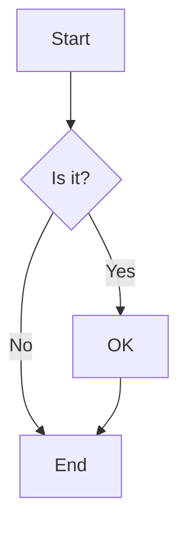
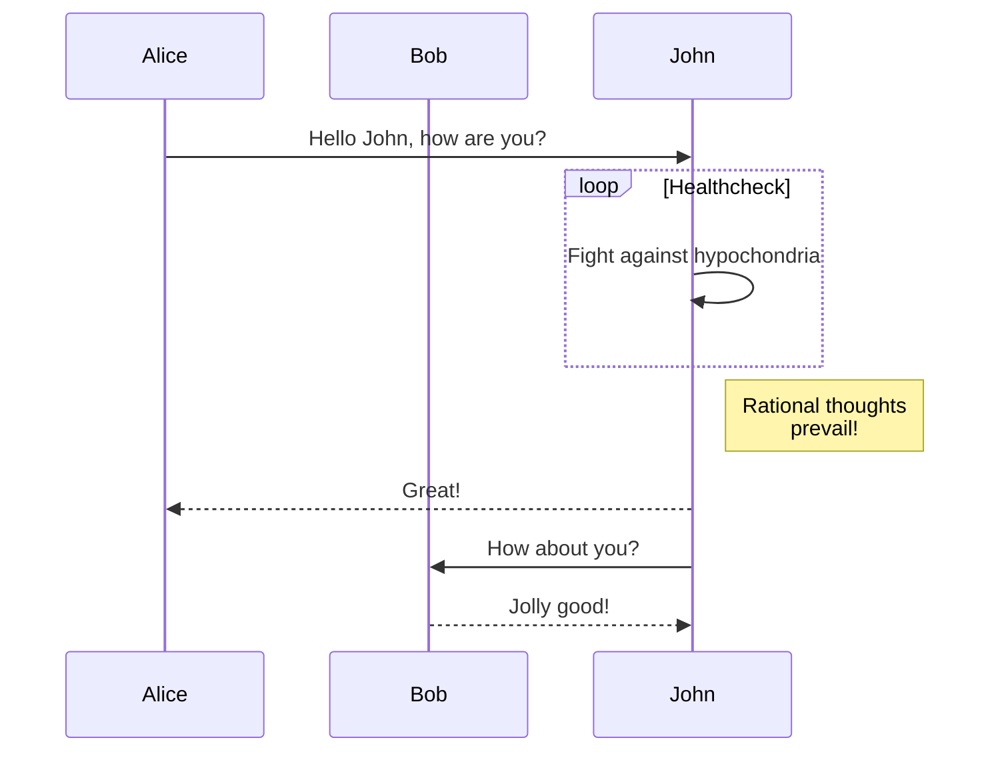
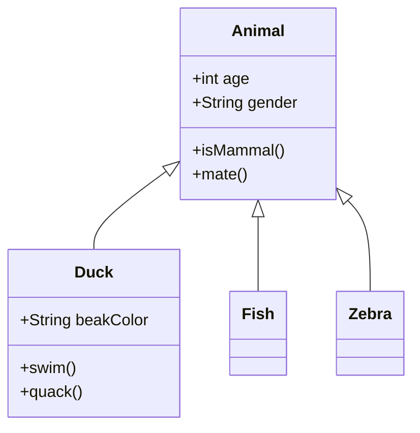
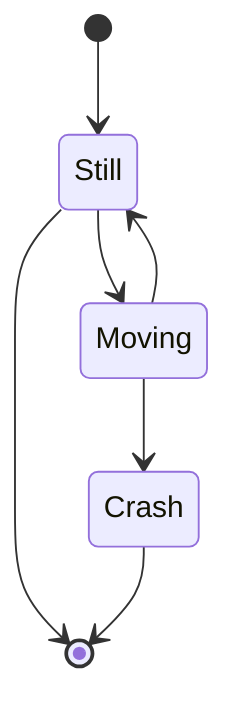
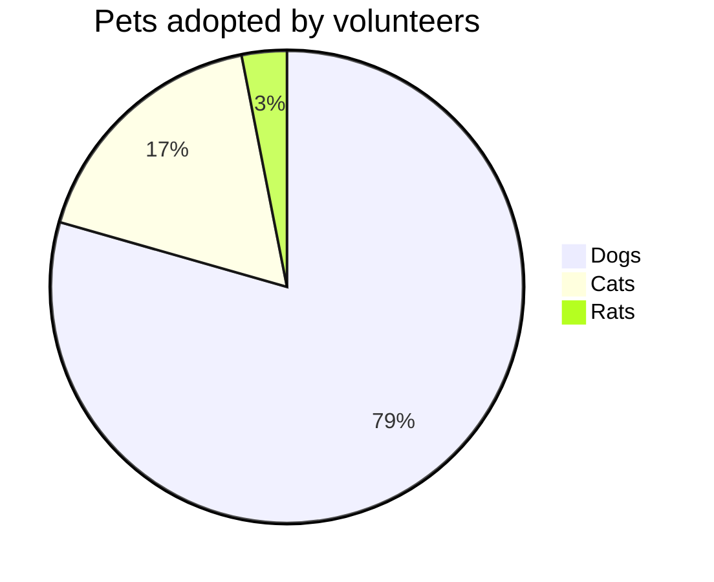

# Mermaid Diagram Test

This document tests Mermaid diagram rendering.

## Flowchart



## Sequence Diagram



## Class Diagram



## State Diagram



## Pie Chart



## Invalid Diagram (Error Test)

```mermaid
this is not valid mermaid syntax
it should show an error
```

## Regular Code Block (Not Mermaid)

```javascript
const x = 1;
console.log(x);
```
